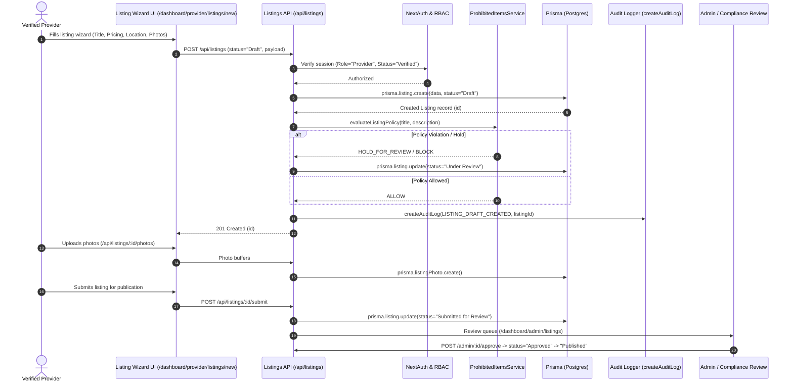
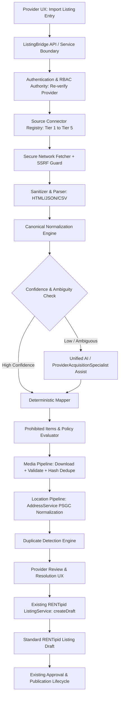

# RENTipid ListingBridge v1.0 Architecture Lock

**Document ID:** RENTIPID-LB-V1.0-ARCH-LOCK-001  
**Controlling Specification:** RENTipid_ListingBridge_v1.0_Master_Implementation_Plan.pdf (Document ID: RENTIPID-LB-V1.0-MIP-001)  
**Lifecycle Status:** ARCHITECTURE LOCKED (P1 Complete)  
**Date:** 2026-08-30  

---

## 1. Baseline
- **Repository Root:** `C:\Users\user\Documents\JD SOFTWARE PROJECTS\RENTipid`
- **Current Branch:** `feature/soc-phase4-threat-response`
- **HEAD Commit SHA:** `7ebc6f2d984eeb1e19e67a5b93e2a5e3a39a8953`
- **Worktree Status:** Clean baseline (scratch files and logs untracked; no staged product modifications)
- **Configured Remotes:** `origin -> https://github.com/jburns2372-sys/RENTipid.git`
- **Monorepo / Workspace Structure:** Next.js 16 App Router monolith (`src/app`, `src/components`, `src/lib`), with auxiliary services in `apps/api` (Express backend) and `apps/worker` (sweeper jobs)
- **Runtimes & Frameworks:** Node.js 20.x, Next.js 16.2.12 (Turbopack), React 19.2.4, Prisma 6.19.3, TailwindCSS 4, NextAuth 4.24.15
- **Database & Migration Engine:** PostgreSQL / Neon Serverless Postgres via `@prisma/adapter-neon` and Prisma ORM (`prisma migrate deploy`)
- **Deployment Model:** Vercel serverless runtime (`iad1`), HTTPS edge, AWS Lambda backend integration

---

## 2. Existing Authoritative Services

| # | Domain | Authority / Owner | Paths | Key Symbols | ListingBridge Usage Decision |
|---|--------|-------------------|-------|-------------|------------------------------|
| 1 | Authentication | NextAuth Core | `src/lib/auth.ts`, `src/lib/auth/sign-out.ts` | `authOptions`, `CredentialsProvider` | **REUSE** — All import operations require valid authenticated session. |
| 2 | Session & User Resolution | NextAuth Session Utilities | `src/lib/auth.ts`, `src/lib/api-client.ts` | `getServerSession`, `getSession` | **REUSE** — Server-authoritative actor extraction (`session.user.id`). |
| 3 | Provider Identity | User / Profile Models | `prisma/schema.prisma`, `src/lib/auth.ts` | `User`, `UserProfile`, `BusinessProfile` | **REUSE** — Link imported listings and jobs directly to existing provider ID. |
| 4 | Provider Onboarding | Provider Onboarding UX | `src/app/dashboard/provider/page.tsx`, `src/app/dashboard/provider/onboarding-checklist/page.tsx` | `ProviderDashboard`, `OnboardingChecklist` | **EXTEND** — Add "Import Existing Listing" entry card alongside manual setup. |
| 5 | Provider Role / RBAC | Permissions Engine | `src/lib/permissions.ts`, `src/lib/security/permissions.ts` | `hasPermission`, `ROLE_PERMISSIONS`, `UserRole` | **REUSE / EXTEND** — Enforce `'Individual Provider'` / `'Business Provider'` and verified status. |
| 6 | Organization / Ownership | Business Profile & Ownership Registry | `prisma/schema.prisma`, `src/lib/ai/specialists/ownership-registry.ts` | `BusinessProfile`, `ownershipRegistry` | **REUSE** — Validate provider tenancy and asset ownership boundaries. |
| 7 | KYC Integration | Compliance & Verification | `prisma/schema.prisma`, `src/app/dashboard/kyc` | `VerificationDocument`, `verification_status` | **REUSE** — ListingBridge does not alter or bypass KYC status. |
| 8 | Listing Creation | Listing Service / Domain Authority | `src/app/api/listings/route.ts`, `apps/api/src/services/listingService.ts` | `ListingService.createDraft`, `POST /api/listings` | **REUSE** — Canonical destination for converting imported data into exactly one Draft. |
| 9 | Listing Editing | Listing Service Draft Updater | `apps/api/src/services/listingService.ts`, `src/app/dashboard/provider/listings/[id]` | `ListingService.updateDraft`, `PATCH /api/listings/:id` | **REUSE** — Allow providers to edit draft fields after import. |
| 10 | Draft Listing State | Prisma Schema Listing Status | `prisma/schema.prisma` (`Listing.status`) | `status = "Draft"` | **REUSE** — All imports terminate strictly in `Draft` state. |
| 11 | Approval & Publication State Machine | Listing Service State Machine | `apps/api/src/services/listingService.ts` | `submitListing`, `approveListing`, `publishListing` | **REUSE** — Publication must pass through existing human review & approval flows. |
| 12 | Listing Validation | Prohibited Items & Category Rules | `src/lib/prohibited-items/prohibited-items.service.ts`, `src/components/listings/ListingWizard.tsx` | `ProhibitedItemsService.evaluateListingPolicy` | **REUSE** — Enforce policy evaluation on all imported titles and descriptions. |
| 13 | Listing Persistence | Prisma Database Models | `prisma/schema.prisma` | `Listing`, `ListingPhoto`, `ListingDocument`, `Category` | **REUSE** — Import tables reference existing `Listing.id`. |
| 14 | Media Upload | Storage Service Facade | `src/lib/storage/storage-service.ts` | `storageService.uploadPublicFile`, `uploadPrivateFile` | **REUSE** — Upload sanitized, downloaded external photos to RENTipid storage. |
| 15 | Media Storage | Storage Adapters | `src/lib/storage/local-storage-adapter.ts`, `s3-storage-adapter.ts` | `LocalStorageAdapter`, `S3StorageAdapter` | **REUSE** — Store ingested image buffers in configured storage backend. |
| 16 | Media Validation | Upload Security Policy | `src/lib/security/upload-security.ts` | `LISTING_PHOTO_POLICY`, `validateUploadRequest` | **REUSE** — Enforce MIME sniffing, extension allowlist, and magic byte validation. |
| 17 | Media Deduplication | SHA-256 Checksum Engine | N/A (New in ListingBridge) | `ListingImportAsset.content_sha256` | **ADDITIVE** — Hash-based deduplication to prevent duplicate photo storage. |
| 18 | Address & Location Handling | Address Service & PSGC | `src/lib/address/AddressService.ts`, `src/lib/address/normalizer.ts` | `AddressService`, `normalizeAddress`, `NormalizedAddress` | **REUSE** — Parse and validate location into canonical Philippine hierarchy. |
| 19 | Geocoding | Address Geocoding Providers | `src/lib/address/providers/google.ts`, `mock.ts` | `GoogleAddressProvider`, `MockAddressProvider` | **REUSE** — Resolve coordinates and place IDs safely. |
| 20 | Property & Category Taxonomy | Category Catalog | `prisma/schema.prisma`, `src/lib/marketplace/seed-reconciler.ts` | `Category`, `categoryControls` | **REUSE** — Map external property/rental categories into 15 official RENTipid categories. |
| 21 | Amenity Taxonomy | Amenity Standardization | `src/lib/marketplace/category-metadata.ts` | `CategoryRequirement` | **EXTEND / ADD** — Bounded standard amenity dictionary for canonical mapping. |
| 22 | Pricing / Policy Authority | Listing Service Financial Policies | `apps/api/src/services/listingService.ts`, `prisma/schema.prisma` | `rental_type`, `daily_rate`, `security_deposit` | **REUSE** — Populate validated numeric pricing and deposit requirements. |
| 23 | Availability Handling | Availability Domain | `src/lib/availability.ts`, `prisma/schema.prisma` | `Listing.availability_start`, `Listing.availability_end` | **REUSE** — Ingest availability dates only when explicitly approved. |
| 24 | Duplicate Detection | Marketplace Duplicate Detection | `src/lib/marketplace/seed-reconciler.ts` | `Listing` title/provider matching | **EXTEND / ADD** — Cross-source duplicate detection based on title, location, and photos. |
| 25 | Idempotency Engine | Durable Tool Execution Pattern | `src/lib/ai/tools/AiToolGateway.ts` | `idempotencyKey` pattern | **REUSE / ADD** — Durable `idempotency_key` constraint on `ListingImportJob`. |
| 26 | Background Jobs | Worker Process Engine | `apps/worker/src/index.ts`, `apps/worker/src/jobs/` | `bookingExpirationSweeper` pattern | **EXTEND / ADD** — Async job runner for multi-photo and external fetch processing. |
| 27 | Queue / Worker Infrastructure | Node Sweeper / Next.js Background Worker | `apps/worker/src/` | Worker dispatcher | **EXTEND / ADD** — Add `listingImportWorker` job handler. |
| 28 | Retry / Recovery Infrastructure | SOC Recovery Engine Pattern | `src/lib/security/events/jobs/recovery.ts` | Exponential backoff with jitter | **REUSE PATTERN** — Implement bounded retries for transient HTTP errors. |
| 29 | Outbound HTTP Client | API Client | `src/lib/api-client.ts` | `azureFetch`, native `fetch` | **EXTEND** — Wrap in SSRF-guarded fetch client (`ListingBridgeHttpClient`). |
| 30 | URL / Network Validation | Database & Host Guard | `src/lib/test-database-guard.ts` | Host validation pattern | **ADDITIVE GAP** — Implement `SsrfProtectionService` (block private IPs, cloud metadata, loopback). |
| 31 | Secret / Token Management | Cryptography Subsystem | `src/lib/security/crypto/` | `ProfileFieldProtection`, `process.env` | **REUSE** — Encrypt OAuth tokens and third-party connector credentials at rest. |
| 32 | Rate Limiting | Address & MFA Rate Limiter | `src/lib/address/rate-limiter.ts`, `src/lib/security/auth/mfa-rate-limiter.ts` | `AddressApiRateLimit` table pattern | **REUSE PATTERN** — Database-backed rate limiter for public URL imports. |
| 33 | File Upload Validation | Upload Security Engine | `src/lib/security/upload-security.ts` | `validateUploadRequest`, `handleUploadError` | **REUSE** — Validate structured files (Tier 3: CSV/JSON/XLSX). |
| 34 | MIME / Content Validation | Upload Security Sniffer | `src/lib/security/upload-security.ts` | Magic byte inspection (`%PDF-`, `FFD8FF`, `89504E47`, `57454250`) | **REUSE** — Validate all incoming media byte buffers. |
| 35 | Audit Framework | Central Audit Logger | `src/lib/audit.ts` | `createAuditLog`, `model AuditLog` | **REUSE** — Log all import lifecycle state transitions with actor and trace context. |
| 36 | Trace / Correlation Framework | AI Trace Subsystem | `src/lib/ai/specialists/trace.ts`, `src/lib/security/telemetry-hmac.ts` | `traceId`, `correlationId` | **REUSE** — Propagate `importJobId` across all logs, metrics, and audits. |
| 37 | Logging | Central AI / System Logger | `src/lib/ai/ai-logger.ts` | Structured JSON logging | **REUSE** — Redact PII, URLs with tokens, and raw secrets from logs. |
| 38 | Metrics | Telemetry & Analytics | `src/lib/ai/ai-telemetry.ts`, `SupportAnalyticsService` | Metric counter/duration pattern | **REUSE** — Emit deterministic listing import metrics without PII dimensions. |
| 39 | Alerts / Monitoring | SOC Rule Evaluator & Alert Generator | `src/lib/security/rules/alert-generator.service.ts` | `AlertGenerator` | **REUSE PATTERN** — Surface import security anomalies to SOC monitoring. |
| 40 | Feature Flags | Specialist Feature Control Service | `src/lib/ai/specialists/feature-control.ts` | `SpecialistFeatureControlService`, `SystemSetting` | **REUSE** — Control ListingBridge rollout via `SystemSetting` flags. |
| 41 | Seed / Sync Framework | Marketplace Seed Reconciler | `src/lib/marketplace/seed-reconciler.ts`, `scripts/psgc-sync.ts` | `seed-reconciler` pattern | **REUSE** — Deterministic test catalog seeding and PSGC taxonomy sync. |
| 42 | Database Migration Framework | Prisma Migration Engine | `prisma/migrations/`, `package.json` | `prisma migrate deploy` | **REUSE** — Additive migrations only; zero downtime schema changes. |
| 43 | Unified AI Runtime | Autonomous AI Command Layer | `src/lib/ai/ai-command-layer.ts`, `src/lib/ai/specialists/orchestrator.ts` | `AiCommandLayer`, `SpecialistOrchestrator` | **REUSE** — Route ambiguous amenity/category classification through Unified AI. |
| 44 | AI Tool Gateway | Controlled AI Tool Gateway | `src/lib/ai/tools/AiToolGateway.ts` | `AiToolGateway`, `ToolDefinition` | **REUSE** — Register ListingBridge tools with `DRAFT_ONLY` risk class. |
| 45 | ProviderAcquisitionSpecialist | Provider Acquisition AI Specialist | `src/lib/ai/specialists/provider-acquisition-specialist.ts` | `ProviderAcquisitionSpecialistExecutor` | **REUSE / EXTEND** — Bind ListingBridge fact extraction to `ProviderAcquisitionSpecialist`. |
| 46 | AI Tool Permission / Allowlist | AI Permissions Engine | `src/lib/ai/ai-permissions.ts`, `AiToolGateway.ts` | `allowedRoles`, `riskClass` | **REUSE** — Restrict ListingBridge tools to verified providers and admins. |
| 47 | AI Structured Output Validation | Specialist Contracts & Zod | `src/lib/ai/specialists/contracts.ts` | `SpecialistResultInput`, `Zod` schemas | **REUSE** — Enforce strict JSON schema contracts on AI extraction output. |
| 48 | Prompt Injection Protections | AI Guard & Specialist Regex | `src/lib/security/detection/ai-guard.ts`, `provider-acquisition-specialist.ts` | Regex guards, untrusted input containment | **REUSE** — Treat all imported external text as untrusted content. |
| 49 | AI-Disabled Fallback | Specialist Fallback Mechanism | `src/lib/ai/specialists/feature-control.ts` | `fallback: 'UNIFIED_AI_BASELINE'` | **REUSE** — Deterministic heuristics operate fully when AI is disabled. |
| 50 | Preview Deployment Pipeline | Vercel Git Integration | `playwright.preview.config.ts`, `scripts/app-verify.ts` | `app:verify:preview` | **REUSE** — Validate Preview deployment automatically. |
| 51 | Preview Database Migration | Preview DB Deploy Script | `scripts/app-verify.ts` | `prisma migrate deploy` against preview DB | **REUSE** — Apply safe additive migrations to Preview database. |
| 52 | Preview Seed / Sync | OAT / Knowledge Seed Scripts | `scripts/knowledge/knowledge-runner.ts` | Seed scripts | **REUSE** — Ensure required lookup records exist on Preview. |
| 53 | Production Deployment Pipeline | Production Release Gate | `scripts/app-release-gate.ts`, `scripts/app-verify.ts` | `app:release:gate` | **REUSE** — Production deployment verification gate. |
| 54 | Rollback Mechanism | Vercel Instant Rollback & DB Additive Safety | `vercel.json`, `SystemSetting` | Instant redeploy + Feature flag toggle | **REUSE** — Feature toggle disable without requiring database rollback. |
| 55 | Environment Configuration | Dotenv & Runtime Envs | `.env.local`, `.env.preview`, `src/lib/ai/ai-env.ts` | Environment validation | **REUSE** — Configuration via standardized environment variables. |

---

## 3. Existing Provider + Listing Flow



### Architectural Lock Invariant
ListingBridge **MUST NOT** create a parallel listing database, alternate publication path, or secondary approval workflow. ListingBridge strictly feeds sanitized, normalized, and provider-verified data into this exact existing `ListingService.createDraft` authority, producing a standard RENTipid `Draft` listing.

---

## 4. ListingBridge Proposed Boundary



---

## 5. Connector Architecture

### Connector Interface Contract (`src/lib/listingbridge/connectors/types.ts`)
```typescript
export interface ListingBridgeConnector {
  readonly id: string;
  readonly name: string;
  readonly tier: 'TIER_1_OAUTH' | 'TIER_2_PMS' | 'TIER_3_FILE' | 'TIER_4_URL' | 'TIER_5_MANUAL';
  readonly capabilities: {
    readonly supportsMedia: boolean;
    readonly supportsAvailability: boolean;
    readonly supportsBatch: boolean;
    readonly requiresOAuth: boolean;
  };
  
  identifySource(input: string | Buffer): boolean;
  authorize?(credentials: Record<string, unknown>): Promise<boolean>;
  fetchListing(sourceRef: string, options?: Record<string, unknown>): Promise<RawListingPayload>;
  fetchMedia(mediaUrl: string): Promise<{ buffer: Buffer; mimeType: string; fileName: string }>;
  fetchAvailability?(sourceRef: string): Promise<RawAvailabilityPayload | null>;
  normalize(raw: RawListingPayload): Promise<CanonicalImportContract>;
  validateResponse(raw: RawListingPayload): boolean;
  healthCheck(): Promise<{ healthy: boolean; latencyMs: number }>;
}
```

### Connector Tiers for v1.0
1. **Tier 1 (Authorized API / OAuth):** Structured API connectors (future partner integrations; framework defined).
2. **Tier 2 (PMS / Channel Manager):** Standard iCal / PMS JSON feeds.
3. **Tier 3 (Structured File):** CSV, XLSX, and JSON listing file uploads via `UploadSecurity`.
4. **Tier 4 (Permitted Public URL):** SSRF-guarded, rate-limited HTML meta / JSON-LD / OpenGraph scrapers.
5. **Tier 5 (Manual Setup Fallback):** Direct handoff to existing `ListingWizard` with pre-filled fields.

---

## 6. Canonical Import Contract Placement

**File Location:** `src/lib/listingbridge/types/canonical-contract.ts`

```typescript
export interface CanonicalImportContract {
  readonly schemaVersion: 'rentipid.listingbridge.v1';
  readonly importJobId: string;
  readonly source: {
    readonly connectorId: string;
    readonly sourceUrl?: string;
    readonly sourceReferenceId?: string;
    readonly extractedAt: string;
  };
  readonly property: {
    readonly title: string;
    readonly description: string;
    readonly suggestedCategoryId?: string;
    readonly condition?: 'New' | 'Like New' | 'Good' | 'Fair' | 'Used';
    readonly rentalType: 'Hourly' | 'Daily' | 'Weekly' | 'Monthly';
    readonly quantity: number;
  };
  readonly location: {
    readonly rawLocationString: string;
    readonly city?: string;
    readonly province?: string;
    readonly country: string;
    readonly postalCode?: string;
    readonly latitude?: number;
    readonly longitude?: number;
    readonly psgcCode?: string;
  };
  readonly pricing: {
    readonly dailyRate?: number;
    readonly hourlyRate?: number;
    readonly weeklyRate?: number;
    readonly monthlyRate?: number;
    readonly securityDeposit?: number;
    readonly replacementValue?: number;
    readonly currency: 'PHP';
  };
  readonly amenities: readonly string[];
  readonly rules: {
    readonly generalRules?: string;
    readonly minDuration?: number;
    readonly maxDuration?: number;
    readonly pickupAvailable: boolean;
    readonly deliveryAvailable: boolean;
    readonly deliveryFee?: number;
  };
  readonly media: readonly {
    readonly externalUrl: string;
    readonly caption?: string;
    readonly isCover: boolean;
    readonly order: number;
    readonly mimeType?: string;
  }[];
  readonly fieldConfidence: Record<string, number>; // 0.0 to 1.0
  readonly unresolvedFields: readonly {
    readonly fieldName: string;
    readonly reason: string;
    readonly severity: 'BLOCKING' | 'OPTIONAL';
  }[];
  readonly provenance: {
    readonly rawPayloadHash: string;
    readonly aiAssisted: boolean;
    readonly modelVersion?: string;
    readonly extractedFactCount: number;
  };
}
```

---

## 7. Proposed Additive Database Concepts

### Prisma Schema Additions (`prisma/schema.prisma`)

```prisma
// Phase 1: ListingBridge Import Job Foundation
model ListingImportJob {
  id                    String    @id @default(cuid())
  provider_id           String
  provider              User      @relation(fields: [provider_id], references: [id])
  source_connector      String    // "URL_SCRAPER", "CSV_IMPORT", "JSON_IMPORT", "PMS_ICAL"
  source_url            String?
  source_reference_id   String?
  idempotency_key       String    @unique
  status                String    // "CREATED", "FETCHING", "NORMALIZING", "PROCESSING_MEDIA", "VALIDATING", "NEEDS_REVIEW", "READY_FOR_DRAFT", "CREATING_DRAFT", "COMPLETED", "FAILED_RETRYABLE", "FAILED_FINAL", "CANCELLED"
  raw_payload_hash      String?
  canonical_payload     Json?
  field_confidence      Json?
  unresolved_fields     Json?
  created_listing_id    String?   @unique
  created_listing       Listing?  @relation(fields: [created_listing_id], references: [id])
  retry_count           Int       @default(0)
  max_retries           Int       @default(3)
  last_error_code       String?
  last_error_message    String?
  ai_assisted           Boolean   @default(false)
  created_at            DateTime  @default(now())
  updated_at            DateTime  @updatedAt
  completed_at          DateTime?

  assets                ListingImportAsset[]
  resolutions           ListingImportResolution[]
  auditEvents           ListingImportAuditEvent[]

  @@index([provider_id, status])
  @@index([source_connector, created_at])
}

model ListingImportAsset {
  id                    String    @id @default(cuid())
  job_id                String
  job                   ListingImportJob @relation(fields: [job_id], references: [id], onDelete: Cascade)
  external_url          String
  content_sha256        String
  local_storage_path    String?
  file_size_bytes       Int?
  mime_type             String?
  status                String    // "PENDING", "DOWNLOADED", "VALIDATED", "FAILED", "SKIPPED_DUPLICATE"
  is_cover              Boolean   @default(false)
  display_order         Int       @default(0)
  error_message         String?
  created_at            DateTime  @default(now())

  @@unique([job_id, external_url])
  @@index([content_sha256])
}

model ListingImportResolution {
  id                    String    @id @default(cuid())
  job_id                String
  job                   ListingImportJob @relation(fields: [job_id], references: [id], onDelete: Cascade)
  field_name            String
  original_value        String?
  resolved_value        String?
  resolution_type       String    // "PROVIDER_OVERRIDE", "AI_SUGGESTION_ACCEPTED", "SYSTEM_DEFAULT", "DISMISSED"
  resolved_by_user_id   String
  resolved_at           DateTime  @default(now())

  @@index([job_id, field_name])
}

model ListingImportAuditEvent {
  id                    String    @id @default(cuid())
  job_id                String
  job                   ListingImportJob @relation(fields: [job_id], references: [id], onDelete: Cascade)
  actor_user_id         String
  event_type            String    // "JOB_CREATED", "FETCH_COMPLETED", "AI_ENRICHED", "RESOLUTION_SAVED", "DRAFT_COMMITTED", "JOB_FAILED"
  event_payload         Json?
  ip_address            String?
  created_at            DateTime  @default(now())

  @@index([job_id, created_at])
}
```

---

## 8. Job / Worker / Recovery Architecture

1. **State Transition Pipeline:**
   `CREATED` -> `FETCHING` -> `NORMALIZING` -> `PROCESSING_MEDIA` -> `VALIDATING` -> `NEEDS_REVIEW` (if confidence < 0.85 or required fields missing) -> `READY_FOR_DRAFT` -> `CREATING_DRAFT` -> `COMPLETED`.
2. **Terminal & Recovery States:**
   `FAILED_RETRYABLE` (network timeouts, transient HTTP 503s), `FAILED_FINAL` (SSRF violation, unsupported payload, schema corrupt), `CANCELLED` (provider abandoned).
3. **Execution Model:**
   - Synchronous / streaming execution for lightweight Tier 3 file parses.
   - Asynchronous worker execution in `apps/worker` for heavy Tier 4 multi-photo external scraping.
4. **Recovery Daemon:**
   - Background sweeper checks for stale jobs in `FETCHING` or `PROCESSING_MEDIA` (> 10 mins).
   - Re-queues up to `max_retries = 3` with exponential backoff (`2^attempt * 30s`).

---

## 9. Idempotency and Duplicate Strategy

1. **Job Creation Idempotency:**
   Unique constraint on `ListingImportJob.idempotency_key = sha256(provider_id + ":" + source_connector + ":" + source_identifier)`. Re-submitting returns the active or completed job without re-fetching.
2. **Draft Creation Idempotency:**
   `created_listing_id` on `ListingImportJob` ensures that calling the draft conversion endpoint multiple times returns the previously created `Listing.id`.
3. **Media Deduplication:**
   `ListingImportAsset.content_sha256` prevents downloading and saving identical images across re-runs.
4. **Cross-Listing Duplicate Detection:**
   During `VALIDATING`, query existing listings by the provider matching normalized title (Levenshtein distance > 0.85) and address coordinates. Surface warning to provider during review if a potential duplicate exists.

---

## 10. Security Controls

| Security Dimension | Existing Control | Verified Gap | Proposed Minimal Addition | Evidence |
|--------------------|------------------|--------------|---------------------------|----------|
| **SSRF Protection** | Database host check only (`test-database-guard.ts`) | **VERIFIED GAP:** No general-purpose outbound HTTP SSRF filter. | Add `SsrfProtectionService`: Resolve DNS, reject IPv4 private (10.0.0.0/8, 172.16.0.0/12, 192.168.0.0/16), loopback (127.0.0.1/8), link-local (169.254.0.0/16, AWS metadata), IPv6 ULA/loopback. Validate redirects. | `src/lib/test-database-guard.ts`, zero matches for `ssrf` in repository. |
| **Fetch Controls** | Standard fetch in `api-client.ts` | **VERIFIED GAP:** No response size limits or request timeouts on external fetches. | Add bounded fetch: 10s timeout, max 5MB response body, max 3 redirects, MIME type allowlist (`text/html`, `application/json`, `text/csv`). | `src/lib/api-client.ts` |
| **Authorization & RBAC** | `hasPermission` in `permissions.ts` | Reusable | Validate actor has `'Individual Provider'` or `'Business Provider'` and `status === 'Verified'`. Re-verify on server at every stage. | `src/lib/permissions.ts`, `src/app/api/listings/route.ts` |
| **Token / Secret Storage** | `ProfileFieldProtection` AES-256-GCM | Reusable | Encrypt OAuth tokens and third-party connector credentials using existing cryptographic envelopes. | `src/lib/security/crypto/` |
| **Prompt Injection Protection** | AI Guard regex filters | Reusable | Enforce untrusted external content isolation in prompts; structured JSON schemas via Zod; tool execution restricted to `DRAFT_ONLY`. | `src/lib/ai/specialists/provider-acquisition-specialist.ts`, `src/lib/security/detection/ai-guard.ts` |
| **Media & File Security** | `validateUploadRequest` in `upload-security.ts` | Reusable | Validate external photo downloads against `LISTING_PHOTO_POLICY` (magic byte checks, max 5MB, strict MIME check). | `src/lib/security/upload-security.ts` |
| **Audit Logging** | `createAuditLog` in `src/lib/audit.ts` | Reusable | Emit `LISTING_IMPORT_JOB_CREATED`, `LISTING_IMPORT_COMPLETED`, `LISTING_IMPORT_SECURITY_BLOCK` to `AuditLog`. | `src/lib/audit.ts` |

---

## 11. Media + Location Authorities

1. **Media Authority:**
   - Ingested photos are passed through `upload-security.ts` byte inspection.
   - Saved via `storageService.uploadPublicFile()` to the active storage adapter (Local / S3).
   - Inserted into `ListingPhoto` with `is_cover`, `display_order`, and `file_path`.
2. **Location Authority:**
   - External raw location string is processed through `AddressService` and `normalizeAddress()`.
   - Mapped to standard Philippine PSGC hierarchy (`regionPsgcCode`, `provincePsgcCode`, `localityPsgcCode`, `sublocalityPsgcCode`).
   - If external coordinates exist, validate bounds within the Philippines (Lat: 4.5° to 21.5°N, Lng: 116.0° to 127.0°E).

---

## 12. Unified AI / ProviderAcquisitionSpecialist Integration

1. **Safe Integration Point:**
   - Register a dedicated ListingBridge tool in `AiToolGateway.ts`: `classifyAndMapListingImport` with `riskClass = 'DRAFT_ONLY'`.
   - Wire ambiguous category and amenity resolution to `ProviderAcquisitionSpecialistExecutor`.
2. **Strict Guardrails:**
   - AI **never** creates or modifies database records directly.
   - AI **never** bypasses RBAC, KYC, or prohibited item policies.
   - If AI suggests category or amenities, confidence score is tagged and presented to provider for confirmation.
   - **Deterministic Fallback:** If `SPECIALIST_FEATURE_FLAG` is disabled or AI throws, system uses keyword/regex heuristics without failing the import.

---

## 13. UX Integration Point

1. **Location:** `src/app/dashboard/provider/listings/new/page.tsx`
2. **Layout Adjustment:**
   - Introduce a top-level selection toggle:
     - **Option A:** "Create Manually" (renders existing `<ListingWizard categories={categories} />`).
     - **Option B:** "Import from Existing Listing / File" (renders new `<ListingBridgeImportWizard />`).
3. **Design System & Components:**
   - Use TailwindCSS 4, Shadcn/UI primitives (`Button`, `Card`, `Progress`, `Badge`, `Alert`).
   - Mobile-responsive, accessible (ARIA labels, keyboard navigation).
   - Review step displays a side-by-side comparison of extracted values, confidence indicators, and field edit inputs before the provider clicks "Save as RENTipid Draft".

---

## 14. Feature Flags

Integrated via `SystemSetting` table and `SpecialistFeatureControlService`:

| Flag Key | Type | Default | Purpose |
|----------|------|---------|---------|
| `LISTINGBRIDGE_GLOBAL` | Boolean | `false` | Master toggle for ListingBridge import features. |
| `LISTINGBRIDGE_URL_IMPORT` | Boolean | `false` | Enable/disable Tier 4 public URL scraping. |
| `LISTINGBRIDGE_FILE_IMPORT` | Boolean | `true` | Enable/disable Tier 3 structured CSV/JSON upload. |
| `LISTINGBRIDGE_AI_MAPPING` | Boolean | `true` | Enable/disable Unified AI semantic enhancement. |
| `LISTINGBRIDGE_MEDIA_IMPORT`| Boolean | `true` | Enable/disable automatic media download & processing. |

---

## 15. Observability

Metrics emitted via structured logging and `ai-telemetry.ts` pattern:
- `listing_import_started_total{source_connector}`
- `listing_import_completed_total{source_connector}`
- `listing_import_failed_total{source_connector, error_code}`
- `listing_import_duration_seconds{source_connector}`
- `listing_import_fields_detected_total`
- `listing_import_fields_unresolved_total`
- `listing_import_provider_corrections_total`
- `listing_import_media_success_total`
- `listing_import_media_failure_total`
- `listing_import_duplicate_detected_total`
- `listing_import_security_block_total{reason}`
- `listing_import_draft_created_total`

*Privacy Invariant:* No raw URLs with tokens, passwords, customer PII, or internal prompt completions are used as metric dimensions.

---

## 16. Migration Plan

1. **Migration Naming:** `20260830_add_listingbridge_import_job_foundation`
2. **Additive Safety:** Creates `ListingImportJob`, `ListingImportAsset`, `ListingImportResolution`, `ListingImportAuditEvent`.
3. **Execution Commands:**
   - Local: `npx prisma migrate dev --name add_listingbridge_import_job_foundation`
   - Preview / Prod: `npx prisma migrate deploy`
4. **Zero Downtime:** Schema additions only; no existing table column drops or alters.

---

## 17. Seed / Sync Plan

1. **Feature Flags:** Insert default `SystemSetting` records for ListingBridge flags.
2. **Category Synonym Map:** Seed initial category and amenity canonical dictionary in `seed-data/` if needed.
3. **Test Fixtures:** Add mock import payloads for Jest integration tests in `tests/fixtures/listingbridge/`.

---

## 18. Test Framework and Exact Commands

| Test Tier | Scope | Exact Command |
|-----------|-------|---------------|
| **Typecheck** | Full project TypeScript compilation | `npm run typecheck` |
| **Lint** | ESLint compliance | `npm run lint` |
| **Unit Tests** | Connector parsers, SSRF validator, normalizers | `npm test -- tests/listingbridge/unit` |
| **Integration Tests** | Import job lifecycle, policy checks, draft creation | `npm test -- tests/listingbridge/integration` |
| **Security Tests** | SSRF blocking, rate limits, malicious payload rejects | `npm test -- tests/listingbridge/security` |
| **E2E / Browser Tests** | Import UX workflow, review screen, draft conversion | `npx playwright test tests/e2e/listingbridge.spec.ts` |
| **Local Quality Gate** | Verification gate before promotion | `npm run app:verify:local` |
| **Preview Quality Gate** | Verification on deployed preview | `npm run app:verify:preview` |

---

## 19. Preview Deployment Path
1. Pass all local verification gates (`app:verify:local`).
2. Push branch to GitHub -> Vercel automatically builds Preview environment.
3. Run `npx prisma migrate deploy` against Preview database.
4. Execute `npm run app:verify:preview` and focused Playwright tests against preview URL.
5. Authenticate via Vercel browser session and verify import wizard loads cleanly.

---

## 20. Production Deployment Path
1. Verify Preview Acceptance PASS.
2. Run `npm run app:verify:production-readiness`.
3. Execute `npm run app:release:gate`.
4. Deploy to Vercel Production.
5. Verify production smoke tests with `LISTINGBRIDGE_GLOBAL` initially enabled for internal beta users.

---

## 21. Rollback Path
1. **Immediate Feature Rollback:** Set `LISTINGBRIDGE_GLOBAL = 'false'` in `SystemSetting` table (takes effect instantly without redeploy).
2. **Deployment Rollback:** Roll back to prior commit in Vercel dashboard.
3. **Database Safety:** Additive schema changes mean existing listing creation continues working seamlessly even if new tables are present.

---

## 22. New Dependency Decisions

**DECISION: ZERO NEW EXTERNAL DEPENDENCIES (NONE).**

- HTTP client: Native `fetch` (Node.js 20+).
- DNS / IP resolution: Native Node `node:dns` / `node:net`.
- HTML parsing: Built-in DOM regex / lightweight streaming parser.
- Cryptography / Hashing: Native `node:crypto`.
- Schema validation: Existing `zod`.
- Data persistence: Existing `@prisma/client`.
- UI: Existing React 19 + TailwindCSS 4 + Shadcn/UI.

---

## 23. Minimal File Change Map

| Path | Change Type | Owner / Symbol | Why Required |
|------|-------------|----------------|--------------|
| `prisma/schema.prisma` | **EXTEND** | Database Models | Add `ListingImportJob`, `ListingImportAsset`, `ListingImportResolution`, `ListingImportAuditEvent`. |
| `src/lib/listingbridge/types/` | **ADDITIVE** | Types & Contracts | Define `CanonicalImportContract`, connector interfaces, job states. |
| `src/lib/listingbridge/security/ssrf-protection.ts` | **ADDITIVE** | Security Engine | Implement SSRF IP blacklist, DNS resolution validation, and redirect checks. |
| `src/lib/listingbridge/services/listingbridge.service.ts` | **ADDITIVE** | Domain Authority | Core orchestrator for import job lifecycle, normalization, and draft conversion. |
| `src/lib/listingbridge/connectors/` | **ADDITIVE** | Connectors Registry | Implement Tier 3 (CSV/JSON) and Tier 4 (URL) connectors. |
| `src/lib/listingbridge/services/media-pipeline.service.ts` | **ADDITIVE** | Media Engine | Download, validate via `upload-security.ts`, hash dedupe, and upload photos. |
| `src/app/api/listingbridge/jobs/route.ts` | **ADDITIVE** | API Route | Create and query import jobs. |
| `src/app/api/listingbridge/jobs/[id]/commit/route.ts` | **ADDITIVE** | API Route | Converts approved canonical payload into `Listing` via `ListingService.createDraft`. |
| `src/components/listingbridge/ListingBridgeWizard.tsx` | **ADDITIVE** | UX Component | Provider import UI (source selection, progress, review, and resolution). |
| `src/app/dashboard/provider/listings/new/page.tsx` | **EXTEND** | Provider Listing Creation | Add import tab/card alongside existing `ListingWizard`. |
| `tests/listingbridge/` | **ADDITIVE** | Test Suite | Unit, integration, security, and E2E tests for import pipeline. |

---

## 24. Verified Gaps

1. **SSRF Outbound Validator:** No general-purpose IP and cloud metadata validator existed in the repository. (`SsrfProtectionService` is required).
2. **Content Hash Deduplication:** Media uploads checked file size and signatures, but did not compute content SHA-256 for cross-source deduplication. (`ListingImportAsset.content_sha256` resolves this).
3. **Structured Import Job Tracking:** No durable state machine existed for multi-step external listing imports. (`ListingImportJob` resolves this).

---

## 25. Risks & Blockers

- **Blockers:** **NONE.** All required authorities (Auth, Permissions, ListingService, ProhibitedItemsService, AddressService, StorageService, Prisma, NextAuth) are present, functional, and fully verified.
- **Risks & Mitigations:**
  - *Risk:* External websites blocking scraper IPs or changing markup.
    - *Mitigation:* Bounded timeouts, graceful degradation to partial extraction, clear provider review screen where any missing field can be filled manually.
  - *Risk:* SSRF vulnerabilities on public URL fetch.
    - *Mitigation:* Strict pre-fetch and post-redirect DNS IP validation blocking private/loopback/cloud subnets.

---

## 26. P2 Recommended Implementation Slice

**P2 Scope: Core Data Contracts, SSRF Protection, and Prisma Schema Migration**
1. Add `ListingImportJob`, `ListingImportAsset`, `ListingImportResolution`, `ListingImportAuditEvent` to `prisma/schema.prisma`.
2. Generate Prisma client (`npx prisma generate`) and create local migration.
3. Implement `CanonicalImportContract` and TypeScript interfaces in `src/lib/listingbridge/types/`.
4. Implement `SsrfProtectionService` in `src/lib/listingbridge/security/ssrf-protection.ts`.
5. Add unit tests for SSRF protection and schema validation in `tests/listingbridge/unit/ssrf-protection.test.ts`.

---

## 27. Architecture Freeze Statement

Repository discovery for RENTipid ListingBridge v1.0 is **COMPLETE AND FROZEN**. All existing domain authorities, integration points, security controls, and file maps are locked. Broad repository re-discovery is prohibited during implementation phases P2–P12. Future phases must proceed directly using this Architecture Lock document.
