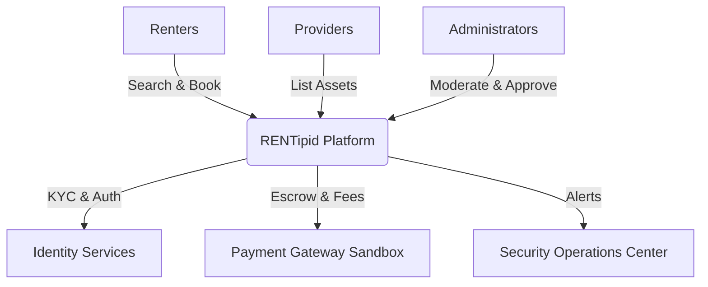

# Chapter 1 — RENTipid Executive Overview

## 1.1 Purpose of RENTipid

RENTipid is a comprehensive digital rental marketplace designed to facilitate secure, transparent, and efficient rental transactions between individuals and businesses. 

**"Why buy it? RENTipid."** 
The platform operates on the principle that renting is more economical and environmentally sustainable than purchasing assets for short-term use. RENTipid bridges the gap between asset owners (Providers) and asset seekers (Renters) while providing robust escrow mechanisms, compliance checks, and operational safety nets.

## 1.2 Rentable Assets

RENTipid supports a wide array of categories, categorized by risk and regulatory requirements:
- **Low Risk:** Tools, Office Equipment, Event Equipment
- **Medium Risk:** Construction Equipment, Cameras & Gadgets, Event Venues
- **Regulated / High Risk:** Heavy Equipment, Cars & Motorcycles, Condominiums, Beach Resorts, Boats, Aircraft Charters

## 1.3 Marketplace Participants

The primary stakeholders in the RENTipid ecosystem include:
- **Renters:** Individuals or businesses seeking to rent assets.
- **Individual Providers:** Private asset owners listing items for rent.
- **Business Providers:** Commercial rental entities with bulk listings and advanced onboarding requirements.
- **Platform Operators (Admins):** Personnel managing compliance, finance, security, and dispute resolution.

## 1.4 Core Transaction Lifecycle

The business model revolves around secure escrow transactions:
1. **Discovery:** Renters browse, filter, and request bookings for listed assets.
2. **Agreement:** Providers approve requests, establishing a binding Rental Agreement.
3. **Escrow (Mock/Live):** Renters deposit funds securely into the platform's escrow holding.
4. **Active Rental:** Pre-rental and post-rental inspections are conducted to verify asset condition.
5. **Resolution:** Funds are released to the Provider (minus platform fees) upon successful return, or disputed via the claims process if damage occurs.

## 1.5 Safety, Trust, and Compliance

RENTipid integrates a multi-layered security and trust framework:
- **KYC Verification:** Identity and business verification processes ensure all participants are legitimate.
- **Security Operations Center (SOC):** A dedicated administrative module for detecting behavioral anomalies, payment fraud, and threat response.
- **Emergency Controls:** Platform-wide freeze capabilities to halt financial transactions during critical incidents.

## 1.6 Current Product Maturity and Posture

- **Current Status:** RENTipid is operating in a **Live Pilot / Private Beta** environment.
- **Financial Posture:** `MOCK_OR_SIMULATION_ONLY`. Payment gateways (e.g., PayMongo) are integrated in Sandbox mode. Real financial transactions are strictly disabled pending regulatory approval.
- **AI Integration:** `IMPLEMENTED_BUT_DISABLED` / `SANDBOX_ACTIVE`. Generative AI and automated assistance features are present but restricted from autonomous financial or administrative actions.

## 1.7 Diagrams

### RENTipid Ecosystem Context Diagram

## Evidence References

| Evidence ID | Repository Path | Symbol, Model, Route, Test, or Report | Relevance | Verification Status |
| ----------- | --------------- | ------------------------------------- | --------- | ------------------- |
| REPO-002 | `prisma/schema.prisma` | `Category`, `Booking`, `Payment` | Core business model | Verified |
| REPO-005 | `src/app` | Dashboard Routes | Stakeholder access paths | Verified |
| REPO-007 | `docs/soc` | SOC Documentation | Security posture | Verified |

## Known Limitations
- **Financial Limitation:** The platform currently relies on a simulated payment escrow. All references to live money movement are architectural plans awaiting production activation.

## Related Chapters
- Chapter 2: System Scope and Boundaries
- Chapter 17: Payment Architecture
