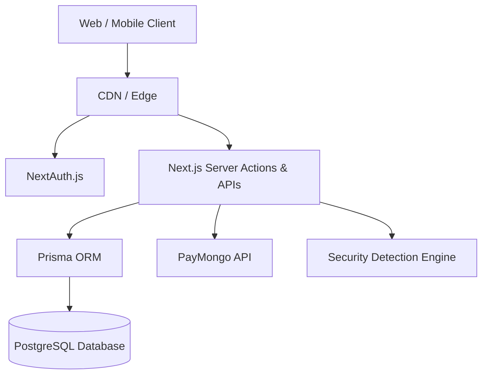

# Chapter 20 — Technical Architecture

## 20.1 Core Stack

RENTipid is built on a modern, serverless-first, full-stack JavaScript architecture:
- **Frontend / Fullstack Framework:** Next.js (App Router, React 19).
- **Styling:** Tailwind CSS, Shadcn UI components.
- **Database ORM:** Prisma Client.
- **Database Engine:** PostgreSQL (via local Docker for dev, RDS/Neon for production).
- **Authentication:** NextAuth.js with bcrypt.
- **Containerization:** Docker / Docker Compose.

## 20.2 Architectural Patterns

### Server Components and Server Actions
RENTipid relies heavily on React Server Components (RSC) to minimize client-side bundle size. Data mutations (e.g., creating a booking, approving KYC) are handled via Next.js Server Actions, ensuring secure, server-side execution without exposing intermediate APIs where unnecessary.

### Event-Driven Security
The SOC module operates on an event-driven architecture. Core actions emit specific `SecurityEvent` payloads which are logged and processed by the detection engine asynchronously, preventing security telemetry from blocking critical user path execution.

## 20.3 Deployment Topology

The expected deployment topology involves:
- **Edge Network / CDN:** Routing and static asset caching.
- **Serverless Functions:** Next.js API routes and server actions running in scalable serverless environments (e.g., Vercel or AWS Lambda).
- **Relational Database:** A robust PostgreSQL instance for transactional consistency (ACID compliance required for escrow ledgers).
- **Blob Storage:** (Planned) AWS S3 for storing KYC documents and inspection photos securely.

### High-Level Architecture Diagram

## Evidence References

| Evidence ID | Repository Path | Symbol, Model, Route, Test, or Report | Relevance | Verification Status |
| ----------- | --------------- | ------------------------------------- | --------- | ------------------- |
| REPO-003 | `package.json` | Next.js, Prisma, Tailwind | Core stack definition | Verified |
| REPO-004 | `docker-compose.yml` | Container specs | Infra definition | Verified |

## Related Chapters
- Chapter 21: Database Manual
- Chapter 24: Configuration and Environment
