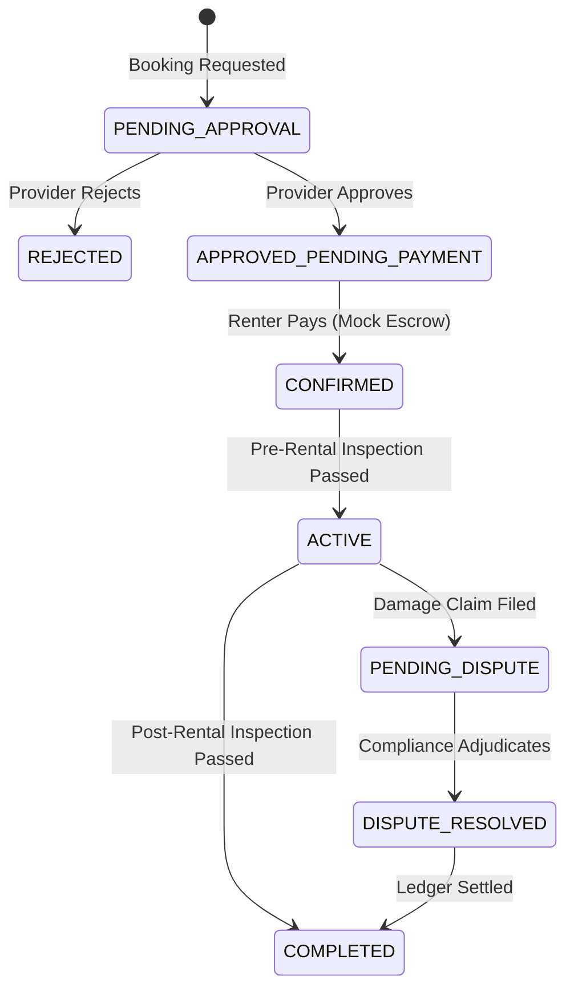

# Chapter 31 — Diagrams and Quick Guides

## 31.1 Master Booking State Machine Diagram

## 31.2 Quick-Start Guide: Compliance Admins
1. Log into the Dashboard.
2. Navigate to `Compliance > Verification Queue`.
3. Select a `Pending` document.
4. Verify the ID text matches the user profile.
5. Verify the selfie matches the ID photo.
6. Click `Approve` or `Reject` (with a reason).

## 31.3 Quick-Start Guide: Finance Admins
1. Log into the Dashboard.
2. Navigate to `Finance > Payout Batches`.
3. Select an `Unprocessed` batch.
4. Verify no users in the batch are under SOC investigation.
5. Click `Execute Batch` to simulate the bank transfer.

## 31.4 Quick-Start Guide: SOC Analysts
1. Log into the Dashboard.
2. Navigate to `Security > Alert Queue`.
3. Open an `IncidentCase`.
4. Review the timeline of events.
5. Select a playbook (e.g., `REQUIRE_STEP_UP_AUTH`).
6. Submit for Supervisor approval if the risk level requires it.
