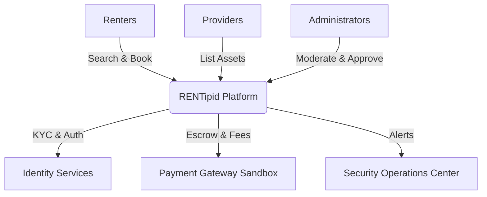
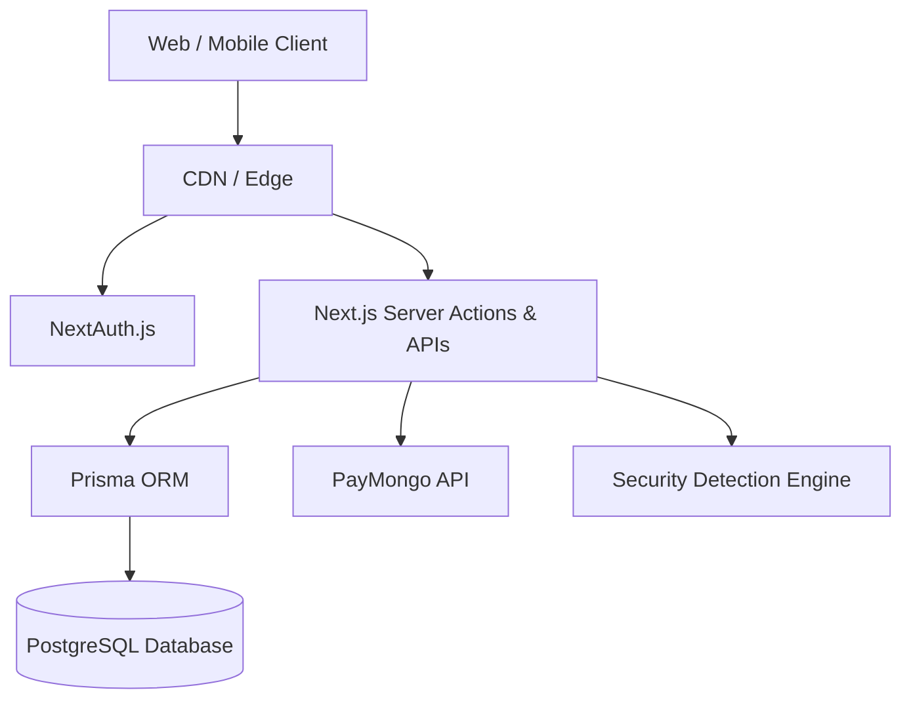
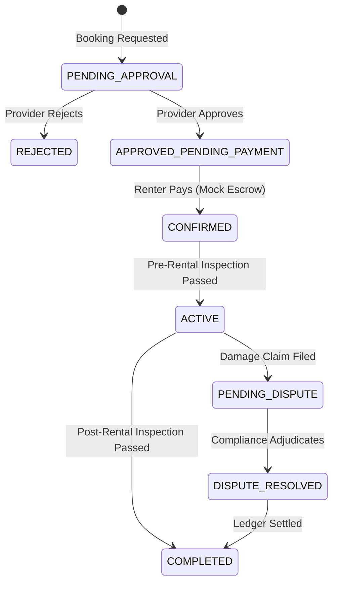

# RENTipid Master User, Operations, Technical, Database, Security, and Developer Manual

## Cover Page

**Document Title**: RENTipid Master Manual  
**Application Name**: RENTipid  
**Application Version**: 0.1.0  
**Repository Branch Inspected**: `feature/soc-phase4-threat-response`  
**Commit Inspected**: `741620cb3a2a07c1db28b052db98c39ea38c2d38`  
**Documentation Generation Date**: 2026-07-28  

**Prepared For**: RENTipid Stakeholders, Users, Operators, and Developers  
**Confidentiality Notice**: This document contains proprietary information regarding the architecture, security models, and operational procedures of RENTipid. Unauthorized distribution is prohibited.

---

## Document Control

### Revision History
| Version | Date | Description | Author |
| :--- | :--- | :--- | :--- |
| 1.0 | 2026-07-28 | Initial Master Manual Generation (Batched) | Technical Documentation Architect |

### Approval and Sign-Off
| Role | Name | Signature | Date |
| :--- | :--- | :--- | :--- |
| Project Owner | | | |
| Lead Security Architect | | | |
| Operations Director | | | |

---

## Table of Contents

*(This section will be fully compiled upon completion of all Batches.)*

1. **Part I — Executive and Product Overview**
2. **Part II — User Types, Roles, and Access**
3. **Part III — Renter User Manual**
4. **Part IV — Provider User Manual**
5. **Part V — Administration and Operations Manual**
6. **Part VI — Finance and Payment Operations**
7. **Part VII — Compliance, Trust, and Safety**
8. **Part VIII — Security Operations Center**
9. **Part IX — AI Assistant and Automation**
10. **Part X — Social Media, Promotion, and Feedback Intelligence**
11. **Part XI — Mobile Application and PWA**
12. **Part XII — Technical Architecture**
13. **Part XIII — Database Manual**
14. **Part XIV — API, Services, and Integrations**
15. **Part XV — Workflows and State Machines**
16. **Part XVI — Configuration and Environment**
17. **Part XVII — Testing and Quality Assurance**
18. **Part XVIII — Deployment, Operations, and Maintenance**
19. **Part XIX — Development Phase History**
20. **Part XX — Troubleshooting**
21. **Part XXI — Training Materials**
22. **Part XXII — Governance and Audit**

---

## Glossary and Acronyms

- **BOQ**: Bill of Quantities
- **KYC**: Know Your Customer (Identity Verification)
- **MFA**: Multi-Factor Authentication
- **PBAC**: Project-Based Access Control
- **PWA**: Progressive Web App
- **RBAC**: Role-Based Access Control
- **SOC**: Security Operations Center
- **UAT**: User Acceptance Testing
- **WBS**: Work Breakdown Structure

---

## How to Use This Manual

This manual is the single source of truth for RENTipid. 
- **Users and Providers** should reference Parts III and IV.
- **Operations and Finance** personnel should reference Parts V, VI, and VII.
- **Security Analysts** should consult Part VIII.
- **Developers and Architects** should rely on Parts XII through XVI.

> [!IMPORTANT]
> **Important Safety and Operational Notice**
> Certain features documented herein are marked as `MOCK_OR_SIMULATION_ONLY` or `SANDBOX_ACTIVE`. Do not assume financial integrations or escrow mechanisms are live without verifying the deployment environment controls detailed in Chapter 43 (Environment Variables).

---

## Evidence References

| Evidence ID | Repository Path | Symbol, Model, Route, Test, or Report | Relevance | Verification Status |
| ----------- | --------------- | ------------------------------------- | --------- | ------------------- |
| REPO-001 | `/` | Root Repository | Master baseline | Verified |
| REPO-003 | `package.json` | Version info | Application metadata | Verified |

## Known Limitations

- **Documentation Limitation:** The complete Table of Contents will be finalized upon the conclusion of Batch E.

## Related Chapters
- Chapter 1: RENTipid Executive Overview

---

# Chapter 1 — RENTipid Executive Overview

## 1.1 Purpose of RENTipid

RENTipid is a comprehensive digital rental marketplace designed to facilitate secure, transparent, and efficient rental transactions between individuals and businesses. 

**"Why buy it? RENTipid."** 
The platform operates on the principle that renting is more economical and environmentally sustainable than purchasing assets for short-term use. RENTipid bridges the gap between asset owners (Providers) and asset seekers (Renters) while providing robust escrow mechanisms, compliance checks, and operational safety nets.

## 1.2 Rentable Assets

RENTipid supports a wide array of categories, categorized by risk and regulatory requirements:
- **Low Risk:** Tools, Office Equipment, Event Equipment
- **Medium Risk:** Construction Equipment, Cameras & Gadgets, Event Venues
- **Regulated / High Risk:** Heavy Equipment, Cars & Motorcycles, Condominiums, Beach Resorts, Boats, Aircraft Charters

## 1.3 Marketplace Participants

The primary stakeholders in the RENTipid ecosystem include:
- **Renters:** Individuals or businesses seeking to rent assets.
- **Individual Providers:** Private asset owners listing items for rent.
- **Business Providers:** Commercial rental entities with bulk listings and advanced onboarding requirements.
- **Platform Operators (Admins):** Personnel managing compliance, finance, security, and dispute resolution.

## 1.4 Core Transaction Lifecycle

The business model revolves around secure escrow transactions:
1. **Discovery:** Renters browse, filter, and request bookings for listed assets.
2. **Agreement:** Providers approve requests, establishing a binding Rental Agreement.
3. **Escrow (Mock/Live):** Renters deposit funds securely into the platform's escrow holding.
4. **Active Rental:** Pre-rental and post-rental inspections are conducted to verify asset condition.
5. **Resolution:** Funds are released to the Provider (minus platform fees) upon successful return, or disputed via the claims process if damage occurs.

## 1.5 Safety, Trust, and Compliance

RENTipid integrates a multi-layered security and trust framework:
- **KYC Verification:** Identity and business verification processes ensure all participants are legitimate.
- **Security Operations Center (SOC):** A dedicated administrative module for detecting behavioral anomalies, payment fraud, and threat response.
- **Emergency Controls:** Platform-wide freeze capabilities to halt financial transactions during critical incidents.

## 1.6 Current Product Maturity and Posture

- **Current Status:** RENTipid is operating in a **Live Pilot / Private Beta** environment.
- **Financial Posture:** `MOCK_OR_SIMULATION_ONLY`. Payment gateways (e.g., PayMongo) are integrated in Sandbox mode. Real financial transactions are strictly disabled pending regulatory approval.
- **AI Integration:** `IMPLEMENTED_BUT_DISABLED` / `SANDBOX_ACTIVE`. Generative AI and automated assistance features are present but restricted from autonomous financial or administrative actions.

## 1.7 Diagrams

### RENTipid Ecosystem Context Diagram

## Evidence References

| Evidence ID | Repository Path | Symbol, Model, Route, Test, or Report | Relevance | Verification Status |
| ----------- | --------------- | ------------------------------------- | --------- | ------------------- |
| REPO-002 | `prisma/schema.prisma` | `Category`, `Booking`, `Payment` | Core business model | Verified |
| REPO-005 | `src/app` | Dashboard Routes | Stakeholder access paths | Verified |
| REPO-007 | `docs/soc` | SOC Documentation | Security posture | Verified |

## Known Limitations
- **Financial Limitation:** The platform currently relies on a simulated payment escrow. All references to live money movement are architectural plans awaiting production activation.

## Related Chapters
- Chapter 2: System Scope and Boundaries
- Chapter 17: Payment Architecture

---

# Chapter 2 — System Scope and Boundaries

## 2.1 Included Functions

The RENTipid platform includes the following fully or partially implemented functions:
- User registration, authentication, and session management.
- Multi-tier verification (KYC) for individuals and businesses.
- Listing creation, moderation, and publication workflows.
- Booking requests, scheduling, and provider approvals.
- Simulated financial escrow, deposit holding, and simulated provider payouts.
- Post-rental inspections, damage claims, and dispute case management.
- Security Operations Center (SOC) dashboard, event ingestion, and incident playbooks.
- Administrative dashboards for finance, compliance, and user support.

## 2.2 Excluded Functions

The following functions are explicitly excluded from the current system boundary:
- **Real-world logistics:** RENTipid does not provide delivery, shipping, or physical asset transport. All asset handovers are coordinated directly between the Renter and Provider.
- **Insurance underwriting:** While RENTipid manages damage claims against security deposits, it does not act as a licensed insurance provider.
- **Autonomous Financial Execution:** AI components and automated scripts are strictly prohibited from releasing funds or approving provider payouts.

## 2.3 External Dependencies

RENTipid relies on the following third-party infrastructure:
- **Cloud Infrastructure:** Vercel (Frontend), AWS / Azure (Backend/DB migration targets).
- **Database:** PostgreSQL (Prisma ORM).
- **Payment Gateway:** PayMongo (Currently restricted to Sandbox).
- **Authentication:** NextAuth.js.

## 2.4 Feature Activation Status

The system enforces strict feature flags and environment controls. The current posture is:

| Feature Area | Status | Notes |
| :--- | :--- | :--- |
| **Authentication (NextAuth)** | `PRODUCTION_ACTIVE` | Core RBAC and JWT sessions are active. |
| **Listing Moderation** | `PRODUCTION_ACTIVE` | Compliance checks are enforced. |
| **Mock Escrow** | `SANDBOX_ACTIVE` | Simulated financial ledger is active. |
| **Live Payments** | `IMPLEMENTED_BUT_DISABLED` | Requires executive and compliance approval to switch from Sandbox to Production gateway keys. |
| **AI Assistants** | `MOCK_OR_SIMULATION_ONLY` | Dependent on external LLM subscriptions and governance policies. |
| **Push Notifications** | `PLANNED_NOT_IMPLEMENTED` | PWA/Capacitor roadmap item. |

## 2.5 Features Requiring Approval

Several high-impact features cannot be utilized without manual administrative or external intervention:
- **Provider Account Activation:** Requires manual Compliance Admin review of KYC documents.
- **Regulated Asset Listings:** Assets like Heavy Equipment and Real Estate require manual Admin approval before publication.
- **Payout Batches:** Finance Admins must manually authorize payout batches to Providers.
- **Emergency Freeze Resolution:** Only Super Admins can lift a platform-wide security freeze.

## Evidence References

| Evidence ID | Repository Path | Symbol, Model, Route, Test, or Report | Relevance | Verification Status |
| ----------- | --------------- | ------------------------------------- | --------- | ------------------- |
| REPO-002 | `prisma/schema.prisma` | `SystemSetting` | Feature flag enforcement | Verified |
| REPO-006 | `src/lib/security` | `authorization.ts` | RBAC and feature access | Verified |

## Known Limitations
- **Legal Limitation:** Real-world legal frameworks for the "Rental Agreements" generated by the platform have not been fully localized for all operating jurisdictions.

## Related Chapters
- Chapter 3: User Roles
- Chapter 43: Environment Variables

---

# Chapter 3 — User Roles

## 3.1 Role Overview

RENTipid utilizes a strict, database-authoritative Role-Based Access Control (RBAC) system. Every user is assigned a specific role that dictates their permissions, visibility, and available actions within the platform.

The system currently implements the following core roles:

| Role Name | Purpose | Account Type |
| :--- | :--- | :--- |
| **Guest** | Unauthenticated or unverified users browsing public listings. | N/A |
| **Renter** | Verified users who can book rentals and submit claims. | Individual / Business |
| **Individual Provider** | Verified private asset owners who list items for rent. | Individual |
| **Business Provider** | Verified commercial entities with bulk listings. | Business |
| **Admin** | General operations and listing moderation. | System |
| **Compliance Admin** | Responsible for KYC, identity, and business verification. | System |
| **Finance Admin** | Responsible for payouts, refunds, and reconciliation. | System |
| **SOC Analyst / Supervisor** | Personnel managing security events and threats. | System |
| **Super Admin** | Highest authority; controls platform settings and emergency freezes. | System |

## 3.2 Role-to-Permission Matrix

*Note: This is a simplified overview. Granular permissions are enforced via server-side middleware and the `authorization.ts` service.*

| Feature | Renter | Provider | Admin | Finance | Compliance | Super Admin |
| :--- | :--- | :--- | :--- | :--- | :--- | :--- |
| Browse Listings | Yes | Yes | Yes | Yes | Yes | Yes |
| Request Booking | Yes | No | No | No | No | No |
| Create Listing | No | Yes | No | No | No | No |
| Approve Booking | No | Yes | No | No | No | No |
| Approve KYC | No | No | No | No | Yes | Yes |
| Approve Listing | No | No | Yes | No | Yes | Yes |
| Authorize Payout | No | No | No | Yes | No | Yes |
| Emergency Freeze | No | No | No | No | No | Yes |

## 3.3 Role Transitions and Approval Authority

Roles are assigned during registration but can be elevated or restricted based on verification and compliance:
- A newly registered user defaults to a restricted state until KYC verification is approved by a **Compliance Admin**.
- Users can apply to become Providers, requiring secondary verification.
- **Super Admins** have the authority to assign or revoke administrative roles.
- Administrative roles cannot participate in the marketplace as Renters or Providers using the same account to prevent conflicts of interest.

## Evidence References

| Evidence ID | Repository Path | Symbol, Model, Route, Test, or Report | Relevance | Verification Status |
| ----------- | --------------- | ------------------------------------- | --------- | ------------------- |
| REPO-002 | `prisma/schema.prisma` | `User` model, `role` field | Role definitions | Verified |
| REPO-006 | `src/lib/security` | `authorization.ts` | Access enforcement | Verified |

## Known Limitations
- **Support Roles:** Dedicated "Customer Support" tier roles are partially implemented and currently grouped under general "Admin" permissions.

## Related Chapters
- Chapter 4: Account Lifecycle
- Chapter 13: Administrative Dashboard

---

# Chapter 4 — Account Lifecycle

## 4.1 Account Registration and Authentication

The RENTipid account lifecycle begins with registration via email and password (managed via NextAuth and bcrypt hashing). 
- Users must agree to the Terms of Service and Privacy Policy during registration.
- Passwords must meet complexity requirements.
- Session management is handled securely via HTTP-only JWT cookies with a 30-day rolling expiration.

## 4.2 Profile Setup and KYC Verification

Following registration, accounts are in a `Pending` status. To transact on the platform, users must complete Know Your Customer (KYC) verification:
1. **User Action:** The user submits government-issued ID and a selfie via the profile dashboard.
2. **System Action:** Documents are uploaded securely (currently simulating OCR/verification).
3. **Approval:** A Compliance Admin reviews the submission. 
4. **Status Change:** Upon approval, the account status changes to `Verified`.

## 4.3 Provider Onboarding

Users wishing to list items must complete the Provider Onboarding flow:
- **Individual Providers** must pass standard KYC and agree to the Provider Terms.
- **Business Providers** must submit additional corporate documents (e.g., Business Permits, SEC Registration) which undergo a stricter review by Compliance Admins.

## 4.4 Account Suspension and Blacklisting

Accounts can be restricted due to policy violations, failed payments, or security anomalies:
- **Suspended:** Temporary restriction. The user cannot book or list new items but can access historical records. Often used during dispute resolution.
- **Blacklisted:** Permanent ban. The user is immediately logged out, active sessions are invalidated, and the email/identity is flagged to prevent re-registration. 

## 4.5 Account Deletion and Data Retention

Users have the right to request account deletion in compliance with data privacy regulations:
1. **User Action:** Submits an `AccountDeletionRequest`.
2. **System Check:** The system verifies there are no active bookings, pending payouts, or unresolved disputes linked to the account.
3. **Execution:** If clear, personal data is anonymized or hard-deleted depending on retention policies (e.g., financial records are retained for statutory periods).

## 4.6 Technical Workflow: Failed Login

To prevent credential stuffing and brute-force attacks:
- Failed login attempts trigger an `AUTH_LOGIN_FAILED` audit event.
- Repeated failures result in temporary IP or account lockouts enforced by the SOC monitoring rules.

## Evidence References

| Evidence ID | Repository Path | Symbol, Model, Route, Test, or Report | Relevance | Verification Status |
| ----------- | --------------- | ------------------------------------- | --------- | ------------------- |
| REPO-002 | `prisma/schema.prisma` | `User`, `VerificationDocument`, `AccountDeletionRequest` | DB Schema | Verified |
| REPO-005 | `src/app/api/auth` | NextAuth endpoints | Auth lifecycle | Verified |

## Known Limitations
- **Verification Automation:** KYC verification relies heavily on manual Compliance Admin review; third-party automated OCR integration is planned but not fully implemented.

## Related Chapters
- Chapter 9: Provider Registration and Verification
- Chapter 19: Verification and Compliance

---

# Chapter 5 — Renter Getting Started

## 5.1 Account Creation and Profile Setup

To begin renting on RENTipid, users must first create a Renter account:
1. Navigate to the RENTipid homepage and select **Sign Up**.
2. Provide a valid email address, name, and secure password.
3. Once registered, log into the dashboard and complete your profile.
4. **Verification:** Navigate to the KYC section and upload a valid government ID. Your account will remain in a limited state until a Compliance Admin approves your identity.

## 5.2 Searching and Filtering Listings

The `Browse Rentals` page allows Renters to discover available assets:
- **Search Bar:** Enter keywords to find specific items.
- **Categories:** Filter by predefined categories (e.g., Tools, Cameras, Vehicles).
- **Filters:** Adjust price ranges, location constraints, and deposit requirements.

*Technical Note: The search functionality queries the `Listing` database model where the status is `PUBLISHED`.*

## 5.3 Reviewing Listing Details

When selecting a listing, Renters can view:
- **Item Description & Photos:** Detailed specifications and visual condition.
- **Provider Details:** The Provider's name, rating, and verification status.
- **Pricing & Fees:** Daily rental rate, required security deposit, and platform service fees.
- **Availability Calendar:** Selectable dates for the rental period.
- **Conditions:** Specific rules set by the Provider (e.g., "No off-road use").

## 5.4 Using the Dashboard

Once logged in, the Renter Dashboard provides access to:
- **My Bookings:** Track pending, active, and completed rentals.
- **Payments:** View receipts and refund status.
- **Claims & Disputes:** Manage ongoing issues with Providers.
- **Inbox/Messages:** (If supported) Communicate regarding active bookings.

## 5.5 Mobile and PWA Access

RENTipid is designed as a Progressive Web App (PWA). Renters can access the platform via desktop or mobile browsers. For an app-like experience, users can "Add to Home Screen" on iOS (Safari) or Android (Chrome), which enables offline caching and a full-screen interface.

## Evidence References

| Evidence ID | Repository Path | Symbol, Model, Route, Test, or Report | Relevance | Verification Status |
| ----------- | --------------- | ------------------------------------- | --------- | ------------------- |
| REPO-005 | `src/app/browse/page.tsx` | Search and Filter UI | Core renter discovery | Verified |
| REPO-005 | `src/app/dashboard/renter` | Renter Dashboard Routes | User portal | Verified |

## Known Limitations
- **Favorites/Saving:** The ability to "save" or "favorite" listings is currently UI-only or partially implemented and may not persist across sessions.

## Related Chapters
- Chapter 6: Booking and Rental Process
- Chapter 30: Mobile and PWA Capabilities

---

# Chapter 6 — Booking and Rental Process

## 6.1 The Renter Journey

The RENTipid booking lifecycle is a highly structured process designed to protect both parties and ensure transparency.

### Step 1: Booking Request
- **User Action:** The Renter selects rental dates and submits a booking request from the listing page.
- **System Action:** A `Booking` record is created with the status `PENDING_APPROVAL`. The Provider is notified.

### Step 2: Provider Approval
- **Action:** The Provider reviews the Renter's profile and accepts or rejects the request.
- **Status Change:** If accepted, the status changes to `APPROVED_PENDING_PAYMENT`.

### Step 3: Payment and Mock Escrow
- **User Action:** The Renter proceeds to checkout to pay the total amount (Rental Fee + Security Deposit + Service Fee).
- **System Action:** The system utilizes the payment gateway (currently `SANDBOX_ACTIVE`) to capture funds. The funds are held in a mock escrow ledger (`FinanceLedger`).
- **Status Change:** Status updates to `CONFIRMED`.

### Step 4: Pre-Rental Inspection and Handover
- **Action:** Both parties meet to exchange the asset. They must complete an `InspectionReport` via the platform, taking photos of the asset's current condition to establish a baseline.
- **Status Change:** Once confirmed by both, the rental begins (`ACTIVE`).

### Step 5: Active Rental
- **Action:** The Renter possesses the asset for the agreed duration. Extension requests can be made if supported by the Provider.

### Step 6: Return and Post-Rental Inspection
- **Action:** The asset is returned. A post-rental `InspectionReport` is completed to verify the condition against the baseline.

### Step 7: Deposit Release or Claim
- **Clean Return:** If no damage is reported, the security deposit is queued for refund to the Renter, and the rental fee is queued for payout to the Provider. Status: `COMPLETED`.
- **Damage Reported:** If damage is noted, the Provider initiates a `DamageClaim` against the deposit. Status: `PENDING_DISPUTE`.

### Step 8: Review and Rating
- **User Action:** Both parties are prompted to leave a review and rating for the transaction.

## 6.2 Error Handling and Escalation

- **Expired Requests:** If a Provider does not respond within the timeframe, the booking automatically expires.
- **Payment Failure:** If the checkout fails, the booking remains in `APPROVED_PENDING_PAYMENT` until retried or cancelled.
- **Handover No-Show:** If either party fails to show up for handover, the booking can be cancelled with potential penalty fees applied depending on the cancellation policy.

## Evidence References

| Evidence ID | Repository Path | Symbol, Model, Route, Test, or Report | Relevance | Verification Status |
| ----------- | --------------- | ------------------------------------- | --------- | ------------------- |
| REPO-002 | `prisma/schema.prisma` | `Booking`, `BookingStatusHistory`, `InspectionReport` | State machine tracking | Verified |
| REPO-005 | `src/app/dashboard/renter/bookings/[id]` | Booking details and actions | User interface | Verified |

## Known Limitations
- **Live Payments:** Escrow holding is simulated. Real funds are not captured during the Beta/Pilot phase.

## Related Chapters
- Chapter 7: Renter Payments and Financial Transactions
- Chapter 41: Complete Workflow Catalog

---

# Chapter 9 — Provider Registration and Verification

## 9.1 Provider Onboarding Flow

Any Verified Renter can apply to become a Provider. RENTipid distinguishes between Individual and Business Providers, enforcing different compliance requirements.

### Individual Provider Verification
1. **Application:** User submits a request via the Provider Onboarding dashboard.
2. **Requirements:** Must have a verified government ID and a clean rental history.
3. **Approval:** Processed by Compliance Admins.

### Business Provider Verification
1. **Application:** A corporate entity submits a request to list assets at scale.
2. **Requirements:** Must submit corporate documents (e.g., DTI/SEC registration, Mayor's Permit, Tax Identification).
3. **Approval:** Subject to enhanced due diligence by Compliance Admins.

*Technical Note: Provider status is tracked via the `BusinessProfile` model and the `role` field in the `User` model.*

# Chapter 10 — Listing Creation and Management

## 10.1 Creating a Listing

Providers manage their inventory through the Provider Dashboard.
1. **Drafting:** The Provider enters the title, category, description, and high-quality photos.
2. **Pricing Configuration:** Sets the daily rental rate, required security deposit, and optional minimum/maximum rental durations.
3. **Submission:** High-risk or regulated categories (e.g., Vehicles, Heavy Equipment) automatically trigger a `PENDING_APPROVAL` status and require Admin review. Low-risk items may auto-publish based on System Settings.

## 10.2 Listing Moderation and States

- **Draft:** Work in progress, not visible to Renters.
- **Pending Approval:** Submitted but awaiting Admin clearance.
- **Published:** Active and bookable on the marketplace.
- **Paused/Unpublished:** Temporarily hidden by the Provider.
- **Rejected/Archived:** Removed due to compliance violations or permanent retirement.

# Chapter 11 — Provider Booking Operations

## 11.1 Managing Booking Requests

When a booking request is received:
- The Provider is notified and given a specific timeframe to respond.
- The Provider can review the Renter's profile and past reviews before deciding to `Accept` or `Reject`.

## 11.2 Inspections and Handover

Providers are responsible for conducting thorough inspections:
- **Pre-Rental:** The Provider must upload photos of the asset at handover, detailing any existing wear and tear via the `InspectionReport`.
- **Post-Rental:** Upon return, the Provider completes a closing inspection to verify the asset's condition.

# Chapter 12 — Provider Earnings and Reconciliation

## 12.1 Financial Lifecycle for Providers

- **Pending Funds:** Once a rental begins, funds are locked in the mock escrow ledger.
- **Settlement:** After a successful return and clean inspection, the platform calculates the final payout (Rental Fee minus Platform Commission).
- **Payout Batches:** Funds are queued into a `ProviderPayout`. Finance Admins process these payouts in batches (currently simulated).

> [!WARNING]
> **FINANCE WARNING**
> Current provider payouts are `MOCK_OR_SIMULATION_ONLY`. No real bank transfers are executed. Earnings visible in the Provider Dashboard reflect sandbox ledger entries only.

## Evidence References

| Evidence ID | Repository Path | Symbol, Model, Route, Test, or Report | Relevance | Verification Status |
| ----------- | --------------- | ------------------------------------- | --------- | ------------------- |
| REPO-002 | `prisma/schema.prisma` | `Listing`, `ProviderPayout`, `BusinessProfile` | Provider models | Verified |
| REPO-005 | `src/app/dashboard/provider` | Provider Dashboard Routes | Management UI | Verified |

## Related Chapters
- Chapter 2: System Scope and Boundaries
- Chapter 19: Verification and Compliance

---

# Chapter 13 — Administrative and Operations Manual

## 13.1 Super Admin Capabilities

The Super Admin role (`SUPER_ADMIN`) possesses the highest level of authorization within RENTipid. This role is strictly separated from daily operational tasks and is reserved for structural system management.

Key capabilities include:
- **Feature Toggles:** Activating or deactivating system-wide features via the `SystemSettings` module.
- **Emergency Incident Response:** Deploying the `EMERGENCY_FREEZE` playbook to halt all financial transactions and logins during a severe threat.
- **Role Assignment:** Granting or revoking administrative privileges for other staff members.

## 13.2 General Administrative Dashboard

General Admins monitor the overall health of the marketplace. Their primary responsibilities include:

### 13.2.1 Listing Moderation
Admins review listings flagged by the system or other users. 
- High-risk categories (e.g., Heavy Equipment) are automatically queued in the `Pending Approval` state.
- Admins verify that photos match descriptions and that no prohibited items are listed.

### 13.2.2 Support and Issue Tickets
Renters and Providers can submit `SupportTicket` or `IssueTicket` requests for general platform help. Admins resolve these tickets or escalate them to specialized departments (e.g., Finance or Compliance).

### 13.2.3 Category Management
Admins define the global rental taxonomy by adding or modifying `Category` models. They can enforce dynamic `CategoryRequirement` rules, such as requiring extra insurance documentation for specific categories.

## 13.3 Audit Logging and Traceability

Every significant administrative action is recorded in the `AuditLog`.
- Actions like approving a listing, resolving a ticket, or modifying a user's role are permanently logged.
- The logs capture the `actorId`, `targetId`, `actionType`, and a JSON payload of the changes.

## Evidence References

| Evidence ID | Repository Path | Symbol, Model, Route, Test, or Report | Relevance | Verification Status |
| ----------- | --------------- | ------------------------------------- | --------- | ------------------- |
| REPO-002 | `prisma/schema.prisma` | `AuditLog`, `SystemSetting` | Operations models | Verified |
| REPO-005 | `src/app/dashboard/admin` | General Admin Routes | Admin interface | Verified |
| REPO-005 | `src/app/dashboard/super-admin` | Super Admin Routes | Master interface | Verified |

## Related Chapters
- Chapter 3: User Roles
- Chapter 16: Security Operations Center

---

# Chapter 14 — Finance and Payment Operations

## 14.1 Financial Operating Posture

**Current Status:** `SANDBOX_ACTIVE` / `MOCK_OR_SIMULATION_ONLY`.
All references to payments, escrows, and payouts refer to the simulated financial ledger within the RENTipid database. The payment gateway integration (PayMongo) is restricted to Sandbox API keys.

## 14.2 The Mock Escrow Mechanism

To protect both Renters and Providers, RENTipid employs a simulated escrow system:
1. **Capture:** When a booking is confirmed, the Renter's payment is captured. 
2. **Holding:** The `FinanceLedger` records the funds as "held in escrow" under the RENTipid master account. The funds are not immediately disbursed to the Provider.
3. **Release:** Funds remain locked until the rental period concludes and both parties submit clean `InspectionReports`.
4. **Resolution:** The ledger simulates transferring the Rental Fee to the Provider and refunding the Security Deposit to the Renter.

## 14.3 Finance Administrator Role

Finance Admins (`FINANCE_ADMIN`) manage the lifecycle of money movement on the platform.

### 14.3.1 Payment Reconciliation
Finance Admins monitor the `PaymentReconciliationLog` to ensure that simulated PayMongo Webhook events match the internal `FinanceLedger` state. Any discrepancies are flagged for manual review.

### 14.3.2 Managing Payouts
Providers accumulate earnings in their virtual wallet. Finance Admins are responsible for executing payouts:
1. Earnings are grouped into a `PayoutBatch`.
2. The Finance Admin reviews the batch for flagged accounts (e.g., users under investigation by Compliance).
3. The Admin approves the batch, triggering a simulated disbursement to the Provider's registered bank account.

### 14.3.3 Refund Requests
If a booking is cancelled or a dispute is resolved in favor of the Renter, a `RefundRequest` is generated. Finance Admins process these requests to return funds to the Renter's original payment method.

## 14.4 Financial Telemetry and Security

High-velocity transactions or unusually large deposits trigger `SecurityEvent` alerts.
- **Velocity Rules:** If a single account attempts >5 bookings within an hour, a `PAYMENT_VELOCITY_ANOMALY` is triggered.
- **Value Rules:** Bookings exceeding predefined thresholds require manual Finance Admin clearance before the escrow is simulated.

## Evidence References

| Evidence ID | Repository Path | Symbol, Model, Route, Test, or Report | Relevance | Verification Status |
| ----------- | --------------- | ------------------------------------- | --------- | ------------------- |
| REPO-002 | `prisma/schema.prisma` | `Payment`, `GatewayTransaction`, `FinanceLedger` | Financial Data Models | Verified |
| REPO-005 | `src/app/dashboard/finance` | Finance Admin Dashboard | Operations UI | Verified |
| REPO-006 | `src/app/api/webhooks/paymongo/route.ts` | PayMongo Webhook Handler | Integration point | Verified |

## Known Limitations
- **Production Integration:** Live payments are explicitly disabled. 
- **Payout Automation:** Real-world API-driven payouts via the payment gateway are not yet implemented; the current design assumes manual offline batch processing by Finance Admins for actual disbursement.

## Related Chapters
- Chapter 6: Booking and Rental Process
- Chapter 16: Security Operations Center

---

# Chapter 15 — Compliance, Trust, and Safety

## 15.1 Compliance Administrator Role

The Compliance Admin (`COMPLIANCE_ADMIN`) is the gatekeeper of trust within the RENTipid ecosystem. They are responsible for verifying identities, mitigating fraud, and handling disputes.

## 15.2 KYC Verification Workflow

Every user intending to transact must pass Identity Verification (KYC):
1. **Submission:** The user uploads a government ID (Passport, Driver's License) and a live selfie.
2. **Review:** The `VerificationDocument` is placed in a queue. The Compliance Admin compares the ID against the selfie and checks for signs of digital alteration.
3. **Decision:** The Admin approves or rejects the document. If rejected, the user must restart the process.

**Business Provider Verification:** Businesses must submit corporate documents. The Compliance Admin verifies these against public registries (e.g., DTI, SEC) to ensure the business is legally permitted to operate.

## 15.3 Dispute and Damage Claim Management

When a rental concludes with reported damage, it escalates to Compliance:
1. **Damage Claim Initiation:** The Provider files a `DamageClaim` including photos (`DamageClaimPhoto`) and an estimated repair cost.
2. **Renter Rebuttal:** The Renter is notified and can agree to the claim or file a dispute.
3. **Dispute Case:** If contested, a `DisputeCase` is generated.
4. **Adjudication:** A Compliance Admin reviews the Pre-Rental Inspection vs. Post-Rental Inspection photos, communications, and the claim details.
5. **Resolution:** The Admin issues a binding decision. They can authorize transferring a portion of the simulated Security Deposit to the Provider (`DepositAction`), or release the funds back to the Renter.

## 15.4 Content Moderation

Compliance Admins actively moderate the platform to prevent illegal or prohibited listings:
- **Prohibited Items:** Firearms, hazardous materials, illegal substances, and regulated medical equipment are strictly prohibited.
- **Reporting:** Any user can flag a listing. Flagged listings are hidden pending Compliance review.

## Evidence References

| Evidence ID | Repository Path | Symbol, Model, Route, Test, or Report | Relevance | Verification Status |
| ----------- | --------------- | ------------------------------------- | --------- | ------------------- |
| REPO-002 | `prisma/schema.prisma` | `VerificationDocument`, `DisputeCase`, `DamageClaim` | Compliance Models | Verified |
| REPO-005 | `src/app/dashboard/compliance` | Compliance Dashboard | Operations UI | Verified |

## Related Chapters
- Chapter 4: Account Lifecycle
- Chapter 9: Provider Registration and Verification

---

# Chapter 16 — Security Operations Center (SOC)

## 16.1 SOC Purpose and Architecture

The RENTipid Security Operations Center (SOC) is an internal subsystem designed to detect, analyze, and respond to platform abuse, financial fraud, and behavioral anomalies. 

The SOC architecture is event-driven:
1. **Event Ingestion:** Core application modules emit normalized `SecurityEvent` payloads (e.g., `PAYMENT_FAILED`, `LOGIN_ANOMALY`).
2. **Rule Evaluation:** A continuous engine evaluates events against defined `DetectionRule` heuristics.
3. **Alert Generation:** If a rule triggers, a `SecurityAlert` is generated.
4. **Case Management:** Related alerts are grouped into an `IncidentCase` for human investigation.
5. **Response Execution:** Analysts deploy predefined `SecurityResponsePlaybook` actions to mitigate the threat.

## 16.2 SOC Roles and Hierarchy

- **SOC Analyst (`SOC_ANALYST`):** Triage alerts, investigate incident cases, and execute low-risk playbooks (e.g., triggering a password reset).
- **SOC Supervisor (`SOC_SUPERVISOR`):** Oversee analysts, approve high-risk playbook executions (e.g., account suspension), and manage detection rules.

## 16.3 Behavioral Risk Intelligence

The SOC includes a `BehavioralRiskAssessment` module. It aggregates multiple `BehavioralRiskSignal` events (e.g., rapid consecutive booking cancellations, using known VPN IPs) to calculate a cumulative risk score for a user. If the score exceeds the threshold, the system automatically escalates the user for manual review.

## 16.4 Security Response Playbooks

Playbooks are predefined sequences of mitigation actions:
- **`ACCOUNT_LOCKDOWN`**: Invalidates active sessions and suspends the account.
- **`PAYMENT_FREEZE`**: Halts all outbound simulated payouts for a specific user.
- **`REQUIRE_STEP_UP_AUTH`**: Forces the user to re-authenticate or perform MFA before their next action.

*Execution Control:* High-impact actions require multi-party authorization via the `SecurityResponseApprovalRequest` workflow. A SOC Analyst proposes the execution, and a SOC Supervisor must approve it before the system executes the state change.

## 16.5 The Emergency Freeze Protocol

In the event of a catastrophic platform vulnerability or mass exploitation, a Super Admin can trigger a `SYSTEM_WIDE_FREEZE`. This instantly halts:
- All new logins.
- All payment capture and mock escrow releases.
- All listing modifications.

## Evidence References

| Evidence ID | Repository Path | Symbol, Model, Route, Test, or Report | Relevance | Verification Status |
| ----------- | --------------- | ------------------------------------- | --------- | ------------------- |
| REPO-002 | `prisma/schema.prisma` | `SecurityEvent`, `IncidentCase`, `SecurityResponsePlaybook` | SOC Data Architecture | Verified |
| REPO-005 | `src/app/dashboard/admin/security` | SOC Dashboard Routes | Operations UI | Verified |
| REPO-007 | `docs/soc` | SOC Documentation | Design Specifications | Verified |

## Related Chapters
- Chapter 13: Administrative and Operations Manual
- Chapter 39: Event-Driven Architecture

---

# Chapter 17 — AI Assistant and Automation

## 17.1 Artificial Intelligence Posture

**Current Status:** `MOCK_OR_SIMULATION_ONLY` / `IMPLEMENTED_BUT_DISABLED`.
RENTipid has architectural hooks for Generative AI and automated chat assistance; however, these systems are actively restricted from executing autonomous financial, administrative, or compliance actions.

## 17.2 The AI Support Assistant

The primary AI integration is designed to offload tier-1 customer support.
- **Renter Assistance:** AI can answer questions about the rental process, guide users on how to upload KYC documents, or explain the dispute process.
- **Provider Assistance:** AI can suggest optimal rental pricing based on category averages or help draft listing descriptions.

*Note: All AI interactions are logged in the `AIBotLog` model for compliance and quality assurance.*

## 17.3 AI Governance and Safeguards

To prevent "hallucinations" or unauthorized commitments, the AI module is restricted by strict boundaries:
1. **Read-Only Access:** The AI can query knowledge bases (RAG) but cannot execute POST/PUT/DELETE operations on user data.
2. **Escalation Triggers:** If the AI detects negative sentiment, threats of legal action, or physical safety concerns, it automatically escalates the chat to a human `SupportTicket` and notifies the SOC.
3. **No Financial Authority:** The AI cannot authorize refunds, waive platform fees, or alter the simulated escrow ledger.

## Evidence References

| Evidence ID | Repository Path | Symbol, Model, Route, Test, or Report | Relevance | Verification Status |
| ----------- | --------------- | ------------------------------------- | --------- | ------------------- |
| REPO-002 | `prisma/schema.prisma` | `AIBotLog` | AI Telemetry | Verified |
| REPO-005 | `src/app/api/ai/chat/route.ts` | AI Chat Handler | Integration | Verified |

## Related Chapters
- Chapter 13: Administrative and Operations Manual

---

# Chapter 18 — Social Media, Promotion, and Feedback Intelligence

## 18.1 Marketing and Promotion Engine

RENTipid includes a built-in module for managing external marketing campaigns and provider promotions. This allows the platform to broadcast top-tier listings to connected social channels (e.g., Facebook, Instagram, Twitter).

### 18.1.1 Social Accounts and Queues
- Admins can link official RENTipid social profiles via the `SocialAccount` model (using OAuth integration).
- The `SocialPostQueue` manages scheduled promotional posts.

### 18.1.2 Provider Opt-In Promotion
Providers can boost their listings by opting into promotional campaigns (`ProviderPromotionOptIn`). If selected, RENTipid generates marketing assets (`PromotionAsset`) and tracks engagement via UTM links (`UTMLink`).

## 18.2 Feedback Intelligence and Sentiment Analysis

A critical component of Trust and Safety is aggregating user feedback.
- **Review System:** Renters and Providers rate each other post-transaction.
- **Sentiment Tracking:** (Planned) RENTipid intends to route text reviews through an NLP sentiment analyzer. Consistently negative sentiment scores against a Provider will flag their account for Compliance review, even if no formal disputes were filed.

## 18.3 Campaign Analytics

Marketing Admins utilize the `CampaignAnalytics` module to track the ROI of social media efforts, measuring:
- Click-through rates on promotional UTM links.
- Conversion rates (number of actual bookings originating from a specific social post).

## Evidence References

| Evidence ID | Repository Path | Symbol, Model, Route, Test, or Report | Relevance | Verification Status |
| ----------- | --------------- | ------------------------------------- | --------- | ------------------- |
| REPO-002 | `prisma/schema.prisma` | `SocialAccount`, `MarketingCampaign`, `SocialPostQueue` | Marketing Data Models | Verified |
| REPO-005 | `src/app/dashboard/admin/marketing` | Marketing Dashboard | Operations UI | Verified |

## Known Limitations
- **API Quotas:** Social media integrations rely on external third-party APIs which are subject to rate limiting. Deep integration is currently heavily mocked.

## Related Chapters
- Chapter 10: Listing Creation and Management

---

# Chapter 19 — Mobile Application and PWA

## 19.1 Mobile Strategy

RENTipid utilizes a hybrid mobile strategy to maximize reach while minimizing separate codebases. The primary web application is built with responsive web design principles and Progressive Web App (PWA) capabilities. For native device deployment (App Store / Google Play), RENTipid utilizes **Capacitor.js**.

## 19.2 Progressive Web App (PWA)

The PWA implementation allows users to install RENTipid directly from their mobile browser (Chrome/Safari) without visiting an app store.
- **Service Workers:** (Planned/Partial) Caching static assets for faster subsequent load times.
- **Manifest:** The `manifest.json` defines the app's display name, icons, and theme color for home-screen installation.

## 19.3 Capacitor Native Integration

Capacitor wraps the web application in a native WebView, allowing the codebase to access native device APIs.
- **Configuration:** Managed via `capacitor.config.ts`.
- **Target Platforms:** iOS and Android.
- **Native Capabilities Supported (Planned):**
  - Camera (for KYC uploads and Inspection Reports).
  - Push Notifications (for booking alerts and SOC interventions).
  - Geolocation (for mapping nearby rentals).

## 19.4 Mobile Analytics

The `MobileAnalytics` database model is designed to capture telemetry specific to the mobile application layer, including device type, OS version, and app version (`AppReleaseVersion`).

## Evidence References

| Evidence ID | Repository Path | Symbol, Model, Route, Test, or Report | Relevance | Verification Status |
| ----------- | --------------- | ------------------------------------- | --------- | ------------------- |
| REPO-001 | `capacitor.config.ts` | Capacitor settings | Native Wrapper | Verified |
| REPO-002 | `prisma/schema.prisma` | `AppReleaseVersion`, `MobileAnalytics` | DB tracking | Verified |

## Known Limitations
- **Push Notifications:** The backend schema for notifications exists, but native Apple APNs and Firebase Cloud Messaging (FCM) integrations are not yet fully active in the production sandbox.

## Related Chapters
- Chapter 20: Technical Architecture

---

# Chapter 20 — Technical Architecture

## 20.1 Core Stack

RENTipid is built on a modern, serverless-first, full-stack JavaScript architecture:
- **Frontend / Fullstack Framework:** Next.js (App Router, React 19).
- **Styling:** Tailwind CSS, Shadcn UI components.
- **Database ORM:** Prisma Client.
- **Database Engine:** PostgreSQL (via local Docker for dev, RDS/Neon for production).
- **Authentication:** NextAuth.js with bcrypt.
- **Containerization:** Docker / Docker Compose.

## 20.2 Architectural Patterns

### Server Components and Server Actions
RENTipid relies heavily on React Server Components (RSC) to minimize client-side bundle size. Data mutations (e.g., creating a booking, approving KYC) are handled via Next.js Server Actions, ensuring secure, server-side execution without exposing intermediate APIs where unnecessary.

### Event-Driven Security
The SOC module operates on an event-driven architecture. Core actions emit specific `SecurityEvent` payloads which are logged and processed by the detection engine asynchronously, preventing security telemetry from blocking critical user path execution.

## 20.3 Deployment Topology

The expected deployment topology involves:
- **Edge Network / CDN:** Routing and static asset caching.
- **Serverless Functions:** Next.js API routes and server actions running in scalable serverless environments (e.g., Vercel or AWS Lambda).
- **Relational Database:** A robust PostgreSQL instance for transactional consistency (ACID compliance required for escrow ledgers).
- **Blob Storage:** (Planned) AWS S3 for storing KYC documents and inspection photos securely.

### High-Level Architecture Diagram

## Evidence References

| Evidence ID | Repository Path | Symbol, Model, Route, Test, or Report | Relevance | Verification Status |
| ----------- | --------------- | ------------------------------------- | --------- | ------------------- |
| REPO-003 | `package.json` | Next.js, Prisma, Tailwind | Core stack definition | Verified |
| REPO-004 | `docker-compose.yml` | Container specs | Infra definition | Verified |

## Related Chapters
- Chapter 21: Database Manual
- Chapter 24: Configuration and Environment

---

# Chapter 21 — Database Manual

## 21.1 Database Engine and ORM

RENTipid utilizes PostgreSQL as its primary relational database engine. All schema migrations, client generation, and querying are managed via the **Prisma ORM** (`@prisma/client`).

## 21.2 Core Domain Models

The schema (`prisma/schema.prisma`) encompasses 78 models categorized into logical domains:

### 21.2.1 Identity and Access Management (IAM)
- **`User`:** The master record for authentication, tracking email, hashed passwords, and RBAC roles.
- **`UserMfa`:** Stores Multi-Factor Authentication secrets and backup codes.
- **`UserProfile` / `BusinessProfile`:** Segregates personal and commercial entity data.

### 21.2.2 Marketplace and Listings
- **`Listing`:** The core rentable asset record, linking to `User` (Provider) and `Category`.
- **`ListingPhoto` / `ListingDocument`:** Associated media and compliance documents (e.g., insurance certificates for vehicles).
- **`Category`:** Hierarchical classification (e.g., Vehicles -> Cars).

### 21.2.3 Booking and Escrow
- **`Booking`:** The transactional nexus linking a Renter, a Provider, and a Listing across a specific date range.
- **`BookingStatusHistory`:** An immutable append-only log tracking state changes (e.g., PENDING -> APPROVED).
- **`Payment` / `FinanceLedger`:** Tracks the financial state, separating the Rental Fee from the Security Deposit.

### 21.2.4 Trust and Safety (SOC)
- **`SecurityEvent`:** High-volume telemetry logs detailing system actions (e.g., failed logins, payout approvals).
- **`IncidentCase`:** Analyst-driven investigation containers linking multiple alerts.
- **`VerificationDocument`:** KYC artifacts linked to user profiles.

## 21.3 Database Security and Integrity

- **Foreign Key Constraints:** Prisma enforces strict referential integrity. Deleting a user will gracefully handle or block deletion based on active bookings.
- **Soft Deletion:** Important records (like Bookings) generally utilize status flags rather than hard SQL `DELETE` operations to maintain financial auditability.
- **Seed Data:** Development environments use `prisma/seed.ts` to populate necessary roles and mock data.

## Evidence References

| Evidence ID | Repository Path | Symbol, Model, Route, Test, or Report | Relevance | Verification Status |
| ----------- | --------------- | ------------------------------------- | --------- | ------------------- |
| REPO-002 | `prisma/schema.prisma` | Master Schema | Single source of truth | Verified |

## Related Chapters
- Chapter 23: Workflows and State Machines
- Chapter 32: Database Model Registry

---

# Chapter 22 — API, Services, and Integrations

## 22.1 Internal APIs and Server Actions

RENTipid primarily utilizes Next.js Server Actions for internal mutations, avoiding the need to expose REST endpoints for every UI interaction. This enhances security by keeping logic tightly coupled to the server.

However, formal API routes (`src/app/api`) are exposed for specific architectural needs:
- **Webhooks:** Receiving asynchronous callbacks from third parties (e.g., PayMongo).
- **Client-Side Fetching:** Specific highly dynamic UI components that require polling.
- **Mobile/Native Sync:** Endpoints designed for the upcoming Capacitor native applications.

## 22.2 Payment Gateway Integration (PayMongo)

**Status:** `SANDBOX_ACTIVE`
- **Route:** `src/app/api/webhooks/paymongo/route.ts`
- **Purpose:** Listens for `payment.paid` and `payment.failed` events. 
- **Security:** The webhook endpoint verifies the signature using the PayMongo Webhook Secret (`PAYMONGO_WEBHOOK_SECRET`) to prevent spoofing.

## 22.3 Authentication Service (NextAuth)

**Status:** `PRODUCTION_ACTIVE`
- **Route:** `src/app/api/auth/[...nextauth]/route.ts`
- **Purpose:** Handles login, session token generation, and OAuth callbacks (if social login is enabled).

## 22.4 AI and Chat Services

**Status:** `MOCK_OR_SIMULATION_ONLY`
- **Route:** `src/app/api/ai/chat/route.ts`
- **Purpose:** Connects the frontend chat interface to the backend LLM orchestrator.

## 22.5 Administrative and SOC APIs

The SOC module exposes extensive REST-like routes for managing security playbooks and approvals asynchronously:
- `src/app/api/soc/playbooks/list/route.ts`
- `src/app/api/soc/responses/execute/route.ts`
- `src/app/api/admin/security/cases/route.ts`

These endpoints enforce strict role-based authorization, requiring `SOC_ANALYST` or `SOC_SUPERVISOR` tokens.

## Evidence References

| Evidence ID | Repository Path | Symbol, Model, Route, Test, or Report | Relevance | Verification Status |
| ----------- | --------------- | ------------------------------------- | --------- | ------------------- |
| REPO-005 | `src/app/api` | Next.js API Routes | System integration points | Verified |

## Related Chapters
- Chapter 16: Security Operations Center
- Chapter 20: Technical Architecture

---

# Chapter 23 — Workflows and State Machines

## 23.1 The Booking State Machine

The core transaction in RENTipid is governed by a strict state machine implemented over the `Booking` model. Transitions between states require specific role authorizations and trigger side effects (like sending emails or emitting security events).

### Expected Happy Path
1. **`PENDING_APPROVAL`:** The Renter has submitted a request. Awaiting Provider action.
2. **`APPROVED_PENDING_PAYMENT`:** Provider approved. Awaiting Renter payment.
3. **`CONFIRMED`:** Payment captured (mock escrow). Awaiting the rental start date and Pre-Rental Inspection.
4. **`ACTIVE`:** Pre-Rental Inspection passed. Renter has possession of the asset.
5. **`COMPLETED`:** Asset returned. Post-Rental Inspection passed. Escrow released.

### Exception and Dispute Paths
- **`REJECTED`:** Provider denies the initial request. End state.
- **`CANCELLED_BY_RENTER` / `CANCELLED_BY_PROVIDER`:** Can occur before `ACTIVE`. Subject to cancellation policies.
- **`PENDING_DISPUTE`:** Triggered if the Post-Rental Inspection fails or a Damage Claim is filed. Halts escrow release.
- **`DISPUTE_RESOLVED`:** Compliance Admin adjudicates the dispute and manually transitions the booking to closure.

## 23.2 State Tracking

To ensure auditability, RENTipid employs the `BookingStatusHistory` model. 
Every state transition inserts an immutable record detailing:
- The previous state.
- The new state.
- The `actorId` who triggered the transition.
- A timestamp and optional contextual notes.

## 23.3 Verification Workflow

The KYC workflow operates on a simpler state machine linked to the `VerificationDocument` model:
1. **`SUBMITTED`:** User uploads ID.
2. **`UNDER_REVIEW`:** Compliance Admin claims the ticket.
3. **`APPROVED`:** Document validated. User role may elevate.
4. **`REJECTED`:** Document invalid (e.g., blurry, expired). User notified to retry.

## Evidence References

| Evidence ID | Repository Path | Symbol, Model, Route, Test, or Report | Relevance | Verification Status |
| ----------- | --------------- | ------------------------------------- | --------- | ------------------- |
| REPO-002 | `prisma/schema.prisma` | `BookingStatusHistory`, `Booking` | State definition | Verified |

## Related Chapters
- Chapter 6: Booking and Rental Process
- Chapter 15: Compliance, Trust, and Safety

---

# Chapter 24 — Configuration and Environment

## 24.1 The 12-Factor App Methodology

RENTipid adheres to the 12-Factor App methodology for configuration management. All environment-specific settings (database URIs, API keys, feature flags) are passed via environment variables, not hardcoded into the source.

## 24.2 Environment Variable Tiers

The system utilizes multiple `.env` files depending on the execution context:
- **`.env.example`:** The generic template defining required keys (committed to version control).
- **`.env.local`:** Developer's local overrides (git-ignored).
- **`.env.test.local`:** Configuration specifically for running the Jest/Playwright test suites against a dedicated test database (e.g., `rentipid_test_soc`).
- **Production Variables:** Managed securely within the Vercel dashboard or AWS Parameter Store.

## 24.3 Critical Configuration Variables

| Variable Name | Purpose | Risk Level |
| :--- | :--- | :--- |
| `DATABASE_URL` | Prisma connection string for PostgreSQL. | **Critical** |
| `NEXTAUTH_SECRET` | Cryptographic key for signing JWT sessions. | **Critical** |
| `NEXTAUTH_URL` | The canonical URL of the application. | High |
| `PAYMONGO_SECRET_KEY` | Server-side key for API calls. | **Critical** |
| `PAYMONGO_WEBHOOK_SECRET` | Verifies incoming webhook payloads. | High |
| `SOC_CORRELATION_HMAC_KEY` | Secures internal telemetry routing. | High |

## 24.4 Feature Flagging

While core secrets are stored in `.env`, dynamic feature flags are managed within the database via the `SystemSetting` model. This allows Super Admins to toggle features (e.g., `ENABLE_LIVE_PAYMENTS = false`) without redeploying the application.

## Evidence References

| Evidence ID | Repository Path | Symbol, Model, Route, Test, or Report | Relevance | Verification Status |
| ----------- | --------------- | ------------------------------------- | --------- | ------------------- |
| REPO-001 | `.env.local`, `.env.test.local` | Environment templates | Local dev configuration | Verified |

## Known Limitations
- **Secret Rotation:** Automated secret rotation for `NEXTAUTH_SECRET` and HMAC keys is not currently implemented and requires a manual environment update and redeployment.

## Related Chapters
- Chapter 20: Technical Architecture
- Chapter 35: Environment Variable Registry

---

# Chapter 25 — Testing and Quality Assurance

## 25.1 Testing Strategy

RENTipid employs a multi-tiered testing strategy to ensure platform stability, particularly around financial and security operations.

### 25.1.1 End-to-End (E2E) Testing
- **Framework:** Playwright (`@playwright/test`)
- **Execution:** `npm run test:e2e`
- **Purpose:** Simulates real user flows across the browser. Core test slices focus on the "Happy Path" (Renter books an item -> Provider approves -> Payment captured).

### 25.1.2 Integration and Security Testing
- **Framework:** Jest
- **Execution:** `npm run test:soc:integration`
- **Purpose:** Verifies that internal state machines and security event telemetry trigger correctly. Specifically tests the SOC module's ability to ingest events and generate alerts without UI dependencies.

### 25.1.3 Database Testing Guardrails
To prevent accidental data corruption during testing, the `npm run test:db:guard` script enforces that database migrations and truncations are only executed against the dedicated test database (`rentipid_test_soc`).

## 25.2 User Acceptance Testing (UAT)

UAT is tracked via the `UATFlow` database model. During beta testing, specific cohorts of users are assigned UAT scenarios. Their completion rates and feedback are recorded to validate production readiness.

## Evidence References

| Evidence ID | Repository Path | Symbol, Model, Route, Test, or Report | Relevance | Verification Status |
| ----------- | --------------- | ------------------------------------- | --------- | ------------------- |
| REPO-003 | `package.json` | Test scripts (`test:e2e`, `test:soc`) | Test execution | Verified |
| REPO-008 | `tests/` | Playwright and Jest configurations | Test definitions | Verified |

## Related Chapters
- Chapter 26: Deployment, Operations, and Maintenance

---

# Chapter 26 — Deployment, Operations, and Maintenance

## 26.1 Deployment Architecture

RENTipid is designed to be deployed across a hybrid cloud infrastructure:
- **Frontend / API Layer:** Deployed to edge-optimized platforms (e.g., Vercel) for rapid auto-scaling and low-latency delivery.
- **Database Layer:** Hosted on managed PostgreSQL instances (e.g., AWS RDS or Neon).
- **Blob Storage:** AWS S3 for scalable document and photo storage.

## 26.2 Deployment Pipelines

Deployments are managed via GitOps principles:
1. **Pull Requests:** Trigger automated Playwright and Jest test suites.
2. **Merging to `main`:** Triggers a production build.
3. **Database Migrations:** Executed as part of the build step (`prisma migrate deploy`). *Note: Strict database guards prevent destructive migrations from running in the production environment without manual override.*

## 26.3 Operations and Maintenance

### 26.3.1 Routine Maintenance
- **Database Backups:** Automated daily snapshots of the PostgreSQL instance.
- **Log Rotation:** Application logs and SOC telemetry are archived to cold storage after 90 days.

### 26.3.2 Emergency Rollbacks
If a critical defect reaches production, operators deploy a hotfix or roll back to the previous stable commit. If the defect involves financial escrow logic, the Super Admin must immediately execute the `EMERGENCY_FREEZE` playbook via the SOC dashboard before initiating the rollback.

## 26.4 Live Payment Readiness

**CRITICAL LIMITATION:** The platform is currently configured strictly for `MOCK_OR_SIMULATION_ONLY` financial operations. Transitioning to `PRODUCTION_ACTIVE` requires:
1. Passing Gate 10 (Final Acceptance Package).
2. Updating `PAYMONGO_SECRET_KEY` in the production environment.
3. Disabling the `ENABLE_MOCK_ESCROW` feature flag.

## Evidence References

| Evidence ID | Repository Path | Symbol, Model, Route, Test, or Report | Relevance | Verification Status |
| ----------- | --------------- | ------------------------------------- | --------- | ------------------- |
| REPO-001 | `.env.example` | Env Vars | Deployment Config | Verified |
| REPO-007 | `docs/` | Deployment Readiness Reports | Launch protocols | Verified |

## Related Chapters
- Chapter 20: Technical Architecture
- Chapter 24: Configuration and Environment

---

# Chapter 27 — Development Phase History

## 27.1 Project Evolution

RENTipid's development has been meticulously documented across multiple phases, each representing a distinct maturity milestone.

- **Phase 1-3:** Foundation. Establishing the Next.js app router, Prisma ORM, NextAuth integration, and core RBAC models.
- **Phase 4:** Security Operations Center (SOC). Implementation of the threat detection engine, behavioral telemetry, and incident response playbooks.
- **Phase 5-10:** Marketplace Mechanics. Development of listings, KYC workflows, bookings, and the simulated escrow ledger.
- **Phase 11+:** Payment gateways, UAT testing, and Live Pilot preparations.

*(Note: The full historical archive of phase reports is located in `docs/` and should be referenced for granular development decisions).*

# Chapter 30 — Governance and Audit

## 30.1 Governance Framework

RENTipid operates under a strict data governance and compliance framework to protect user privacy and financial integrity.

### 30.1.1 Data Privacy
- **Consent:** All users must agree to the Privacy Policy.
- **Data Minimization:** KYC documents are only accessible to Compliance Admins and are subject to retention policies.
- **Right to be Forgotten:** The `AccountDeletionRequest` workflow ensures compliant removal of personal data.

### 30.1.2 Audit Trails
Every operational and financial action is immutable.
- **Financial Audit:** The `FinanceLedger` and `PaymentReconciliationLog` provide a double-entry style audit trail of all simulated funds.
- **Operational Audit:** The `AuditLog` tracks every state change made by an Admin, preventing repudiation.
- **Security Audit:** The SOC logs all playbook executions and analyst decisions.

## Evidence References

| Evidence ID | Repository Path | Symbol, Model, Route, Test, or Report | Relevance | Verification Status |
| ----------- | --------------- | ------------------------------------- | --------- | ------------------- |
| REPO-007 | `docs/` | Historical Phase Reports | Project Timeline | Verified |
| REPO-002 | `prisma/schema.prisma` | `AuditLog`, `AccountDeletionRequest` | Governance models | Verified |

## Related Chapters
- Chapter 15: Compliance, Trust, and Safety
- Chapter 16: Security Operations Center

---

# Chapter 28 — Troubleshooting

## 28.1 Common Operational Issues

### Issue: Booking Stuck in "Pending Payment"
- **Cause:** The Renter abandoned checkout, or the simulated payment gateway timed out.
- **Resolution:** The system automatically expires the booking after a set duration. Admins can manually cancel it via the Dashboard if requested.

### Issue: User Cannot Upload KYC Documents
- **Cause:** File size exceeds limits, or the mobile camera API is blocked by browser permissions.
- **Resolution:** Instruct the user to check browser permissions or compress the image to under 5MB.

### Issue: "Emergency Freeze Active" Error
- **Cause:** A Super Admin has triggered the `SYSTEM_WIDE_FREEZE` playbook.
- **Resolution:** All transactional functionality is halted. Only a Super Admin can lift the freeze via the SOC Dashboard after the incident is resolved.

# Chapter 29 — Training Materials

## 29.1 Onboarding Guides

Training for RENTipid personnel is divided by role:
- **Compliance Admins:** Must train on identifying fraudulent identification documents and adjudicating `DisputeCases`.
- **Finance Admins:** Must train on navigating the simulated `FinanceLedger` and processing `PayoutBatches`.
- **SOC Analysts:** Must train on the `IncidentCase` workflow and proper execution of `SecurityResponsePlaybooks`.

*Note: Detailed Quick-Start Guides for each role will be generated in Batch E.*

## Evidence References

| Evidence ID | Repository Path | Symbol, Model, Route, Test, or Report | Relevance | Verification Status |
| ----------- | --------------- | ------------------------------------- | --------- | ------------------- |
| REPO-005 | `src/app/dashboard` | Role-specific dashboards | Training targets | Verified |

## Related Chapters
- Chapter 13: Administrative and Operations Manual

---

# Chapter 31 — Diagrams and Quick Guides

## 31.1 Master Booking State Machine Diagram

## 31.2 Quick-Start Guide: Compliance Admins
1. Log into the Dashboard.
2. Navigate to `Compliance > Verification Queue`.
3. Select a `Pending` document.
4. Verify the ID text matches the user profile.
5. Verify the selfie matches the ID photo.
6. Click `Approve` or `Reject` (with a reason).

## 31.3 Quick-Start Guide: Finance Admins
1. Log into the Dashboard.
2. Navigate to `Finance > Payout Batches`.
3. Select an `Unprocessed` batch.
4. Verify no users in the batch are under SOC investigation.
5. Click `Execute Batch` to simulate the bank transfer.

## 31.4 Quick-Start Guide: SOC Analysts
1. Log into the Dashboard.
2. Navigate to `Security > Alert Queue`.
3. Open an `IncidentCase`.
4. Review the timeline of events.
5. Select a playbook (e.g., `REQUIRE_STEP_UP_AUTH`).
6. Submit for Supervisor approval if the risk level requires it.

---

