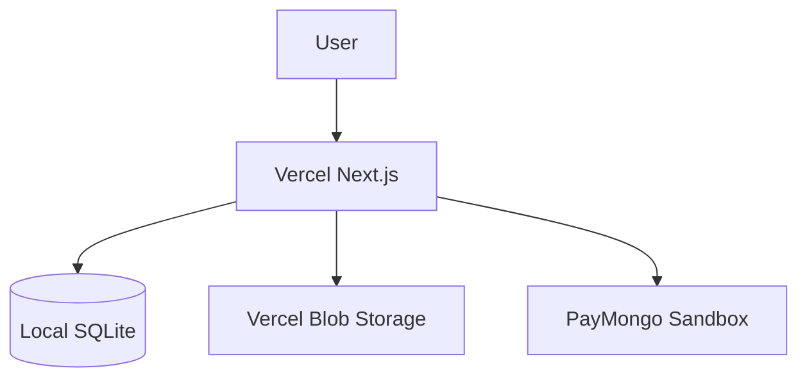
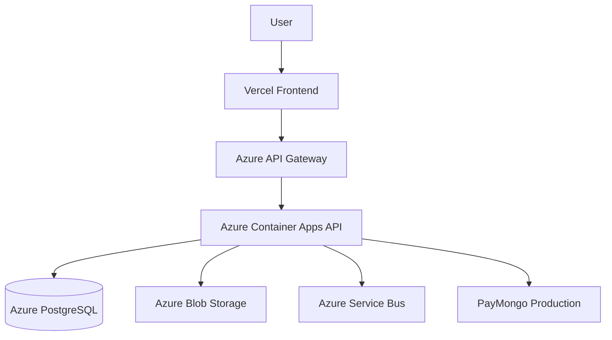
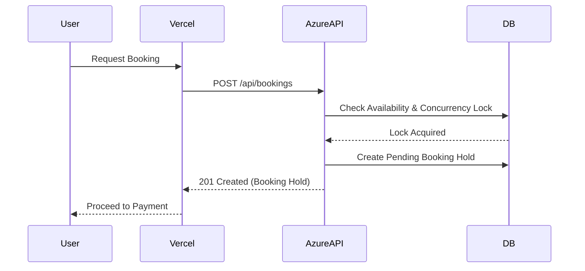

# Target Architecture

## Current Architecture

```mermaid
graph TD
    User-->Vercel[Vercel Next.js]
    Vercel-->SQLite[(Local SQLite)]
    Vercel-->VercelBlob[Vercel Blob Storage]
    Vercel-->PayMongo[PayMongo Sandbox]
```

## Target Architecture

```mermaid
graph TD
    User-->Vercel[Vercel Frontend]
    Vercel-->AzAG[Azure API Gateway]
    AzAG-->AzCA[Azure Container Apps API]
    AzCA-->AzDB[(Azure PostgreSQL)]
    AzCA-->AzBlob[Azure Blob Storage]
    AzCA-->AzSB[Azure Service Bus]
    AzCA-->PayMongo[PayMongo Production]
```

## Booking Flow

```mermaid
sequenceDiagram
    participant User
    participant Vercel
    participant AzureAPI
    participant DB
    User->>Vercel: Request Booking
    Vercel->>AzureAPI: POST /api/bookings
    AzureAPI->>DB: Check Availability & Concurrency Lock
    DB-->>AzureAPI: Lock Acquired
    AzureAPI->>DB: Create Pending Booking Hold
    AzureAPI-->>Vercel: 201 Created (Booking Hold)
    Vercel-->>User: Proceed to Payment
```