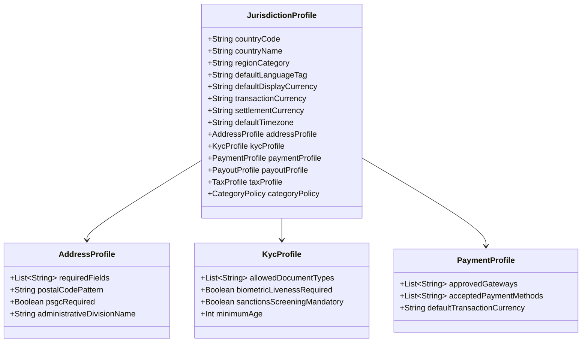
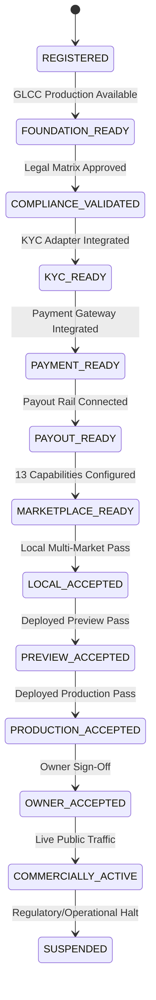

# RENTipid GLOBAL-MKT / v2.0 — Global Marketplace Platform Architecture Specification

## 1. Executive Architectural Blueprint

RENTipid is engineered as **ONE GLOBAL RENTAL MARKETPLACE PLATFORM**. The platform serves all 46 registered international jurisdictions from a single unified codebase, single database instance, and single deployment cluster. 

The architecture strictly prohibits country application forks (e.g., \`RentipidPhilippinesApp\`, \`RentipidThailandApp\`) and duplicated jurisdictional engines (e.g., \`booking-ph\`, \`payment-th\`). Instead, shared global business engines interact with declarative \`JurisdictionProfile\` records, a centralized \`JurisdictionPolicyEngine\`, and pluggable \`ProviderAdapter\` modules.

```mermaid
graph TD
    subgraph Client Tier
        Web[Web Application / PWA]
        iOS[iOS App - Capacitor/Native]
        Android[Android App - Capacitor/Native]
    end

    subgraph API Gateway & Edge
        Edge[Next.js Edge Middleware]
        PrefResolver[GLCC Preference Resolver]
        PolicyGate[Jurisdiction Policy Gateway]
    end

    subgraph Shared Core Engines
        AccountCore[GlobalAccountCore]
        ListingEngine[GlobalListingEngine]
        SearchEngine[GlobalSearchEngine]
        BookingEngine[GlobalBookingEngine]
        CommsCore[GlobalCommunicationsCore]
        PaymentOrch[GlobalPaymentOrchestrator]
        PayoutOrch[GlobalPayoutOrchestrator]
        DisputeEngine[GlobalDisputeEngine]
        TaxEngine[GlobalTaxComplianceEngine]
    end

    subgraph Governance & Metadata
        PolicyEngine[JurisdictionPolicyEngine]
        CapRegistry[MarketCapabilityRegistry]
        Profiles[46 Jurisdiction Profiles]
    end

    subgraph Provider Adapter Layer
        KycAdapters[KYC Adapters: Persona / Veriff / Manual]
        PayAdapters[Payment Adapters: PayMongo / Stripe / PromptPay / Alipay]
        PayoutAdapters[Payout Adapters: Wise / Stripe Connect / SEPA / Domestic]
        GeoAdapters[Geocoding Adapters: Google Places / Loqate]
        TaxAdapters[Tax Adapters: Avalara / Internal Profiles]
        CommsAdapters[Comms Adapters: Twilio / Resend / AWS SES]
    end

    Client Tier --> Edge
    Edge --> PrefResolver
    PrefResolver --> PolicyGate
    PolicyGate --> Shared Core Engines

    Shared Core Engines <--> PolicyEngine
    PolicyEngine <--> Profiles
    PolicyEngine <--> CapRegistry

    Shared Core Engines --> Provider Adapter Layer
```

---

## 2. Core Global Business Engines

### 2.1 GlobalAccountCore
- **Responsibility:** Manages identity, multi-login sessions, MFA, and operational role switching.
- **Key Invariant:** A user maintains **ONE GLOBAL ACCOUNT**. A user residing in Japan can rent items while traveling in France, or register as a provider in Thailand (subject to local verification), without creating separate country accounts.
- **Jurisdiction Association:** Operational context is determined dynamically by the user's active session, selected physical location, or listing jurisdiction, rather than a hardcoded user-level country lock.

### 2.2 GlobalListingEngine
- **Responsibility:** Manages rental catalog creation, media assets, availability scheduling, and publication moderation.
- **Decoupling:** Eliminates Philippine-only assumptions (such as barangay subdivisions and implicit PHP rates).
- **Data Model:** Listings explicitly store the physical \`countryCode\`, authoritative \`currency\`, and integer \`minorUnitRate\`.
- **Policy Enforcement:** Pre-publication checks invoke the \`JurisdictionPolicyEngine\` to verify local category permission (e.g. licensing requirements, age limits, prohibited goods).

### 2.3 GlobalSearchEngine
- **Responsibility:** Geographic discovery, radius-based filtering, and category browsing.
- **Capabilities:**
  - Coordinates and distance calculations normalized globally using Haversine indexing.
  - Multi-currency price presentation: displays prices in the searcher's preferred display currency via real-time FX quote services while preserving the listing's authoritative pricing.
  - Category suppression: automatically suppresses listings in jurisdictions where the category is legally prohibited.

### 2.4 GlobalBookingEngine
- **Responsibility:** Orchestrates the complete rental lifecycle from request to completion.
- **Lifecycle Phases:**
  1. Availability Check & Rate Calculation
  2. Renter Request & Deposit Hold
  3. Provider Approval / Instant Booking
  4. Turnover & Pre-Rental Inspection (photos + checklist)
  5. Active Rental Period (with extension capabilities)
  6. Return & Post-Rental Inspection
  7. Final Settlement, Deposit Release, and Review
- **Jurisdiction Overlays:** Rental duration limits, legal notice periods, and statutory cancellation windows are injected via \`JurisdictionBookingPolicy\`.

### 2.5 GlobalPaymentOrchestrator
- **Responsibility:** Authoritative management of all inbound payment attempts, customer billing, and multi-gateway routing.
- **Provider Neutrality:** Implements \`PaymentProvider\` interface. PayMongo is encapsulated as a regional adapter for the Philippines; additional adapters (Stripe, 2C2P, Adyen, Alipay) are routed dynamically based on transaction currency and jurisdiction.
- **Ledger Invariant:** RENTipid maintains internal ledger authority over all payment states. Webhooks from external PSPs are normalized into standardized platform events before modifying state.

### 2.6 GlobalPayoutOrchestrator
- **Responsibility:** Manages the calculation, schedule, reconciliation, and automated disbursement of net rental earnings to providers.
- **Decoupling:** Eliminates manual bank transfer receipt uploads. Providers register standardized \`BeneficiaryProfile\` records (IBAN, ACH, SWIFT, PromptPay, domestic bank accounts).
- **Settlement Policy:** Payouts disburse in the provider's authorized local settlement currency following completed return inspection and dispute hold periods.

### 2.7 GlobalDisputeAndRefundEngine
- **Responsibility:** Escrow management, security deposit claims, cancellation refunds, and structured dispute arbitration.
- **Arbitration Workflow:** In the event of damaged equipment or late return, providers submit photo evidence from turnover inspections. The engine applies jurisdiction-specific dispute timelines and consumer protection thresholds.

### 2.8 GlobalTaxComplianceEngine
- **Responsibility:** Calculation, itemization, collection, and reporting of applicable taxes (VAT, GST, Sales Tax, Withholding).
- **Reporting Boundaries:** Generates localized tax invoices compliant with domestic invoicing laws and prepares export datasets for marketplace facilitator regulations (e.g. EU DAC7, US 1099-K).

---

## 3. Jurisdiction Profile & Policy Architecture

To eliminate scattered conditionals (e.g. \`if (country === 'PH')\`), all jurisdiction-specific behavior is governed by structured, immutable profiles:



---

## 4. The Global Money Model

RENTipid enforces a strict, multi-tiered money contract across all transactions:

$$\text{DISPLAY CURRENCY} \neq \text{TRANSACTION CURRENCY} \neq \text{SETTLEMENT CURRENCY}$$

1. **Display Currency:** The currency selected by the browsing user (one of 25 supported GLCC currencies). Values are dynamically quoted for presentation only and are strictly non-authoritative.
2. **Transaction Currency:** The legally authorized currency charged to the renter's payment method. Governed by the listing's operational jurisdiction profile.
3. **Settlement Currency:** The currency disbursed to the provider's local bank account or digital wallet.
4. **Storage Contract:**
   - Floating-point representations are strictly forbidden for financial authority.
   - All monetary amounts in database records (\`Listing\`, \`Booking\`, \`Payment\`, \`ProviderPayout\`) must be stored as **64-bit Integers** representing minor units (e.g., cents, satang, fen, yen) alongside an explicit 3-letter ISO-4217 currency code.

---

## 5. Market Activation State Machine

A jurisdiction moves through the following governed lifecycle before achieving commercial activation:



---

## 6. Security, Privacy & Data Residency Boundaries

1. **PII Encryption:** Sensitive user data (identification documents, tax IDs, mobile numbers, physical addresses) must be encrypted at rest using envelope encryption (AES-256-GCM).
2. **Data Residency Compliance:** For jurisdictions with data sovereignty mandates (e.g. PRC PIPL, EU GDPR), user telemetry and audit logs must adhere to regional storage adapters.
3. **Mainland China Regulatory Boundary:** In alignment with CNTH governance, public network operability in mainland China remains **NOT CLAIMED** pending ICP filing and CAC cross-border security review (\`CN-BLK-001\`, \`CN-BLK-002\`).

---

## 7. Unified Mobile Architecture

Mobile applications (Progressive Web App, iOS, Android) connect directly to the shared Global Marketplace API cluster. 

- **No Mobile Application Forks:** A single binary deployed to Google Play and Apple App Store serves all 46 jurisdictions.
- **Dynamic Feature Flags:** The mobile client queries \`MarketCapabilityRegistry\` upon startup; UI surfaces adapt dynamically based on the user's active jurisdiction. Unactivated markets display exploration and waitlist modes rather than disabled or broken transactional checkout flows.
