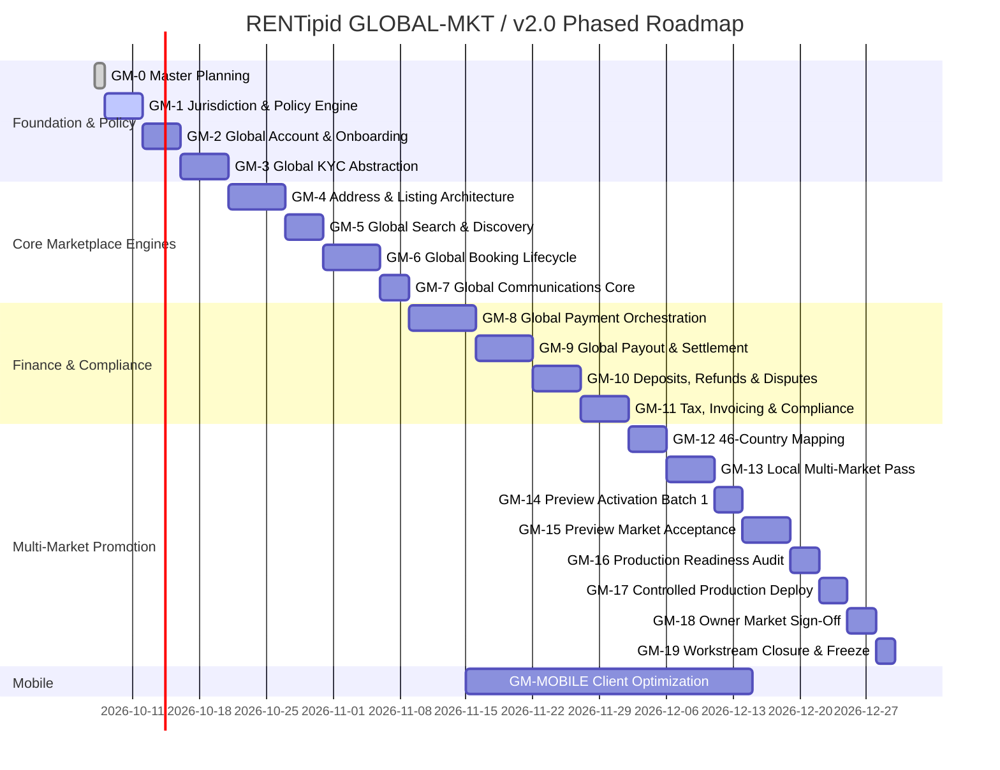

# RENTipid GLOBAL-MKT / v2.0 — Master Implementation Plan

**Document ID:** \`RENTIPID-GLOBAL-MKT-MIP-001\`  
**Version:** \`1.0 DRAFT\`  
**Date:** \`2026-10-07\`  
**Status:** **PROJECT OWNER REVIEW REQUIRED**  
**Controlling Authority:** Federico Diagono Jr., Project Owner of RENTipid  

---

## 1. Executive Direction & Workstream Mandate

RENTipid is transitioning from a domestic Philippine rental application with multilingual and multicurrency presentation into **ONE GLOBAL RENTAL MARKETPLACE PLATFORM**. 

The Project Owner has explicitly mandated:
1. **Single Global Platform:** The entire platform shall operate from a unified codebase, shared business engines, and a single deployment cluster.
2. **Strict Prohibition of Country Forks:** Engineering shall not create 46 separate versions of RENTipid (e.g., \`RentipidTH\`, \`RentipidCN\`, \`RentipidJP\`), nor duplicate core engines (e.g., \`booking-ph\`, \`payment-th\`).
3. **Configuration & Policy Driven:** All jurisdictional differences (legal mandates, taxes, currencies, payment rails, KYC documents, address formats) shall be governed via declarative \`JurisdictionProfile\` records, a centralized \`JurisdictionPolicyEngine\`, and pluggable \`ProviderAdapter\` modules.
4. **Honest Activation Standard:** A market is NOT commercially active merely because language, currency, or GLCC availability exists. Full commercial active status requires proven end-to-end execution of all 13 core lifecycle capabilities.

---

## 2. Frozen Baseline Verification

The GLOBAL-MKT / v2.0 workstream builds directly upon the accepted and frozen foundation of GLCC-JX / v1.2:
- **Previous Workstream:** \`GLCC-JX / v1.2 Mainland China + Thailand Jurisdiction Expansion\`
- **Release Status:** \`ACCEPTED — CLOSED — FROZEN\`
- **Production Application Source:** \`9c69fd0128b0f9ef6a2e933d8a6636403a300bf6\`
- **Production Deployment ID:** \`dpl_BLvC4y4i21giKNGBoLJszoRNxEQ6\`
- **Production Domain:** \`https://www.rentipid.com.ph\`
- **Immutable Freeze Tags:** \`rentipid-glcc-v1.2-cn-th-frozen\`, \`glcc-v1.2-cn-th\`
- **Baseline Inventories:** 46 Countries, 47 Languages, 33 Full Locale Packs, 12 Language Aliases, 25 Currencies.
- **Invariant:** The application source and freeze tags of GLCC-JX v1.2 remain strictly immutable.

---

## 3. Core Architecture Principles & Decision Register

Ten locked architectural decisions govern all work in GLOBAL-MKT / v2.0:
1. **ONE GLOBAL MARKETPLACE PLATFORM:** A single unified platform serving all markets.
2. **NO COUNTRY APPLICATION FORKS:** Zero regional codebase forks.
3. **SHARED BUSINESS ENGINES:** Invariant marketplace engines (accounts, listings, search, bookings, turnover inspection, messaging, reviews, disputes).
4. **COUNTRY DIFFERENCES VIA PROFILES & ADAPTERS:** Dynamic injection of local rules via declarative profiles.
5. **LANGUAGE INDEPENDENT OF COUNTRY:** UI language decoupled from geographic location.
6. **DISPLAY CURRENCY INDEPENDENT OF FINANCIAL AUTHORITY:** Display quoting decoupled from transaction charging and provider settlement.
7. **PAYMENT PROVIDER NEUTRALITY:** Provider-neutral payment orchestration without vendor lock-in.
8. **PAYOUT PROVIDER NEUTRALITY:** Multi-rail provider payout orchestration.
9. **FULL 13-CAPABILITY LIFECYCLE MANDATE:** All 13 capabilities must be proven for commercial active status.
10. **UNIFIED MOBILE BACKEND:** iOS, Android, and Web share the exact same backend APIs.

---

## 4. Current-State Audit & Gap Summary

A comprehensive repository and database audit identified key technical debt and domestic couplings:
1. **Database Financial Hazards:** \`Listing\` and \`Booking\` tables lack explicit \`currency\` columns; prices are stored as floating-point numbers (\`Float\`) rather than 64-bit integer minor units.
2. **Philippine Geographic Couplings:** \`Address\` table is coupled to Philippine PSGC codes; 105 occurrences of \`Barangay\` and 32 occurrences of \`PSGC\` exist across form and service modules.
3. **Payment & Payout Couplings:** Platform strictly routes payments through PayMongo (PHP only) across 450 code references; provider payout is 100% manual (bank transfer receipt upload).
4. **Identity & KYC Gaps:** Verification documents are limited to Philippine ID types without automated third-party biometric or sanctions screening adapters.
5. **Mainland China Deferred Blockers:** Regulatory blockers \`CN-BLK-001\` (ICP filing & hosting) and \`CN-BLK-002\` (CAC cross-border security review) remain active and deferred.

---

## 5. The 13-Capability Commercial Activation Standard

Every registered jurisdiction must satisfy the complete lifecycle matrix before commercial activation:
- **C01: Account Registration:** Local user registration under jurisdiction terms.
- **C02: KYC & Identity Verification:** Localized identity document capture and screening.
- **C03: Local Listing Creation:** Publishing listings within the jurisdiction.
- **C04: Market Pricing Authority:** Pricing stored in local transaction currency minor units.
- **C05: Search & Discovery:** Location-aware search and multi-currency quoting.
- **C06: Booking & Rental Lifecycle:** Request, approval, turnover inspection, and return workflow.
- **C07: In-App Communications:** Real-time localized messaging, SMS, and email.
- **C08: Approved Payment Gateway:** Collection via domestic payment methods.
- **C09: Automated Payout Rail:** Reconciled provider disbursement in local settlement rail.
- **C10: Deposits, Claims & Disputes:** Escrow pre-authorization, damage claims, and refunds.
- **C11: Multilingual Presentation:** Clean UI in supported languages with zero raw keys.
- **C12: Local Display Currency:** Accurate mathematical display quoting.
- **C13: Regulatory Compliance:** Tax withholding, restricted category bans, and local consumer laws.

---

## 6. Phased Implementation Roadmap (GM-0 through GM-19, GM-MOBILE)

The program is organized into 20 disciplined, sequential work packages:

---

## 7. Database Migration & Safety Strategy

1. **Non-Destructive Additive Migrations:**
   - Existing production records must remain 100% intact.
   - New columns (\`Listing.currency\`, \`Booking.currency\`, \`ProviderPayout.currency\`) will be added with safe defaults (\`PHP\`) for existing rows.
   - Monetary values will introduce parallel integer minor unit columns (\`daily_rate_minor_units\`, \`base_rental_amount_minor_units\`) with automatic synchronization before deprecating legacy float fields.
2. **Environment Isolation:**
   - Migrations will be tested first locally, promoted to Preview database, and validated before touching Production database.
   - Zero destructive table drops or column resets permitted.

---

## 8. Definition of Done & Quality Gates

A work package or market batch is complete if and only if it satisfies the mandatory Universal Promotion Pipeline:
1. **Code Complete:** Unit and integration tests pass; TypeScript and lint checks pass.
2. **Local Functional:** Workflows execute without runtime errors against local database.
3. **Database Migrated:** Schema changes applied safely and client generated.
4. **Data Seeded:** System configuration and capability registries synchronized.
5. **Local Acceptance:** Happy path, edge cases, and cross-market scenarios verified.
6. **Preview Migrated:** Vercel Preview environment deployed with matching schema.
7. **Preview Acceptance:** Deployed preview validated without local session dependencies.
8. **Production-Ready:** Source-delta audit verified, rollback scripts tested.
9. **Production Accepted:** Live deployment healthy; smoke tests pass.
10. **Owner Accepted:** Formal Project Owner written approval recorded.

---

## 9. Next Permitted Action

Upon delivery of GM-0, the implementation team must halt and await explicit written Project Owner review and approval:

**NEXT PERMITTED ACTION:**
\`PROJECT OWNER REVIEW + APPROVAL OF GLOBAL-MKT v2.0 MASTER IMPLEMENTATION PLAN\`
