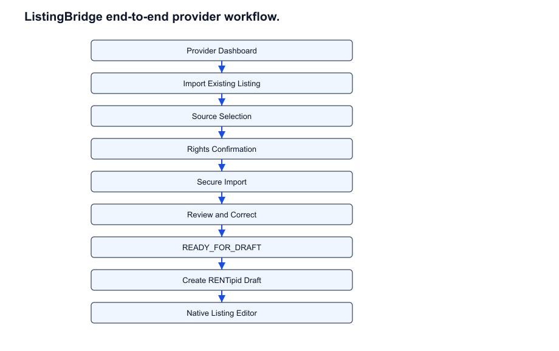
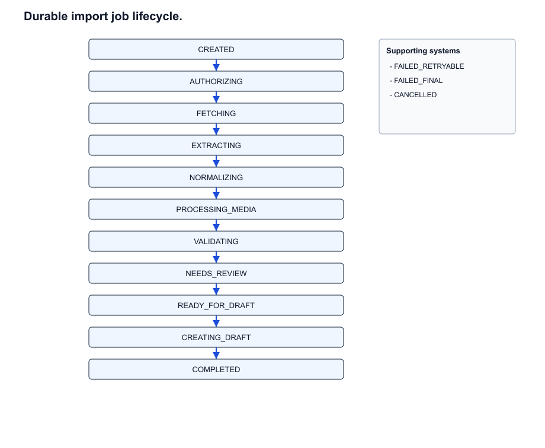
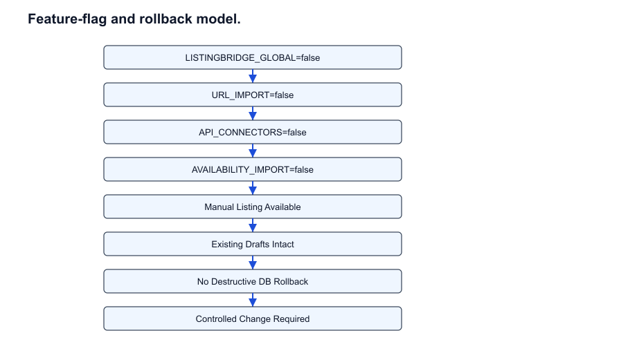
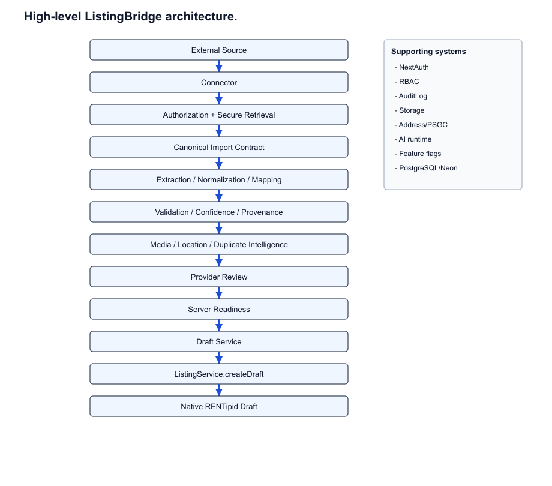
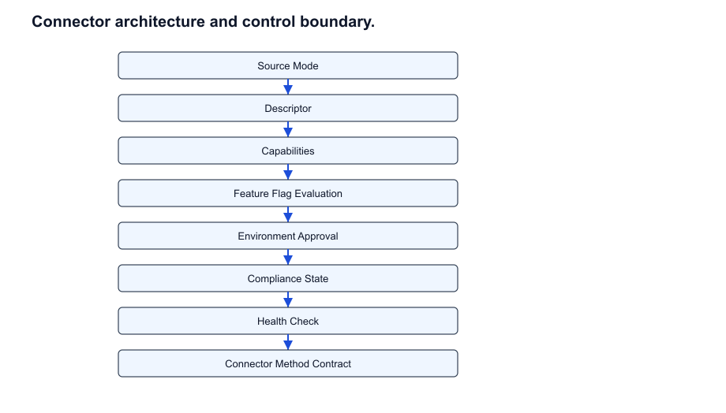
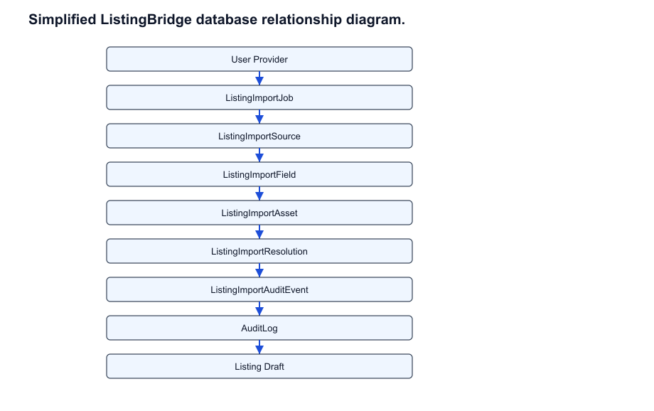
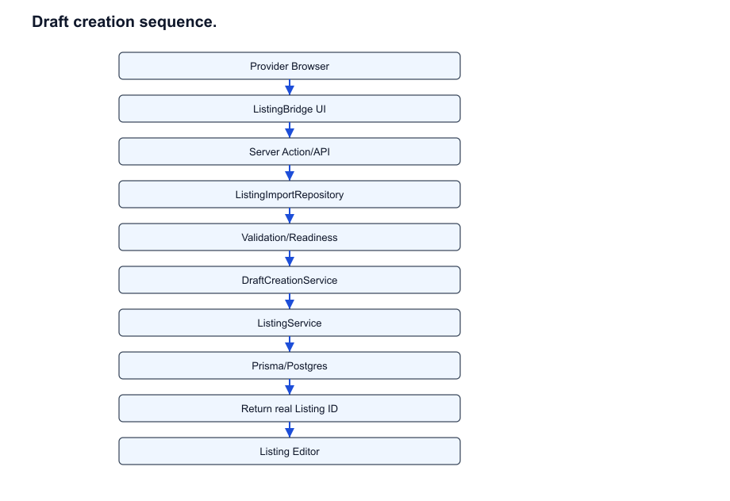
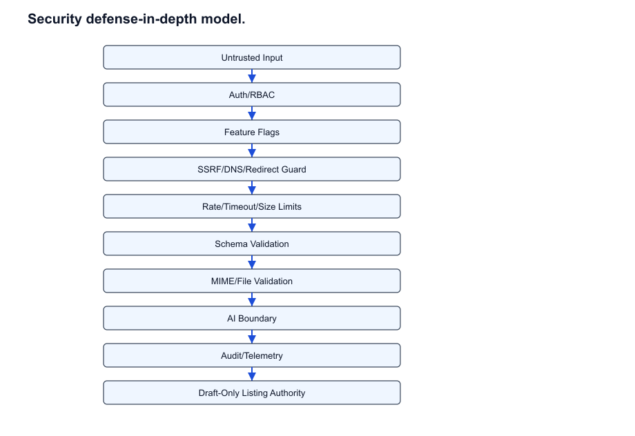
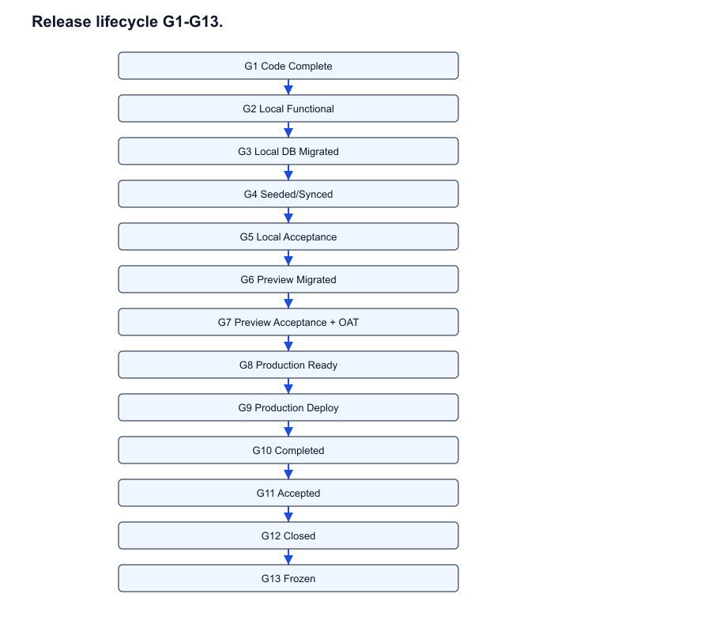

# RENTipid ListingBridge v1.0

## Complete User, Operations, Developer & Business Reference Manual

**Document classification:** Controlled Technical & Operational Reference

## Document Control

| Field | Value |
| --- | --- |
| Document | RENTipid ListingBridge v1.0 Complete Reference Manual |
| Module Version | 1.0 |
| Application Release SHA | a8647df71aa9c610027054e2016fd73b53f3b238 |
| Release Tag | listingbridge-v1.0.0-frozen |
| Production Deployment | dpl_G4kvoqxoMUUnDMQZFBirfEwt5Ch3 |
| Production URL | https://www.rentipid.com.ph |
| Release State | VERSION FROZEN |
| Change Control | Controlled change required after freeze |
| Publication date | 2026-09-02 |

## Intended Audiences

Users/providers, operators/support/administrators, developers/maintainers, and business owners/product owners.

## How To Use This Manual

Use Parts I and V for business/governance context, Part II for provider use, Part III for operations, Part IV for engineering details, and Part VI for quick references.

# Part I - Executive & Business Reference

## Chapter 1 - Executive Overview

ListingBridge is RENTipid v1.0 functionality for importing an existing provider listing into a native RENTipid draft. It reduces repeated data entry while preserving RENTipid as the system of record. External sources are input channels only. RENTipid remains authoritative for identity, provider ownership, listing state, media storage, policy, publication eligibility, audit, and production records.

The import is intentionally one-time. ListingBridge helps gather and normalize listing details, media candidates, location facts, pricing hints, and provenance, then routes the reviewed result through the existing native draft authority. It does not replace manual listing creation and it does not publish listings.

> **IMPORTANT:** ListingBridge itself does not publish, approve, or make a listing bookable. The output of v1.0 is a native RENTipid Listing with status Draft. Submission, review, approval, and publication remain separate existing RENTipid lifecycle steps.

**Table: v1.0 achievement and non-scope summary**

| Area | v1.0 achieves | v1.0 intentionally excludes |
| --- | --- | --- |
| Onboarding | Provider can import into a reviewable draft workflow. | Continuous OTA synchronization. |
| External sources | Connector architecture, structured file capability, guarded URL capability, internal test connector for non-production validation. | Live Airbnb, Agoda, Booking.com, reservation write-back, or broad price write-back. |
| Governance | Frozen release with G1-G13 evidence. | Informal post-freeze modification. |
| Safety | Server authorization, SSRF controls, provenance, duplicate checks, and audit. | Security bypasses or client-only draft authority. |

## Chapter 2 - Business Capability & Value

The business capability is controlled external-data ingestion for providers. It improves onboarding efficiency by allowing providers to begin from known listing facts, while still requiring provider review and RENTipid policy controls before any draft enters the normal listing lifecycle.

**Table: Business benefits table**

| Capability | Business Value | Risk Control |
| --- | --- | --- |
| One-time import to draft | Shortens provider onboarding and reduces duplicate data entry. | Provider review and draft-only boundary prevent uncontrolled publication. |
| Canonical contract | Creates reusable foundation for future source channels. | External source objects never write directly to Listing. |
| Field confidence and provenance | Improves support visibility and user trust. | Ambiguous or missing data is surfaced rather than fabricated. |
| Duplicate detection | Protects marketplace quality. | Exact matches block readiness; possible matches require review. |
| Feature flags | Allows controlled rollout by capability. | Master kill switch disables import without harming manual listings. |
| Security-first retrieval | Enables controlled external input. | SSRF, MIME, size, redirect, and rate controls fail closed. |

> **BUSINESS NOTE:** The connector framework creates future extensibility, but v1.0 does not include active commercial OTA integrations or bidirectional channel management.

Future connector potential should prioritize authorized API/OAuth or approved partner integrations, followed by PMS/channel-manager feeds and structured files. Unrestricted scraping should not be used to bypass access controls, terms, security review, or provider authorization.

## Chapter 3 - Implemented Scope & Limitations

ListingBridge v1.0 implements the import foundation, canonical data contract, durable job model, provider review, corrections, media/location/duplicate intelligence, AI-assisted mapping boundary, observability, and native draft creation integration. The implementation is additive and frozen at application SHA a8647df71aa9c610027054e2016fd73b53f3b238.

**Table: Source mode hierarchy and frozen availability**

| Tier | Mode | Architecture support | v1.0 production posture |
| --- | --- | --- | --- |
| Tier 1 | Authorized API/OAuth | Connector interface supports server-side API/OAuth authorization. | No live partner connector; API_CONNECTORS=false. |
| Tier 2 | PMS/channel manager | Tier is modeled for managed partner feeds. | Future scope. |
| Tier 3 | Structured file | Structured file import capability is implemented in architecture and tests. | FILE_IMPORT=true, but GLOBAL=false blocks production rollout. |
| Tier 4 | Permitted public URL | Secure URL retrieval capability is implemented with SSRF protection. | URL_IMPORT=false. |
| Tier 5 | Manual setup | Fallback to native manual listing wizard. | Available independently of ListingBridge. |

> **WARNING:** Do not imply Airbnb, Agoda, or Booking.com are live integrations. They are future roadmap only and are not included in ListingBridge v1.0 frozen release.

The Internal Test Connector is deterministic and intended for development, automated tests, Preview, and controlled OAT validation only. Its descriptor is approved for LOCAL, TEST, and PREVIEW, but has PRODUCTION: DISABLED and INTERNAL_ONLY feature status.

# Part II - Provider / End-User Manual

## Chapter 4 - User Roles & Prerequisites

A provider must be authenticated and must have authority to create listings for the property or rental item being imported. ListingBridge is not a substitute for ownership, management rights, KYC, policy review, or publication approval.

- Use a verified provider account where required by RENTipid policy.
- Confirm you own or manage the property, are authorized to submit the information, can reuse submitted media, and accept accuracy responsibility.
- Understand that imported information becomes a draft only after review and server-side readiness validation.
- Continue through the normal Listing Editor and separate submission flow when the draft is ready.

## Chapter 5 - Getting Started

Providers enter ListingBridge from the provider listing workflow. The implemented route is /dashboard/provider/listings/import. Manual listing creation remains available at /dashboard/provider/listings/new.

- Open Provider Dashboard.
- Choose Import Existing Listing.
- Select an available source. In Production v1.0, ListingBridge global rollout is disabled; controlled Preview/OAT used the Internal Test Connector.
- Continue to authorization.
- Confirm listing authority, media rights, and accuracy responsibility.
- Begin secure import.
- If the source is unavailable or unsuitable, use Create New Listing Directly to open the standard manual wizard.

## Chapter 6 - Complete ListingBridge User Workflow

The user workflow is intentionally review-first. Imported source values are not silently published and should be treated as a starting point for provider confirmation.

**Table: Provider workflow procedure**

| Step | Action | Result |
| --- | --- | --- |
| 1 | Open Provider Dashboard. | Listing actions are shown. |
| 2 | Choose Import Existing Listing. | ListingBridge import page opens. |
| 3 | Select available source. | Source card is selected. |
| 4 | Continue to authorization. | Rights confirmation stage opens. |
| 5 | Confirm authority and media rights. | Required legal/accuracy attestation is captured. |
| 6 | Begin secure import. | Server action creates a durable import job. |
| 7 | Import, extraction, normalization. | Canonical contract and field records are prepared. |
| 8 | Review imported information. | Fields display values and confidence states. |
| 9 | Understand confidence states. | Provider can distinguish verified, review, conflict, missing, and prohibited values. |
| 10 | Review provenance. | Source hashes and field records preserve traceability. |
| 11 | Correct a field. | Save Correction persists a provider resolution. |
| 12 | Resolve conflicts/missing info. | Blocking reasons are removed when valid. |
| 13 | Confirm readiness. | Server readiness requires no blockers. |
| 14 | Proceed to draft. | READY_FOR_DRAFT screen appears. |
| 15 | Create RENTipid Draft. | Native ListingService.createDraft is invoked server-side. |
| 16 | Open draft in Listing Editor. | Real Listing.id route opens. |
| 17 | Continue normal workflow. | Provider edits photos, pricing, terms, and details as needed. |
| 18 | Submit for review separately. | Publication is not automatic. |

## Chapter 7 - Understanding Field Status & Confidence

**Table: Field status and confidence reference**

| State | Meaning | Provider action | Readiness impact |
| --- | --- | --- | --- |
| VERIFIED | Confirmed by provider or deterministic trusted validation. | Review for accuracy; no action unless wrong. | Normally non-blocking. |
| HIGH_CONFIDENCE | Imported and normalized with strong evidence. | Review and edit if needed. | Normally non-blocking. |
| REVIEW_RECOMMENDED | Usable but uncertain or AI/system assisted. | Inspect and confirm or correct. | May warn; can block if required by context. |
| CONFLICT | Contradictory, invalid, or inconsistent data was detected. | Choose the correct value or correct the field. | Blocks required fields and critical checks. |
| MISSING | Required or useful information was not found. | Enter the missing information manually. | Blocks when required or readiness-critical. |
| PROHIBITED | Source data is not allowed into listing content. | Do not reuse; provide allowed replacement content if needed. | Active prohibited content blocks. |

## Chapter 8 - Reviewing & Correcting Imported Data

The review screen distinguishes imported values from provider-modified values. Editable fields allow a provider to open an edit dialog, enter a correction, and save the correction. The server action validates ownership against the persisted import job before saving the resolution.

A saved correction creates or updates ListingImportResolution with resolution_type PROVIDER_OVERRIDE and updates ListingImportField with the corrected normalized value, VERIFIED confidence, provider_modified=true, and validation_state=VALIDATED. This produces a durable correction trail tied to the authenticated provider.

> **NOTE:** Prohibited fields cannot be accepted into listing content. Providers must supply allowed replacement text or omit that content.

## Chapter 9 - Photos, Media & Location

Imported media candidates are supplemental. ListingBridge validates media before storage using byte-level MIME sniffing, size limits, and SHA-256 hashing. Duplicates within the same job reuse the existing stored asset path and are marked SKIPPED_DUPLICATE. Invalid media is rejected without necessarily failing the whole import.

Location data is normalized through the RENTipid address normalizer and checked against Philippine bounds when coordinates are provided. Coordinates outside 4.5 to 21.5 latitude or 116.0 to 127.0 longitude conflict with Philippine listings and can block readiness. Providers must review uncertain or conflicting location data.

## Chapter 10 - Duplicate Listings

Duplicate checks protect providers and the marketplace from repeated drafts for the same property. The implemented detector considers same source reference, same provider and address/city with title similarity, coordinate proximity within 50 meters, and similar title in the same city for different providers.

**Table: Duplicate match levels**

| Level | Threshold / signal basis | Effect |
| --- | --- | --- |
| EXACT_MATCH | Max signal score >= 0.95, including same source reference or near-coordinate same-provider match. | Blocks draft readiness. |
| LIKELY_MATCH | Max signal score >= 0.75. | Requires review. |
| POSSIBLE_MATCH | Max signal score >= 0.50. | Requires review. |
| NO_MATCH | No meaningful duplicate signals. | No duplicate blocker. |

Repeat Create Draft does not create duplicate drafts. If ListingImportJob.created_listing_id is already set, the draft service returns the existing Listing.id idempotently.

## Chapter 11 - User Troubleshooting

**Table: User troubleshooting table**

| Symptom | Possible cause | User action | Escalate when |
| --- | --- | --- | --- |
| Source unavailable | Connector disabled or feature flag off. | Use manual listing creation or retry later. | Expected source should be enabled for your account. |
| Authorization rejected | Rights confirmation missing or connector authorization failed. | Confirm authority and media rights; reauthorize if prompted. | You believe authorization is valid but still blocked. |
| Imported field missing | External source did not expose the field. | Enter the value manually during review. | The field repeatedly disappears after saving. |
| Field says Please Review | Confidence is review-recommended or AI-assisted. | Inspect and confirm or edit the value. | The status does not change after correction. |
| Conflict shown | Location, duplicate, or field validation conflict. | Resolve the highlighted field. | You cannot determine the correct value. |
| Unsafe URL rejection | URL failed SSRF, protocol, DNS, redirect, or size policy. | Use another approved source or manual listing. | Never attempt to bypass URL safety. |
| Media failure | Invalid MIME, too large, duplicate, retrieval failure, or storage issue. | Upload photos through the normal editor if needed. | Many unrelated imports fail media processing. |
| Duplicate detected | Same source, nearby coordinates, or similar title/location. | Open existing draft/listing or clarify unique details. | System marks a clearly different property as exact match. |
| Cannot reach draft readiness | Missing required field, unconfirmed rights, blocking duplicate, invalid media, or location conflict. | Complete each listed blocker. | Blockers persist after correction. |
| Import retry | Transient network or upstream issue. | Retry if offered; otherwise use manual fallback. | Retry fails repeatedly. |
| Session/authentication issue | Login expired or role not authorized. | Sign in again with provider account. | You are verified but still denied. |

# Part III - Operations & Support Manual

## Chapter 12 - Operating Model

The frozen production posture is safe-by-default: LISTINGBRIDGE_GLOBAL=false. Operators should treat ListingBridge as a controlled import subsystem that can be disabled without affecting native manual listing creation or existing listings.

- Monitor feature flag posture, connector health, import job state, retries, security blocks, media failures, draft creation failures, and audit events.
- Support boundaries: guide providers through review and manual fallback; do not fabricate missing facts or bypass security.
- Expected roles include support operators, administrators, SRE/on-call, security operations, release manager, and engineering maintainer.

## Chapter 13 - Feature Flags

Frozen Production feature flags are recorded in the freeze manifest. LISTINGBRIDGE_GLOBAL=false is the master kill-switch and safe rollout state. It blocks connector evaluation and the import entry point while preserving manual listing creation.

**Table: Feature flag reference**

| Key | Purpose | Frozen Production Value | Effect when OFF | Effect when ON | Dependencies | Operational caution |
| --- | --- | --- | --- | --- | --- | --- |
| LISTINGBRIDGE_GLOBAL | Master ListingBridge kill switch and rollout gate. | false | No ListingBridge connectors are offered; manual listing creation remains available. | ListingBridge import entry points and connector evaluation are permitted subject to child flags. | All ListingBridge capabilities. | Frozen release flag. Change only through controlled rollout. |
| LISTINGBRIDGE_FILE_IMPORT | Enables Tier 3 structured file import capability. | true | Structured file import is unavailable. | Structured file connectors can be evaluated when global flag also permits. | LISTINGBRIDGE_GLOBAL. | Do not confuse enabled capability with production-wide public rollout. |
| LISTINGBRIDGE_URL_IMPORT | Enables Tier 4 public URL retrieval. | false | URL import is unavailable. | SSRF-guarded URL retrieval can run for approved connectors. | LISTINGBRIDGE_GLOBAL, retrieval policy, SSRF controls. | High caution due to external network exposure. |
| LISTINGBRIDGE_API_CONNECTORS | Enables API or OAuth partner connectors. | false | OAuth/API connector paths are unavailable. | Approved server-side API connectors may be evaluated. | LISTINGBRIDGE_GLOBAL, connector credentials, compliance approval. | No live Airbnb, Agoda, or Booking.com connector exists in v1.0. |
| LISTINGBRIDGE_MEDIA_IMPORT | Enables media retrieval, validation, hashing, and storage. | true | Imports can continue as text/detail-only where supported. | External media candidates may be ingested after validation. | Storage provider, media MIME validation, source retrieval. | Disable if storage or MIME validation anomaly is observed. |
| LISTINGBRIDGE_AI_MAPPING | Enables bounded semantic mapping assistance. | true | Deterministic mapping and provider review continue without AI. | AI may suggest amenities, categories, summaries, and original descriptions from verified facts. | Unified AI adapter and read-only/draft-only tools. | AI output is advisory and never policy-authoritative. |
| LISTINGBRIDGE_AVAILABILITY_IMPORT | Enables external availability/calendar import. | false | Availability data is not imported from external calendars. | Approved availability connector capability may be used. | LISTINGBRIDGE_GLOBAL and connector availability support. | Reservation write-back and continuous sync are not v1.0 scope. |

## Chapter 14 - Job Lifecycle & Support Diagnostics

**Table: Durable state transition reference**

| State | Meaning | Expected transition | Operator concern | Recovery / escalation notes |
| --- | --- | --- | --- | --- |
| CREATED | Durable job record exists. | AUTHORIZING or FETCHING. | Job should not remain idle for long. | Retry or cancel only through controlled support flow. |
| AUTHORIZING | Provider rights or connector authorization is being verified. | FETCHING. | Repeated authorization failures may indicate user action or connector issue. | Ask provider to retry authorization; do not bypass rights confirmation. |
| FETCHING | Connector or secure retrieval is obtaining source payload. | EXTRACTING. | Timeouts and connector errors are expected transient concerns. | Retry if retryable; security failures become final. |
| EXTRACTING | Structured facts are being read from payload. | NORMALIZING. | Malformed payloads can produce missing fields. | Escalate only if repeated for known-good source. |
| NORMALIZING | Facts are mapped into canonical contract. | PROCESSING_MEDIA or VALIDATING. | Unexpected confidence spikes or prohibited fields require review. | Inspect normalized field records and rejected fields. |
| PROCESSING_MEDIA | Media candidates are downloaded, validated, deduped, and stored. | VALIDATING, NEEDS_REVIEW, or READY_FOR_DRAFT. | Storage, MIME, or partial failures. | Text import may survive partial media failure; missing required photo can block readiness. |
| VALIDATING | Readiness, policy, location, duplicate, and field checks run. | NEEDS_REVIEW or READY_FOR_DRAFT. | Blocking fields must be resolved before draft. | Use field/resolution records to guide provider. |
| NEEDS_REVIEW | Provider must inspect, correct, or confirm fields. | READY_FOR_DRAFT or VALIDATING. | Support should not edit provider assertions casually. | Provider correction is preferred. |
| READY_FOR_DRAFT | Server-side readiness has no blockers. | CREATING_DRAFT. | If job regresses, review duplicate/location/media blockers. | Proceed to draft only after rights confirmation. |
| CREATING_DRAFT | Draft creation through native Listing authority is underway. | COMPLETED or failure state. | Stuck jobs may have native draft already created. | Check created_listing_id before any retry. |
| COMPLETED | Native RENTipid draft has been created and linked. | Terminal. | No further import mutation expected. | Provider continues normal listing editing workflow. |
| FAILED_RETRYABLE | Transient failure occurred and may be retried. | Prior processing state, FAILED_FINAL, or CANCELLED. | Retry count and next_attempt_at matter. | Retry is bounded by max_retries=3. |
| FAILED_FINAL | Non-retryable or exhausted failure. | Terminal. | Security, corrupt data, or repeated retry exhaustion. | Manual listing fallback; preserve audit evidence. |
| CANCELLED | Provider or operator cancelled import. | Terminal. | No draft should be created from a cancelled job. | Manual fallback remains available. |

## Chapter 15 - Monitoring & Observability

Implemented observability includes a ListingBridgeHealthDiagnosticsService, connector health snapshots, durable job timestamps, retry fields, structured logs, alert evaluation, and a metrics collector with safe dimensions. The production health endpoint is /api/health and production verification recorded HTTP 200 with database connected.

**Table: Implemented metric and signal reference**

| Metric / signal | Purpose |
| --- | --- |
| listingbridge_import_started_total | Counts import starts. |
| listingbridge_import_completed_total | Counts completed imports. |
| listingbridge_import_failed_total | Counts failed imports. |
| listingbridge_connector_failure_total | Tracks connector-level failures. |
| listingbridge_ssrf_block_total | Tracks blocked SSRF/security retrieval attempts. |
| listingbridge_rate_limit_total | Tracks retrieval rate limiting. |
| listingbridge_media_failure_total | Tracks media processing failures. |
| listingbridge_duplicate_detected_total | Tracks duplicate detection results. |
| listingbridge_review_required_total | Tracks jobs requiring provider review. |
| listingbridge_ai_fallback_total | Tracks AI-disabled or fail-closed fallback. |
| listingbridge_draft_created_total | Counts native draft creations. |
| listingbridge_draft_creation_failure_total | Counts draft creation failures. |

> **IMPORTANT:** Metrics use bounded dimensions only: environment, connectorId, resultClass, stage, failureCategory, and aiEnabled. Raw URLs, user IDs, titles, tokens, and customer PII must not be dimensions.

## Chapter 16 - Incident Response

**Table: Incident response escalation matrix**

| Incident | Immediate action | Escalate to |
| --- | --- | --- |
| Connector outage | Check connector health, upstream status, and flags; keep manual fallback available. | SRE and connector owner. |
| External-source failure | Classify retryable vs final; preserve user-facing message. | Engineering if reproducible. |
| Repeated import failure | Review status, last_error_code, retry_count, and source mode. | Engineering/SRE. |
| SSRF/security block spike | Treat as security event; review actor/source patterns; rate limit or suspend if abusive. | SOC/Security. |
| Worker interruption | Resume from durable state; never create a draft without checking created_listing_id. | Engineering. |
| Media processing failure | Check storage and MIME failures; consider MEDIA_IMPORT=false for systemic issue. | SRE/Storage owner. |
| Duplicate anomalies | Inspect duplicate signals and thresholds. | Product and Engineering. |
| Draft creation failure | Check readiness blockers, category resolution, and native ListingService constraints. | Engineering. |
| Database issue | Use standard DB incident process; avoid destructive schema rollback. | SRE/DBA. |
| Runtime regression | Set GLOBAL=false; consider Vercel rollback to known-good release. | Release manager. |

## Chapter 17 - Rollback & Kill Switch

Feature rollback for the frozen release is LISTINGBRIDGE_GLOBAL=false. Subsystem rollback flags include LISTINGBRIDGE_URL_IMPORT=false, LISTINGBRIDGE_API_CONNECTORS=false, and LISTINGBRIDGE_AVAILABILITY_IMPORT=false.

- Manual listing creation remains available and independent.
- Existing listings and drafts remain intact.
- No destructive schema rollback is expected because the ListingBridge migration is additive.
- Use Vercel application rollback where appropriate for runtime regressions.
- Use forward-fix for additive DB migration issues through reviewed change control.
- Never run unreviewed production commands or expose secrets in support notes.

# Part IV - Developer / Engineering Reference

## Chapter 18 - Architecture Overview

ListingBridge is implemented as an additive Next.js/TypeScript subsystem under src/lib/listingbridge plus provider UI under src/components/listings/listingbridge and server actions under src/app/dashboard/provider/listings/import/actions.ts. The native draft authority remains apps/api/src/services/listingService.ts through ListingService.createDraft.

## Chapter 19 - Reused Authorities

**Table: Verified reused authorities**

| Authority | Repository path | ListingBridge use |
| --- | --- | --- |
| Authentication | src/lib/auth.ts; src/app/api/auth/[...nextauth]/route.ts | NextAuth v4 server session validation. |
| Provider identity | prisma/schema.prisma: User, UserProfile, BusinessProfile | Associates import jobs and drafts to provider_id. |
| RBAC | src/lib/permissions.ts; src/lib/security/permissions.ts | Provider/admin access enforcement. |
| Draft authority | apps/api/src/services/listingService.ts | ListingService.createDraft creates native Draft listing. |
| Publication authority | Existing Listing.status and listing service lifecycle | Publication remains outside ListingBridge. |
| Policy | src/lib/listingbridge/normalization/prohibited-filter.ts and existing prohibited item authorities | Prohibited source data is filtered and marked. |
| Location | src/lib/address/AddressService.ts; src/lib/address/normalizer.ts | Address normalization and Philippine location handling. |
| Storage | src/lib/listingbridge/media/media-storage.ts; src/lib/security/upload-security.ts | Validated media storage and upload-security reuse. |
| AI | src/lib/listingbridge/ai/*; src/lib/ai/tools/AiToolGateway.ts | Read-only and draft-only bounded tools. |
| Audit | src/lib/audit.ts; ListingImportAuditEvent | Lifecycle and security event trail. |
| Feature flags | SystemSetting; src/lib/listingbridge/connectors/feature-flags.ts | Runtime capability gates. |
| Database | PostgreSQL/Neon/Prisma | Durable import records and native Listing records. |

## Chapter 20 - Connector Architecture

The canonical connector contract is ListingBridgeConnector in src/lib/listingbridge/connectors/types.ts. It declares config, identifySource(), getCapabilities(), authorize(), fetchListing(), fetchMedia(), fetchAvailability(), normalize(), validateResponse(), and healthCheck().

**Table: Connector control fields**

| Control | Purpose |
| --- | --- |
| Capability declaration | Advertises listing facts, media, availability, structured file, URL retrieval, API/OAuth, rights confirmation, and AI-assisted mapping support. |
| Environment status | LOCAL, TEST, PREVIEW, and PRODUCTION each declare APPROVED/DISABLED/REVIEW_REQUIRED/BLOCKED. |
| Feature flags | Required global and capability flags are evaluated before availability. |
| Authorization type | NONE, rights confirmation, server-side API key/OAuth, signed URL, file upload, public URL, or manual input. |
| Retry and timeout policy | Per-connector bounded attempts, delays, redirects, and response size. |
| Compliance and health | Compliance must be approved and health cannot be disabled/unhealthy for availability. |

> **DEVELOPER NOTE:** The Internal Test Connector id is internal.test.fixture. It is deterministic, version 1.0.0, TIER_3_FILE, INTERNAL_ONLY, PREVIEW-approved, and Production-disabled.

## Chapter 21 - Canonical Import Contract

The canonical import contract lives in src/lib/listingbridge/types/canonical-contract.ts with schemaVersion rentipid.listingbridge.v1. It is parsed through a Zod schema before persistence or downstream use.

**Table: Canonical contract groups**

| Group | Purpose |
| --- | --- |
| source | Connector id, tier, source reference hash/label, authorization method, extraction timestamp. |
| identity | Provider id, optional import job id, idempotency key. |
| property | Title, description, category suggestion, condition, property type. |
| location | Raw address, city, province, country, postal code, latitude, longitude, PSGC code. |
| capacity | Quantity, max guests, bedrooms, bathrooms. |
| rooms | Room names, types, bed counts, sleeps values. |
| amenities[] | Canonical amenity terms. |
| rules | General rules, duration limits, pickup/delivery flags, delivery fee. |
| pricingHints | Hourly/daily/weekly/monthly rates, deposit, replacement value, PHP currency. |
| availability | Availability dates, source calendar hash, provider confirmation flag. |
| media[] | Source reference hash, label, caption, cover flag, order, MIME, content hash, confidence. |
| provenance | Raw payload hash, AI assisted flag, AI non-authority, model version, fact count, corrections, rejected fields. |
| fieldConfidence | Per-field confidence state, score, authority, provenance, review and confirmation markers. |
| unresolvedFields[] | Blocking or optional gaps with expected correction source. |

External source objects never write directly to Listing. They are normalized into this contract, reviewed, validated, then mapped to the native draft payload only after readiness.

## Chapter 22 - Data Mapping, Provenance & Confidence

The normalization pipeline uses deterministic aliases in StructuredFactExtractor, taxonomy mapping for property and amenities, prohibited data filtering, commercial/rule classification, conflict detection, optional bounded AI suggestions, and Zod validation. Source values are hashed and attached to provenance rather than exposing sensitive source data.

Provider corrections become ListingImportResolution records and update field records with provider_modified=true. AI-assisted values remain advisory and reviewable; contract validation explicitly marks aiOutputAuthoritative=false.

## Chapter 23 - Database Model

**Table: ListingBridge additive entities**

| Entity | Purpose | Key relationships | Lifecycle role | Important constraints |
| --- | --- | --- | --- | --- |
| ListingImportJob | Durable root import job and status state. | provider_id -> User; created_listing_id -> Listing. | Owns canonical payload, retry metadata, status, and draft linkage. | Unique idempotency_key and created_listing_id; indexes by provider/status/source. |
| ListingImportSource | Per-source retrieval/provenance record. | job_id -> ListingImportJob. | Records connector, tier, source mode, version, hashes, and retrieval metadata. | Indexes source reference and identifier. |
| ListingImportField | Field-level normalized value, confidence, and validation record. | job_id -> ListingImportJob; optional source_id -> ListingImportSource. | Supports provider review, readiness, and provenance. | Unique job_id+field_name; indexes confidence and blockers. |
| ListingImportAsset | Media candidate, validation, storage, and hash record. | job_id -> ListingImportJob. | Tracks media success, rejection, duplicates, and storage path. | Unique job_id+source_reference_hash and job_id+content_sha256. |
| ListingImportResolution | Provider/system resolution of a field. | job_id -> ListingImportJob; resolved_by_user_id -> User. | Persists corrections and rights confirmation. | Unique job_id+field_name; indexed by resolver/time. |
| ListingImportAuditEvent | Append-only import audit trail. | job_id -> ListingImportJob; actor_user_id -> User; audit_log_id -> AuditLog. | Records lifecycle, authorization, security, correction, and draft events. | Indexed by job/time, actor/time, and central audit link. |

## Chapter 24 - Migrations & Production Database History

The canonical release migration is 20260831000000_add_listingbridge_import_job_foundation. It is additive: it creates four enums and six new ListingBridge tables plus indexes and foreign keys to User, Listing, and AuditLog.

Frozen production migration count is 60. During the controlled G9 deployment, 59 historical production migrations were baselined before the ListingBridge migration. This reconciliation was required so Prisma migrate status could become clean without replaying already-applied historical production changes.

> **WARNING:** This history is not an instruction for casual manual database manipulation. Future schema changes require reviewed migration/change-control procedures and appropriate environment isolation.

## Chapter 25 - Import Repository & Durable Jobs

ListingImportRepository creates or returns jobs by idempotency key, attaches source records, upserts field provenance, validates state transitions, stores canonical payloads, increments retry count for retryable failures, and records status-change audit events. Durable state includes provider_id, source connector/tier, hashes, status, retries, lock metadata, errors, timestamps, and optional created_listing_id.

## Chapter 26 - Readiness & Draft Creation

Final implementation corrected the browser flow exposed during OAT. Earlier OAT found a client-only mock draft id that caused a draft editor 404. The frozen implementation uses Server Actions and real database persistence.

The browser can initiate the action and submit the current review snapshot, but it cannot create a native draft by itself. createNativeDraftAction re-resolves the authenticated session, fetches the persisted import job, verifies job.provider_id equals session.user.id, checks idempotent reuse of created_listing_id, then delegates to ListingBridgeDraftCreationService. The service recalculates readiness, maps the reviewed canonical snapshot to a native payload, invokes ListingService.createDraft, records created_listing_id, writes DRAFT_COMMITTED audit evidence, and returns the actual Listing.id.

> **IMPORTANT:** Repeat creation is idempotent. If created_listing_id is already present and belongs to the provider, the existing draft id is returned instead of creating another Listing. The resulting Listing.status is Draft and is not automatically published.

## Chapter 27 - Security Architecture

All external content is treated as untrusted. The secure retrieval layer defaults to HTTPS, rejects embedded credentials, blocks local and cloud metadata hostnames, resolves DNS, rejects unsafe IPv4/IPv6 ranges, pins the request to a prevalidated address, revalidates redirect targets, strips sensitive headers on cross-origin redirects, enforces timeout caps, enforces response-size caps, restricts content types, rate limits retrieval, and writes security audit events on block.

Blocked ranges include unspecified IPv4, private IPv4 10/8, 172.16/12, 192.168/16, carrier-grade NAT 100.64/10, loopback 127/8, link-local 169.254/16, AWS/GCP/Azure/Alibaba metadata addresses captured in code, IPv6 loopback, link-local, and unique-local ranges.

File and media controls include MIME and magic-byte validation, size constraints, content hashing, duplicate detection, and storage through RENTipid-managed paths. AI controls include safe context construction, prohibited-field stripping, explicit untrusted-source delimiters, structured output validation, and tool allowlists. Authorization is re-resolved server-side for corrections, rights confirmation, and draft creation.

## Chapter 28 - AI Operating Boundary

**Table: AI boundary**

| AI may assist with | AI may not do |
| --- | --- |
| Semantic amenity mapping. | Make ownership decisions. |
| Property category suggestions. | Approve KYC or publication. |
| Structured fact extraction support. | Override policy, duplicate, or security controls. |
| Missing-field identification. | Fabricate missing factual data. |
| Conflict explanations and summaries. | Browse unrestricted external sources. |
| Original description drafting from verified facts. | Mutate databases directly or create published listings. |

Deterministic policy authority remains final. If AI is disabled through LISTINGBRIDGE_AI_MAPPING=false or if AI output fails validation, the import continues through deterministic mapping and provider review where possible.

## Chapter 29 - Media, Location & Duplicate Intelligence

Media validation accepts image/jpeg, image/png, image/webp, and image/gif with a default max size of 10 MB and minimum size of 100 bytes. MIME sniffing checks JPEG, PNG, GIF, and WEBP magic bytes and validates declared MIME compatibility.

Duplicate detection uses same source reference, coordinate proximity under 50 meters, same-provider city with title similarity >= 0.7, and different-provider same-city title similarity >= 0.85. Match levels are exact at scores >= 0.95, likely at >= 0.75, possible at >= 0.50. Exact matches block readiness; likely and possible matches require review.

## Chapter 30 - Idempotency & Recovery

Job idempotency is enforced by ListingImportJob.idempotency_key. Media dedupe uses content_sha256 and per-job unique constraints. Draft idempotency uses ListingImportJob.created_listing_id and returns an existing draft if present. Retryable failures increment retry_count and move to FAILED_FINAL when retry_count reaches max_retries, which defaults to 3.

## Chapter 31 - API / Server Action / UI Integration

The provider import route is src/app/dashboard/provider/listings/import/page.tsx. It renders src/components/listings/listingbridge/ListingBridgeWizard.tsx and uses src/lib/listingbridge/ui/actions.ts to discover available connectors. Browser interactions call Server Actions in src/app/dashboard/provider/listings/import/actions.ts.

**Table: UI and server responsibilities**

| Component | Responsibility |
| --- | --- |
| ListingBridgeWizard | Source selection, rights confirmation UI, review table, corrections, draft-ready screen, editor link. |
| startImportAction | Authenticates user, creates durable job, runs test connector path in controlled environments, stores canonical payload and field records. |
| saveCorrectionAction | Authenticates user, verifies ownership, persists field resolution and verified field state. |
| confirmRightsAction | Authenticates user, verifies ownership, persists rights confirmation and authorization audit event. |
| createNativeDraftAction | Authenticates user, verifies ownership and idempotency, delegates to draft creation service. |
| ListingBridgeDraftCreationService | Rebuilds/evaluates readiness, maps payload, invokes ListingService.createDraft, completes job. |

## Chapter 32 - Testing & Acceptance

Controlled OAT defect repair evidence records ListingBridge Test Suite 32/32 suites passing and 212/212 tests passing. Local and Preview acceptance records carry 52/52 mandatory acceptance criteria PASS. Acceptance categories include functional behavior, mapping/data quality, authorization/rights, security, media/location, duplicate/idempotency, AI, UX/resilience, audit, and regression.

**Table: Acceptance summary matrix**

| Category | IDs | Count | Status |
| --- | --- | --- | --- |
| Confidence & Review | LB-CONF-001 to LB-CONF-008 | 8 | PASS |
| Core Functionality | LB-FUNC-001 to LB-FUNC-008 | 8 | PASS |
| Connectors & Registry | LB-CONN-001 to LB-CONN-004 | 4 | PASS |
| Security & SSRF | LB-SEC-001 to LB-SEC-008 | 8 | PASS |
| Media Intelligence | LB-MEDIA-001 to LB-MEDIA-004 | 4 | PASS |
| Location & PSGC | LB-LOC-001 to LB-LOC-004 | 4 | PASS |
| Duplicate Intelligence | LB-DUP-001 to LB-DUP-004 | 4 | PASS |
| UX & Provider Actions | LB-UX-001 to LB-UX-004 | 4 | PASS |
| Unified AI & Fallback | LB-AI-001 to LB-AI-004 | 4 | PASS |
| Observability & Health | LB-OBS-001 to LB-OBS-004 | 4 | PASS |

## Chapter 33 - Release Lifecycle G1-G13

**Table: Release gate record**

| Gate | Purpose | Final status | Important evidence |
| --- | --- | --- | --- |
| G1 CODE COMPLETE | Final code complete and independently repaired after OAT findings. | PASS | OAT defect repair evidence and 32/32 suites. |
| G2 LOCAL FUNCTIONAL | Application and import functions operate locally. | PASS | Local functional evidence. |
| G3 LOCAL DATABASE MIGRATED | Local DB has migration objects. | PASS | Local database migrated evidence. |
| G4 LOCAL REQUIRED DATA SEEDED/SYNCED | Feature flags and required data synced. | PASS | Seed/sync evidence. |
| G5 LOCAL ACCEPTANCE PASS | Mandatory local acceptance verified. | PASS | 52/52 acceptance criteria. |
| G6 PREVIEW MIGRATED | Preview database migration applied. | PASS | Preview migration evidence. |
| G7 PREVIEW ACCEPTANCE PASS | Automated Preview plus human OAT. | PASS | Preview acceptance and Owner OAT. |
| G8 PRODUCTION-READY | Release readiness and rollback posture. | PASS | Production readiness evidence. |
| G9 PRODUCTION DEPLOYMENT/VERIFICATION | Production deployed and verified. | PASS | Deployment dpl_G4kvoqxoMUUnDMQZFBirfEwt5Ch3. |
| G10 COMPLETED | Technical completion. | PASS | Completion record. |
| G11 ACCEPTED | Owner business acceptance. | PASS | Owner acceptance record. |
| G12 CLOSED | Module closure. | PASS | Closure record. |
| G13 VERSION FROZEN | Immutable release baseline. | PASS | Freeze record and tag. |

> **IMPORTANT:** No-substitution rule: build is not local functional; local functional is not acceptance; Preview deployment is not Preview acceptance; automated Preview is not Owner OAT; production-ready is not production deployment; deployment is not accepted; closed is not frozen.

## Chapter 34 - Deployment & Frozen Release Record

**Table: Frozen release identifiers**

| Identifier | Value |
| --- | --- |
| Application SHA | a8647df71aa9c610027054e2016fd73b53f3b238 |
| Production deployment | dpl_G4kvoqxoMUUnDMQZFBirfEwt5Ch3 |
| Production URL | https://www.rentipid.com.ph |
| Release tag | listingbridge-v1.0.0-frozen |
| Freeze docs commit | 450e74435b95b1d8e7d431f46c3b1466204b4ab4 |
| Canonical migration | 20260831000000_add_listingbridge_import_job_foundation |
| Release state | VERSION FROZEN |

The application SHA identifies the deployed and accepted application release. Documentation and evidence commits after that point preserve audit history and do not replace the accepted application SHA. Any change after freeze requires controlled change and a new lifecycle sequence.

# Part V - Business Governance & Future Roadmap

## Chapter 35 - Governance & Change Control

ListingBridge v1.0 is frozen. No informal modification to source code, tests, schema, production configuration, feature flags, deployment state, or release evidence is permitted as an in-place change to the baseline.

- Open a controlled change request.
- Assess user, operational, security, database, and business impact.
- Reopen relevant gates and produce new evidence.
- Version the changed module rather than mutating the frozen record.
- Maintain owner acceptance and release-management traceability.

## Chapter 36 - Future OTA Connector Strategy

> **BUSINESS NOTE:** Airbnb, Agoda, Booking.com, PMS/channel-manager production connectors, continuous channel synchronization, reservation write-back, and broad price write-back are NOT INCLUDED IN LISTINGBRIDGE v1.0 FROZEN RELEASE.

The preferred future strategy is authorized API/OAuth or approved partner integration -> Connector Adapter -> existing ListingBridge canonical pipeline -> Provider Review -> Native RENTipid Draft. Future work should not bypass access controls, provider authorization, KYC, publication review, SSRF controls, or security/legal review.

# Part VI - Reference Appendices

## Chapter A - Complete Terminology / Glossary

**Table: Glossary**

| ListingBridge | RENTipid subsystem for importing external listing facts into a native draft after review. |
| --- | --- |
| Provider | Authenticated RENTipid user or business profile authorized to create listings. |
| Listing | Native RENTipid marketplace record controlled by existing listing lifecycle. |
| Draft | Unpublished Listing.status created before submission/review/publication. |
| Import Job | Durable ListingImportJob record tracking source, status, payload, retry, and draft linkage. |
| Connector | Adapter implementing ListingBridgeConnector methods for a source mode. |
| Canonical Import Contract | rentipid.listingbridge.v1 normalized data shape used before draft mapping. |
| Provenance | Field/source evidence including hashes, timestamps, and authority. |
| Confidence | Field status used for review and readiness. |
| VERIFIED | Provider or deterministic trusted confirmation. |
| HIGH_CONFIDENCE | Strong imported/normalized confidence. |
| REVIEW_RECOMMENDED | Needs provider inspection. |
| CONFLICT | Contradictory or invalid data requiring resolution. |
| MISSING | Expected information not found. |
| PROHIBITED | Data excluded by policy/security rules. |
| Authorization | Server-side confirmation of actor rights or connector access. |
| Rights Confirmation | Provider attestation of property authority, media rights, and accuracy responsibility. |
| RBAC | Role-based access control. |
| SSRF | Server-side request forgery; blocked by URL/DNS/IP/redirect policy. |
| Idempotency | Repeat-safe behavior returning existing job or draft rather than duplicating. |
| Duplicate Detection | Signals that identify same or similar existing listings/imports. |
| Feature Flag | SystemSetting runtime switch controlling ListingBridge capabilities. |
| Kill Switch | LISTINGBRIDGE_GLOBAL=false production-safe disable state. |
| OAT | Owner Operational Acceptance Test. |
| Preview | Non-production Vercel deployment/database used for acceptance. |
| Production | Live rentipid.com.ph deployment and database. |
| Migration | Prisma schema change applied through migration history. |
| Baseline | Controlled known-good state before applying release migration. |
| Freeze | Immutable accepted version state requiring controlled change for modification. |
| Controlled Change | Formal post-freeze change process with impact assessment and evidence. |
| AI Mapping | Bounded semantic assistance for taxonomy and review support. |
| Draft-Only Boundary | Rule that ListingBridge creates only Draft listings. |
| PMS | Property management system or channel manager source. |
| OTA | Online travel agency such as Airbnb, Agoda, or Booking.com. |
| API | Programmatic source interface. |
| OAuth | Authorization flow for delegated API access. |
| MIME | Media/content type identifier verified against bytes. |
| PSGC | Philippine Standard Geographic Code hierarchy. |
| Audit Event | Durable evidence of lifecycle, security, correction, or draft action. |
| Trace ID | Correlation identifier for logs, metrics, and support investigation. |
| ListingService | Native RENTipid listing authority containing createDraft lifecycle. |

## Chapter B - Feature Flag Reference

**Table: Complete feature flag reference**

| Key | Purpose | Frozen Production Value | Operational Effect | Dependencies | Change-Control Note |
| --- | --- | --- | --- | --- | --- |
| LISTINGBRIDGE_GLOBAL | Master ListingBridge kill switch and rollout gate. | false | No ListingBridge connectors are offered; manual listing creation remains available. / ListingBridge import entry points and connector evaluation are permitted subject to child flags. | All ListingBridge capabilities. | Frozen release flag. Change only through controlled rollout. |
| LISTINGBRIDGE_FILE_IMPORT | Enables Tier 3 structured file import capability. | true | Structured file import is unavailable. / Structured file connectors can be evaluated when global flag also permits. | LISTINGBRIDGE_GLOBAL. | Do not confuse enabled capability with production-wide public rollout. |
| LISTINGBRIDGE_URL_IMPORT | Enables Tier 4 public URL retrieval. | false | URL import is unavailable. / SSRF-guarded URL retrieval can run for approved connectors. | LISTINGBRIDGE_GLOBAL, retrieval policy, SSRF controls. | High caution due to external network exposure. |
| LISTINGBRIDGE_API_CONNECTORS | Enables API or OAuth partner connectors. | false | OAuth/API connector paths are unavailable. / Approved server-side API connectors may be evaluated. | LISTINGBRIDGE_GLOBAL, connector credentials, compliance approval. | No live Airbnb, Agoda, or Booking.com connector exists in v1.0. |
| LISTINGBRIDGE_MEDIA_IMPORT | Enables media retrieval, validation, hashing, and storage. | true | Imports can continue as text/detail-only where supported. / External media candidates may be ingested after validation. | Storage provider, media MIME validation, source retrieval. | Disable if storage or MIME validation anomaly is observed. |
| LISTINGBRIDGE_AI_MAPPING | Enables bounded semantic mapping assistance. | true | Deterministic mapping and provider review continue without AI. / AI may suggest amenities, categories, summaries, and original descriptions from verified facts. | Unified AI adapter and read-only/draft-only tools. | AI output is advisory and never policy-authoritative. |
| LISTINGBRIDGE_AVAILABILITY_IMPORT | Enables external availability/calendar import. | false | Availability data is not imported from external calendars. / Approved availability connector capability may be used. | LISTINGBRIDGE_GLOBAL and connector availability support. | Reservation write-back and continuous sync are not v1.0 scope. |

## Chapter C - Import Job State Reference

**Table: Complete import job state transition table**

| State | Meaning | Expected transition | Operator concern | Recovery / escalation notes |
| --- | --- | --- | --- | --- |
| CREATED | Durable job record exists. | AUTHORIZING or FETCHING. | Job should not remain idle for long. | Retry or cancel only through controlled support flow. |
| AUTHORIZING | Provider rights or connector authorization is being verified. | FETCHING. | Repeated authorization failures may indicate user action or connector issue. | Ask provider to retry authorization; do not bypass rights confirmation. |
| FETCHING | Connector or secure retrieval is obtaining source payload. | EXTRACTING. | Timeouts and connector errors are expected transient concerns. | Retry if retryable; security failures become final. |
| EXTRACTING | Structured facts are being read from payload. | NORMALIZING. | Malformed payloads can produce missing fields. | Escalate only if repeated for known-good source. |
| NORMALIZING | Facts are mapped into canonical contract. | PROCESSING_MEDIA or VALIDATING. | Unexpected confidence spikes or prohibited fields require review. | Inspect normalized field records and rejected fields. |
| PROCESSING_MEDIA | Media candidates are downloaded, validated, deduped, and stored. | VALIDATING, NEEDS_REVIEW, or READY_FOR_DRAFT. | Storage, MIME, or partial failures. | Text import may survive partial media failure; missing required photo can block readiness. |
| VALIDATING | Readiness, policy, location, duplicate, and field checks run. | NEEDS_REVIEW or READY_FOR_DRAFT. | Blocking fields must be resolved before draft. | Use field/resolution records to guide provider. |
| NEEDS_REVIEW | Provider must inspect, correct, or confirm fields. | READY_FOR_DRAFT or VALIDATING. | Support should not edit provider assertions casually. | Provider correction is preferred. |
| READY_FOR_DRAFT | Server-side readiness has no blockers. | CREATING_DRAFT. | If job regresses, review duplicate/location/media blockers. | Proceed to draft only after rights confirmation. |
| CREATING_DRAFT | Draft creation through native Listing authority is underway. | COMPLETED or failure state. | Stuck jobs may have native draft already created. | Check created_listing_id before any retry. |
| COMPLETED | Native RENTipid draft has been created and linked. | Terminal. | No further import mutation expected. | Provider continues normal listing editing workflow. |
| FAILED_RETRYABLE | Transient failure occurred and may be retried. | Prior processing state, FAILED_FINAL, or CANCELLED. | Retry count and next_attempt_at matter. | Retry is bounded by max_retries=3. |
| FAILED_FINAL | Non-retryable or exhausted failure. | Terminal. | Security, corrupt data, or repeated retry exhaustion. | Manual listing fallback; preserve audit evidence. |
| CANCELLED | Provider or operator cancelled import. | Terminal. | No draft should be created from a cancelled job. | Manual fallback remains available. |

## Chapter D - Acceptance Test Catalogue

**Table: All 52 frozen mandatory acceptance IDs**

| Acceptance ID | Scenario | Status |
| --- | --- | --- |
| LB-CONF-001 | Confidence states exist and are rendered consistently. | PASS |
| LB-CONF-002 | Verified/high-confidence fields remain non-blocking. | PASS |
| LB-CONF-003 | Review-recommended fields produce warnings. | PASS |
| LB-CONF-004 | Conflicts are visible and actionable. | PASS |
| LB-CONF-005 | Missing required fields block readiness. | PASS |
| LB-CONF-006 | Prohibited fields are excluded from active listing content. | PASS |
| LB-CONF-007 | Provider corrections update confidence to verified. | PASS |
| LB-CONF-008 | Review snapshots preserve field provenance. | PASS |
| LB-FUNC-001 | Import job creation persists durable state. | PASS |
| LB-FUNC-002 | Manual listing creation remains independent. | PASS |
| LB-FUNC-003 | Canonical contract validation succeeds for valid payloads. | PASS |
| LB-FUNC-004 | Extraction and normalization produce mapped fields. | PASS |
| LB-FUNC-005 | Provider rights confirmation is required. | PASS |
| LB-FUNC-006 | Native draft creation uses ListingService authority. | PASS |
| LB-FUNC-007 | Draft status remains Draft only. | PASS |
| LB-FUNC-008 | Import flow can resume from durable state. | PASS |
| LB-CONN-001 | Connector descriptors validate contract shape. | PASS |
| LB-CONN-002 | Environment resolution distinguishes Preview from Production. | PASS |
| LB-CONN-003 | Internal test connector is available for controlled Preview testing. | PASS |
| LB-CONN-004 | Internal test connector is disabled in Production. | PASS |
| LB-SEC-001 | HTTPS-only default retrieval policy enforced. | PASS |
| LB-SEC-002 | Loopback/private/link-local addresses are blocked. | PASS |
| LB-SEC-003 | Cloud metadata endpoints are blocked. | PASS |
| LB-SEC-004 | DNS failure fails closed. | PASS |
| LB-SEC-005 | Redirect targets are revalidated. | PASS |
| LB-SEC-006 | Sensitive headers are stripped/redacted. | PASS |
| LB-SEC-007 | Response size, timeout, and content-type limits are enforced. | PASS |
| LB-SEC-008 | Ownership mismatch blocks cross-tenant access. | PASS |
| LB-MEDIA-001 | Valid JPEG/PNG/WEBP/GIF media is accepted. | PASS |
| LB-MEDIA-002 | Invalid MIME and executable-like content is rejected. | PASS |
| LB-MEDIA-003 | SHA-256 deduplication prevents duplicate media writes. | PASS |
| LB-MEDIA-004 | Partial media failures do not erase valid import details. | PASS |
| LB-LOC-001 | Philippine address normalization succeeds. | PASS |
| LB-LOC-002 | Coordinates outside Philippine bounds conflict for PH listings. | PASS |
| LB-LOC-003 | Missing city/address blocks readiness. | PASS |
| LB-LOC-004 | Address review state is surfaced to provider. | PASS |
| LB-DUP-001 | Previously imported same source is exact match. | PASS |
| LB-DUP-002 | Nearby same-provider coordinates are likely/exact duplicate signals. | PASS |
| LB-DUP-003 | Similar title and city produce possible-match review. | PASS |
| LB-DUP-004 | Unrelated listings return no match. | PASS |
| LB-UX-001 | Provider dashboard links to create and import listing. | PASS |
| LB-UX-002 | Source selector and authorization step operate. | PASS |
| LB-UX-003 | Provider correction UI saves edited fields. | PASS |
| LB-UX-004 | Manual fallback link opens the native listing wizard. | PASS |
| LB-AI-001 | AI cannot fabricate missing required facts. | PASS |
| LB-AI-002 | Invalid AI structured output fails safely. | PASS |
| LB-AI-003 | AI cannot publish, approve, or bypass policy. | PASS |
| LB-AI-004 | Core import works with AI disabled. | PASS |
| LB-OBS-001 | Metrics use bounded safe dimensions. | PASS |
| LB-OBS-002 | Health report summarizes flags, connector health, and import totals. | PASS |
| LB-OBS-003 | Alerts trigger for SSRF, draft failure, and connector failure thresholds. | PASS |
| LB-OBS-004 | Structured logging and redaction avoid secrets and PII dimensions. | PASS |

## Chapter E - Support Troubleshooting Matrix

**Table: Detailed operator support table**

| Issue | Diagnostic evidence | Operator response | Escalation |
| --- | --- | --- | --- |
| Connector outage | connector failure metrics, health state DEGRADED/UNHEALTHY. | Disable affected connector capability if necessary; preserve manual fallback. | Engineering/SRE and partner owner. |
| Repeated import failure | FAILED_RETRYABLE trend, retry_count near max_retries. | Classify error category; verify source is allowed and reachable. | Engineering if deterministic reproducible failure. |
| SSRF/security block spike | listingbridge_ssrf_block_total >= 10 or SECURITY_BLOCKED audit events. | Investigate actor/source patterns; rate limit or suspend abusive account. | Security/SOC immediately. |
| Worker interruption | Stale FETCHING/PROCESSING_MEDIA/CREATING_DRAFT with lock timestamps. | Resume from durable state; check created_listing_id before retry. | Engineering if state transition invalid. |
| Media storage failure | MEDIA_PROCESSING_EXCEPTION, storage errors, media_failure metric. | Temporarily disable media import if systemic. | Storage/SRE. |
| Duplicate anomaly | Unexpected EXACT_MATCH or widespread false positives. | Review signals: source hash, coordinate proximity, title/city similarity. | Product/Engineering for threshold tuning. |
| Draft creation failure | DRAFT_READINESS_FAILED or LISTING_AUTHORITY_CREATION_FAILED. | Verify required fields, Category resolution, ListingService health. | Engineering if native service rejects valid payload. |
| Database issue | /api/health database not connected, Prisma errors. | Follow production DB incident process; avoid destructive rollback. | SRE/DBA. |
| Runtime regression | Vercel runtime errors after deployment. | Use global kill switch; consider Vercel rollback. | Release manager. |

## Chapter F - Security Control Matrix

**Table: Security control matrix**

| Threat | Control | Implementation component | Detection | Operator response |
| --- | --- | --- | --- | --- |
| SSRF to internal network | Protocol, DNS, IP range, redirect, and pinned-address validation. | SsrfProtectionService; SecureHttpRetrievalEngine. | SECURITY_BLOCKED audit; ssrf block metric. | Treat spikes as security incident. |
| Credential leakage | Server-only credentials; sensitive header stripping and log redaction. | credential-boundary; secure retrieval; structured logger. | Redaction tests and audit review. | Rotate affected secret if exposure suspected. |
| Prompt injection | External text delimited as untrusted and AI tools restricted. | SafeAiContextBuilder; AiToolGateway tools. | AI fallback/validation failures. | Inspect source payload and disable AI mapping if needed. |
| Malicious media/file | MIME sniffing, size limits, content hashing. | MediaSecurityValidator; file-preflight. | media_failure metric and rejected asset rows. | Block source or guide provider to manual upload. |
| Cross-tenant access | Server session re-resolution and provider_id ownership check. | Server actions; draft creation service. | OWNERSHIP_MISMATCH errors. | Security escalation if malicious. |
| Duplicate draft creation | created_listing_id and idempotency guard. | ListingImportJob unique constraints; draft service. | Duplicate exact match signals. | Return existing draft; do not create new one manually. |

## Chapter G - File / Component Reference

**Table: Developer file and component quick reference**

| Canonical contract | Defines rentipid.listingbridge.v1 schema, confidence states, source identity, media, provenance. | src/lib/listingbridge/types/canonical-contract.ts |
| --- | --- | --- |
| Job state types | Lists job/asset/resolution/audit states and legal transitions. | src/lib/listingbridge/types/job-state.ts |
| Connector interface | Defines ListingBridgeConnector method contract. | src/lib/listingbridge/connectors/types.ts |
| Connector descriptor | Defines capability, environment, compliance, health, timeout, retry, and feature controls. | src/lib/listingbridge/connectors/descriptor.ts |
| Connector registry | Registers, filters, and evaluates connector availability. | src/lib/listingbridge/connectors/registry.ts |
| Feature flags | Maps capabilities to SystemSetting flags and manual-flow independence. | src/lib/listingbridge/connectors/feature-flags.ts |
| Environment resolver | Distinguishes VERCEL_ENV Preview/Production and fails closed. | src/lib/listingbridge/connectors/environment.ts |
| Internal test connector | Deterministic fixture connector disabled in Production. | src/lib/listingbridge/connectors/test-connector.ts |
| Seed settings | Idempotently seeds required ListingBridge SystemSetting rows. | src/lib/listingbridge/connectors/seed.ts |
| SSRF service | Validates URLs, hostnames, DNS, IP ranges, and redirects. | src/lib/listingbridge/security/ssrf-protection.ts |
| Secure retrieval | Pinned-address HTTP retrieval with header stripping, content limits, audit, and rate limiting. | src/lib/listingbridge/retrieval/secure-http-retrieval.ts |
| Retrieval policy | Default and hard retrieval limits. | src/lib/listingbridge/retrieval/policy.ts |
| Rate control | Database-backed retrieval rate limit helper. | src/lib/listingbridge/retrieval/rate-control.ts |
| Extraction | Alias-based structured fact extraction. | src/lib/listingbridge/extraction/structured-extractor.ts |
| Normalization pipeline | Maps facts, filters prohibited data, detects conflicts, optional AI assistance. | src/lib/listingbridge/normalization/pipeline.ts |
| Review snapshot | Builds provider review model and readiness summary. | src/lib/listingbridge/review/review-snapshot-engine.ts |
| Readiness engine | Evaluates rights, duplicate, location, media, status, and field blockers. | src/lib/listingbridge/review/draft-readiness-engine.ts |
| Provider corrections | Applies validated provider corrections. | src/lib/listingbridge/review/provider-correction-service.ts |
| Import repository | Durable job/source/field/status persistence. | src/lib/listingbridge/repository/listing-import-repository.ts |
| Draft service | Server-side draft creation and idempotency. | src/lib/listingbridge/draft/draft-creation-service.ts |
| Draft mapper | Maps review snapshot to native draft payload. | src/lib/listingbridge/draft/draft-payload-mapper.ts |
| Media security | MIME sniffing, size limits, and hash generation. | src/lib/listingbridge/media/media-security.ts |
| Media pipeline | Media candidate retrieval, validation, storage, and duplicate handling. | src/lib/listingbridge/media/media-ingestion-pipeline.ts |
| Location intelligence | Address normalization and Philippine bounds checks. | src/lib/listingbridge/location/location-intelligence.ts |
| Duplicate detector | Exact/likely/possible duplicate signal logic. | src/lib/listingbridge/duplicates/duplicate-detector.ts |
| AI tools | Read-only and draft-only ListingBridge AI tools. | src/lib/listingbridge/ai/tools.ts |
| Safe AI context | Filters prohibited fields and delimits untrusted source data. | src/lib/listingbridge/ai/safe-context-builder.ts |
| AI service | Review summary, missing fields, conflict explanation, mapping, description draft. | src/lib/listingbridge/ai/listingbridge-ai-service.ts |
| Metrics | Bounded-dimension metrics collector. | src/lib/listingbridge/observability/metrics.ts |
| Health | ListingBridge health diagnostics service. | src/lib/listingbridge/observability/health.ts |
| Alerts | SSRF, draft failure, and connector outage alert conditions. | src/lib/listingbridge/observability/alerts.ts |
| Provider import route | Renders ListingBridge import page. | src/app/dashboard/provider/listings/import/page.tsx |
| Provider server actions | Start import, save correction, confirm rights, create native draft. | src/app/dashboard/provider/listings/import/actions.ts |
| Wizard UI | Client source selection, review, correction, draft handoff. | src/components/listings/listingbridge/ListingBridgeWizard.tsx |
| Prisma schema | ListingBridge models and enums. | prisma/schema.prisma |
| Migration SQL | Canonical additive ListingBridge migration. | prisma/migrations/20260831000000_add_listingbridge_import_job_foundation/migration.sql |

## Chapter H - Database Entity Reference

**Table: Database entity reference**

| Entity | Purpose | Key relationships | Lifecycle role | Important constraints |
| --- | --- | --- | --- | --- |
| ListingImportJob | Durable root import job and status state. | provider_id -> User; created_listing_id -> Listing. | Owns canonical payload, retry metadata, status, and draft linkage. | Unique idempotency_key and created_listing_id; indexes by provider/status/source. |
| ListingImportSource | Per-source retrieval/provenance record. | job_id -> ListingImportJob. | Records connector, tier, source mode, version, hashes, and retrieval metadata. | Indexes source reference and identifier. |
| ListingImportField | Field-level normalized value, confidence, and validation record. | job_id -> ListingImportJob; optional source_id -> ListingImportSource. | Supports provider review, readiness, and provenance. | Unique job_id+field_name; indexes confidence and blockers. |
| ListingImportAsset | Media candidate, validation, storage, and hash record. | job_id -> ListingImportJob. | Tracks media success, rejection, duplicates, and storage path. | Unique job_id+source_reference_hash and job_id+content_sha256. |
| ListingImportResolution | Provider/system resolution of a field. | job_id -> ListingImportJob; resolved_by_user_id -> User. | Persists corrections and rights confirmation. | Unique job_id+field_name; indexed by resolver/time. |
| ListingImportAuditEvent | Append-only import audit trail. | job_id -> ListingImportJob; actor_user_id -> User; audit_log_id -> AuditLog. | Records lifecycle, authorization, security, correction, and draft events. | Indexed by job/time, actor/time, and central audit link. |

## Chapter I - Release / Evidence Reference

**Table: Release and evidence reference**

| Item | Value |
| --- | --- |
| Application SHA | a8647df71aa9c610027054e2016fd73b53f3b238 |
| Freeze docs commit | 450e74435b95b1d8e7d431f46c3b1466204b4ab4 |
| Release tag | listingbridge-v1.0.0-frozen |
| Preview deployment | dpl_37GAd7SmgPunNayBcsvxuR6214kt |
| Production deployment | dpl_G4kvoqxoMUUnDMQZFBirfEwt5Ch3 |
| Production URL | https://www.rentipid.com.ph |
| Canonical migration | 20260831000000_add_listingbridge_import_job_foundation |
| Local acceptance | 52/52 PASS |
| Preview automated acceptance | 52/52 PASS |
| Owner OAT | PASS |
| Owner business acceptance | PASS |
| Evidence root | docs/listingbridge/evidence/ListingBridge-v1.0/ |
| Evidence directories | 00-baseline through 15-freeze, including architecture, code complete, local/preview acceptance, OAT, production readiness, deployment, completion, acceptance, closure, and freeze. |

## Chapter J - Quick Reference Cards

**Table: Provider user quick reference**

| Do | Remember |
| --- | --- |
| Use Import Existing Listing when available. | You must confirm authority and media rights. |
| Review every imported field. | Please Review means inspect before relying on it. |
| Correct missing or conflicting fields. | ListingBridge creates only Draft listings. |
| Open the draft in Listing Editor. | Submit for review separately when ready. |

**Table: Support operator quick reference**

| Check | Action |
| --- | --- |
| Feature flags | GLOBAL=false disables import safely. |
| Job status | Use status, retry_count, last_error_code, and audit events. |
| Security blocks | Do not bypass; escalate SSRF spikes. |
| Draft issues | Check created_listing_id before retry. |

**Table: Developer quick reference**

| Area | Primary path |
| --- | --- |
| Types/contracts | src/lib/listingbridge/types/ |
| Connectors | src/lib/listingbridge/connectors/ |
| Repository | src/lib/listingbridge/repository/listing-import-repository.ts |
| Draft creation | src/lib/listingbridge/draft/draft-creation-service.ts |
| UI | src/components/listings/listingbridge/ListingBridgeWizard.tsx |

**Table: Business owner quick reference**

| Decision point | v1.0 answer |
| --- | --- |
| Is it live OTA sync? | No. One-time controlled import to Draft. |
| Can it publish? | No. Existing approval lifecycle remains authoritative. |
| Can it be disabled? | Yes. GLOBAL=false. |
| Are future connectors possible? | Yes, through controlled change and approved integrations. |

# Alphabetical Index

The final PDF includes generated page-numbered index entries. This editable source preserves the same subject terms for regeneration.
