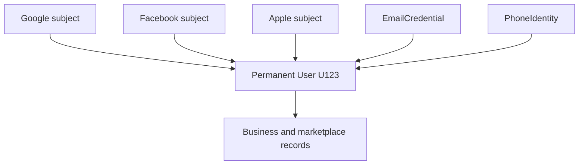
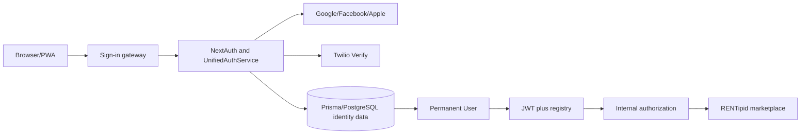
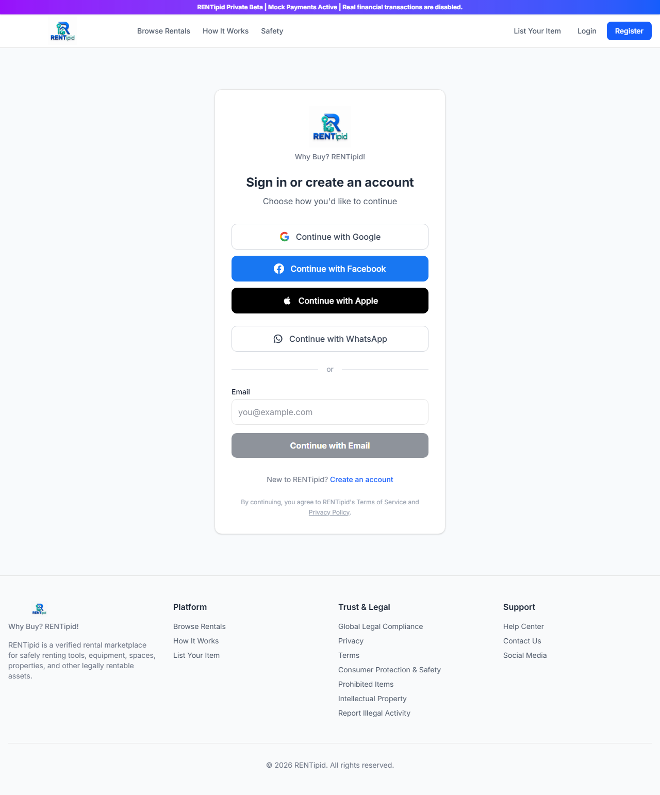
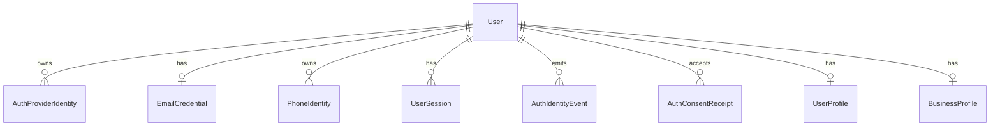
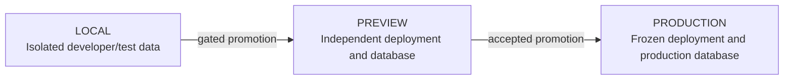

# RENTipid Unified Multi-Login Authentication Module

## Complete User, Business, Technical, Security and Operations Manual

### Version v1.1.0

**Document status:** CLOSED / VERSION FROZEN  
**Frozen tag:** `rentipid-unified-auth-v1.1.0-frozen`  
**Production runtime source SHA:** `c0254631ea55030fd8e6c21ee73bc7a4563173ff`  
**Production deployment:** `dpl_G2mNn7DAEJh4FMerSBcVhfnauZse`  
**Production site:** <https://www.rentipid.com.ph>  
**Stable Preview:** <https://preview.rentipid.com.ph>  
**Document revision:** 1.0  
**Prepared:** 2026-09-19  
**Audience:** users, partners, prospects, support, engineering, security, operations, audit and governance  
**Owner:** RENTipid  
**Classification:** Internal publication baseline; no repository-specific confidentiality policy was located. Approve separately before external distribution.

---

## Document Control

| Field | Value |
|---|---|
| Document title | RENTipid Unified Multi-Login Authentication Module - Complete User, Business, Technical, Security and Operations Manual |
| Module | Unified Multi-Login Authentication Module |
| Version | v1.1.0 |
| Release status | CLOSED / VERSION FROZEN |
| Production runtime source | `c0254631ea55030fd8e6c21ee73bc7a4563173ff` |
| Frozen tag | `rentipid-unified-auth-v1.1.0-frozen` |
| Document revision | 1.0 |
| Prepared date | 2026-09-19 |
| Audience | User, business, developer, security, operations and governance |
| Owner | RENTipid |

## Revision History

| Revision | Date | Author/owner | Change | Status |
|---|---|---|---|---|
| 1.0 | 2026-09-19 | RENTipid documentation baseline | First complete coordinated manual derived from frozen source and release evidence | Published documentation successor |

## Document Purpose

This manual is the authoritative consolidated description of the accepted RENTipid Unified Multi-Login Authentication Module v1.1.0. It explains what customers use, what the business gains, how the implementation resolves identity, how security controls work and how operators support the service.

It does not replace source control, the frozen tag, provider-console configuration, incident authority or database change procedures. If this manual conflicts with the frozen implementation, the frozen implementation and accepted release evidence control and the documentation must be corrected.

## Intended Audience

- Customers and marketplace providers who need sign-in and recovery guidance
- Business prospects and partners evaluating account continuity and security
- Developers maintaining the successor code line
- Operations and support teams monitoring or troubleshooting authentication
- Security reviewers and incident responders
- Product owners, auditors and release-governance authorities

## How to Use This Manual

Start with Part I for the product model. Users can go directly to Part II. Business readers should use Part III. Developers and reviewers use Part IV and the Architecture/API/Security companion references. Operators use Part V. QA uses Part VI. Troubleshooting and governance are in Parts VII-IX. Appendices provide matrices and lookup material.

## Document Conventions

- `Code style` identifies exact provider IDs, paths, models, variables, error codes, tags, commits and deployments.
- **NOTE** provides context.
- **IMPORTANT** identifies an action needed to preserve correct behavior.
- **WARNING** identifies security, privacy or availability risk.
- **TIP** provides practical guidance.
- “Implemented” means present in frozen source.
- “Configured” means release/runtime evidence records environment enablement.
- “Tested” means source tests or accepted execution evidence cover the behavior.
- “Documented” means described in accepted release/manual evidence.
- “Not implemented” means outside v1.1.0, even if discussed as a future possibility.

## Important Security Notice

Email address similarity alone does not authorize identity linking. Same-email automatic OAuth linking is intentionally disabled. Do not enable or recommend `allowDangerousEmailAccountLinking`. Never place passwords, OTPs, OAuth codes/tokens, Apple ID tokens, session cookies, provider secrets, database credentials, Twilio tokens or Apple `.p8` material in logs, screenshots, documentation or support tickets.

## Table of Contents

### Front Matter

- [List of Figures](#list-of-figures)
- [List of Tables](#list-of-tables)
- [List of Diagrams](#list-of-diagrams)

### Part I - Executive and Product Overview

1. [Executive summary](#1-executive-summary)
2. [What is Unified Multi-Login](#2-what-is-unified-multi-login)
3. [Why RENTipid uses multiple login methods](#3-why-rentipid-uses-multiple-login-methods)
4. [Problems solved and benefits](#4-problems-solved-and-benefits)
5. [One user, many verified methods](#5-one-user-many-verified-methods)
6. [Supported methods](#6-supported-methods)
7. [Scope and non-goals](#7-scope-and-non-goals)
8. [Release status](#8-release-status)
9. [High-level architecture](#9-high-level-architecture)
10. [Marketplace relationship](#10-marketplace-relationship)

### Part II - User Manual

11. [Getting started and signing in](#11-getting-started-and-signing-in)
12. [Provider instructions](#12-provider-instructions)
13. [Email and WhatsApp instructions](#13-email-and-whatsapp-instructions)
14. [Account Security and Connected Login Methods](#14-account-security-and-connected-login-methods)
15. [AccountLinkRequired](#15-accountlinkrequired)
16. [Recovery, logout and sessions](#16-recovery-logout-and-sessions)
17. [User privacy and safety](#17-user-privacy-and-safety)

### Part III - Business Prospect Guide

18. [Business overview](#18-business-overview)
19. [Business benefit matrix](#19-business-benefit-matrix)
20. [Account continuity and provider independence](#20-account-continuity-and-provider-independence)
21. [Enterprise and marketplace readiness](#21-enterprise-and-marketplace-readiness)

### Part IV - Developer and Security Manual

22. [Implementation architecture](#22-implementation-architecture)
23. [Identity data model](#23-identity-data-model)
24. [Authentication algorithms](#24-authentication-algorithms)
25. [Provider implementations](#25-provider-implementations)
26. [Linking, collision and duplicate prevention](#26-linking-collision-and-duplicate-prevention)
27. [Sessions, RBAC and KYC](#27-sessions-rbac-and-kyc)
28. [Configuration](#28-configuration)
29. [Security model](#29-security-model)
30. [Audit events and logging hygiene](#30-audit-events-and-logging-hygiene)

### Part V - Operations Manual

31. [Environment topology](#31-environment-topology)
32. [Health and provider verification](#32-health-and-provider-verification)
33. [Monitoring and support](#33-monitoring-and-support)
34. [Incident response](#34-incident-response)
35. [Rollback and reconciliation](#35-rollback-and-reconciliation)

### Part VI - Testing and Quality Assurance

36. [Accepted verification evidence](#36-accepted-verification-evidence)
37. [Test strategy and matrix](#37-test-strategy-and-matrix)
38. [Manual acceptance](#38-manual-acceptance)

### Part VII - Troubleshooting

39. [Diagnostic matrix](#39-diagnostic-matrix)
40. [Provider-specific diagnostics](#40-provider-specific-diagnostics)

### Part VIII - API Reference

41. [API inventory](#41-api-inventory)
42. [API security expectations](#42-api-security-expectations)

### Part IX - Business and Governance

43. [Ownership and change control](#43-ownership-and-change-control)
44. [Release lifecycle](#44-release-lifecycle)
45. [Evidence retention and successor releases](#45-evidence-retention-and-successor-releases)

### Appendices

- [Appendix A - Glossary](#appendix-a---glossary)
- [Appendix B - Acronyms](#appendix-b---acronyms)
- [Appendix C - Supported Login Methods Matrix](#appendix-c---supported-login-methods-matrix)
- [Appendix D - Provider Behavior Matrix](#appendix-d---provider-behavior-matrix)
- [Appendix E - Environment Matrix](#appendix-e---environment-matrix)
- [Appendix F - Environment Variable Reference](#appendix-f---environment-variable-reference)
- [Appendix G - Database Entity Reference](#appendix-g---database-entity-reference)
- [Appendix H - API Route Reference](#appendix-h---api-route-reference)
- [Appendix I - Authentication Event Reference](#appendix-i---authentication-event-reference)
- [Appendix J - Error Code Reference](#appendix-j---error-code-reference)
- [Appendix K - User Troubleshooting Matrix](#appendix-k---user-troubleshooting-matrix)
- [Appendix L - Developer Troubleshooting Matrix](#appendix-l---developer-troubleshooting-matrix)
- [Appendix M - Security Controls Matrix](#appendix-m---security-controls-matrix)
- [Appendix N - Threat Model](#appendix-n---threat-model)
- [Appendix O - Test Matrix](#appendix-o---test-matrix)
- [Appendix P - Definition of Done](#appendix-p---definition-of-done)
- [Appendix Q - Release Lifecycle](#appendix-q---release-lifecycle)
- [Appendix R - Deployment and Rollback Reference](#appendix-r---deployment-and-rollback-reference)
- [Appendix S - Support Escalation Matrix](#appendix-s---support-escalation-matrix)
- [Appendix T - Business Prospect FAQ](#appendix-t---business-prospect-faq)
- [Appendix U - Developer FAQ](#appendix-u---developer-faq)
- [Appendix V - User FAQ](#appendix-v---user-faq)
- [Appendix W - Release History](#appendix-w---release-history)
- [Appendix X - Frozen Release Manifest](#appendix-x---frozen-release-manifest)
- [Appendix Y - Architecture Diagrams](#appendix-y---architecture-diagrams)
- [Appendix Z - Document Change Log](#appendix-z---document-change-log)
- [Source and Evidence Register](#source-and-evidence-register)

## List of Figures

| Figure | Title | Location |
|---|---|---|
| Figure 1 | Public Production sign-in gateway | Section 11 |

## List of Tables

Major tables include document control, supported methods, benefit matrix, provider behavior, environment/configuration matrices, data entities, APIs, events, errors, troubleshooting, security controls, threats, tests, release lifecycle and evidence register.

## List of Diagrams

1. High-level authentication architecture
2. One user/multiple identities
3. New-user authentication sequence
4. Returning linked-user login
5. Same-email new-provider flow
6. Explicit account-linking sequence
7. Provider collision sequence
8. Connected Login Methods workflow
9. Session flow
10. RBAC post-authentication flow
11. Local/Preview/Production topology
12. Database identity relationships

Reusable Mermaid sources are in [`diagrams/`](diagrams/README.md).

# Part I - Executive and Product Overview

## 1. Executive summary

RENTipid Unified Multi-Login v1.1.0 gives customers five supported ways to authenticate while preserving one internal RENTipid account. The methods are email/password, WhatsApp OTP, Google, Facebook and Apple.

The core design is identity continuity: a person can connect several verified methods to one permanent `User.id`. The internal user owns roles, permissions, KYC, profiles, listings, bookings, payments, ledger entries, reviews, history, sessions and security evidence. External providers do not own or assign these records.

The module rejects email-only automatic OAuth linking. A new provider that reports an email already associated with an account receives `ACCOUNT_LINK_REQUIRED`. The user must first authenticate the existing account and then connect the provider from Account Security. A provider subject already linked to another user is blocked with `IDENTITY_IN_USE`.

v1.1.0 is recorded as Production-deployed, completed, owner-accepted, closed and version-frozen. This manual describes that baseline without changing it.

## 2. What is Unified Multi-Login

Unified Multi-Login is the authentication layer that converts different proofs into one canonical user relationship.



“Unified” does not mean unaudited merging. It means controlled resolution and linking around a permanent internal identity.

## 3. Why RENTipid uses multiple login methods

Rental-marketplace participants have different access needs. Social/provider sign-in can reduce entry friction. WhatsApp supports mobile-first users. Email/password provides a direct credential. Multiple connected methods can improve continuity when a provider is temporarily unavailable or a user changes device.

The choice also supports different user categories—renters, individual providers, business providers, operators, staff and administrators—without allowing the external provider to define their internal role.

## 4. Problems solved and benefits

### Problems addressed

- Forced dependence on one credential style
- Duplicate accounts created by naive provider/email handling
- Loss of account continuity when an email changes or is hidden
- Unsafe same-email merging
- Provider identity reassignment
- Split business/KYC/transaction history
- Support uncertainty about linking and disconnecting

### Benefits

- Familiar customer access options
- One customer record across connected methods
- Explicit anti-takeover linking
- Durable provider-subject ownership
- Provider-independent RBAC and business data
- Revocable sessions and security evidence
- Provider-specific failure isolation when alternatives are connected

## 5. One user, many verified methods

`User.id` is the permanent identity. Authentication identities are child records. Email metadata can help detect a possible existing account but cannot approve a link.

This distinction matters for Apple private relay, Facebook without email, Google email changes and corporate/customer address transitions. As long as a provider subject remains linked, the subject resolves to the same internal user. When a new subject appears, the secure linking rules apply.

## 6. Supported methods

| Method | Public ID | Proof | Durable record | Notes |
|---|---|---|---|---|
| Email/password | `credentials` | Verified email credential and bcrypt comparison | `EmailCredential` | New credentials begin unverified |
| WhatsApp OTP | `phone-otp` | Twilio Verify WhatsApp challenge | `PhoneIdentity` | Five-minute default; five attempts; no SMS fallback |
| Google | `google` | OAuth/OIDC callback | `AuthProviderIdentity` | State, PKCE, nonce |
| Facebook | `facebook` | OAuth callback | `AuthProviderIdentity` | State; email optional |
| Apple | `apple` | OAuth/OIDC form POST | `AuthProviderIdentity` | State, PKCE, nonce; private relay aware |

## 7. Scope and non-goals

In scope: provider sign-in, email credentials, WhatsApp verification, explicit identity linking, connected-method display and OAuth disconnect, sessions, recovery flows, MFA assurance integration, events, provider/config health and environment separation.

Not implemented in v1.1.0:

- Passkeys/WebAuthn
- Public SMS login
- Automatic same-email OAuth linking
- Provider-driven internal role assignment
- Universal offline authentication
- Automatic manual merging of duplicate users
- A business-performance guarantee or measured conversion uplift

## 8. Release status

| Gate/evidence | Status |
|---|---|
| Production runtime source | Accepted at `c025463...` |
| Production deployment | `dpl_G2mNn7DAEJh4FMerSBcVhfnauZse` |
| Owner acceptance | PASS |
| Closure | PASS |
| Frozen tag | `rentipid-unified-auth-v1.1.0-frozen` |
| Preview isolation | Restored and separately evidenced after freeze; Production unchanged |

## 9. High-level architecture



## 10. Marketplace relationship

Authentication resolves a user; the marketplace authorizes that user. Renters retain bookings and reviews. Providers retain listings and verification. Businesses retain their business profile and related records. Operators/staff/admins retain only permissions granted inside RENTipid.

An external provider can be a sign-in mechanism for a privileged user, but its profile cannot create that privilege.

# Part II - User Manual

## 11. Getting started and signing in

Open <https://www.rentipid.com.ph>, select Login and choose a method you already connected. New users can follow an onboarding method. Review terms/privacy before continuing.



**Figure 1.** Public Production login page captured without authentication.

For full numbered instructions, see the [User Manual](02_RENTipid_Unified_Multi_Login_User_Manual_v1.1.0.md).

## 12. Provider instructions

### Google

Select Continue with Google, choose the intended Google account and approve the provider flow. Returning linked subjects resolve the same RENTipid user. Same-email new subjects may require explicit linking.

### Facebook

Select Continue with Facebook and authenticate at Facebook. Email may be absent. RENTipid uses the Facebook subject. Identity-in-use errors require support escalation.

### Apple

Select Continue with Apple and authenticate. Share Email or Hide My Email can both work. RENTipid uses Apple's durable subject and handles the secure form POST callback.

## 13. Email and WhatsApp instructions

Email/password users enter their registered email and password. New credentials must be verified. Recovery tokens expire after 30 minutes and reset all sessions after success.

WhatsApp users enter a correctly formatted mobile number, request one code and submit it within the default five-minute window. Codes are one-time; users must never disclose them.

## 14. Account Security and Connected Login Methods

From Dashboard, open Account Security and Connected Login Methods. The panel shows Google, Facebook, Apple, Email & Password and WhatsApp OTP as Connected, Not connected or unavailable.

To add an OAuth method, select Connect, authenticate the provider and confirm Connected. To disconnect, confirm another tested method remains. The final viable method cannot be removed.

## 15. AccountLinkRequired

This state means the provider proof succeeded, but linking proof did not. It typically occurs when a new provider reports the same email as an existing RENTipid account.

Resolution:

1. Sign in through an existing connected method.
2. Open Account Security.
3. Select Connect for the new provider.
4. Authenticate the provider.
5. Confirm it is Connected.

This is expected protection, not a request to enable automatic merging.

## 16. Recovery, logout and sessions

Use another connected method when available. Email-password users can request a reset. External provider accounts must be recovered through the provider. If all methods are unavailable, use controlled RENTipid support without sharing secrets.

Log out through RENTipid rather than only closing the browser. Review active sessions and revoke unknown ones. Password reset revokes all sessions.

## 17. User privacy and safety

- Verify the official domain.
- Never share passwords, codes or cookies.
- Use a unique password and MFA where available.
- Store recovery codes privately.
- Check the selected account on shared devices.
- Review connected methods and sessions.
- Report unexpected linking/unlinking immediately.
- Understand that Apple relay email and absent Facebook email are normal supported states.

# Part III - Business Prospect Guide

## 18. Business overview

Unified access is designed to lower unnecessary onboarding friction while preserving strong internal ownership. It offers customer convenience without making email the account key.

Operationally, one internal user reduces the need to reconcile separate bookings, profiles and provider records every time a person chooses another sign-in method. Security controls prevent convenience from becoming silent account merging.

## 19. Business benefit matrix

| Capability | Customer benefit | Business benefit | Security benefit |
|---|---|---|---|
| Google | Familiar cross-device sign-in | Designed to reduce entry friction | Durable subject; state/PKCE/nonce |
| Apple | Private-relay-friendly sign-in | Serves Apple-oriented users | Durable subject and secure form POST |
| Facebook | Familiar sign-in even without email | Broadens choice | Subject is key; email optional |
| WhatsApp OTP | Passwordless mobile entry | Supports mobile-first customers | Expiry, limits, replay prevention |
| Email/password | Direct RENTipid credential | Provider-independent option | Hashing, verification, reset controls |
| Connected Methods | User-managed alternatives | Support clarity and continuity | Signed explicit linking |
| Collision protection | Clear ownership boundary | Reduces data-integrity disputes | Unique mapping and blocked reassignment |
| Internal RBAC | Consistent marketplace access | Protects operating model | Providers cannot assign roles |

## 20. Account continuity and provider independence

The customer's marketplace history belongs to the internal user. Connecting Apple to a Google-backed account changes access options, not bookings or KYC ownership. If a provider is unavailable, another already connected method may continue to work.

The module does not guarantee that every customer has an alternate method. Partners should encourage appropriate account protection and support recovery processes.

## 21. Enterprise and marketplace readiness

Durable IDs, explicit linking, structured events, isolated environments and a gated release lifecycle support enterprise due diligence. The design can serve renters, providers, businesses and governed staff roles.

Geographic/language expansion still requires local legal, delivery, provider, localization and support review. No unsupported scale, availability or ROI figure is claimed.

# Part IV - Developer and Security Manual

## 22. Implementation architecture

The module uses Next.js 16 App Router, NextAuth 4.24.15, Prisma/PostgreSQL and a `UnifiedAuthService` with repository abstraction. Provider callbacks enter through the catch-all route and are resolved to an internal user by service rules.

Key files are `src/lib/auth.ts`, `src/lib/auth/unified/services.ts`, `repository.ts`, intent utilities, session registry, auth/account routes, login UI, ConnectedLoginMethods and Prisma schema/migrations.

## 23. Identity data model



`AuthProviderIdentity` has a unique provider/subject pair. `EmailCredential.normalized_email` and `PhoneIdentity.phone_e164` are unique. Challenges and rate limits support OTP controls. Consent/events/session records provide governance and revocation.

## 24. Authentication algorithms

### Case 1 - linked provider

Resolve provider+subject, load owner, verify active status, register session and continue.

### Case 2 - new person

Validate profile/consent, confirm no existing provider identity or same-email account, create default user and identity in controlled persistence, then create a session.

### Case 3 - same-email new provider

Do not link and do not create a duplicate. Emit `AUTH_ACCOUNT_LINK_REQUIRED`; require existing-account authentication and explicit connect.

### Case 4 - identity owned elsewhere

Block, emit `AUTH_IDENTITY_LINK_BLOCKED` with `IDENTITY_IN_USE`, preserve ownership and escalate.

## 25. Provider implementations

Google: scope `openid email profile`; checks PKCE/state/nonce; subject durable; issuer/audience/expiry/verified-email validation where claims exist.

Facebook: state; subject durable; email optional; Meta callback registration per environment.

Apple: `name email`; `response_mode=form_post`; PKCE/state/nonce; secure `SameSite=None` transient cookies on HTTPS; subject durable; private relay metadata.

Email: normalized credential, bcrypt, required verification, generic recovery, hash-only expiring tokens.

WhatsApp: Twilio Verify, E.164 normalization, five-minute default expiry, five attempts, persisted limits and atomic consumption. No SMS fallback.

## 26. Linking, collision and duplicate prevention

OAuth link intent is signed, ten minutes, HttpOnly, current-user-bound and provider-bound. Callback consumption distinguishes a Connect action from ordinary sign-in.

Database uniqueness and service checks enforce one owner. Same-owner linking is idempotent. Different-owner linking is denied. Unlink checks viable methods.

Generic email/phone link/unlink APIs require AAL2. Current OAuth Account Security actions use session plus signed intent/ownership safeguards; v1.1.0 does not claim AAL2 on every OAuth UI action.

## 27. Sessions, RBAC and KYC

JWT sessions carry user ID, role, status and opaque session identifier. `UserSession` stores only a hash and supports 30-day maximum age, last-seen tracking and revocation.

TOTP/recovery-code MFA can grant four-hour AAL2 bound to the current session. OAuth/phone login does not grant AAL2 automatically.

RBAC reads `User.role`; inactive account status fails closed. KYC/profile/business/booking/payment/ledger relationships remain with `User.id`.

## 28. Configuration

Primary names are `NEXTAUTH_URL`, `NEXTAUTH_SECRET`, `AUTH_REFERENCE_HASH_SECRET`; provider feature flags/IDs/secrets; email/SMTP settings; WhatsApp/Twilio Verify settings; terms/privacy versions; database URLs and MFA encryption key.

Only names and purpose belong in documentation. Values live in environment-specific secret management. See Appendix F and the companion Developer Manual for the full table.

## 29. Security model

Threats include same-email takeover, provider collision, OAuth CSRF/code interception, OTP guessing/replay/flooding, credential stuffing, account enumeration, session theft, provider role escalation, secret leakage and environment crossover.

Implemented responses include explicit linking, unique provider ownership, state/PKCE/nonce, short-lived cookies, verified profile claims, bcrypt, hash-only tokens, rate limits, challenge consumption, registry revocation, database RBAC and sanitized events.

Registration returns conflict for an existing email; therefore the release does not claim uniform account-enumeration protection across every public route.

## 30. Audit events and logging hygiene

Literal event families cover login, OAuth user creation, account-link-required, identity-link-blocked, OTP lifecycle/rate/provider failures, email verification/password reset, MFA and sessions. Identity events record create/link/block/unlink.

Never log raw passwords/hashes, OTPs, OAuth codes/tokens, Apple ID tokens, cookies, private keys, secrets or database credentials. Use masked phones and derived reference hashes.

# Part V - Operations Manual

## 31. Environment topology



Current Preview and Production must not share live customer data. The post-freeze restoration evidence records the corrected Preview isolation without changing the frozen Production runtime.

## 32. Health and provider verification

Read-only endpoints:

```text
GET /api/health
GET /api/auth/providers
GET /api/auth/methods
```

At preparation time, both public environments returned HTTP 200 ready/database connected and exact provider IDs `credentials`, `phone-otp`, `google`, `facebook`, `apple`.

Provider presence does not prove full OAuth acceptance. Use designated accounts and an approved acceptance plan for end-to-end verification.

## 33. Monitoring and support

Monitor health/database state, provider registry changes, auth failures, account-status denials, link-required/collision events, OTP rate/replay/provider failures, recovery failures, MFA failures and session revocations.

Support collects environment, provider, time, browser/device and user-visible error plus safe event reference. It does not collect credentials or tokens.

## 34. Incident response

Unauthorized linking: preserve evidence, revoke sessions, secure remaining methods and verify durable subject ownership.

Secret exposure: contain, rotate, invalidate affected sessions/tokens, inspect propagation and document.

Provider outage: keep unaffected methods available, confirm provider/config state and never disable validation to restore service.

Environment crossover: stop promotion, preserve Production, compare safe alias/deployment/database branch identifiers, correct through controlled change and reverify.

## 35. Rollback and reconciliation

Application rollback uses a known-good immutable deployment under incident authority. Database identity rollback favors reviewed forward repair or proven restore—not casual reversal of ownership constraints. Provider configuration rollback restores last-known-good environment values without exposing them.

Identity reconciliation must be evidence-backed, auditable and reversible. It must preserve KYC/business/transaction ownership and never reassign a provider subject from email similarity alone.

# Part VI - Testing and Quality Assurance

## 36. Accepted verification evidence

The Production completion report records typecheck PASS, targeted auth regression PASS (8 suites, 85 tests) and canonical Production build PASS with Turbopack. Owner acceptance confirmed Google/Apple/Facebook same-user linking, duplicate prevention and role/profile/KYC integrity.

The repository contains a broader current auth test inventory, including legacy compatibility and post-acceptance regression files. Counts from source inventory must not be substituted for the recorded accepted execution without running them.

## 37. Test strategy and matrix

Testing covers service algorithms, route contracts, UI visibility, cookie policy, display-email safety, ancillary email flows and WhatsApp stall/telemetry containment.

Minimum scenarios include new/returning provider users, missing/relay email, Apple form POST, cross-provider same-email sequences, explicit linking, collisions, unlink and last-method protection, credentials/verification/reset, OTP expiry/replay/limits, provider outage, RBAC/KYC/profile/marketplace continuity, logout/revocation and duplicate prevention.

See Appendix O for the matrix and the Developer Manual Section 26 for extended cases.

## 38. Manual acceptance

Use designated accounts and non-production data in Preview. Record internal user continuity before/after connecting providers. Verify Account Security statuses and absence of duplicate users. Do not retain PII, tokens, cookies or provider subjects in screenshots.

Production verification after deployment should be minimal, controlled and evidence-based. Never use an acceptance exercise to invent or alter live customer identity data.

# Part VII - Troubleshooting

## 39. Diagnostic matrix

| Symptom | Likely cause | Safe action | Escalation |
|---|---|---|---|
| Sign-in method not connected | Same-email provider not explicitly linked | Existing-method sign-in then Connect | L1/L2 |
| Identity in use | Subject owned by another user | Stop; preserve evidence | Security/L3 |
| Redirect URI mismatch | Provider console/environment mismatch | Correct exact registered callback | L3 |
| Apple missing state cookie | Cross-site transient cookie not returned | Check HTTPS/Secure/SameSite/proxy; no bypass | L3 |
| Provider absent | Disabled/deferred/unconfigured | Check public methods and env presence | L2/L3 |
| OTP not received | Phone/delivery/rate issue | Verify number; wait; check Twilio safely | L1/L3 |
| OTP expired/replayed | Challenge lifecycle | Start new challenge | L1 |
| Invalid credentials | Credential proof failed | Generic retry/recovery | L1/L2 |
| Cannot disconnect | Last viable method | Connect/test alternative | L1 |
| Session returns to login | Expired/revoked/status/registry | Reauthenticate and inspect | L2/L3 |
| Database unavailable | Health not ready | Restore dependency; no bypass | L3 |

## 40. Provider-specific diagnostics

Google: verify exact callback, provider registry, PKCE/state/nonce and claim validation. Facebook: verify Meta callback, tolerate missing email and escalate collision. Apple: verify Services ID, form POST and transient-cookie policy. WhatsApp: verify Twilio Verify configuration, channel, challenges and limits. Email: verify credential state, SMTP delivery and token lifetimes.

See the companion [Troubleshooting Guide](06_RENTipid_Unified_Multi_Login_Troubleshooting_Guide_v1.1.0.md).

# Part VIII - API Reference

## 41. API inventory

Framework-managed endpoints include providers, session, CSRF, sign-in, callbacks and sign-out under `/api/auth/*`.

Application endpoints include:

- `/api/auth/methods`
- `/api/auth/register`
- `/api/auth/otp`
- `/api/auth/oauth/intent`
- `/api/auth/oauth/link-intent`
- `/api/auth/link`
- `/api/auth/unlink`
- `/api/auth/logout`
- `/api/auth/email-verification/resend`
- `/api/auth/email-verification/verify`
- `/api/auth/password-recovery`
- `/api/auth/password-reset`
- `/api/auth/mfa/enroll`, `/activate`, `/verify`
- `/api/account/connected-methods`
- `/api/account/sessions`
- `/api/account/sessions/{sessionId}`
- `/api/account/sessions/logout-others`
- `/api/health`

See the [API Reference](08_RENTipid_Unified_Multi_Login_API_Reference_v1.1.0.md) for methods, inputs, outputs, statuses and security.

## 42. API security expectations

Use same-origin HTTPS, framework CSRF protections, authenticated session scope, AAL2 where implemented, no-store responses, validated inputs, generic sensitive error responses and environment-correct callbacks. Do not send authentication secrets in URL query strings except one-time link tokens in their implemented verification routes, and never log those values.

# Part IX - Business and Governance

## 43. Ownership and change control

RENTipid owns internal identity, role policy, release evidence and operational configuration. External providers own their authentication services and user recovery. Users own/control their connected external accounts subject to provider terms.

Changes require approved successor work. Frozen commits/tags are not amended. Secrets and provider-console settings are controlled separately from source documentation.

## 44. Release lifecycle

The mandatory lifecycle is:

CODE COMPLETE → LOCAL FUNCTIONAL → LOCAL DATABASE MIGRATED → LOCAL REQUIRED DATA SEEDED/SYNCED → LOCAL ACCEPTANCE PASS → PREVIEW MIGRATED → PREVIEW ACCEPTANCE PASS → PRODUCTION-READY → PRODUCTION DEPLOYMENT/VERIFICATION → COMPLETED → ACCEPTED → CLOSED → VERSION FROZEN.

Each gate establishes evidence needed by the next. Skipping local/database/Preview gates can put customer identity at risk. Skipping acceptance/closure/freeze makes it unclear which behavior is authoritative.

## 45. Evidence retention and successor releases

Retain source SHAs, immutable tag, deployment ID, migration identity, test/build evidence, provider IDs, acceptance/closure reports and incident/isolation records. Do not retain secret values in evidence.

Successor releases must identify deltas from v1.1.0 and rerun affected threat, schema, provider, linking, session and acceptance tests. Post-freeze infrastructure corrections must explicitly state whether the frozen runtime changed.

# Appendices

## Appendix A - Glossary

| Term | Definition |
|---|---|
| Account | The permanent RENTipid `User` and its related records |
| Authentication identity | A verified method linked to a User |
| Canonical user | The permanent internal `User.id` owner |
| Connected method | A method whose durable identity/credential belongs to the current User |
| Durable subject | Provider-issued stable account identifier |
| Explicit linking | Authenticated process proving existing account and new provider control |
| Identity collision | A provider subject already owned by a different User |
| Provider metadata | Email/name/avatar supplied by an external provider, not ownership key |
| Synthetic email | Internal reserved identifier for provider/phone-only User rows |

## Appendix B - Acronyms

| Acronym | Meaning |
|---|---|
| AAL2 | Authentication Assurance Level 2 in the session step-up subsystem |
| CSRF | Cross-Site Request Forgery |
| ERD | Entity Relationship Diagram |
| HMAC | Hash-based Message Authentication Code |
| KYC | Know Your Customer |
| MFA | Multi-Factor Authentication |
| OIDC | OpenID Connect |
| OTP | One-Time Password/code |
| PKCE | Proof Key for Code Exchange |
| RBAC | Role-Based Access Control |
| PWA | Progressive Web Application |

## Appendix C - Supported Login Methods Matrix

| Method | Accepted | Public | Can create user | Can return same user | Current direct Connected UI |
|---|---|---|---|---|---|
| Email/password | Yes | Yes | Yes | Yes | Displayed; credential flows separate |
| WhatsApp OTP | Yes | Yes | Yes | Yes | Displayed; verification flow separate |
| Google | Yes | Yes | Yes | Yes | Connect/disconnect |
| Facebook | Yes | Yes | Yes | Yes | Connect/disconnect |
| Apple | Yes | Yes | Yes | Yes | Connect/disconnect |
| SMS | No - retired | No | Not a current public method | Legacy compatibility only | No |

## Appendix D - Provider Behavior Matrix

| Provider | Durable key | Email behavior | Checks | Callback |
|---|---|---|---|---|
| Google | `google + subject` | Supplied email must be verified | state, PKCE, nonce | `/api/auth/callback/google` |
| Facebook | `facebook + subject` | Optional | state | `/api/auth/callback/facebook` |
| Apple | `apple + subject` | Optional on return; can be private relay; supplied email verified | state, PKCE, nonce | `/api/auth/callback/apple` via form POST |

## Appendix E - Environment Matrix

| Environment | Domain | Deployment/data rule | Provider target |
|---|---|---|---|
| Local | developer origin | Isolated local/test database; no Production secrets | As configured for development |
| Preview | `preview.rentipid.com.ph` | Independent Preview deployment and database | Five accepted IDs at preparation time |
| Production | `www.rentipid.com.ph` | Frozen deployment and Production database | Five accepted IDs |

## Appendix F - Environment Variable Reference

| Category | Names | Secret? | Notes |
|---|---|---|---|
| Core auth | `NEXTAUTH_URL`, `NEXTAUTH_SECRET`, `AUTH_REFERENCE_HASH_SECRET` | URLs no; secrets yes | Strong isolated secrets required outside local |
| Google | `AUTH_GOOGLE_ENABLED`, `GOOGLE_CLIENT_ID`, `GOOGLE_CLIENT_SECRET` | Secret is sensitive | Exact callback per environment |
| Facebook | `AUTH_FACEBOOK_ENABLED`, `FACEBOOK_CLIENT_ID`, `FACEBOOK_CLIENT_SECRET` | Secret is sensitive | Meta registration per environment |
| Apple | `AUTH_APPLE_ENABLED`, `AUTH_APPLE_DEFERRED`, `APPLE_CLIENT_ID`, `APPLE_CLIENT_SECRET` | Secret is sensitive | Never commit `.p8`/generated secret |
| Email | `AUTH_EMAIL_ENABLED`, `EMAIL_PROVIDER`, `EMAIL_FROM`, `SMTP_HOST`, `SMTP_PORT`, `SMTP_USER`, `SMTP_PASSWORD`, `SMTP_SECURE` | Credentials sensitive | Frozen adapter is SMTP |
| Phone | `AUTH_WHATSAPP_OTP_ENABLED`, `AUTH_SMS_OTP_ENABLED`, `TWILIO_ACCOUNT_SID`, `TWILIO_AUTH_TOKEN`, `TWILIO_VERIFY_SERVICE_SID` | Twilio values sensitive | SMS false; Verify service used |
| Consent | `RENTIPID_TERMS_VERSION`, `RENTIPID_PRIVACY_VERSION` | No | Defaults identify unified v1.1 terms/privacy |
| Data/security | `DATABASE_URL`, `DIRECT_URL`, `MFA_ENCRYPTION_KEY` | Yes | Environment isolation mandatory |

## Appendix G - Database Entity Reference

| Entity | Purpose | Critical constraint |
|---|---|---|
| `User` | Canonical account/business identity | Primary key; unique internal email |
| `AuthProviderIdentity` | OAuth identity ownership | Unique provider + subject |
| `EmailCredential` | Password credential | Unique user and normalized email |
| `PhoneIdentity` | Verified mobile identity | Unique E.164 phone |
| `PhoneVerificationChallenge` | OTP lifecycle | Status, attempts, expiry, consumption |
| `AuthRateLimit` | Persisted rate-limit buckets | Bucket/window semantics |
| `AuthConsentReceipt` | Terms/privacy consent evidence | User/version/time relationships |
| `AuthIdentityEvent` | Identity lifecycle audit | Safe provider/reference/reason |
| `UserSession` | Revocable session registry | Unique hashed session key |
| `MfaSessionAssurance` | Time-bounded AAL2 | Bound to user/session hash |
| `AuthenticationSecurityLog` | Security telemetry | Sanitized metadata and retention |

## Appendix H - API Route Reference

| Method | Path | Auth | Purpose |
|---|---|---|---|
| GET | `/api/health` | Public | Application/database readiness |
| GET | `/api/auth/providers` | Public | Runtime NextAuth providers |
| GET | `/api/auth/methods` | Public | Public method states |
| POST | `/api/auth/register` | Public | Email registration |
| POST | `/api/auth/otp` | Public | WhatsApp challenge start |
| POST | `/api/auth/oauth/intent` | Public | OAuth consent intent |
| POST | `/api/auth/oauth/link-intent` | Session | Explicit OAuth connect intent |
| GET/DELETE | `/api/account/connected-methods` | Session | List/disconnect OAuth method |
| POST | `/api/auth/link` | Session + AAL2 | Generic credential/phone link |
| POST | `/api/auth/unlink` | Session + AAL2 | Generic unlink |
| POST | `/api/auth/logout` | Session | Registry-aware logout |
| GET | `/api/account/sessions` | Session | List sessions |
| DELETE | `/api/account/sessions/{sessionId}` | Session | Revoke another session |
| POST | `/api/account/sessions/logout-others` | Session | Revoke all other sessions |

## Appendix I - Authentication Event Reference

| Event | Meaning |
|---|---|
| `AUTH_ACCOUNT_LINK_REQUIRED` | Same-email reconciliation stopped pending explicit proof |
| `AUTH_IDENTITY_LINK_BLOCKED` | Link denied, including `IDENTITY_IN_USE` |
| `AUTH_OAUTH_USER_CREATED` | New provider-backed internal user created |
| `AUTH_OAUTH_LOGIN_SUCCEEDED` | Existing provider identity resolved |
| `AUTH_PHONE_OTP_STARTED/VERIFIED` | WhatsApp challenge lifecycle success |
| `AUTH_PHONE_OTP_EXPIRED/REPLAY_DENIED/ATTEMPT_LIMITED/RATE_LIMITED` | OTP control outcome |
| `AUTH_EMAIL_VERIFIED` | Email credential verified |
| `AUTH_PASSWORD_RESET_COMPLETED` | Password changed and sessions revoked |
| `SESSION_CREATED/REVOKED/REVOKED_BY_USER` | Session registry lifecycle |

## Appendix J - Error Code Reference

| Code | Meaning | Handling |
|---|---|---|
| `ACCOUNT_LINK_REQUIRED` | Existing account may match new provider email | Authenticate existing account, then connect |
| `IDENTITY_IN_USE` | Durable identity owned elsewhere | Block/escalate |
| `LAST_SIGN_IN_METHOD` | Unlink would strand account | Add/test another method |
| `INVALID_OAUTH_PROFILE` | Provider proof/profile invalid | Reject and diagnose callback |
| `INVALID_CREDENTIALS` | Credential proof failed | Generic retry/recovery |
| `EMAIL_NOT_VERIFIED` | Credential not verified | Verify/resend |
| `INVALID_OTP` | OTP challenge failed | Fresh challenge if safe |
| `RATE_LIMITED` | Threshold exceeded | Honor delay/investigate abuse |
| `PROVIDER_UNAVAILABLE` | Dependency unavailable | Alternative method/operations |
| `METHOD_DISABLED` | Method not enabled/configured | Alternative/config check |
| `ACCOUNT_DISABLED` | Account status denies access | Account-status process |
| `CONSENT_REQUIRED` | First-time OAuth consent missing | Restart gateway |
| `RECENT_AUTH_REQUIRED` | AAL2 required | MFA step-up |

## Appendix K - User Troubleshooting Matrix

| Symptom | User action |
|---|---|
| Method not connected | Use existing method, then Account Security Connect |
| WhatsApp code missing | Verify number, wait, request one new code |
| Expired code | Start a fresh challenge |
| Forgot password | Use recovery; check newest link within 30 minutes |
| Cannot disconnect | Add/test another method first |
| Unknown session | Revoke it, secure methods, contact support if suspicious |

## Appendix L - Developer Troubleshooting Matrix

| Symptom | Checks |
|---|---|
| OAuth callback failure | Exact origin/callback; registry; state/PKCE/nonce; clock; cookie policy |
| Apple state cookie missing | HTTPS, host/proxy, Secure, SameSite=None, 15-minute age |
| Facebook missing email | Accept subject; do not require/guess email |
| Identity collision | Ownership query, unique constraint, safe events; no reassignment |
| Session loop | callback normalization, registry, user status, session cookie, clock |
| Build sees root scratch file | `tsconfig.json` include/exclude and build remediation baseline |

## Appendix M - Security Controls Matrix

| Control | Protects against | Evidence |
|---|---|---|
| No email auto-link | Same-email takeover | Service and connected-method tests |
| Provider+subject uniqueness | Identity collision | Schema/migration and tests |
| State/PKCE/nonce | OAuth CSRF/interception/replay | Config and Apple/security tests |
| Secure transient cookies | Apple form POST state loss | Cookie regression suite |
| OTP expiry/attempt/rate/consume | Guessing/flood/replay | Service and route tests |
| Hash-only reset/verify tokens | Token disclosure at rest | Ancillary tests |
| Session registry | Stale/stolen session persistence | Session service/routes/events |
| Database RBAC | Provider privilege escalation | Service tests and acceptance |
| Sanitized events | Secret leakage | Audit-safety tests |

## Appendix N - Threat Model

| Threat | Asset | Mitigation | Residual duty |
|---|---|---|---|
| Same-email takeover | Account ownership | Explicit dual proof | Support never merges by email |
| Provider collision | Identity ownership | Unique mapping and denial | Security investigation |
| OAuth CSRF | Callback integrity | State/CSRF/intents | Correct provider config |
| OTP abuse | Phone account access | Limits, expiry, attempts, replay prevention | Monitor provider/rate events |
| Credential stuffing | Email credential | Hashing/generic failures/rate infrastructure | Platform monitoring and response |
| Session theft | User access | HttpOnly cookie, registry, revocation | User/provider security |
| Role escalation | Privileged access | Internal role authority | Governance of role changes |
| Environment crossover | Customer data | Isolation and gates | Change control and verification |

## Appendix O - Test Matrix

| Test ID | Scenario | Expected |
|---|---|---|
| O-01 | New/returning Google | One User; returning same ID |
| O-02 | New/returning Facebook | One User; missing email accepted |
| O-03 | New/returning Apple | One User; relay metadata supported |
| O-04 | Apple form POST | Secure transient cookies; state/PKCE/nonce retained |
| O-05 | Cross-provider same email | AccountLinkRequired; no duplicate |
| O-06 | Explicit provider connection | Same User owns multiple identities |
| O-07 | Provider collision | Denied and audited |
| O-08 | Unlink and last method | Secondary succeeds; last blocked |
| O-09 | Email credential lifecycle | Verification/reset single-use and sessions revoked |
| O-10 | OTP expiry/replay/limits | Denied/audited |
| O-11 | RBAC/KYC/profile | Preserved |
| O-12 | Booking/payment/ledger | Same canonical User relationships |
| O-13 | Logout/revocation | Registry enforces revocation |
| O-14 | Provider outage | Controlled failure; other methods independent |

## Appendix P - Definition of Done

For v1.1.0, done required implementation, migration, local/Preview/Production validation, provider acceptance, security regression, canonical build, Production verification, owner acceptance, closure and frozen evidence. A source-only change was not sufficient.

## Appendix Q - Release Lifecycle

| Gate | Required evidence |
|---|---|
| Code complete | Scoped source/schema/docs and review |
| Local functional | Working flows and tests |
| Local DB migrated | Migration applied and schema aligned |
| Local data seeded/synced | Required reference/test state |
| Local acceptance | Scenario evidence |
| Preview migrated | Isolated Preview database/deployment |
| Preview acceptance | End-to-end provider/linking behavior |
| Production-ready | Secrets/config/rollback/security approval |
| Production deployment/verification | Immutable deployment and health/provider checks |
| Completed/Accepted/Closed | Formal records and owner decision |
| Version frozen | Immutable tag/manifest |

## Appendix R - Deployment and Rollback Reference

Before deploy: secret scan, typecheck/tests/build, migration review, environment isolation, exact callbacks and rollback baseline. After deploy: health, provider IDs, existing-user login, link-required, explicit connect, collision, last-method, session and data continuity.

Rollback: use approved immutable deployment; preserve identity constraints; prefer reviewed forward fix/restore for database; restore provider configuration from secret management; rerun post-rollback verification.

## Appendix S - Support Escalation Matrix

| Condition | Level | Required action |
|---|---|---|
| Normal AccountLinkRequired | L1/L2 | Educate and guide explicit connect |
| Provider outage/config issue | L3 | Operations/provider investigation |
| Identity in use | Security/L3 | Preserve evidence; no reassignment |
| Suspected takeover/session theft | Security | Revoke, secure, investigate |
| Duplicate account with business records | Security/Product/Data | Controlled reconciliation plan |
| Preview/Production crossover | Incident command | Stop, preserve Production, isolate and verify |

## Appendix T - Business Prospect FAQ

**Does it automatically merge customers?** No.  
**Can providers assign roles?** No.  
**Does it replace KYC?** No.  
**Can it reduce friction?** It is designed to; no numerical outcome is claimed.  
**What if a provider fails?** Existing alternative methods can provide continuity.  
**Is it accepted?** v1.1.0 is Production-deployed, accepted, closed and frozen.

## Appendix U - Developer FAQ

**Canonical key?** `User.id`.  
**OAuth key?** Provider + provider subject.  
**Authoritative mapping?** `AuthProviderIdentity`, not a NextAuth Account table.  
**Dangerous email linking?** Not enabled.  
**Apple cookies?** Secure SameSite=None only for required transient OAuth cookies on HTTPS.  
**Does OTP grant AAL2?** No. TOTP/recovery-code verification grants AAL2.

## Appendix V - User FAQ

**Can Google and Apple reach the same account?** Yes, after secure connection.  
**Why does same email not link automatically?** Email alone is insufficient ownership proof.  
**Can I disconnect a method?** Yes, if another usable method remains.  
**Is WhatsApp the same as SMS?** No; SMS is retired.  
**Should support ask for a code?** Never.

## Appendix W - Release History

| Date | Milestone | Evidence |
|---|---|---|
| 2026-09-18 | Apple transient-cookie remediation and unified linking lineage | Commits `41610f9...`, `9b21e5d...` |
| 2026-09-19 | Production runtime accepted | Source `c025463...`, deployment `dpl_G2m...` |
| 2026-09-19 | Owner acceptance, closure and freeze | Release reports and frozen tag |
| 2026-09-19 | Preview isolation restored without Production change | Post-freeze isolation report |
| 2026-09-19 | Complete manual suite prepared | This documentation successor |

## Appendix X - Frozen Release Manifest

| Item | Value |
|---|---|
| Module | RENTipid Unified Multi-Login Authentication Module |
| Version | v1.1.0 |
| Status | CLOSED / VERSION FROZEN |
| Tag | `rentipid-unified-auth-v1.1.0-frozen` |
| Tag commit | `eaa63c78f4c1cc11760bb3084d0ee9b84bac6e47` |
| Tag object | `ada8385ee3d0fc4e11fd710ea34f31dc60865a96` |
| Production source | `c0254631ea55030fd8e6c21ee73bc7a4563173ff` |
| Production deployment | `dpl_G2mNn7DAEJh4FMerSBcVhfnauZse` |
| Providers | `credentials`, `phone-otp`, `google`, `facebook`, `apple` |
| Migration | `20260827090000_unified_multi_login_auth_v1_1` |

## Appendix Y - Architecture Diagrams

The 12 Mermaid sources in [`diagrams/`](diagrams/README.md) cover high-level architecture, identity model, new/returning login, same-email stop, explicit linking, collision, Connected Methods, sessions, RBAC, environment topology and database relationships. They are derived from actual model and route names.

## Appendix Z - Document Change Log

| Revision | Change | Runtime impact |
|---|---|---|
| 1.0 | Initial complete manual suite for frozen v1.1.0 | None; documentation only |

# Source and Evidence Register

## Source paths

| Area | Paths reviewed |
|---|---|
| Auth framework | `src/lib/auth.ts`, `src/app/api/auth/[...nextauth]/route.ts` |
| Unified identity | `src/lib/auth/unified/config.ts`, `services.ts`, `repository.ts`, `identifiers.ts` |
| Intents/cookies | `oauth-consent.ts`, `oauth-link-intent.ts`, `anonymous-client.ts` |
| Credentials/recovery | `password.ts`, `ancillary.ts`, `email-delivery.ts`, register/recovery/verification routes |
| OTP | `phone-provider.ts`, `otp-route.ts`, OTP route, rate limiter |
| Sessions/MFA | `session-registry.ts`, session routes, `src/lib/security/auth/mfa-*` |
| UI | login page, ConnectedLoginMethods, Dashboard Security/Profile pages |
| Data | `prisma/schema.prisma`, unified identity and session migrations |
| Tests | nine auth-focused test files in `tests/auth/` |

## Release documents

| Document | Use |
|---|---|
| `VERSION_FROZEN_MANIFEST.md` | Version/tag/provider/migration baseline |
| `UNIFIED_AUTH_CLOSURE_REPORT.md` | Closure architecture and policy evidence |
| `PRODUCTION_COMPLETION_REPORT.md` | Build/test/deployment/health evidence |
| `OWNER_ACCEPTANCE_REPORT.md` | Cross-provider same-user and integrity acceptance |
| `LOCAL_PRODUCTION_PARITY_REPORT.md` | Local parity/build evidence |
| `PREVIEW_ISOLATION_RESTORATION_REPORT.md` | Current independent Preview topology |
| `AUTH_UNIFIED_LOGIN_PREVIEW_CHECKPOINT.md` | Historical implementation lineage; later frozen evidence prevails |
| `docs/modules/identity-authentication/reconciliation.md` | Reconciliation principles/context |

## Relevant commits

| Commit | Relevance |
|---|---|
| `41610f9b536fd49a2457ceee87380612d00f8aea` | Apple form POST transient cookie remediation |
| `9b21e5d0203e610cfca8d2b5e27ef20174a50389` | Controlled unified provider linking |
| `92328c85c8ff28011b8bdf4907939a560cedd09e` | Root scratch TypeScript/build scope remediation |
| `c0254631ea55030fd8e6c21ee73bc7a4563173ff` | Accepted Production runtime source |
| `eaa63c78f4c1cc11760bb3084d0ee9b84bac6e47` | Frozen release manifest commit |

## Fact-classification summary

| Classification | Examples in this manual |
|---|---|
| Implemented | Identity models, explicit linking, session registry, cookie policy, APIs |
| Configured | Five providers in accepted Production and current Preview registry |
| Tested | Auth regression behaviors and accepted release test/build evidence |
| Documented | Lifecycle, deployment IDs, owner acceptance and Preview isolation |
| Planned/not implemented | Passkeys, public SMS, automatic merging—identified as absent, not presented as current |

**End of Master Manual**
