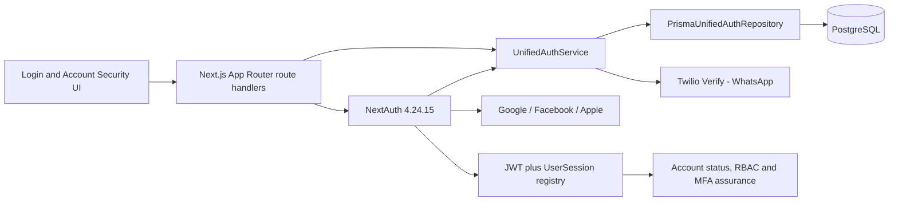
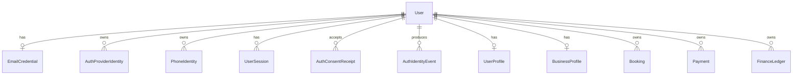
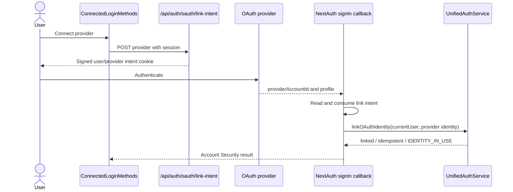
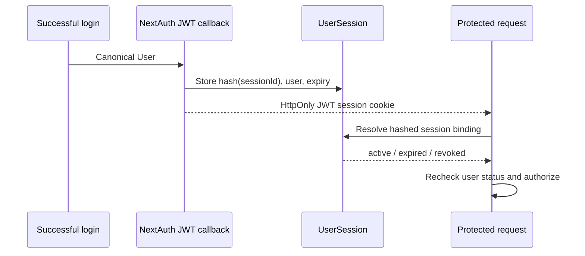

# RENTipid Unified Multi-Login Authentication Module

## Developer and Operations Manual v1.1.0

**Document status:** CLOSED / VERSION FROZEN  
**Frozen tag:** `rentipid-unified-auth-v1.1.0-frozen`  
**Production runtime source:** `c0254631ea55030fd8e6c21ee73bc7a4563173ff`  
**Production deployment:** `dpl_G2mNn7DAEJh4FMerSBcVhfnauZse`  
**Prepared:** 2026-09-19  
**Audience:** developers, database engineers, SRE/operations, security engineering, QA and technical support

> **SECURITY NOTICE:** This manual lists configuration names and safe structures only. Never paste secret values, cookies, tokens, authorization codes, OTPs, database URLs or private keys into documentation, commits, logs or tickets.

## Table of Contents

1. [Scope and release authority](#1-scope-and-release-authority)
2. [Architecture overview](#2-architecture-overview)
3. [Technology stack](#3-technology-stack)
4. [Repository map](#4-repository-map)
5. [Identity data model](#5-identity-data-model)
6. [Authentication algorithms](#6-authentication-algorithms)
7. [NextAuth integration](#7-nextauth-integration)
8. [OAuth intent system](#8-oauth-intent-system)
9. [Explicit identity linking](#9-explicit-identity-linking)
10. [Connected Methods API and UI](#10-connected-methods-api-and-ui)
11. [Provider collision and duplicate prevention](#11-provider-collision-and-duplicate-prevention)
12. [Google provider](#12-google-provider)
13. [Facebook provider](#13-facebook-provider)
14. [Apple provider](#14-apple-provider)
15. [Email/password provider](#15-emailpassword-provider)
16. [WhatsApp OTP provider](#16-whatsapp-otp-provider)
17. [Session model](#17-session-model)
18. [MFA and recent authentication](#18-mfa-and-recent-authentication)
19. [RBAC, KYC and business-data continuity](#19-rbac-kyc-and-business-data-continuity)
20. [Audit and security events](#20-audit-and-security-events)
21. [Error handling](#21-error-handling)
22. [Environment configuration](#22-environment-configuration)
23. [Local development](#23-local-development)
24. [Preview configuration and isolation](#24-preview-configuration-and-isolation)
25. [Production baseline](#25-production-baseline)
26. [Testing and QA](#26-testing-and-qa)
27. [Build and TypeScript control](#27-build-and-typescript-control)
28. [Deployment and promotion](#28-deployment-and-promotion)
29. [Operational monitoring](#29-operational-monitoring)
30. [Support runbook](#30-support-runbook)
31. [Incident response](#31-incident-response)
32. [Rollback and recovery](#32-rollback-and-recovery)
33. [Change control and versioning](#33-change-control-and-versioning)
34. [Known boundaries](#34-known-boundaries)
35. [Source and evidence map](#35-source-and-evidence-map)

## 1. Scope and release authority

This manual describes the accepted v1.1.0 implementation. It is not an implementation plan. The frozen release evidence and source at `rentipid-unified-auth-v1.1.0-frozen` are authoritative. Authentication source, Prisma schema and auth tests are unchanged between the Production runtime source, frozen tag and the successor branch state inspected for this documentation.

The accepted public methods are:

- `credentials` - Email and password
- `phone-otp` - WhatsApp OTP
- `google`
- `facebook`
- `apple`

The source contains a retired `sms` compatibility state. Public SMS initiation fails closed and is not part of v1.1.0.

## 2. Architecture overview



The permanent identity is `User.id`. `AuthProviderIdentity`, `EmailCredential` and `PhoneIdentity` are authentication proofs owned by a user. Application records reference the user, not an OAuth email.

The module's primary architectural decisions are:

1. Durable OAuth identity is provider plus provider subject.
2. Email is optional metadata and a possible reconciliation signal.
3. Same-email automatic OAuth linking is disabled.
4. New-provider same-email cases stop at `ACCOUNT_LINK_REQUIRED`.
5. Explicit linking is authenticated, provider-bound and user-bound.
6. Provider collision is blocked, not reassigned.
7. Sessions are JWT-based but backed by a revocable registry.
8. Roles and account status remain server-authoritative RENTipid data.

## 3. Technology stack

| Layer | Frozen implementation |
|---|---|
| Web framework | Next.js 16.2.12 App Router |
| UI/runtime | React 19.2.4 |
| Authentication framework | NextAuth 4.24.15 |
| ORM | Prisma 6.19.3 with Neon adapter |
| Database | PostgreSQL / Neon serverless topology |
| Password hashing | `bcryptjs` |
| Validation | Zod 4.4.3 and route/service validation |
| OTP delivery | Twilio Verify over WhatsApp |
| MFA | TOTP via `otplib`; QR generation via `qrcode` |
| Tests | Jest 30, Testing Library and Playwright |
| Hosting evidence | Vercel deployment with isolated Preview and Production |

Next.js route handlers use current App Router conventions, including asynchronous `params` in dynamic route handlers such as session revocation. Future code changes must follow the repository's installed Next.js documentation rather than assumptions from older releases.

## 4. Repository map

| Area | Key paths |
|---|---|
| NextAuth configuration | `src/lib/auth.ts` |
| Unified config | `src/lib/auth/unified/config.ts` |
| Identity service | `src/lib/auth/unified/services.ts` |
| Repository abstraction/Prisma implementation | `src/lib/auth/unified/repository.ts` |
| Identifiers and masking | `src/lib/auth/unified/identifiers.ts` |
| OAuth consent | `src/lib/auth/unified/oauth-consent.ts` |
| OAuth link intent | `src/lib/auth/unified/oauth-link-intent.ts` |
| OTP route service | `src/lib/auth/unified/otp-route.ts` |
| Twilio provider | `src/lib/auth/unified/phone-provider.ts` |
| Ancillary email flows | `src/lib/auth/unified/ancillary.ts` |
| Email delivery | `src/lib/auth/unified/email-delivery.ts` |
| Rate limiting | `src/lib/auth/unified/rate-limiter.ts` |
| Session registry | `src/lib/auth/session-registry.ts` |
| NextAuth route | `src/app/api/auth/[...nextauth]/route.ts` |
| Auth APIs | `src/app/api/auth/**/route.ts` |
| Account auth APIs | `src/app/api/account/**/route.ts` |
| Login page | `src/app/login/page.tsx` |
| Connected methods component | `src/components/profile/ConnectedLoginMethods.tsx` |
| Security page | `src/app/dashboard/security/page.tsx` |
| Profile page | `src/app/dashboard/profile/page.tsx` |
| Schema | `prisma/schema.prisma` |
| Unified migration | `prisma/migrations/20260827090000_unified_multi_login_auth_v1_1/migration.sql` |
| Auth tests | `tests/auth/` |

## 5. Identity data model

### 5.1 Relationship model



### 5.2 `User`

`User` contains the canonical primary key, required unique internal email, optional mobile number and name, account type, `role`, `status`, optional legacy `password_hash`, and relations to profile, business, marketplace, security and auth entities.

OAuth-only and phone-only accounts use deterministic-format synthetic internal emails under `identity.rentipid.invalid`. The display-email helper never renders these to users. This preserves the existing non-null unique schema requirement without promoting provider email into account ownership.

### 5.3 `AuthProviderIdentity`

The entity contains `provider`, `provider_subject`, optional email/profile metadata, email verification, Apple private-email state and timestamps. The composite unique constraint is the external identity ownership boundary. An index on user/provider supports connected-method lookup.

The repository method for OAuth lookup takes provider and subject. Email lookup is separate and is used only to detect a reconciliation condition.

### 5.4 `EmailCredential`

One user may have one credential record. `normalized_email` is unique. `password_hash` and `is_verified` are authoritative for email sign-in. An OAuth email cannot create or merge an email credential.

### 5.5 `PhoneIdentity`

`phone_e164` is unique. Both historical channel compatibility and current WhatsApp proof resolve through the same durable normalized number so repeated verification does not create duplicate users.

### 5.6 Challenge and rate-limit entities

`PhoneVerificationChallenge` stores challenge reference, channel, status, counts, expiry and consumption. `AuthRateLimit` persists bucket/window counters. The anonymous client bucket is signed server-side so an arbitrary client cookie cannot choose its own rate-limit identity.

### 5.7 Consent, event and session entities

- `AuthConsentReceipt` stores accepted terms/privacy versions.
- `AuthIdentityEvent` records identity lifecycle action/outcome with derived references.
- `AuthenticationSecurityLog` stores sanitized security events.
- `UserSession` stores a hash of the opaque session key, timestamps, expiry and revocation.
- `MfaSessionAssurance` records AAL2 against the registered session binding.

### 5.8 Migration properties

Migration `20260827090000_unified_multi_login_auth_v1_1` creates the unified identity tables, foreign keys and unique constraints. The session registry is introduced by `20260826120000_add_user_session_registry`. Deployment must apply migrations through the repository's controlled database gate; schema changes must not be improvised in Production.

## 6. Authentication algorithms

### 6.1 Existing provider identity

```text
normalized = validate(provider, providerAccountId, profile)
identity = findProviderIdentity(normalized.provider, normalized.subject)
if identity exists:
    user = load(identity.user_id)
    assert user status is active
    audit successful OAuth login
    return user
```

Email is not part of this lookup, so relay addresses and email changes do not redirect ownership.

### 6.2 New person

```text
validate provider profile
require valid consent intent
ensure provider identity does not exist
canonicalize optional provider email
if any existing user matches the email:
    ACCOUNT_LINK_REQUIRED
else:
    create User(role=Renter, status=Pending, synthetic email)
    create AuthProviderIdentity(user_id, provider, subject, metadata)
    create consent receipt and audit evidence
    return user
```

Repository transaction behavior prevents partial user/identity creation.

### 6.3 Same-email new provider

The service does not call a dangerous auto-link API. It emits `AUTH_ACCOUNT_LINK_REQUIRED` with safe provider metadata and throws `UnifiedAuthError('ACCOUNT_LINK_REQUIRED')`. The NextAuth callback redirects to `/login?error=AccountLinkRequired`. No identity is linked and no new user is created.

### 6.4 Explicit link

```text
assert authenticated current User
assert signed intent binds User and provider
validate provider profile
existing = findProviderIdentity(provider, subject)
if existing.user_id != current User.id:
    audit AUTH_IDENTITY_LINK_BLOCKED / IDENTITY_IN_USE
    deny
if existing.user_id == current User.id:
    return idempotent success
create provider identity for current User.id
audit identity LINK success
```

### 6.5 Unlink

```text
assert ownership
count viable methods
if count <= 1: LAST_SIGN_IN_METHOD
delete only selected current-user identity
audit UNLINK success
```

## 7. NextAuth integration

### 7.1 Providers

`src/lib/auth.ts` conditionally creates providers from runtime config. Credentials and phone are NextAuth Credentials providers; Google, Facebook and Apple use OAuth providers. Disabled/unconfigured providers are omitted from the registry.

### 7.2 Sign-in callback

For OAuth, the callback requires provider account identity, checks the explicit link intent/current session path when linking, and otherwise resolves or creates through the unified service. Known errors map to controlled login/security redirect states.

For credentials/phone, the provider authorize function returns a RENTipid user only after verification. A successful callback does not accept a role from the browser or provider profile.

### 7.3 JWT callback

The callback sets `id`, `role` and `status` from the database user. It creates an opaque session ID when required and registers a hash in `UserSession`. The raw session identifier is not stored in the database.

### 7.4 Session callback

The session callback validates registry activity and account status. It places the canonical user ID, role and status in the application session. Invalid/revoked registry state yields an unauthenticated result.

### 7.5 Pages and redirects

The custom sign-in page is `/login`. Callback URLs are normalized to safe internal routes. External, malformed, missing, login-loop and known invalid targets resolve to safe defaults.

## 8. OAuth intent system

### 8.1 Consent intent

`POST /api/auth/oauth/intent` creates a signed ten-minute cookie after explicit acceptance of current Terms and Privacy. Payload fields include version, provider, terms/privacy versions, consent timestamp and expiry. Verification uses an HMAC and timing-safe equality.

This design carries first-time consent across the external provider round trip. On HTTPS, the cookie uses `SameSite=None` and `Secure` for Apple form POST compatibility. Local HTTP uses `Lax` and not Secure.

### 8.2 Link intent

`POST /api/auth/oauth/link-intent` requires a current session, accepts only Google/Facebook/Apple and writes a signed ten-minute HttpOnly cookie. Payload includes current user, selected provider and expiry. The callback consumes the cookie to prevent replay.

### 8.3 Key material

Both intent systems derive signing material from `AUTH_REFERENCE_HASH_SECRET` or `NEXTAUTH_SECRET`; local fallback strings exist for development. Production and Preview must supply real environment secrets and isolate them.

## 9. Explicit identity linking



The explicit OAuth connection route relies on current-session plus signed intent. The generic `POST /api/auth/link` route for email/password or phone additionally requires AAL2 via the current registered session. Do not overstate that OAuth link intent itself requires AAL2 in v1.1.0.

## 10. Connected Methods API and UI

### 10.1 Read model

`GET /api/account/connected-methods` requires a session and returns five method definitions. It uses configured/enabled state plus current user's identities. Provider email metadata and phone display are safe for the current account; internal synthetic email is excluded.

### 10.2 OAuth disconnect

`DELETE /api/account/connected-methods` accepts Google, Facebook or Apple and calls service unlink for the current user. It returns explicit invalid-provider, not-connected and last-method responses while keeping generic unexpected failures.

### 10.3 Component behavior

`src/components/profile/ConnectedLoginMethods.tsx`:

- Loads with credentials included.
- Shows Connected, Not connected or unavailable state.
- Starts OAuth connect by creating the link intent before `signIn`.
- Refreshes after `?linked=` callback state.
- Confirms and performs OAuth disconnect.
- Explains last-method policy.

The component is present on the security/profile dashboard surfaces. Email and WhatsApp are displayed, while current direct connect/disconnect UI actions are primarily OAuth-oriented.

## 11. Provider collision and duplicate prevention

### 11.1 Application control

Before creating/linking, the service queries the provider+subject. Different-owner results fail with `IDENTITY_IN_USE`. Same-owner results are idempotent. New-provider same-email results fail with `ACCOUNT_LINK_REQUIRED` before user creation.

### 11.2 Database control

Composite uniqueness prevents duplicate durable external identities even under concurrency. Unique normalized email and phone constraints protect direct credential and phone identity ownership.

### 11.3 Historical reconciliation

The frozen release evidence records controlled Facebook historical identity reconciliation before Production acceptance. That evidence is not a general-purpose runtime merge feature. Future data repair must use a separately reviewed, auditable procedure.

### 11.4 Prohibited shortcuts

- Do not enable `allowDangerousEmailAccountLinking`.
- Do not update `AuthProviderIdentity.user_id` based on email alone.
- Do not delete a collision record merely to make login pass.
- Do not copy bookings/KYC/ledger records into a newly created duplicate as routine support.
- Do not use external provider roles as `User.role`.

## 12. Google provider

### 12.1 Configuration

Variable names: `AUTH_GOOGLE_ENABLED`, `GOOGLE_CLIENT_ID`, `GOOGLE_CLIENT_SECRET`. A method is public only when enabled and credentials are present.

### 12.2 Provider contract

- Provider ID: `google`
- Callback: `/api/auth/callback/google`
- Scope: `openid email profile`
- Checks: `pkce`, `state`, `nonce`
- Durable key: Google subject/provider account ID

Normalization checks subject consistency. It validates allowed issuer, configured audience, expiry and verified email when those claims are supplied.

### 12.3 Error behavior

Missing/mismatched subject or invalid claims return `INVALID_OAUTH_PROFILE`. Same-email existing account returns `ACCOUNT_LINK_REQUIRED`. Different-owner subject during explicit link returns `IDENTITY_IN_USE`.

### 12.4 Tests

The auth suites cover new/returning Google, subject validation, wrong issuer/audience, unverified email, same-email prevention, explicit link, collision and RBAC preservation.

## 13. Facebook provider

### 13.1 Configuration

Variable names: `AUTH_FACEBOOK_ENABLED`, `FACEBOOK_CLIENT_ID`, `FACEBOOK_CLIENT_SECRET`.

### 13.2 Provider contract

- Provider ID: `facebook`
- Callback: `/api/auth/callback/facebook`
- Checks: `state`
- Durable key: Facebook provider account ID
- Email: optional

Facebook missing-email profiles remain valid when the provider subject exists. The service creates a synthetic internal email for a truly new user.

### 13.3 Collision behavior

A Facebook subject already owned by another user is blocked. The accepted Production release included provider registration and reconciliation acceptance; operations must still keep Meta callback registration aligned with each environment.

### 13.4 Tests

Tests cover new/returning Facebook, missing email, same-user resolution, provider visibility, linking/collision and display-email behavior.

## 14. Apple provider

### 14.1 Configuration

Variable names: `AUTH_APPLE_ENABLED`, `AUTH_APPLE_DEFERRED`, `APPLE_CLIENT_ID`, `APPLE_CLIENT_SECRET`. The web client ID represents the Apple Services ID. By implementation design in `src/lib/auth/unified/config.ts`, `isAppleLoginDeferred()` defaults to `true` (`isFeatureFlagEnabled(env, APPLE_LOGIN_DEFERRED_ENV, true)`). Therefore, when `AUTH_APPLE_DEFERRED` is absent or unconfigured, Apple defaults to HIDDEN / DEFERRED on the public login gateway. To make Apple publicly visible on the login gateway, `AUTH_APPLE_DEFERRED` must be explicitly set to `false` (or `0`, `off`, `disabled`, `no`).

### 14.2 Provider contract

- Provider ID: `apple`
- Callback: `/api/auth/callback/apple`
- Scope: `name email`
- Authorization parameter: `response_mode=form_post`
- Checks: `pkce`, `state`, `nonce`
- Durable key: Apple subject

### 14.3 Transient cookie policy

For HTTPS/Production conditions, state, PKCE verifier, nonce and callback URL cookies are HttpOnly, Secure, SameSite=None and expire after 15 minutes. This permits the cross-site POST to carry the evidence needed for validation. It does not disable any security check. Session and CSRF tokens retain stricter default behavior.

### 14.4 Hide My Email

Private relay detection sets `is_private_email`. The account still resolves by Apple subject. Returning authorization may omit email/name, so the existing identity record is authoritative.

### 14.5 Tests

`apple-oauth-cookie-policy.test.ts` covers cookie attributes, session/CSRF defaults, PKCE/state/nonce preservation, state mismatch/missing state, consent cookies, new/returning users, consent failure, same-email prevention and inactive-user denial.

## 15. Email/password provider

### 15.1 Registration

The public route validates email/password, required consent and safe public role. It creates the user/profile and `EmailCredential` in an unverified state. The current route uses bcrypt cost 10; the shared `BcryptPasswordHasher` used elsewhere uses cost 12.

### 15.2 Verification

Verification tokens are 32 random bytes, stored as SHA-256 hashes, expire after 24 hours and are single-use. Resend is generic and invalidates outstanding tokens.

### 15.3 Authentication

Credentials sign-in canonicalizes email, looks up the credential, compares bcrypt hash, requires verification and checks user status. Unknown email and wrong password both become `INVALID_CREDENTIALS`.

### 15.4 Password recovery/reset

Recovery responses are generic. Reset tokens use hash-only storage, 30-minute expiry and one-time consumption. A successful reset changes the password and revokes all sessions. Provider-only/phone-only accounts do not gain a password implicitly.

### 15.5 Password policy

The shared schema permits 8-128 characters and rejects null bytes. Do not claim uppercase, numeric or symbol rules that are not implemented.

## 16. WhatsApp OTP provider

### 16.1 Configuration

Variable names: `AUTH_WHATSAPP_OTP_ENABLED`, `TWILIO_ACCOUNT_SID`, `TWILIO_AUTH_TOKEN`, `TWILIO_VERIFY_SERVICE_SID`. `TWILIO_WHATSAPP_FROM` is not used by this frozen Twilio Verify implementation.

### 16.2 Initiation

`POST /api/auth/otp` delegates to the unified OTP route/service. `phone-provider.ts` accepts only `whatsapp`; `sms` throws `SMS_AUTH_RETIRED`. Twilio calls use server-side Basic authentication and the Verify service.

### 16.3 Phone normalization

The identifier utility accepts E.164 and normalizes common Philippine formats to `+63...`. Invalid values are rejected before durable identity use.

### 16.4 Limits and lifecycle

Default expiry is five minutes; default maximum attempts is five. Start and verify operations use persisted per-phone, per-network and signed-client limits. Challenge status, phone, channel and expiry must match. Consumption is atomic, preventing replay.

### 16.5 Session handoff

After service verification returns the canonical user, the `phone-otp` Credentials provider hands it to the same JWT/session registry flow as other methods. OTP authentication alone does not grant AAL2.

## 17. Session model



Maximum age is 30 days. `last_seen_at` updates are throttled to roughly five minutes. Routes allow listing sessions, revoking a selected other session and logging out other sessions. The current session uses normal logout.

## 18. MFA and recent authentication

MFA enrollment generates a TOTP secret and QR data. Activation verifies a six-digit TOTP, stores protected MFA material, returns recovery codes and grants current-session AAL2. Verification accepts TOTP or a 12-character recovery code. Rate limiting applies to enrollment, activation and verification.

`MFA_SESSION_ASSURANCE_LEVEL_AAL2` has a four-hour TTL and is bound to the registered session hash. Generic sensitive link/unlink routes call `requireCurrentSessionAal2`. OAuth Account Security link-intent and connected-method DELETE currently rely on the authenticated session and their identity/linking safeguards; do not document universal AAL2 for those UI operations.

## 19. RBAC, KYC and business-data continuity

The JWT callback derives role/status from the canonical database user. OAuth provider profiles have no role input. New OAuth and phone accounts default to `Renter`; public registration limits role selection to safe public roles.

`UserProfile`, `BusinessProfile`, KYC/verification fields, listings, bookings, payments, ledger entries and related history remain associated with `User.id`. Linking adds an authentication identity and leaves these relationships intact. Unlinking removes one access path and does not delete marketplace records.

Owner acceptance specifically verified canonical-user linking and preservation of role/profile/KYC integrity. Tests validate role/status preservation during explicit linking. Future schema/business changes should retain regression tests for booking, payment and ledger continuity.

## 20. Audit and security events

### 20.1 Authentication events

Implemented families include registration, login success/failure, account-status denial, account-link-required, identity-link-blocked, OAuth creation/login, OTP start/failure/expiry/replay/attempt/rate/provider states, email verification, password recovery/reset and sessions.

Representative literal codes:

```text
AUTH_LOGIN_SUCCEEDED
AUTH_LOGIN_FAILED
AUTH_OAUTH_LOGIN_SUCCEEDED
AUTH_OAUTH_USER_CREATED
AUTH_ACCOUNT_LINK_REQUIRED
AUTH_IDENTITY_LINK_BLOCKED
AUTH_PHONE_OTP_STARTED
AUTH_PHONE_OTP_VERIFIED
AUTH_PHONE_OTP_REPLAY_DENIED
AUTH_PHONE_OTP_RATE_LIMITED
AUTH_EMAIL_VERIFIED
AUTH_PASSWORD_RESET_COMPLETED
SESSION_CREATED
SESSION_REVOKED
SESSION_REVOKED_BY_USER
OTHER_SESSIONS_REVOKED
```

### 20.2 Identity events

`AuthIdentityEvent` records identity type, action (`CREATE`, `LINK`, `LINK_BLOCKED`, `UNLINK`), outcome, provider and safe derived references/reason. `PROVIDER_IDENTITY_COLLISION` is not a literal v1.1.0 event code; the implemented signal is `AUTH_IDENTITY_LINK_BLOCKED` with `IDENTITY_IN_USE`.

### 20.3 Logging hygiene

Never log passwords/hashes, OTPs, OAuth codes/tokens, Apple ID tokens, session cookies, provider secrets, database credentials or raw private keys. Use masked phone display and HMAC reference hashes. The tests assert absence of passwords, OTPs, provider secrets and raw subjects from relevant audit evidence.

## 21. Error handling

`UnifiedAuthError` codes are:

| Code | Trigger | Intended handling |
|---|---|---|
| `ACCOUNT_DISABLED` | Inactive/suspended/deleted user | Deny; account-status support process |
| `ACCOUNT_LINK_REQUIRED` | New provider and possible existing same-email user | Existing-method sign-in plus explicit connect |
| `CONSENT_REQUIRED` | Missing/invalid first-time OAuth consent | Restart gateway consent flow |
| `EMAIL_NOT_VERIFIED` | Credential not verified | Complete/resend verification |
| `IDENTITY_IN_USE` | Identity owned by another user | Block and security escalation |
| `INVALID_CREDENTIALS` | Wrong/unknown email credential | Generic retry/recovery |
| `INVALID_OAUTH_PROFILE` | Missing/inconsistent/invalid profile claims | Reject callback |
| `INVALID_OTP` | Invalid/expired/replayed/exhausted challenge | Start fresh challenge when safe |
| `LAST_SIGN_IN_METHOD` | Unlink would strand user | Connect another method first |
| `METHOD_DISABLED` | Flag/config disables method | Use alternative; operations check |
| `PROVIDER_UNAVAILABLE` | Twilio/provider dependency failure | Alternative method and provider monitoring |
| `RATE_LIMITED` | Persisted threshold exceeded | Honor delay; investigate abuse |
| `RECENT_AUTH_REQUIRED` | AAL2-required API lacks assurance | Complete MFA step-up |

Unexpected errors are mapped to controlled responses. Sensitive endpoints favor generic messaging and no-store behavior.

## 22. Environment configuration

The following table lists variable names only.

| Variable | Purpose | Local | Preview | Production | Secret? | Required? | Safe default / notes |
|---|---|---|---|---|---|---|---|
| `NEXTAUTH_URL` | Canonical auth origin | Local origin | Preview HTTPS origin | Production HTTPS origin | No | Yes | Must match callbacks |
| `NEXTAUTH_SECRET` | NextAuth and fallback signing material | Strong local value recommended | Yes | Yes | Yes | Yes outside disposable local | Never use documented fallback |
| `AUTH_REFERENCE_HASH_SECRET` | HMAC reference/intent secret override | Recommended | Yes | Yes | Yes | Strongly recommended | Isolate by environment |
| `AUTH_GOOGLE_ENABLED` | Google feature flag | As needed | `true` for accepted config | `true` | No | No | Defaults enabled but credentials still required |
| `GOOGLE_CLIENT_ID` | Google OAuth client ID | Env-specific | Preview client/registration | Production client/registration | No/public identifier | Required for Google | Do not mix callbacks |
| `GOOGLE_CLIENT_SECRET` | Google OAuth secret | Env-specific | Secret store | Secret store | Yes | Required for Google | Never commit |
| `AUTH_FACEBOOK_ENABLED` | Facebook feature flag | As needed | `true` | `true` | No | No | Credentials still required |
| `FACEBOOK_CLIENT_ID` | Meta app/client ID | Env-specific | Preview registration | Production registration | No/public identifier | Required for Facebook | Exact callback |
| `FACEBOOK_CLIENT_SECRET` | Meta app secret | Env-specific | Secret store | Secret store | Yes | Required for Facebook | Never commit |
| `AUTH_APPLE_ENABLED` | Apple feature flag | As needed | `true` | `true` | No | No | Credentials still required |
| `AUTH_APPLE_DEFERRED` | Controls public visibility of Apple login | Optional (`false` to show) | `false` (explicitly enabled) | `false` (explicitly enabled) | No | No | Defaults to `true` (HIDDEN/DEFERRED) when absent or empty; must be explicitly set to `false` (or `0`, `off`, `disabled`, `no`) to expose Apple on public gateway |
| `APPLE_CLIENT_ID` | Apple Services ID | Env-specific | Preview-capable registration | Production registration | No/public identifier | Required for Apple | Web Services ID concept |
| `APPLE_CLIENT_SECRET` | Apple generated client secret/JWT | Env-specific | Secret store | Secret store | Yes | Required for Apple | Never store `.p8` or JWT in repo |
| `AUTH_EMAIL_ENABLED` | Email/password flag | As needed | `true` | `true` | No | No | Credential provider still needs email delivery for verification/recovery |
| `EMAIL_PROVIDER` | Email adapter selection | `smtp` if configured | `smtp` | `smtp` | No | For delivery | Frozen implementation recognizes SMTP |
| `EMAIL_FROM` | Sender address | Test sender | Preview sender | Approved Production sender | No/operational | For delivery | Must be authorized by mail service |
| `SMTP_HOST` | SMTP server | Env-specific | Secret config | Secret config | Sensitive config | For delivery | Never publish infrastructure details unnecessarily |
| `SMTP_PORT` | SMTP port | Env-specific | Env-specific | Env-specific | No | For delivery | Parsed integer |
| `SMTP_USER` | SMTP username | Env-specific | Secret store | Secret store | Yes/sensitive | For delivery | Never commit |
| `SMTP_PASSWORD` | SMTP password | Env-specific | Secret store | Secret store | Yes | For delivery | Never commit |
| `SMTP_SECURE` | TLS mode | Match local service | Match service | Match service | No | No | Boolean string |
| `AUTH_WHATSAPP_OTP_ENABLED` | WhatsApp OTP flag | As needed | `true` | `true` | No | No | Twilio config also required |
| `AUTH_SMS_OTP_ENABLED` | Retired SMS flag | `false` | `false` | `false` | No | No | SMS remains publicly retired |
| `TWILIO_ACCOUNT_SID` | Twilio account identifier | Test/approved | Secret config | Secret config | Sensitive | WhatsApp required | Do not log |
| `TWILIO_AUTH_TOKEN` | Twilio API credential | Test/approved | Secret store | Secret store | Yes | WhatsApp required | Never commit |
| `TWILIO_VERIFY_SERVICE_SID` | Twilio Verify service | Env-specific | Preview service | Production service | Sensitive | WhatsApp required | Frozen code uses Verify; no `TWILIO_WHATSAPP_FROM` |
| `RENTIPID_TERMS_VERSION` | Consent document version | Current | Current | Current accepted | No | No | Default `unified-multi-login-v1.1` |
| `RENTIPID_PRIVACY_VERSION` | Privacy document version | Current | Current | Current accepted | No | No | Default `unified-multi-login-v1.1` |
| `DATABASE_URL` | Runtime database connection | Isolated local/test | Preview database | Production database | Yes | Yes | Never share Preview/Production |
| `DIRECT_URL` | Direct migration connection where used | Isolated | Preview migration target | Production migration target | Yes | Workflow-dependent | Never document value |
| `MFA_ENCRYPTION_KEY_ID` | Identifier for active field encryption key | Test key ID (`local-key-1`) | Configured key ID | Configured key ID | No | Yes (for MFA) | Key ID/version metadata; referenced by `EnvironmentKeyProvider` (`process.env.MFA_ENCRYPTION_KEY_ID`); pairs with `MFA_ENCRYPTION_KEY` |
| `MFA_ENCRYPTION_KEY` | Protect MFA secrets (TOTP secrets, recovery codes) | 32-byte hex string | Secret store | Secret store | Yes | Yes (for MFA) | Exactly 32 bytes (64 hex characters) AES key; paired with active `MFA_ENCRYPTION_KEY_ID` |
| `RETIRED_FIELD_ENCRYPTION_KEYS` | Historical key decryption map for rotation | Optional / empty | Secret store | Secret store | Yes | No | JSON map (`{"keyId": "hexKey"}`) supporting decryption during key rotation |
| `NODE_ENV` | Runtime behavior/cookie security context | `development`/`test` | `production` build/runtime | `production` | No | Framework | HTTPS also drives secure cookie behavior |

Other security/SOC variables may exist in the wider application but are outside this module's configuration reference.

## 23. Local development

### 23.1 Prerequisites

- Node.js 20.x as declared by the repository
- Installed dependencies matching the lockfile
- An isolated development/test PostgreSQL database
- Safe local provider/test credentials as required
- No Production secrets or live customer database

### 23.2 Setup sequence

1. Check out an approved successor/development branch; never move the frozen tag.
2. Configure local variables outside version control.
3. Run the repository database guard before database-altering test/setup scripts.
4. Apply migrations through repository-native commands.
5. Generate Prisma Client.
6. Run `npm run typecheck`.
7. Run targeted auth suites.
8. Start the local server with `npm run dev` only when browser verification is needed.
9. Verify `/api/health`, `/api/auth/methods` and `/api/auth/providers`.

### 23.3 Safe local testing

Use test provider apps/accounts and non-production phone/email identities. Do not test provider linking against live customer users. Do not copy Production environment files into local development.

## 24. Preview configuration and isolation

Preview is `https://preview.rentipid.com.ph`. Current evidence records an independent Preview deployment and independent Preview database/branch after a post-freeze alias/isolation restoration. The Production frozen runtime was not changed by that correction.

Preview must have provider callbacks for its own hostname. Read-only verification consists of:

```text
GET https://preview.rentipid.com.ph/api/health
GET https://preview.rentipid.com.ph/api/auth/providers
```

At documentation preparation time, Preview returned ready/connected and provider IDs `credentials`, `phone-otp`, `google`, `facebook`, `apple`.

Never use Production customer data as Preview test fixtures. Provider test accounts and owner acceptance evidence should be clearly labeled and removed/retained under policy.

## 25. Production baseline

| Item | Accepted baseline |
|---|---|
| URL | `https://www.rentipid.com.ph` |
| Runtime source | `c0254631ea55030fd8e6c21ee73bc7a4563173ff` |
| Deployment | `dpl_G2mNn7DAEJh4FMerSBcVhfnauZse` |
| Frozen tag | `rentipid-unified-auth-v1.1.0-frozen` |
| Provider IDs | `credentials`, `phone-otp`, `google`, `facebook`, `apple` |
| Health at documentation preparation | HTTP 200, ready, database connected |

The frozen tag resolves to commit `eaa63c78f4c1cc11760bb3084d0ee9b84bac6e47`; its annotated tag object is distinct from the commit. Do not move or recreate it.

## 26. Testing and QA

### 26.1 Accepted release evidence

Production completion records the targeted auth command as 8 suites and 85 tests passing, typecheck passing and canonical Production build passing with Turbopack. That evidence belongs to the accepted release and should not be silently rewritten as a fresh current run.

### 26.2 Current auth test inventory

The repository contains these auth-focused files:

- `unified-multi-login-v1.1.test.ts`
- `unified-auth-routes.test.ts`
- `profile-display-email.test.ts`
- `multi-login-finalization.test.tsx`
- `login-page.test.ts`
- `connected-login-methods.test.ts`
- `apple-oauth-cookie-policy.test.ts`
- `ancillary-email-password-flows.test.ts`
- `whatsapp-otp-verification-stall.test.ts`

The broad inventory contains legacy compatibility cases as well as current public behavior. For example, some tests assert historical SMS/WhatsApp identity continuity while separate finalization tests verify that public SMS initiation is retired. Interpret test names in release context.

### 26.3 Core test matrix

| ID | Scenario | Precondition | Action | Expected result | Type | Environment |
|---|---|---|---|---|---|---|
| AUTH-001 | New Google user | New Google subject, valid consent | Google sign-in | One User + Google identity + session | Automated | Local/test |
| AUTH-002 | Returning Google | Linked subject | Google sign-in | Same User ID | Automated | Local/test |
| AUTH-003 | New Facebook | New subject | Facebook sign-in | One User + Facebook identity | Automated | Local/test |
| AUTH-004 | Facebook missing email | Valid subject, no email | Facebook sign-in | Accepted; synthetic internal email | Automated | Local/test |
| AUTH-005 | New Apple | New subject, consent | Apple form POST | One User + Apple identity | Automated | Local/test |
| AUTH-006 | Returning Apple | Linked subject, callback may omit metadata | Apple sign-in | Same User ID | Automated | Local/test |
| AUTH-007 | Apple Hide My Email | Relay email | Apple sign-in | Private-email metadata; subject durable | Automated | Local/test |
| AUTH-008 | Apple form POST cookies | HTTPS | Inspect config/callback | Secure SameSite=None transient cookies; checks retained | Automated | Local/test |
| AUTH-009 | Google then Apple same email | Google User exists; new Apple subject | Apple sign-in | `ACCOUNT_LINK_REQUIRED`, no duplicate | Automated/manual | Local/acceptance |
| AUTH-010 | Apple then Google same email | Apple User exists; new Google subject | Google sign-in | `ACCOUNT_LINK_REQUIRED`, no duplicate | Automated/manual | Local/acceptance |
| AUTH-011 | Google to Facebook explicit link | Signed-in Google-backed user | Connect Facebook | Same User owns both | Automated/manual | Local/Preview |
| AUTH-012 | Facebook to Google explicit link | Signed-in Facebook-backed user | Connect Google | Same User owns both | Automated/manual | Local/Preview |
| AUTH-013 | Provider already linked elsewhere | Subject owned by User B | User A connects | `IDENTITY_IN_USE`; no move | Automated | Local/test |
| AUTH-014 | Unlink secondary provider | At least two methods | Disconnect one | Removed; account remains usable | Automated | Local/test |
| AUTH-015 | Unlink last method | One viable method | Disconnect | `LAST_SIGN_IN_METHOD` | Automated | Local/test |
| AUTH-016 | New email/password | Valid registration/consent | Register | Unverified credential created | Automated | Local/test |
| AUTH-017 | Email verification | Valid one-time token | Verify | Credential verified once | Automated | Local/test |
| AUTH-018 | Password reset | Valid reset token | Reset | Hash updated; all sessions revoked | Automated | Local/test |
| AUTH-019 | New WhatsApp user | Valid phone/challenge | Verify | User + PhoneIdentity + session | Automated | Local/test |
| AUTH-020 | Expired OTP | Expired challenge | Verify | Denied | Automated | Local/test |
| AUTH-021 | OTP replay | Consumed challenge | Verify again | Denied/audited | Automated | Local/test |
| AUTH-022 | OTP attempts | Maximum reached | Verify | Denied/audited | Automated | Local/test |
| AUTH-023 | Provider outage | Adapter unavailable | Start/complete method | Controlled failure; other methods unaffected | Automated/manual | Local/Preview |
| AUTH-024 | RBAC preservation | User has known role | Link provider/sign in | Role unchanged from User | Automated | Local/test |
| AUTH-025 | KYC/profile preservation | Existing verified profile | Link provider | Same user/profile/KYC | Owner acceptance | Preview/Production |
| AUTH-026 | Booking/listing preservation | Existing records | Link/unlink provider | Same User relationships | Manual/regression | Preview |
| AUTH-027 | Payment/ledger preservation | Existing records | Link/unlink provider | Same User relationships | Manual/regression | Preview |
| AUTH-028 | Session logout | Active current session | POST logout | Current registry session revoked | Automated/manual | Local/Preview |
| AUTH-029 | Revoke other session | Multiple sessions | DELETE selected | Other session revoked; current retained | Automated/manual | Local/Preview |
| AUTH-030 | Duplicate prevention | Existing email/subject/phone | Repeat onboarding | No unauthorized duplicate | Automated | Local/test |

### 26.4 Manual provider acceptance

Use designated non-production identities. Record the canonical user ID before and after linking, provider IDs, Account Security status and absence of new user creation. Do not retain screenshots with personal email, phone, provider IDs, tokens or session information.

## 27. Build and TypeScript control

`tsconfig.json` scopes the application compilation so root-level scratch/test TypeScript utilities do not pollute the Next.js build. The build remediation commit is `92328c85c8ff28011b8bdf4907939a560cedd09e`. Do not delete user scratch utilities merely to make the build pass, and do not add generated scratch scripts to the application include set.

Canonical validation uses repository scripts:

```text
npm run typecheck
npm run build
```

The build script runs `prisma generate` and sets the canonical Production `NEXTAUTH_URL` for the build. Run it only with safe environment configuration; it does not authorize deployment.

## 28. Deployment and promotion

The mandatory lifecycle is:

1. CODE COMPLETE
2. LOCAL FUNCTIONAL
3. LOCAL DATABASE MIGRATED
4. LOCAL REQUIRED DATA SEEDED/SYNCED
5. LOCAL ACCEPTANCE PASS
6. PREVIEW MIGRATED
7. PREVIEW ACCEPTANCE PASS
8. PRODUCTION-READY
9. PRODUCTION DEPLOYMENT/VERIFICATION
10. COMPLETED
11. ACCEPTED
12. CLOSED
13. VERSION FROZEN

Do not skip a gate. Schema, secrets, provider console registration, deployment and database migration are separate controlled actions. A source commit is not proof that an external provider callback is registered or that a deployment uses the intended database.

### 28.1 Deployment checklist

1. Confirm branch and clean scope.
2. Review auth/schema/config diffs.
3. Scan for secrets.
4. Run typecheck, targeted tests and canonical build.
5. Apply migrations to the target environment through guardrails.
6. Configure variable names/values in target secret storage.
7. Verify provider console callbacks for the target hostname.
8. Deploy Preview and run provider/identity acceptance.
9. Confirm Preview database isolation.
10. Obtain production-ready approval.
11. Deploy immutable source to Production.
12. Verify health, providers, methods, login, linking and session behavior.
13. Record completion, owner acceptance, closure and freeze.

## 29. Operational monitoring

### 29.1 Readiness probes

- `GET /api/health`: alert on non-200 or non-connected database.
- `GET /api/auth/providers`: compare exact provider IDs; do not treat provider listing as proof of end-to-end OAuth success.
- `GET /api/auth/methods`: verify public feature/config state.

### 29.2 Event monitoring

Monitor rates/trends of:

- Login failures and account-status denials
- OAuth callback/profile failures
- `AUTH_ACCOUNT_LINK_REQUIRED`
- `AUTH_IDENTITY_LINK_BLOCKED`
- OTP provider unavailable, rate limited, replayed, expired and attempt-limited
- Password reset and verification failures
- Session creation/revocation anomalies
- MFA verification/recovery failures

Do not put raw sensitive identifiers in alert labels. Use derived references and secure drill-down access.

### 29.3 Provider health

Provider presence in the registry means configuration passed local checks. Full health requires controlled end-to-end sign-in/acceptance. During an outage, preserve other methods and avoid global auth changes unless evidence shows a shared failure.

## 30. Support runbook

### 30.1 AccountLinkRequired

Explain that provider proof succeeded but account-link proof did not. Guide the user to sign in with an existing method and connect the provider in Account Security. Do not create a second account or merge by email.

### 30.2 Identity in use

Escalate. Preserve both internal user references, provider, timestamp and sanitized event reference. Validate previous ownership and potential compromise. Do not reassign the identity in SQL.

### 30.3 Duplicate-account investigation

1. Identify candidate `User.id` values without exposing them to unauthorized parties.
2. Inventory provider subjects, credentials and phone identities.
3. Review creation/link events and timestamps.
4. Compare KYC/profile/business/transaction ownership.
5. Determine whether the duplicate predates v1.1.0 or indicates a defect.
6. Use an approved reconciliation plan with backup, audit, owner acceptance and rollback.

### 30.4 Provider outage

Confirm provider status and configuration, publish user guidance to use existing alternatives, monitor failures and avoid weakening callback validation. After recovery, retest new and returning login in Preview before any configuration promotion.

### 30.5 Sensitive data handling

Support must never request passwords, OTPs, codes, tokens or cookies. Tickets should contain environment, provider, time, browser family, user-visible error and safe event references.

## 31. Incident response

### 31.1 Unauthorized link/unlink

1. Preserve security and identity events.
2. Revoke affected sessions.
3. Secure the user's remaining established method.
4. Verify provider-subject ownership with approved evidence.
5. Reverse changes only through an audited, reviewed procedure.
6. Review intent-cookie/session and account-security access paths.

### 31.2 Secret exposure

1. Stop further disclosure.
2. Identify exact environment and secret class without repeating value.
3. Rotate provider/application/database credential through secret management.
4. Invalidate sessions/tokens where relevant.
5. Check commits, logs, artifacts and tickets for propagation.
6. Document the incident and preventive action.

### 31.3 Preview/Production crossover

Stop Preview changes, preserve Production, compare domain aliases/deployment IDs/database branch identifiers and correct only under an approved infrastructure plan. Verify health/providers and isolated database identity after recovery. Never print database URLs while investigating.

## 32. Rollback and recovery

Rollback is environment-specific:

- **Application:** promote a known-good immutable deployment under approved incident authority.
- **Database:** use a reviewed forward fix or proven restore path; do not casually reverse identity migrations.
- **Provider configuration:** restore last-known-good callback/flag/credential state without exposing values.
- **Identity data:** use audited reconciliation, not blind deletion/reassignment.

Post-rollback verification:

1. Health ready/database connected.
2. Expected provider IDs.
3. Existing-user login for each affected method.
4. Same-email flow still blocks auto-link.
5. Collision still blocks different-owner identity.
6. Account Security loads and last-method protection holds.
7. Sessions/revocation work.
8. RBAC/KYC/profile data remain attached to the canonical user.

The accepted v1.1.0 release reports its own rollback baseline in release evidence. Future operators must use the baseline approved for the current production incident, not assume an old deployment is always safe.

## 33. Change control and versioning

The frozen tag and accepted deployment are immutable evidence. A change to provider checks, cookie policy, linking rules, identity schema, event semantics, session behavior or public method set requires:

1. Successor version and branch.
2. Threat-model review.
3. Schema/migration review if applicable.
4. Regression and provider acceptance.
5. Preview isolation confirmation.
6. Production readiness and approval.
7. New completion/acceptance/closure/freeze evidence.

Documentation-only corrections should identify whether they clarify frozen behavior or describe a successor. They must not rewrite historical acceptance.

## 34. Known boundaries

- Passkeys/WebAuthn are not implemented in v1.1.0.
- SMS login is retired.
- Facebook email is optional; an absent email is supported.
- The current Account Security component directly manages OAuth connections; generic email/phone link APIs exist but are not equivalent to a complete user-facing add/remove flow.
- Production configuration depends on environment secrets despite development fallbacks in source.
- Provider registry presence is not end-to-end provider acceptance.
- The release does not promise universal offline/PWA authentication.
- Business performance metrics such as conversion uplift were not measured by the release evidence.

## 35. Source and evidence map

### Source

- `src/lib/auth.ts`
- `src/lib/auth/unified/*.ts`
- `src/lib/auth/session-registry.ts`
- `src/lib/security/auth/mfa-*.ts`
- `src/app/api/auth/**/route.ts`
- `src/app/api/account/**/route.ts`
- `src/app/login/page.tsx`
- `src/components/profile/ConnectedLoginMethods.tsx`
- `prisma/schema.prisma`
- unified identity and session migrations
- `tests/auth/*.test.ts` and `.test.tsx`

### Release evidence

- `VERSION_FROZEN_MANIFEST.md`
- `UNIFIED_AUTH_CLOSURE_REPORT.md`
- `PRODUCTION_COMPLETION_REPORT.md`
- `OWNER_ACCEPTANCE_REPORT.md`
- `LOCAL_PRODUCTION_PARITY_REPORT.md`
- `PREVIEW_ISOLATION_RESTORATION_REPORT.md`
- `AUTH_UNIFIED_LOGIN_PREVIEW_CHECKPOINT.md` for historical lineage only

### Relevant commits

- `41610f9b536fd49a2457ceee87380612d00f8aea` - Apple transient-cookie remediation
- `9b21e5d0203e610cfca8d2b5e27ef20174a50389` - controlled unified identity linking
- `92328c85c8ff28011b8bdf4907939a560cedd09e` - root scratch TypeScript build control
- `c0254631ea55030fd8e6c21ee73bc7a4563173ff` - accepted Production runtime source
- `eaa63c78f4c1cc11760bb3084d0ee9b84bac6e47` - frozen manifest commit

For endpoint-level detail, see the [API Reference](08_RENTipid_Unified_Multi_Login_API_Reference_v1.1.0.md). For threats and incident controls, see the [Security Reference](09_RENTipid_Unified_Multi_Login_Security_Reference_v1.1.0.md).
