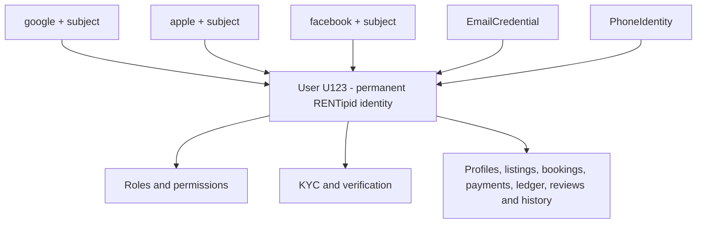
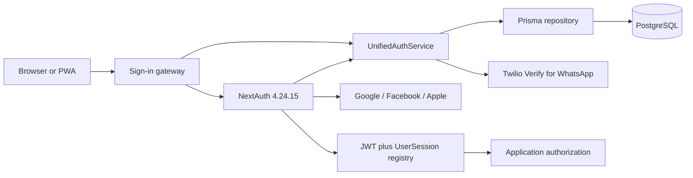
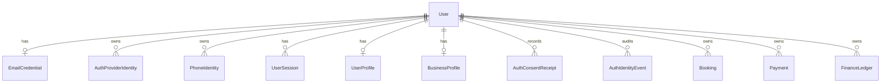
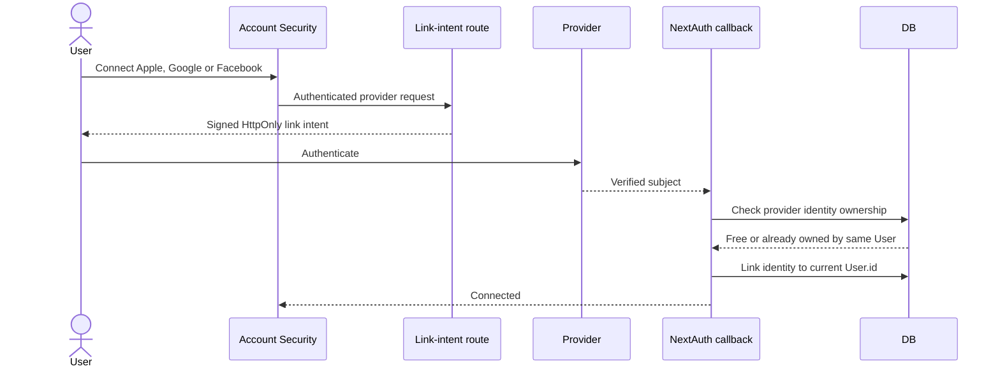
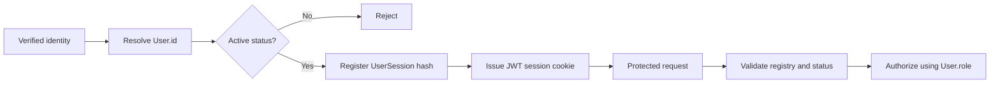
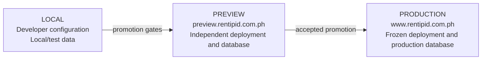

# RENTipid Unified Multi-Login Authentication Module

## Architecture Reference v1.1.0

**Document status:** CLOSED / VERSION FROZEN  
**Frozen tag:** `rentipid-unified-auth-v1.1.0-frozen`  
**Production runtime source:** `c0254631ea55030fd8e6c21ee73bc7a4563173ff`  
**Production deployment:** `dpl_G2mNn7DAEJh4FMerSBcVhfnauZse`  
**Prepared:** 2026-09-19  
**Audience:** application architects, developers, security reviewers, operations engineers and technical support leads

## Table of Contents

1. [Purpose and authority](#1-purpose-and-authority)
2. [Architectural invariant](#2-architectural-invariant)
3. [System context](#3-system-context)
4. [Identity data model](#4-identity-data-model)
5. [Resolution algorithms](#5-resolution-algorithms)
6. [Explicit linking architecture](#6-explicit-linking-architecture)
7. [Provider behavior](#7-provider-behavior)
8. [Session and authorization architecture](#8-session-and-authorization-architecture)
9. [Security boundaries](#9-security-boundaries)
10. [Environment topology](#10-environment-topology)
11. [Failure and recovery model](#11-failure-and-recovery-model)
12. [Traceability](#12-traceability)

## 1. Purpose and authority

This reference explains the implemented architecture of the frozen RENTipid Unified Multi-Login Authentication Module v1.1.0. It is descriptive, not a proposal. Where an older plan or checkpoint differs, the frozen source and the accepted release evidence control.

The release supports five public authentication methods:

| User-facing method | Framework/provider ID | Durable lookup material |
|---|---|---|
| Email and password | `credentials` | `EmailCredential.normalized_email` plus password verification |
| WhatsApp mobile OTP | `phone-otp` | `PhoneIdentity.phone_e164` after challenge verification |
| Google | `google` | `google` plus provider subject |
| Facebook | `facebook` | `facebook` plus provider subject |
| Apple | `apple` | `apple` plus provider subject |

The source still contains a retired SMS compatibility identifier. SMS is not displayed by the public v1.1.0 gateway and is not one of the five accepted login methods.

## 2. Architectural invariant

The permanent business identity is the RENTipid `User.id`. A provider is a proof mechanism, not an account owner and not an authorization authority.



The following rules are invariants of v1.1.0:

1. An OAuth identity is uniquely identified by `provider + provider_subject`.
2. An email address is metadata and a reconciliation signal. It is not a durable OAuth key.
3. Matching email addresses do not authorize a link.
4. `allowDangerousEmailAccountLinking` is not enabled.
5. A new provider that matches an existing account email produces `ACCOUNT_LINK_REQUIRED`; it does not silently merge or create a duplicate `User`.
6. A provider identity already owned by another user produces `IDENTITY_IN_USE` and is not reassigned.
7. Internal roles come from RENTipid's `User.role` and authorization policies. Provider claims never assign marketplace roles.
8. Linking or unlinking an identity does not transfer or recreate KYC, profiles, bookings, listings, payments, ledger records or business data. Those records remain related to the same `User.id`.

## 3. System context



### 3.1 Client and gateway

`src/app/login/page.tsx` obtains public method availability from `GET /api/auth/methods`. It offers enabled OAuth providers, a WhatsApp OTP flow and email/password entry. It validates callback URLs so external or malformed targets do not become open redirects.

### 3.2 Framework boundary

`src/lib/auth.ts` provides the NextAuth configuration. It registers the credential, phone and OAuth providers, configures callback behavior and converts successful authentication into a RENTipid session. The catch-all route is `src/app/api/auth/[...nextauth]/route.ts`.

### 3.3 Unified service boundary

`src/lib/auth/unified/services.ts` contains the core identity rules. `src/lib/auth/unified/repository.ts` presents persistence operations to that service. Provider callbacks therefore do not directly decide user ownership from email.

### 3.4 Persistence boundary

Prisma models and the migration `20260827090000_unified_multi_login_auth_v1_1` establish unique identity constraints. The default NextAuth `Account` model is not the authoritative identity mapping for this module. `AuthProviderIdentity` is.

## 4. Identity data model

### 4.1 Conceptual entity relationship diagram



### 4.2 `User`

`User` is the canonical account. Its primary key is referenced by identity records, profiles, business records, sessions, marketplace transactions and security evidence. It contains the authoritative `role` and `status` fields used after authentication.

New OAuth-only or phone-only users receive an internal synthetic email in the reserved `identity.rentipid.invalid` domain. That address is an implementation identifier and must not be shown as the user's contact address. Profile display logic prefers a real verified provider or credential email and otherwise shows a neutral fallback.

### 4.3 `AuthProviderIdentity`

Important fields are:

| Field | Meaning |
|---|---|
| `user_id` | Permanent RENTipid owner |
| `provider` | OAuth provider name such as `google`, `facebook` or `apple` |
| `provider_subject` | Provider-issued durable subject or account ID |
| `email` | Optional provider metadata |
| `email_verified` | Provider email-verification metadata |
| `is_private_email` | Apple private-relay indicator |
| `display_name`, `avatar_url` | Optional profile metadata |

The database enforces uniqueness on `(provider, provider_subject)`. This constraint supports collision prevention under concurrent requests as well as application-level checks.

### 4.4 `EmailCredential`

`EmailCredential` is a one-to-one credential record for a `User`. It stores a unique normalized email, a password hash and verification state. OAuth email metadata does not implicitly create an `EmailCredential` and cannot be used as a password identity without an explicit credential flow.

### 4.5 `PhoneIdentity` and verification challenges

`PhoneIdentity.phone_e164` is unique and links a verified mobile number to one user. `PhoneVerificationChallenge` records channel, provider challenge reference, state, attempt count, maximum attempts, send count, expiry and consumption. Raw OTP values are not persisted by the module.

### 4.6 Sessions and assurance

NextAuth uses a JWT session strategy. The token carries the RENTipid user ID, role, status and an opaque server session identifier. Only a hash of that opaque identifier is stored in `UserSession`. The registry enables expiration, revocation, listing of active sessions and logout of other sessions.

`MfaSessionAssurance` records time-bounded AAL2 assurance for operations that explicitly require recent strong authentication. It is separate from basic OAuth or OTP authentication; successful provider login does not automatically grant AAL2.

### 4.7 Consent and audit entities

`AuthConsentReceipt` records accepted terms and privacy versions. `AuthIdentityEvent` records identity lifecycle activity. `AuthenticationSecurityLog` records sanitized security events and derived references. These records must not contain passwords, OTP values, OAuth tokens, authorization codes, session cookies or provider secrets.

## 5. Resolution algorithms

### 5.1 Case 1: provider identity is already linked

```text
lookup(provider, providerSubject)
if found:
    load owning User
    deny if account status is inactive
    create or refresh the validated session
    continue as the same User.id
```

Provider email changes do not change ownership because lookup uses the subject. This is also why an Apple private-relay address can change without creating a new RENTipid account when the Apple subject remains the same.

### 5.2 Case 2: completely new person and identity

```text
validate provider profile and consent
lookup(provider, providerSubject) -> none
canonical-email check -> no existing User
create User under public onboarding rules
create AuthProviderIdentity
create consent evidence
create session
```

The default public role is `Renter` for OAuth and phone-created accounts. External provider data cannot request an operator, staff or administrator role.

### 5.3 Case 3: new provider with possible same-email account

```text
lookup(provider, providerSubject) -> none
canonical-email check -> existing User
record AUTH_ACCOUNT_LINK_REQUIRED
return ACCOUNT_LINK_REQUIRED
do not create a User
do not create the provider identity
```

The person must sign in with an existing connected method and use Account Security to connect the new provider. This provides proof of control over both sides of the relationship.

### 5.4 Case 4: identity belongs to another user

```text
authenticated User U123 requests link(provider, subject)
lookup(provider, subject) -> owned by U987
record AUTH_IDENTITY_LINK_BLOCKED with reason IDENTITY_IN_USE
deny the link
do not reassign identity
```

Support must investigate ownership; it must not manually move the identity based on an email match.

## 6. Explicit linking architecture

### 6.1 OAuth link intent

Account Security first calls `POST /api/auth/oauth/link-intent` while the user has an active session. The server creates a signed, provider-bound, user-bound, short-lived intent in an HttpOnly cookie. The OAuth callback consumes that intent and verifies that it still matches the authenticated user and selected provider.

The intent prevents an ordinary sign-in attempt from being treated as a link. It also narrows the action to the selected provider. The signing secret derives from `AUTH_REFERENCE_HASH_SECRET` or `NEXTAUTH_SECRET`; production must configure a secret and must not depend on development fallbacks.

### 6.2 Connect sequence



### 6.3 Unlink rules

The service counts viable methods before deletion. Removing a secondary method is allowed. Removing the final viable login method returns `LAST_SIGN_IN_METHOD`. The component exposes OAuth connect/disconnect controls for Google, Facebook and Apple. Generic link/unlink APIs for email and phone require an authenticated AAL2 session; the UI reviewed for this release does not expose every generic operation directly.

## 7. Provider behavior

### 7.1 Google

Google uses OpenID Connect scopes `openid email profile` and the `pkce`, `state` and `nonce` checks. The provider subject is durable. When issuer, audience, expiry or email-verification claims are present, the unified profile normalization validates them. A changed email does not change the linked RENTipid user.

### 7.2 Facebook

Facebook uses `state` protection. Its provider account ID is the durable subject. Email may be absent, so a valid Facebook identity can create or resolve an account without provider email metadata. An absent email is not an error and is not replaced with a guessed address.

### 7.3 Apple

Apple is configured as a web Services ID flow with `response_mode=form_post`, scopes `name email` and checks `pkce`, `state` and `nonce`. On HTTPS, transient state, PKCE verifier, nonce and callback URL cookies use `HttpOnly`, `Secure` and `SameSite=None` to survive Apple's cross-site POST callback. Session and CSRF cookies keep their stricter framework defaults rather than being broadly changed.

Apple may provide a private relay address. The module records `is_private_email` metadata but resolves the account by Apple subject. Apple often returns name only on the first authorization; the system must not depend on name being repeated.

### 7.4 WhatsApp OTP

The public provider ID is `phone-otp`; the actual channel is fixed to `whatsapp`. The service normalizes Philippine and international input to E.164, starts a Twilio Verify challenge, enforces persisted rate limits and verifies the challenge atomically. Default challenge expiry is five minutes and the default maximum is five verification attempts. A consumed challenge cannot be replayed.

### 7.5 Email and password

Email credentials use normalized email and a bcrypt hash. New credentials begin unverified. Verification links expire after 24 hours. Password-reset links expire after 30 minutes, are single-use, are stored only as hashes and revoke all active user sessions when a reset succeeds. Recovery and resend responses are intentionally generic. The accepted password schema is 8 to 128 characters with null bytes rejected; the release does not claim additional complexity rules.

## 8. Session and authorization architecture



Session maximum age is 30 days. The registry updates `last_seen_at` on a throttled basis and permits current-session logout, individual other-session revocation and logout of all other sessions. Password reset revokes all sessions. An inactive, suspended or deleted account is denied even if a provider login was otherwise valid.

Authentication and authorization are deliberately separate. Authentication answers which internal user controls the presented identity. Authorization answers whether that user may perform an application action. Only RENTipid data and policy answer the second question.

## 9. Security boundaries

| Boundary | Implemented control | Important limitation or operator duty |
|---|---|---|
| OAuth request/callback | State; PKCE and nonce for Google/Apple; signed consent and link intents | Provider callback URLs must exactly match each environment |
| Same-email account | `ACCOUNT_LINK_REQUIRED` and no auto-link | Support must never approve a merge from email similarity alone |
| Provider collision | Unique key plus `IDENTITY_IN_USE` | Escalate ownership disputes; do not reassign manually |
| OTP | Expiry, attempts, consumption, channel binding and rate limits | Delivery depends on Twilio Verify availability and configuration |
| Password | Bcrypt, verified credential, hashed one-time tokens | Production secret/email delivery configuration remains operational responsibility |
| Session | HttpOnly framework cookie, registry hash, expiry and revocation | Users should revoke unknown sessions and rotate credentials after suspected compromise |
| RBAC | Database `User.role`; account-status checks | Provider claims have no role authority |
| Audit | Sanitized metadata and HMAC-derived references | Never log raw secrets or raw tokens |

## 10. Environment topology



Preview and Production must not share live customer data. The post-freeze Preview isolation restoration records the current corrected separation. At documentation preparation time, both public environments returned `ready` with database `connected` and advertised provider IDs `credentials`, `phone-otp`, `google`, `facebook`, `apple`. Runtime availability does not authorize configuration changes or a new deployment.

## 11. Failure and recovery model

| Failure | System behavior | Safe recovery |
|---|---|---|
| Provider outage | That provider can fail independently while other enabled methods remain available | Use an already connected alternate method; monitor provider status |
| Same-email new provider | Block with `ACCOUNT_LINK_REQUIRED` | Sign in to the existing account, then connect from Account Security |
| Provider identity in use | Block with `IDENTITY_IN_USE` | Escalate; validate both users and audit evidence without moving data |
| Last-method disconnect | Block with `LAST_SIGN_IN_METHOD` | Connect and verify another method first |
| Missing Apple transient cookie | Callback fails rather than bypassing validation | Check HTTPS, callback domain, SameSite/Secure policy and proxy behavior |
| Expired or replayed OTP | Deny generic verification | Start a new WhatsApp challenge; do not reuse codes |
| Revoked session | Protected request returns to sign-in | Authenticate again and investigate the revocation if unexpected |
| Database unavailable | Health becomes not ready; auth operations fail closed | Restore database connectivity; do not bypass persistence checks |

## 12. Traceability

Primary implementation sources:

- `src/lib/auth.ts`
- `src/lib/auth/unified/config.ts`
- `src/lib/auth/unified/services.ts`
- `src/lib/auth/unified/repository.ts`
- `src/lib/auth/unified/oauth-consent.ts`
- `src/lib/auth/unified/oauth-link-intent.ts`
- `src/lib/auth/session-registry.ts`
- `src/app/api/account/connected-methods/route.ts`
- `src/components/profile/ConnectedLoginMethods.tsx`
- `prisma/schema.prisma`
- `prisma/migrations/20260827090000_unified_multi_login_auth_v1_1/migration.sql`

Release authority:

- `docs/releases/rentipid-unified-auth-production-2026-09-19/VERSION_FROZEN_MANIFEST.md`
- `docs/releases/rentipid-unified-auth-production-2026-09-19/UNIFIED_AUTH_CLOSURE_REPORT.md`
- `docs/releases/rentipid-unified-auth-production-2026-09-19/PRODUCTION_COMPLETION_REPORT.md`
- `docs/releases/rentipid-unified-auth-production-2026-09-19/OWNER_ACCEPTANCE_REPORT.md`
- `docs/releases/post-freeze-preview-isolation-2026-09-19/PREVIEW_ISOLATION_RESTORATION_REPORT.md`

The reusable Mermaid sources are in [`diagrams/`](diagrams/README.md).
