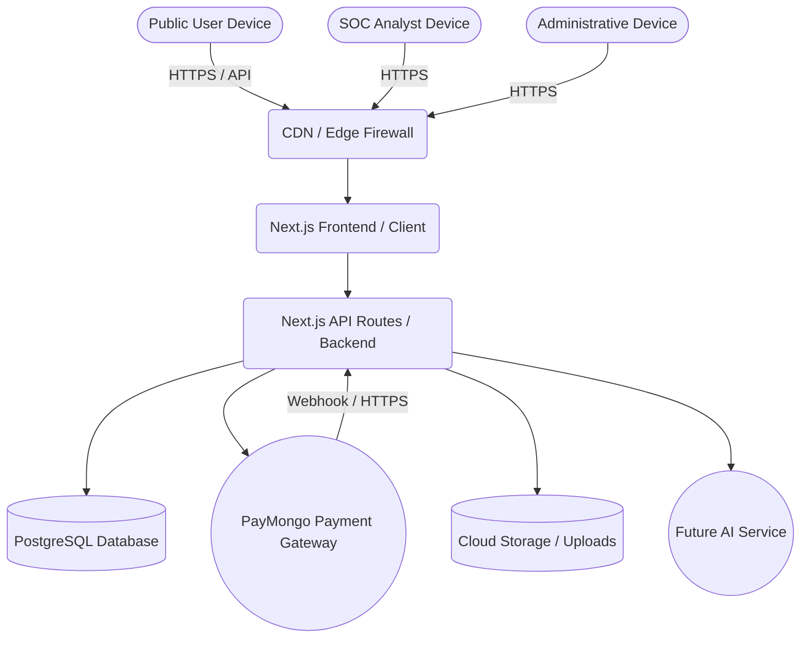
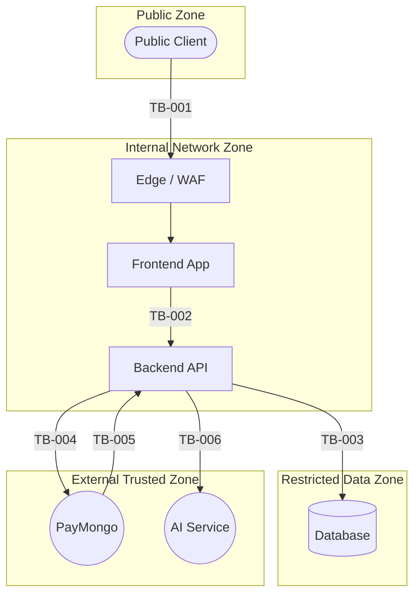

# RENTIPID SYSTEM CONTEXT AND TRUST BOUNDARIES

## 1. System Context Diagram

## 2. Trust Boundaries

### TB-001: Public Internet to Application Edge
- **Boundary ID:** TB-001
- **Source zone:** Public internet, Public user devices
- **Destination zone:** CDN or edge layer
- **Assets crossing:** User session requests, public listings
- **Identities involved:** Unauthenticated users, authenticated tenants/providers
- **Data classifications involved:** PUBLIC, INTERNAL, CONFIDENTIAL
- **Protocol or interaction type:** HTTPS
- **Authentication control:** Edge-level TLS termination
- **Authorization control:** WAF rules (planned)
- **Integrity control:** TLS
- **Confidentiality control:** TLS
- **Replay or idempotency control:** WAF rate limiting (planned)
- **Logging control:** Edge access logs
- **Failure behavior:** Drop connection
- **Existing evidence IDs:** N/A
- **Related gap IDs:** GAP-008
- **Related risk IDs:** RSK-016
- **Evidence classification:** NOT_EVIDENCED
- **Target Phase 5 control:** Phase 5H

### TB-002: Application Frontend to Backend API
- **Boundary ID:** TB-002
- **Source zone:** Frontend application
- **Destination zone:** Server-side application and API routes
- **Assets crossing:** User commands, SOC analytics, listing data
- **Identities involved:** Authenticated users, SOC_ANALYST, ADMIN
- **Data classifications involved:** CONFIDENTIAL, SECURITY_SENSITIVE, HIGHLY_CONFIDENTIAL
- **Protocol or interaction type:** HTTPS / REST API
- **Authentication control:** NextAuth session cookie validation
- **Authorization control:** Proxy route restrictions, `requireSecurityPermission` checks
- **Integrity control:** Payload validation via Zod
- **Confidentiality control:** TLS
- **Replay or idempotency control:** Execution engine idempotency checks
- **Logging control:** Next.js API route logging, Security Event logs
- **Failure behavior:** 401 Unauthorized, 403 Forbidden
- **Existing evidence IDs:** EV-001, EV-002, EV-003, EV-009
- **Related gap IDs:** N/A
- **Related risk IDs:** RSK-001, RSK-002, RSK-003
- **Evidence classification:** VERIFIED_IMPLEMENTATION
- **Target Phase 5 control:** Phase 5D, 5E

### TB-003: Backend API to Database
- **Boundary ID:** TB-003
- **Source zone:** Server-side application
- **Destination zone:** Database boundary
- **Assets crossing:** Persistent state, PII, financial ledgers, audit logs
- **Identities involved:** Application Service Account
- **Data classifications involved:** CONFIDENTIAL, HIGHLY_CONFIDENTIAL, RESTRICTED_IDENTITY, SECURITY_SENSITIVE
- **Protocol or interaction type:** TCP / PostgreSQL protocol
- **Authentication control:** Database credentials
- **Authorization control:** Database user permissions
- **Integrity control:** ORM constraints
- **Confidentiality control:** TLS in transit; Data at rest encryption missing
- **Replay or idempotency control:** Database unique constraints
- **Logging control:** Database audit logs (planned)
- **Failure behavior:** Query failure, transaction rollback
- **Existing evidence IDs:** EV-012
- **Related gap IDs:** GAP-006
- **Related risk IDs:** RSK-009
- **Evidence classification:** VERIFIED_IMPLEMENTATION
- **Target Phase 5 control:** Phase 5F

### TB-004: Backend API to Payment Gateway (PayMongo)
- **Boundary ID:** TB-004
- **Source zone:** Server-side application
- **Destination zone:** Payment-gateway boundary
- **Assets crossing:** Payment initiation, escrow funding
- **Identities involved:** System Service Account
- **Data classifications involved:** RESTRICTED_FINANCIAL
- **Protocol or interaction type:** HTTPS / REST
- **Authentication control:** API Keys
- **Authorization control:** Gateway scoping
- **Integrity control:** TLS
- **Confidentiality control:** TLS
- **Replay or idempotency control:** Request idempotency keys
- **Logging control:** Payment Action logs
- **Failure behavior:** Payment failure
- **Existing evidence IDs:** EV-010
- **Related gap IDs:** GAP-007
- **Related risk IDs:** RSK-006, RSK-007, RSK-008
- **Evidence classification:** NOT_EVIDENCED
- **Target Phase 5 control:** Phase 5G

### TB-005: Payment Gateway Webhook to Backend API
- **Boundary ID:** TB-005
- **Source zone:** Payment-gateway boundary
- **Destination zone:** Server-side application
- **Assets crossing:** Payment status updates
- **Identities involved:** PayMongo System
- **Data classifications involved:** RESTRICTED_FINANCIAL
- **Protocol or interaction type:** HTTPS Webhook
- **Authentication control:** Webhook signature verification
- **Authorization control:** Webhook signature validation
- **Integrity control:** Signature validation
- **Confidentiality control:** TLS
- **Replay or idempotency control:** Webhook event ID idempotency
- **Logging control:** Webhook logs
- **Failure behavior:** 400 Bad Request
- **Existing evidence IDs:** EV-010
- **Related gap IDs:** GAP-007
- **Related risk IDs:** RSK-006
- **Evidence classification:** NOT_EVIDENCED
- **Target Phase 5 control:** Phase 5G

### TB-006: Backend API to External AI Service
- **Boundary ID:** TB-006
- **Source zone:** Server-side application
- **Destination zone:** AI-service boundary
- **Assets crossing:** Prompts, application context
- **Identities involved:** Application Service Account
- **Data classifications involved:** CONFIDENTIAL
- **Protocol or interaction type:** HTTPS / API
- **Authentication control:** API Keys
- **Authorization control:** Vendor policy
- **Integrity control:** TLS
- **Confidentiality control:** TLS
- **Replay or idempotency control:** None
- **Logging control:** AI usage logs
- **Failure behavior:** Fallback to standard application logic
- **Existing evidence IDs:** N/A
- **Related gap IDs:** GAP-009
- **Related risk IDs:** RSK-026, RSK-027, RSK-028
- **Evidence classification:** NOT_EVIDENCED
- **Target Phase 5 control:** Phase 5K

### TB-007: Application to Authentication/Session System
- **Boundary ID:** TB-007
- **Source zone:** Server-side application
- **Destination zone:** Authentication subsystem
- **Assets crossing:** Session tokens
- **Identities involved:** User
- **Data classifications involved:** CREDENTIAL_OR_SECRET
- **Protocol or interaction type:** Internal memory / API
- **Authentication control:** NextAuth internal
- **Authorization control:** Session validity
- **Integrity control:** Signed token
- **Confidentiality control:** NOT_EVIDENCED
- **Replay or idempotency control:** Token expiry
- **Logging control:** Auth logs
- **Failure behavior:** Deny access
- **Existing evidence IDs:** EV-001
- **Related gap IDs:** N/A
- **Related risk IDs:** RSK-003
- **Evidence classification:** VERIFIED_IMPLEMENTATION
- **Target Phase 5 control:** Phase 5D

### TB-008: Application to File Storage
- **Boundary ID:** TB-008
- **Source zone:** Server-side application
- **Destination zone:** File-storage boundary
- **Assets crossing:** KYC docs, images
- **Identities involved:** System Service Account
- **Data classifications involved:** RESTRICTED_IDENTITY
- **Protocol or interaction type:** HTTPS API
- **Authentication control:** NOT_EVIDENCED
- **Authorization control:** NOT_EVIDENCED
- **Integrity control:** NOT_EVIDENCED
- **Confidentiality control:** NOT_EVIDENCED
- **Replay or idempotency control:** NOT_EVIDENCED
- **Logging control:** NOT_EVIDENCED
- **Failure behavior:** NOT_EVIDENCED
- **Existing evidence IDs:** N/A
- **Related gap IDs:** GAP-008
- **Related risk IDs:** RSK-010
- **Evidence classification:** NOT_EVIDENCED
- **Target Phase 5 control:** Phase 5E

### TB-009: Application to Notification/Email Service
- **Boundary ID:** TB-009
- **Source zone:** Server-side application
- **Destination zone:** Email provider boundary
- **Assets crossing:** Transactional emails, auth links
- **Identities involved:** System Service Account
- **Data classifications involved:** CONFIDENTIAL
- **Protocol or interaction type:** HTTPS API
- **Authentication control:** PLANNED_ARCHITECTURE
- **Authorization control:** PLANNED_ARCHITECTURE
- **Integrity control:** PLANNED_ARCHITECTURE
- **Confidentiality control:** PLANNED_ARCHITECTURE
- **Replay or idempotency control:** PLANNED_ARCHITECTURE
- **Logging control:** PLANNED_ARCHITECTURE
- **Failure behavior:** PLANNED_ARCHITECTURE
- **Existing evidence IDs:** N/A
- **Related gap IDs:** N/A
- **Related risk IDs:** RSK-030
- **Evidence classification:** PLANNED_ARCHITECTURE
- **Target Phase 5 control:** Phase 5M

### TB-010: Application to Audit/SOC Processing
- **Boundary ID:** TB-010
- **Source zone:** Server-side application
- **Destination zone:** SOC Logging boundary
- **Assets crossing:** Security events
- **Identities involved:** System
- **Data classifications involved:** SECURITY_SENSITIVE
- **Protocol or interaction type:** Internal DB writes
- **Authentication control:** DB connection
- **Authorization control:** DB roles
- **Integrity control:** Database persistence
- **Confidentiality control:** NOT_EVIDENCED
- **Replay or idempotency control:** NOT_EVIDENCED
- **Logging control:** Database persistence
- **Failure behavior:** Application error
- **Existing evidence IDs:** EV-003
- **Related gap IDs:** N/A
- **Related risk IDs:** RSK-020
- **Evidence classification:** VERIFIED_IMPLEMENTATION
- **Target Phase 5 control:** Phase 5J

### TB-011: Source Control/CI to Deployment Environment
- **Boundary ID:** TB-011
- **Source zone:** Source-control and CI/CD boundary
- **Destination zone:** Production Cloud-management
- **Assets crossing:** Code, build artifacts
- **Identities involved:** CI/CD Service Account
- **Data classifications involved:** INTERNAL
- **Protocol or interaction type:** HTTPS API
- **Authentication control:** NOT_EVIDENCED
- **Authorization control:** NOT_EVIDENCED
- **Integrity control:** NOT_EVIDENCED
- **Confidentiality control:** NOT_EVIDENCED
- **Replay or idempotency control:** NOT_EVIDENCED
- **Logging control:** NOT_EVIDENCED
- **Failure behavior:** NOT_EVIDENCED
- **Existing evidence IDs:** N/A
- **Related gap IDs:** N/A
- **Related risk IDs:** RSK-013, RSK-014
- **Evidence classification:** NOT_EVIDENCED
- **Target Phase 5 control:** Phase 5I

### TB-012: Local Development to Isolated Local Test Database
- **Boundary ID:** TB-012
- **Source zone:** Local-development boundary
- **Destination zone:** Isolated local-test boundary
- **Assets crossing:** Test data, mock events
- **Identities involved:** Local dev account
- **Data classifications involved:** INTERNAL
- **Protocol or interaction type:** TCP/PG
- **Authentication control:** Authenticated PostgreSQL connection using a dedicated local test identity
- **Authorization control:** Dedicated least-privileged local database role and mutation guard
- **Integrity control:** Database constraints, transaction behavior and mutation guard
- **Confidentiality control:** Credentials must remain protected and test data must exclude production personal or payment data
- **Replay or idempotency control:** NOT_EVIDENCED
- **Logging control:** Local application logging
- **Failure behavior:** Mutation guard fails closed when the target is not the approved localhost database
- **Network restriction:** Localhost-only network restriction
- **Data-use restriction:** No production-data use
- **Database-name restriction:** Isolated test database name
- **Transport-protection status:** NOT_EVIDENCED
- **Evidence basis:** EV-004, EV-005, EV-006, EV-007
- **Evidence limitation:** Testing logic limits
- **Existing evidence IDs:** EV-004, EV-005, EV-006, EV-007
- **Related gap IDs:** N/A
- **Related risk IDs:** N/A
- **Evidence classification:** VERIFIED_IMPLEMENTATION
- **Target Phase 5 control:** Phase 5D

### TB-013: Cloud-Management to Production Administration
- **Boundary ID:** TB-013
- **Source zone:** Administrative devices
- **Destination zone:** Cloud-management boundary
- **Assets crossing:** IAM policies, DB admin commands
- **Identities involved:** DevOps Admin
- **Data classifications involved:** SECURITY_SENSITIVE, HIGHLY_CONFIDENTIAL
- **Protocol or interaction type:** HTTPS Console
- **Authentication control:** EXTERNAL_VALIDATION_REQUIRED
- **Authorization control:** EXTERNAL_VALIDATION_REQUIRED
- **Integrity control:** EXTERNAL_VALIDATION_REQUIRED
- **Confidentiality control:** EXTERNAL_VALIDATION_REQUIRED
- **Replay or idempotency control:** EXTERNAL_VALIDATION_REQUIRED
- **Logging control:** EXTERNAL_VALIDATION_REQUIRED
- **Failure behavior:** EXTERNAL_VALIDATION_REQUIRED
- **Existing evidence IDs:** N/A
- **Related gap IDs:** GAP-008
- **Related risk IDs:** RSK-001, RSK-016
- **Evidence classification:** EXTERNAL_VALIDATION_REQUIRED
- **Target Phase 5 control:** Phase 5H

## 3. Trust Boundary Diagram

