# RENTipid Complete System Documentation

## Document Control

| Field | Value |
| --- | --- |
| Document | Complete, systematic, comprehensive RENTipid system documentation |
| Edition | 2.0 — current repository reconciliation edition |
| Generated | 13 August 2026 |
| Repository | RENTipid |
| Branch | `feature/soc-phase4-threat-response` |
| Inspected HEAD | `88565b721d0a4e404fd6a3c6ab7d3146a394665b` |
| Worktree | DIRTY — 78 reported status entries; pre-existing and generated changes preserved |
| Architecture direction | Vercel frontend with Azure backend/services; partially split implementation |
| External verification | Not performed; cloud, production database, DNS, payment, insurer, KYC, AI, and media-provider state not inferred |
| Payment activation | NOT AUTHORIZED; Phase 19 remains COMPLETE/NO-GO/FROZEN |
| Database production migration | Pending separate Owner decision |
| Classification | RENTipid internal engineering, product, operations, security, privacy, and training reference |

## Purpose and Audience

This volume documents the complete RENTipid platform: product scope, actors, user journeys, modules, screens, APIs, services, database, integrations, configuration, security, privacy, SOC, AI, insurance, deployment, operations, recovery, testing, governance, training, limitations, and handover. It is intended for the Owner, product and engineering teams, renters, providers, administrators, finance, compliance, SOC, privacy personnel, operators, testers, and future maintainers.

The document consolidates previously frozen manuals and registers but does not promote historical plans, local definitions, route shells, mocks, readiness screens, or infrastructure-as-code into proof of a live production service. Current code is authoritative for implementation; accepted closure records are authoritative for historical status; explicitly reserved Owner decisions remain reserved.

## How This Edition Is Organized

1. Current-state executive reconciliation and system map.
2. The complete 248-chapter master manual.
3. Role-specific user, operator, technical, security, developer, phase, and training manuals.
4. Full current AI/Digital Human and Insurance module documentation.
5. Privacy and profile-management controlled supplements.
6. Complete working registers and direct current inventories.
7. Twenty-five architecture and workflow diagrams.
8. Source, validation, limitations, and handover guidance.

# Volume I — Current-State Executive Reconciliation

## Current Implementation Baseline

| Metric | Current count |
| --- | ---: |
| Next.js page routes | 181 |
| Root Next.js API route handlers | 85 |
| Azure API route source files | 6 |
| Prisma models | 116 |
| Prisma enums | 29 |
| Prisma migration directories | 43 |
| Test/spec files under `tests` | 194 |
| Source components | 48 |
| Source library files | 186 |
| Next.js | `16.2.12` |
| React | `19.2.4` |
| Prisma client | `^6.19.3` |

## System Mission

RENTipid is a multi-role rental marketplace that coordinates discovery, provider onboarding, listings, availability, booking, agreements, turnover, inspection, payments, deposits, finance records, claims, disputes, insurance foundations, reviews, notifications, marketing, privacy, autonomous support, administration, and a security operations center. The system emphasizes ownership, state-machine integrity, evidence, separation of duties, deterministic financial and policy boundaries, reversible security response, and controlled release governance.

## Principal Actors

| Actor | Primary scope | Prohibited inference |
| --- | --- | --- |
| Guest | Public discovery, guidance, legal/privacy, registration/login | No private or administrative authority |
| Renter | Own profile, bookings, agreements, inspections, claims, receipts, reviews | No provider/admin/finance/SOC mutation |
| Individual Provider | Own listings, bookings, turnover, claims, ledger/payout views | No publication/compliance/finance override |
| Business Provider | Business-scoped marketplace and marketing workflows | No inherited admin authority |
| Admin | Categories, bookings, disputes, support, UAT, marketing, AI settings/logs | No automatic finance/compliance/SOC-supervisor authority |
| Finance Admin | Payments, reconciliation, refunds, deposits, payouts, settlement evidence | No live-money activation outside approved gate |
| Compliance Admin | KYC, documents, listing compliance, policy evidence | Minimum necessary access only |
| SOC Analyst | Event/alert triage, cases, evidence, response requests | Cannot self-approve or exceed grants |
| SOC Supervisor | Approval, grants, execution/rollback oversight | Separation of duties remains mandatory |
| Super Admin | Broad platform controls and visibility | Cannot bypass dual control, NO-GO, privacy, or reserved Owner decisions |

## Architecture and Runtime Truth

The accepted target is a Next.js/Vercel frontend with extracted Azure API and worker services, PostgreSQL/Prisma, Blob Storage, Key Vault/managed identity, Application Insights, Azure AI Search/OpenAI where activated, and provider-neutral external adapters. The repository remains partially split: root App Router APIs coexist with `apps/api` and `apps/worker`. Each handler must be classified before change or retirement.

No local artifact proves that Azure resources are provisioned, migrations are applied to production, DNS/traffic has cut over, or external provider accounts are active. Terraform describes desired state only.

## Material Changes Since Master Manual 1.1

| Area | Older July manual state | Current reconciliation |
| --- | --- | --- |
| Repository baseline | HEAD `5804d4c...`, 31 July 2026 | HEAD `88565b721d0a4e404fd6a3c6ab7d3146a394665b`, 13 August 2026 |
| Profile management | Read-only with edit limitation | A later profile/admin-profile program records phases 0–15 completed, accepted, closed, and frozen; field governance and APIs/UI exist. |
| Privacy | General privacy workflows | Privacy Module v1 records 22 mandatory controls proven, 10 approved deferrals, 34 out of scope, manual retention, production automated deletion disabled, DPO registration pending, and no deployment. |
| Insurance | General model direction | TRU-01 is a provider-neutral technical foundation closed/frozen/safely shelved; live insurer, issuance, claims, money movement, and production activation remain disabled. |
| AI/Digital Human | High-level boundaries | A detailed v1 foundation and closure record exists, but current frontend chat route returns 410, inference/media paths are mock/simulated, real provider is pending, and important shared-core files are untracked. |
| Database | 79 models in older registry | Current schema contains 116 models and 29 enums across 43 migrations. |
| Routes/tests | 163 pages / 142 test files in older registry | Current direct inventory finds 181 pages, 85 root API handlers, and 194 test/spec files. Counts are inventory facts, not pass status. |

## Non-Negotiable Current Boundaries

- Live payment activation remains prohibited unless a new exact authorization changes Phase 19's NO-GO freeze.
- Production migration, deployment, traffic, and DNS actions require separate authority and external evidence.
- Insurance is a non-live shelved foundation; no policy promise, premium, insurer, or coverage is live.
- Digital Human is not a live media provider in the inspected workspace.
- Automated privacy retention/deletion is deferred; the approved v1 process is manual and governed.
- A route, model, tool, Terraform resource, test file, or historical PASS is not by itself proof of live end-to-end operation.
- The working tree is dirty. Existing changes belong to their authors and are not silently absorbed into a release.

## Major Module Map

| Domain | Core capability |
| --- | --- |
| Foundation | Next.js shell, TypeScript, design system, environment/configuration, health, logging |
| Identity | Registration, login, sessions, MFA/password recovery, profiles, roles, addresses |
| Provider and KYC | Individual/business onboarding, documents, verification, activation |
| Marketplace | Categories, listings, media, prohibited items, search, discovery, availability |
| Rental | Booking, pricing, agreements, turnover, return, cancellation, history |
| Money | Checkout, provider gateway events, webhook integrity, ledger, deposits, refunds, payouts, reconciliation |
| Trust | Insurance foundation, inspection evidence, claims, disputes, reviews/reputation |
| Communication | Notifications, support tickets, feedback/issues, AI Help and Digital Human foundation |
| Marketing | Campaigns, posts, provider opt-in, promotion assets, social connections |
| Administration | Admin, Finance, Compliance, Super Admin, UAT/beta/readiness controls |
| Security/SOC | Events, detection, alerts, cases, evidence, playbooks, approvals, response, rollback, simulation, intelligence |
| Privacy | Public notices, consent/cookies, DSR, deletion requests, processor/cross-border records, retention governance |
| Mobile | PWA/responsive foundation and Capacitor packaging direction |
| Delivery | Vercel/Azure topology, IaC, CI/CD, migration controls, monitoring, backup/recovery, freeze governance |

## End-to-End Journey Map

The intended renter journey is registration → profile/KYC → discovery → booking → payment gate → agreement → handover/inspection → rental → return → review, with claim/dispute/insurance branches. The provider journey is registration → business/profile/KYC → listing → compliance/publication → booking fulfillment → turnover/return → earnings/payout evidence. Administrative, finance, compliance, privacy, AI-support, and SOC processes surround these journeys and must not bypass domain ownership or state authority.


<!-- pagebreak -->

# Volume II — Complete Master Manual (248 Chapters)

> Historical consolidated manual 1.1. Its July 2026 counts and limitations are preserved as evidence; Volume I supplies the current reconciliation.

Source: `docs/final-documentation/01-MASTER-MANUAL/RENTipid_COMPLETE_MASTER_MANUAL.md`

## RENTipid Complete Master Manual

Version: `1.1`  
Confidentiality: `RENTipid Internal`  
Repository: `C:\Users\user\Documents\JD SOFTWARE PROJECTS\RENTipid`  
Branch: `feature/soc-phase4-threat-response`  
Inspected HEAD: `5804d4cceafc74e5e51b554be6f84a1b9c80e8be`  
Generation date: `2026-07-31`  

### How to Use This Manual

This manual consolidates the 18 frozen registries and ten preliminary manuals.
Each chapter states the supported behavior or governance boundary and points to
the applicable evidence family. Current code establishes implementation;
accepted closure/freeze records establish phase status; external state is
never inferred from local definitions.

### Part I — Document Foundation and Product Context

#### Chapter 1 — Manual Purpose and Scope

This manual supports Owner review, training, operations, engineering,
governance, and handover for every approved RENTipid module and phase. It
documents implemented, frozen, planned, limited, NO-GO, transitional, and
separately governed states without converting one status into another.
Evidence: document-control, module, phase, terminology, and gap registries.

#### Chapter 2 — Product Identity and Business Mission

RENTipid is a role-based rental marketplace connecting renters with individual
and business providers while supporting trust, finance, compliance, support,
privacy, and security operations. Its business goal is a reviewable rental
lifecycle rather than an uncontrolled listing or payment channel. Evidence:
module and route registries.

#### Chapter 3 — Documentation Audiences

Audiences are guests, renters, providers, business providers, Admin, Finance
Admin, Compliance Admin, SOC Analyst, SOC Supervisor, Super Admin, support,
developers, reviewers, and the Owner. Each audience follows its role-specific
manual; server authorization remains authoritative. Evidence: role and
documentation-traceability registries.

#### Chapter 4 — Source-Authority Hierarchy

Current implementation and data contracts outrank manuals and plans; final
accepted/frozen governance controls phase status. Historical sources remain
traceable when superseded. Conflicts are recorded rather than silently erased.
Evidence: source-authority/conflict register.

#### Chapter 5 — Completion Premise

`VERIFIED_WITH_STATUS_CLASSIFICATION` means every approved module and phase can
be documented honestly. Optional, placeholder, deferred, disabled, NO-GO, and
not-provisioned work may remain. Only an absent exact accepted requirement is
a premise blocker. Evidence: SOC placeholder reconciliation.

#### Chapter 6 — Status Vocabulary

Route, capability, operational, and evidence statuses are separate dimensions.
Examples include `NAVIGATION_SHELL_ONLY`, `COMPLETE_AND_FROZEN`,
`PARTIALLY_SPLIT_IMPLEMENTATION`, and `EXTERNAL_STATE_NOT_VERIFIED`. Never infer
completion from a route, permission, model, test file, or Terraform resource.

#### Chapter 7 — Authoritative Architecture Direction

The accepted direction is
`VERCEL_FRONTEND_WITH_AZURE_BACKEND_AND_SERVICES`: Vercel hosts the frontend
and authentication direction while Azure is the backend/services direction.
This is architecture authority, not evidence of provisioning or cutover.
Evidence: deployment/integration registries and Phase 19B status.

#### Chapter 8 — Current Runtime Transition State

The repository state is `PARTIALLY_SPLIT_IMPLEMENTATION`. Root Next.js APIs
coexist with `apps/api` and `apps/worker` targets; individual handlers must be
classified as authoritative, compatibility/proxy, or target implementations
before change. Evidence: API, module, and deployment registries.

#### Chapter 9 — External-State Boundary

Local code, domains, configuration names, Terraform, and readiness screens do
not prove current cloud resources, production health, database contents,
provider accounts, monitoring, traffic, or DNS. External verification requires
a separate authorized operation. No external system was accessed here.

#### Chapter 10 — Separately Governed Decisions

Database migration is `PENDING_SEPARATE_OWNER_DECISION`; payment activation is
`NOT_AUTHORIZED`. Azure provisioning/deployment, traffic migration, DNS
cutover, and production data actions are not authorized by documentation.
Evidence: document control and phase/freeze register.

### Part II — Roles, Access, and Responsibility

#### Chapter 11 — Role Model Overview

RENTipid separates public, marketplace, operational, finance, compliance, SOC,
and super-admin responsibilities. Server-side session, role, permission,
ownership, and state checks are the access boundary; navigation visibility is
only presentation. Evidence: role/permission and security-control registries.

#### Chapter 12 — Guest Responsibilities

Guests may use public discovery, guidance, safety, legal, support, login, and
registration surfaces. They have no privileged dashboard, private marketplace,
finance, compliance, or SOC authority. Public inputs remain validated and
rate/security controls apply.

#### Chapter 13 — Renter Responsibilities

Renters operate within their own booking, agreement, inspection, claim,
refund-request, receipt, and review scope. They cannot mutate provider,
finance, compliance, or SOC records. Ownership and booking state govern each
action. Evidence: renter routes and booking services.

#### Chapter 14 — Individual Provider Responsibilities

Individual providers manage their listings, booking fulfillment, turnover,
return inspection, claims, ledger views, promotion opt-in, and payout views.
Publication, compliance decisions, and money movement remain separately
controlled. Evidence: provider route and workflow registries.

#### Chapter 15 — Business Provider Responsibilities

Business providers use business-scoped listing and marketing surfaces while
remaining subject to organization verification and record ownership. Business
status does not grant Admin, Finance, Compliance, or SOC rights. Evidence:
role, route, and data registries.

#### Chapter 16 — Admin Responsibilities

Admin manages allowed categories, bookings, disputes, support, feedback,
issues, beta/UAT, marketing, AI settings/logs, and operational dashboards.
General Admin does not implicitly inherit finance, compliance, or SOC
supervisor authority. Every mutation requires audit context.

#### Chapter 17 — Finance Admin Responsibilities

Finance Admin reviews payment, webhook, gateway, reconciliation, ledger,
deposit, refund, payout, batch, and settlement evidence. The role does not
override Phase 19 NO-GO or permit unapproved live transfers. Evidence:
finance routes, payment services, and workflow registry.

#### Chapter 18 — Compliance Admin Responsibilities

Compliance Admin reviews KYC, verification documents, listing requirements,
and applicable policy evidence using minimum-necessary access. The role does
not automatically approve financial or security-response actions. Evidence:
verification routes, models, and role registry.

#### Chapter 19 — SOC Analyst Responsibilities

SOC Analysts investigate authorized events/alerts, manage cases and evidence,
draft playbooks, and request bounded responses. They cannot approve their own
request, execute/rollback outside assigned permissions, administer roles, or
make finance/compliance decisions. Evidence: Phase 4 RBAC tests.

#### Chapter 20 — SOC Supervisor and Super Admin Responsibilities

SOC Supervisors review cases, playbooks, grants, execution, and rollback while
preserving separation of duties. Super Admin has broad platform visibility but
cannot bypass accepted dual-control constraints, live-payment NO-GO, or
separately governed infrastructure/database decisions.

### Part III — Identity, Profiles, KYC, and Account Lifecycle

#### Chapter 21 — Registration Workflow

Registration validates supported user input and creates only permitted
non-privileged account types. Public users cannot self-select operational or
administrative roles. Failures return sanitized feedback without credential or
internal-detail leakage. Evidence: auth registration route and service.

#### Chapter 22 — Authentication Workflow

NextAuth and root authentication services establish the session used by pages
and APIs. Authentication success does not itself authorize a business action;
role, ownership, permission, and state checks follow. Authentication telemetry
must remain privacy-safe.

#### Chapter 23 — Session and Route Protection

Protected pages and APIs validate the server session and redirect or reject
unauthorized users. Proxy, page, route, and service checks must agree. Hidden
links and client-side conditions are not security controls. Evidence: auth,
proxy, and authorization tests.

#### Chapter 24 — Privileged Role Assignment

Admin, Finance Admin, Compliance Admin, SOC roles, and Super Admin require a
controlled administrative process outside public registration. Assignment
must preserve least privilege, review, and audit evidence; documentation never
grants runtime authority.

#### Chapter 25 — User Profile Read Surface

Authenticated users can view profile information within their account scope.
The current profile-edit control is marked coming soon, so the route is
`IMPLEMENTED_READ_ONLY_WITH_EDIT_LIMITATION`. Privacy correction is a separate
controlled workflow. Evidence: route and gap registries.

#### Chapter 26 — Business Profile

Business-provider identity is represented separately from the individual user
record and supports business-scoped operations. Verification and ownership
must be established before business actions; model presence alone does not
prove a verified organization.

#### Chapter 27 — KYC Submission

KYC routes allow an authenticated subject to provide required verification
evidence under upload, access, and privacy controls. Users should submit only
required data. Storage/provider availability is environment-dependent and is
not inferred from the route.

#### Chapter 28 — Verification Document Review

Authorized compliance/admin services review verification documents and record
decisions without exposing raw content broadly. File type, MIME/content,
ownership, size, and permission controls apply. Audit evidence should use
sanitized identifiers rather than document contents.

#### Chapter 29 — Privacy Requests

Consent, correction, export, and deletion endpoints form authorized privacy
workflows. Identity, subject scope, retention, and audit requirements apply;
requests must not expose unrelated records. Evidence: `/api/privacy/*` and
privacy services.

#### Chapter 30 — Account Deletion

Account deletion is a controlled request lifecycle, not an immediate
unreviewed database delete. It must account for identity, retention, legal or
transaction obligations, auditability, and safe completion/error reporting.
Evidence: account-deletion page/model and privacy services.

### Part IV — Public Marketplace and Discovery

#### Chapter 31 — Public Landing Experience

The root route introduces RENTipid and directs visitors toward discovery,
guidance, authentication, and support. It is a public presentation surface and
does not establish availability, verification, payment activation, or external
provider state.

#### Chapter 32 — Browse Experience

`/browse` exposes marketplace discovery subject to current listing state and
server queries. Users should treat displayed results as discovery data, not a
guarantee of future availability or transaction authorization.

#### Chapter 33 — Search and Filter Behavior

Search/filter inputs narrow visible listings and must be validated and safely
encoded. Filters do not bypass publication, verification, ownership, or
availability rules. Exact query behavior is governed by current listing
services.

#### Chapter 34 — Listing Detail

`/listing/[id]` presents an individual listing and its permitted public data.
The dynamic identifier must resolve to an accessible listing; restricted,
unpublished, or absent records must fail safely without leaking private
provider information.

#### Chapter 35 — Categories and Requirements

Categories and category requirements organize marketplace inventory and may
drive listing evidence expectations. Authorized administrators control them;
providers consume the current requirements during listing preparation.
Evidence: Category and CategoryRequirement models and admin routes.

#### Chapter 36 — Availability and Pricing Presentation

Displayed availability and pricing are inputs to the guarded booking/checkout
workflow, not an irrevocable promise. The server revalidates record state,
dates, amounts, and conflicts before accepting a permitted transaction.

#### Chapter 37 — Safety Guidance

Public safety guidance supports careful item, identity, handover, inspection,
and dispute behavior. It complements but does not replace server controls,
verification, evidence capture, or support escalation.

#### Chapter 38 — Prohibited Items

The prohibited-items surface states marketplace policy boundaries. Providers
remain responsible for compliant listings, and authorized review may prevent
publication or require action. A listing route does not override policy.

#### Chapter 39 — Help, Contact, and Support Entry

Help, contact, feedback, and support routes direct users to controlled
assistance. Reports should include safe identifiers and reproducible facts,
not passwords, tokens, raw KYC records, or payment credentials.

#### Chapter 40 — Legal and Privacy Notices

Terms, privacy, and related public pages communicate the applicable user-facing
policy. Technical documentation does not replace legal review. Policy changes
must follow document ownership, acceptance, and implementation alignment.

### Part V — Provider Catalog and Listing Lifecycle

#### Chapter 41 — Provider Onboarding

Provider onboarding and checklist routes guide account, profile, verification,
and readiness tasks. Completion labels summarize evidence; server state and
required review remain authoritative. Business and individual scope must not
be mixed.

#### Chapter 42 — Listing Creation

Providers create listings within their own scope using validated catalog,
description, pricing, and policy fields. Creation does not equal publication;
the listing enters the service-defined lifecycle and may require evidence or
review.

#### Chapter 43 — Listing Photos

Photo upload routes associate authorized media with a provider-owned listing.
Upload controls cover size, extension/MIME/content, ownership, and safe storage
behavior. Public access depends on listing and media state.

#### Chapter 44 — Listing Documents

Listing documents support category, compliance, or verification requirements
and are more restricted than public listing content. Authorization, upload
validation, storage safety, and review evidence apply.

#### Chapter 45 — Category Requirement Fulfillment

Providers match current category requirements before submission. Missing or
invalid evidence prevents a compliant transition. Administrators must change
requirements through authorized configuration rather than editing provider
records directly.

#### Chapter 46 — Listing Edit and Ownership

Only the owning provider or explicitly authorized operator may alter a
listing, and only in service-allowed states. Edits must preserve validation,
publication/review invariants, related media, and audit behavior.

#### Chapter 47 — Listing Submission

Submission moves a prepared listing toward review/publication under exact
service guards. The API must revalidate completeness and ownership. A submit
button cannot create a state transition the server rejects.

#### Chapter 48 — Listing Verification and Publication

Authorized admin/compliance operations verify or publish according to current
requirements. Decisions should be reasoned and auditable. Verification does
not grant provider, finance, or unrelated administrative authority.

#### Chapter 49 — Listing Promotion

Provider/business promotion surfaces and opt-in records support controlled
marketing participation. Promotion assets or routes do not prove external
publication, provider connection, or campaign performance.

#### Chapter 50 — Provider Marketing Limitation

The provider marketing surface includes entry/navigation behavior, while
campaign analytics is explicitly coming soon. It is
`IMPLEMENTED_WITH_PARTIAL_LIMITATION`; documentation must not claim completed
provider analytics. Evidence: route and GAP-005.

### Part VI — Booking and Rental Initiation

#### Chapter 51 — Booking Request

An authenticated renter requests a booking for an eligible listing and date
range. The server validates identity, listing state, ownership conflict,
availability, and required transaction inputs before creating a record.

#### Chapter 52 — Booking Input Validation

Booking routes/services validate identifiers, dates, amounts, roles, and
state. Invalid or unauthorized requests fail with sanitized outcomes and must
not leak another user's booking or provider data.

#### Chapter 53 — Booking State Authority

The Booking model, status history, and current service transition guards are
the state authority. UI labels summarize state but cannot introduce a
transition. History preserves who changed state, when, and why where supported.

#### Chapter 54 — Provider Booking Review

Providers review only bookings for their listings and perform allowed
acceptance/fulfillment actions. Review does not bypass agreement, inspection,
payment, claim, or policy requirements.

#### Chapter 55 — Renter Booking Dashboard

Renter booking list/detail routes show own-scope status, agreement,
inspection, claim, refund, and receipt navigation. Dynamic identifiers remain
ownership-checked on the server.

#### Chapter 56 — Provider Booking Dashboard

Provider booking routes present fulfillment tasks for provider-owned
listings. Actions such as turnover, return inspection, and claim response are
available only in compatible service states.

#### Chapter 57 — Booking Price and Amount Integrity

Amounts and currency must be revalidated at the trusted service/payment
boundary and recorded consistently across booking, payment, gateway, and
ledger evidence. Client-displayed totals are not mutation authority.

#### Chapter 58 — Availability Conflict Handling

Concurrent or overlapping requests must be resolved by the authoritative
booking/availability logic. A conflict returns a safe failure and should not
create duplicate reservations or payment actions.

#### Chapter 59 — Booking Cancellation

Cancellation is allowed only for roles and states defined by current services
and policy. It must preserve status history, related financial/claim effects,
notifications, and audit reasoning.

#### Chapter 60 — Booking Notifications

Notifications communicate state changes to relevant participants without
granting action rights. Delivery/provider state may vary; stored state remains
authoritative if a notification is delayed or unavailable.

#### Chapter 61 — Booking History and Audit

BookingStatusHistory and related audit evidence support investigation of the
rental lifecycle. Logs should record safe identifiers, actor, transition, and
result without credentials or unnecessary private content.

#### Chapter 62 — Booking Failure and Recovery

On a failed booking mutation, preserve the prior valid state, return a
sanitized error, avoid duplicate retries through idempotent design where
applicable, and direct the user to safe retry or support. Financial side
effects require reconciliation before recovery.

### Part VII — Agreements, Turnover, and Inspections

#### Chapter 63 — Rental Agreement Purpose

The rental agreement records participant commitments tied to an authorized
booking. It is not a free-standing public document: access follows booking
ownership/role and the service-defined lifecycle. Evidence: RentalAgreement
model and booking agreement routes.

#### Chapter 64 — Provider Agreement Action

Provider agreement actions are limited to the provider's booking scope and
compatible booking state. The service validates actor, record, and transition;
the UI cannot manufacture agreement acceptance.

#### Chapter 65 — Renter Agreement Review

Renters review the agreement associated with their booking and complete only
their assigned confirmation. Failure or disagreement should preserve the
record and move through support/dispute policy rather than an out-of-band edit.

#### Chapter 66 — Agreement State Integrity

Agreement and booking state must remain consistent across participant actions.
Concurrent updates require safe conflict handling, and audit/history evidence
must identify the effective transition without exposing private content.

#### Chapter 67 — Turnover Preparation

Providers use the turnover route to prepare handoff evidence for an eligible
booking. Confirm identity, item, booking state, expected condition, and minimum
necessary evidence before completion.

#### Chapter 68 — Turnover Record

TurnoverRecord preserves handoff facts linked to the booking. Access is
participant/operator scoped, and uploaded evidence follows the inspection and
upload controls. A record must not contain credentials or unrelated personal
data.

#### Chapter 69 — Initial Inspection

Renter/provider inspection routes capture permitted condition evidence at the
appropriate lifecycle point. InspectionReport and InspectionPhoto records are
authorization-bound and support later claim/dispute review.

#### Chapter 70 — Renter Inspection Confirmation

Renter confirmation is an explicit state action, not an assumption from page
viewing. The service validates booking ownership, inspection existence, and
current state before recording confirmation.

#### Chapter 71 — Return Inspection

The provider return-inspection route records post-rental condition evidence
for an eligible booking. Differences must be described factually and may feed
claim/dispute review; the route does not adjudicate liability by itself.

#### Chapter 72 — Inspection Failure and Evidence Safety

Upload or state failures must leave prior valid evidence intact and provide a
sanitized recovery path. Preserve identifiers, timestamps, and safe metadata;
avoid duplicate photos, unsupported file types, and unnecessary private data.

### Part VIII — Claims, Deposits, Disputes, and Trust

#### Chapter 73 — Damage Claim Initiation

An eligible participant starts a damage claim against a booking using the
authorized route and minimum necessary evidence. The server validates actor,
booking relationship, claim window/state, and input. Evidence: DamageClaim and
DamageClaimPhoto models.

#### Chapter 74 — Claim Evidence

Claim photos and descriptions document alleged condition differences; they do
not automatically prove liability. File safety, ownership, privacy, and audit
rules apply, and reviewers should avoid copying raw media into general logs.

#### Chapter 75 — Claim Response

The claim-response API permits the assigned participant/operator response in
an allowed state. It records the response without bypassing dispute, deposit,
refund, or finance authority.

#### Chapter 76 — Dispute Case Creation

DisputeCase records organize contested rental facts for human review. A claim,
payment mismatch, inspection difference, or support escalation may supply
evidence, but the dispute lifecycle remains separately authorized.

#### Chapter 77 — Dispute Review

Authorized administrators review participant scope, booking history,
agreement, inspections, claims, communications, and relevant financial
evidence. Decisions must be reasoned, sanitized, and auditable.

#### Chapter 78 — Dispute Resolution

`/api/admin/disputes/[id]/resolve` performs a controlled resolution transition.
Resolution does not automatically authorize a gateway transaction, payout, or
refund; finance effects follow their own controls.

#### Chapter 79 — Deposit Actions

DepositAction records support controlled deposit decisions tied to the rental
and dispute evidence. Exact policy, role, amount, currency, and state must be
verified before any permitted action.

#### Chapter 80 — Reviews and Trust Signals

Reviews support marketplace trust after an eligible rental state. Ownership,
participation, timing, and content controls should prevent unrelated or unsafe
submissions. Reviews do not replace formal claims or disputes.

#### Chapter 81 — Notifications in Trust Workflows

Notifications inform participants about claim, dispute, deposit, or review
state. They are not the record of authority; stored service state and audit
history control when delivery is delayed or fails.

#### Chapter 82 — Claims and Dispute Recovery

On conflicts or partial failures, stop duplicate mutations, preserve all prior
evidence, reconcile related booking/payment state, and escalate to authorized
review. Recovery must not erase contested history or fabricate a financial
correction.

### Part IX — Checkout, Payments, and Provider Events

#### Chapter 83 — Checkout Entry

`/checkout/[bookingId]` is a guarded transaction surface linked to an
authorized booking. The server revalidates session, ownership, booking state,
amount, currency, provider mode, and payment policy before any allowed step.

#### Chapter 84 — Payment Model

Payment records represent application payment state; GatewayTransaction and
webhook/reconciliation records provide provider evidence. No single UI status
or provider callback is sufficient to establish final financial truth.

#### Chapter 85 — Payment Provider Modes

Repository configuration supports guarded mock/sandbox/readiness/live-mode
concepts. Variable names document the contract only. Phase 19 NO-GO controls
activation regardless of code presence or dashboard readiness.

#### Chapter 86 — PayMongo Request Safety

Permitted provider requests must use server-held credentials, trusted amount
and currency, safe idempotency, and sanitized error handling. Documentation
does not contain provider secret values or authorize live requests.

#### Chapter 87 — Webhook Reception

`/api/webhooks/paymongo` receives provider events under signature, payload,
event identity, and replay controls. Receipt does not equal accepted mutation;
the handler validates compatibility and records safe processing evidence.

#### Chapter 88 — Webhook Signature Verification

Signature verification uses configured secret material without logging or
returning it. Invalid, malformed, duplicate, or unsupported events fail safely
and remain available for authorized investigation.

#### Chapter 89 — Webhook Idempotency

Provider event identity and current financial state prevent duplicate effects.
Retries should converge on the recorded result rather than create repeated
payments, refunds, ledger entries, or notifications.

#### Chapter 90 — Amount and Currency Integrity

Trusted server values must match gateway and booking evidence exactly. Amount
or currency mismatches are recorded for reconciliation and must not be rounded,
silently corrected, or accepted from the client.

#### Chapter 91 — Payment Reconciliation

Reconciliation compares booking/payment, gateway transaction, webhook, action,
and ledger evidence. Operators classify matches and mismatches, preserve a
sanitized reason, and escalate unresolved differences.

#### Chapter 92 — Payment Audit Trail

PaymentWebhookLog, PaymentActionLog, and PaymentReconciliationLog preserve
safe financial evidence. Logs exclude signatures, keys, authorization headers,
full credentials, and unnecessary personal data.

#### Chapter 93 — Payment Failure Handling

On provider, validation, or persistence failure, avoid duplicate attempts,
preserve the last reliable state, and reconcile before a permitted retry.
User-facing errors remain sanitized; internal evidence remains access-controlled.

#### Chapter 94 — Phase 19 NO-GO Boundary

`PHASE19_COMPLETE_NO_GO_FROZEN` is an accepted operational prohibition.
Checkout code, training pages, smoke-test/readiness routes, or provider
configuration names cannot authorize live payment activation.
`PAYMENT_ACTIVATION: NOT_AUTHORIZED`.

### Part X — Finance, Refunds, Payouts, and Settlement

#### Chapter 95 — Finance Dashboard

Finance dashboards summarize permitted gateway, reconciliation, refund,
payout, deposit, and settlement evidence for Finance Admin. Counts and status
cards are read surfaces and do not themselves authorize financial mutation.

#### Chapter 96 — Finance Ledger

FinanceLedger records support consistent accounting evidence tied to business
transactions. Entries must preserve amount/currency precision, source
references, and authorized creation; direct ad hoc correction is unsafe.

#### Chapter 97 — Refund Request

Renter refund requests capture a request and reason within an eligible booking
state. Submission is not approval or gateway execution. Finance review checks
booking, payment, dispute, and policy evidence.

#### Chapter 98 — Refund Review

Authorized finance operators classify the request, validate amount/currency
and prior provider evidence, and record a reason. Readiness/SOP routes train or
guide review but do not enable live processing.

#### Chapter 99 — Provider Payout

ProviderPayout records represent payout state for an eligible provider and
settled business basis. Provider dashboard visibility is read-only with respect
to authorization of money movement.

#### Chapter 100 — Payout Batch

PayoutBatch groups controlled payout work for finance review and evidence.
Batch presence does not mean provider transmission occurred; exact state,
approval, and external result must be verified.

#### Chapter 101 — Payout Statements

Payout statement routes present provider-scoped evidence for a payout record.
Access checks prevent cross-provider disclosure. A statement reflects stored
state and is not proof of external settlement.

#### Chapter 102 — Settlement Review

Settlement surfaces compare internal ledger/payment/payout evidence with the
available gateway state. Unmatched items remain unresolved and require
reconciliation rather than forced completion.

#### Chapter 103 — Finance Separation of Duties

Finance authority remains separate from Admin, Compliance, SOC, provider, and
renter roles. A dispute or SOC incident may provide evidence but cannot alone
approve a refund, payout, deposit, or settlement action.

#### Chapter 104 — Finance Failure and Escalation

Stop on signature failure, amount/currency mismatch, duplicate event,
unreconciled state, permission failure, or NO-GO conflict. Preserve sanitized
evidence and escalate; never manufacture a live compensating transaction.

### Part XI — Administration, Compliance, Support, and Release

#### Chapter 105 — Admin Dashboard Scope

The Admin dashboard aggregates authorized platform operations. Each child
route retains its own permission and service rules; broad dashboard access is
not universal mutation authority.

#### Chapter 106 — Category Administration

Authorized category changes affect provider requirements and discovery.
Operators validate naming, policy, dependencies, and impact on existing
listings, and retain audit evidence for mutations.

#### Chapter 107 — Booking Administration

Admin booking views support oversight and exception handling within current
permissions. Operators must preserve participant rights, state history, and
finance/compliance boundaries rather than directly forcing incompatible state.

#### Chapter 108 — Compliance Listing Review

Compliance listing routes review listing evidence against category and policy
requirements. Approval/publishing uses exact authorized transitions and
sanitized reasons; provider ownership remains intact.

#### Chapter 109 — KYC Administration

Verification review restricts document access to authorized roles and minimum
necessary evidence. Decisions are auditable and do not expose raw documents in
general admin or support logs.

#### Chapter 110 — Support Ticket Operations

SupportTicket routes organize user problems with safe identifiers, status, and
assigned follow-up. Support does not grant direct database, finance, compliance,
or SOC override authority.

#### Chapter 111 — Feedback and Issue Management

BetaFeedback and IssueTicket records capture product evidence separate from
production incident/security cases. Classify severity and ownership, avoid
secret/personal content, and link a controlled change when required.

#### Chapter 112 — UAT Operations

UATFlow routes record controlled user-acceptance evidence. A UAT pass applies
to its exact build, environment, and scope; it does not prove production
deployment, external services, or later dirty edits.

#### Chapter 113 — Beta and Release Readiness

Invitations, beta controls, readiness dashboards, and release versions support
staged governance. `READY` is scoped prerequisite evidence, not deployment or
general availability authority.

#### Chapter 114 — Admin Reports Limitation

`/dashboard/admin/reports` contains implemented aggregates but placeholder CSV
export and some AI prompt metrics. The super-admin report route delegates and
inherits the limitation. Status:
`IMPLEMENTED_METRICS_WITH_PLACEHOLDER_EXPORTS`.

### Part XII — Privacy, Audit, Support, and Data Rights

#### Chapter 115 — Privacy Principles

RENTipid documentation applies data minimization, purpose limitation,
role/subject scope, retention awareness, safe evidence, and sanitization.
Implementation evidence includes privacy services, audit stores, crypto/profile
controls, and accepted Level 5 records.

#### Chapter 116 — Consent Workflow

`/api/privacy/consent` records an authenticated subject's permitted consent
state. The service validates the subject and request; consent records do not
grant access to unrelated data or override legal retention.

#### Chapter 117 — Correction Workflow

`/api/privacy/correction` provides a controlled correction request path where
direct profile editing is limited or inappropriate. Identity, field scope,
review, audit, and safe response rules apply.

#### Chapter 118 — Data Export Workflow

`/api/privacy/export` prepares authorized subject data under identity,
scope, minimization, and secure-delivery controls. Export content must exclude
other subjects, secrets, internal credentials, and unauthorized security data.

#### Chapter 119 — Deletion Workflow

Deletion requests use controlled state, retention checks, and audit evidence.
Required transaction, security, legal, or dispute records may have separate
retention treatment; deletion must not corrupt referential/business integrity.

#### Chapter 120 — AuditLog

AuditLog records authorized application/operator actions using safe actor,
subject, operation, result, and reason metadata. It must not become a store for
credentials, raw documents, or unbounded payloads.

#### Chapter 121 — Authentication and API Security Logs

AuthenticationSecurityLog and ApiSecurityLog preserve bounded identity/API
security evidence. Access is privileged and outputs remain sanitized so logs
do not amplify an incident or privacy exposure.

#### Chapter 122 — AI and System Error Logs

AIBotLog records AI policy/action evidence, while SystemErrorLog records
failures. Prompts, stack details, and provider errors require sanitization;
secrets and prohibited personal data are excluded.

#### Chapter 123 — Support Privacy Handling

Support staff request the minimum diagnostic facts and use stable record IDs
rather than copying full KYC, payment, or security artifacts. Suspected
security/privacy events are escalated to the correct controlled workflow.

#### Chapter 124 — Privacy Failure and Recovery

On an unauthorized, incomplete, or failed privacy action, preserve prior valid
state, record a safe outcome, prevent cross-subject disclosure, and escalate
through privacy/security review. Do not bypass retention or authorization for
speed.

### Part XIII — Marketing, Social, Mobile, and Public Communication

#### Chapter 125 — Marketing Domain

MarketingCampaign, MarketingPost, CampaignApproval, PromotionAsset, UTMLink,
CampaignAnalytics, ProviderPromotionOptIn, and SocialPostQueue represent the
current marketing/social domain. Model presence describes data capability, not
external account activation or publication.

#### Chapter 126 — Campaign Creation

Authorized admin/provider workflows create campaign intent, content, audience,
timing, and related assets within their scope. Inputs require validation and
must not include provider credentials or unapproved personal data.

#### Chapter 127 — Campaign Approval

CampaignApproval separates drafting from review/publication authority where
implemented. Review considers content, ownership, platform policy, and external
provider readiness; approval in RENTipid is not proof of external publication.

#### Chapter 128 — Social Accounts

SocialAccount records represent connection/configuration state without
documenting secret values. Users should never expose provider tokens in pages,
logs, support records, or documentation. External validity remains unverified.

#### Chapter 129 — Social Post Queue

SocialPostQueue supports controlled scheduling/state for intended publication.
Retries must avoid duplicate posts and preserve provider error evidence in
sanitized form. Queue state is not external-post proof.

#### Chapter 130 — Promotion Assets and UTM Links

PromotionAsset and UTMLink records support attributable campaign content.
Links and public assets require safe construction, ownership, and policy review;
analytics availability depends on implemented/provider data.

#### Chapter 131 — Campaign Analytics Limitation

Analytics models/surfaces may hold supported data, but provider-facing campaign
analytics is marked coming soon. Documentation must not describe a complete
provider analytics product without new implementation/evidence.

#### Chapter 132 — Launch Announcements

Launch-announcement and readiness routes support controlled communication
planning. A drafted announcement does not authorize production release,
payment activation, provider publication, or DNS change.

#### Chapter 133 — PWA Architecture

Manifest and service-worker/PWA tooling support installable web behavior where
the current runtime/browser permits. Packaging does not prove offline coverage,
store distribution, or production deployment. Evidence: PWA configuration and
install route.

#### Chapter 134 — Capacitor and Mobile Readiness

Capacitor configuration and mobile-readiness/analytics routes support packaging
and readiness evidence. App-store publication and current mobile-provider state
are external and not proven. Evidence: mobile/PWA registry entries and GAP-012.

### Part XIV — AI Assistant and Digital-Human Boundaries

#### Chapter 135 — AI Capability Scope

`src/lib/ai`, the AI API, components, settings, and extracted API service
support guarded advisory/generation behavior in configured modes. AI cannot
make prohibited financial, compliance, security-response, or privileged access
decisions.

#### Chapter 136 — AI Chat Route

`/api/ai/chat` validates the authenticated/request context and applies the
current AI policy/provider mode. User-facing errors remain sanitized; prompts
must not be used to transmit secrets, raw KYC records, or payment credentials.

#### Chapter 137 — AI Provider Modes

AI behavior may be mock, disabled, or provider-backed according to current
configuration. Environment-variable names and packages do not prove Azure
OpenAI deployment, credentials, model availability, or production use.

#### Chapter 138 — AI Settings

Admin/super-admin settings surfaces expose only authorized application policy
controls. A configuration screen cannot bypass server guardrails or establish
an external provider resource. Changes require audit and safe defaults.

#### Chapter 139 — AI Logs

AIBotLog supports review of safe AI actions, policy decisions, and outcomes.
Logs must avoid full secrets, authorization data, unnecessary personal content,
and unsafe prompt/response retention.

#### Chapter 140 — AI Decision Boundaries

AI output is advisory or generative within the accepted policy. Human and
service authorization control listing, KYC, payment, dispute, SOC response,
role, deletion, and deployment decisions.

#### Chapter 141 — Digital-Human Presentation Boundary

The documentation contract uses “digital human” as a potential presentation
layer over the guarded AI/support interface. The evidence layer does not prove
a standalone avatar, voice, biometric, or autonomous-agent runtime; those
capabilities remain unclaimed.

#### Chapter 142 — AI Tool Gateway

Any AI-invoked tool must pass an explicit allowlist, authenticated actor,
validated input, least privilege, audit, and deterministic service guard. The
current evidence does not authorize AI to call finance, compliance, SOC
execution, database, cloud, or deployment tools autonomously.

#### Chapter 143 — AI Support-Case Handoff

AI may assist with safe guidance or summarization where implemented, but a
support issue requiring state change is handed to the authorized support,
admin, finance, compliance, privacy, or SOC workflow. Human ownership and
stored service state remain authoritative.

#### Chapter 144 — AI Failure and Recovery

On provider failure, unsafe output, or policy rejection, fail closed for
prohibited actions, return a sanitized message, preserve safe audit evidence,
and offer a non-AI support path. Never expose provider keys or raw internal
errors.

### Part XV — Data Model and Ownership

#### Chapter 145 — Schema Authority

`prisma/schema.prisma` is the documented data-contract authority with 79
models and 29 enums. No database was queried. A model proves a repository
contract, not production rows, migration completion, or deployment.

#### Chapter 146 — Identity Data Domain

User, UserMfa, UserProfile, BusinessProfile, and AccountDeletionRequest hold
identity/account-lifecycle state. Access is subject/role scoped and protected
fields follow crypto/privacy controls.

#### Chapter 147 — Catalog Data Domain

Category, CategoryRequirement, Listing, ListingPhoto, and ListingDocument
represent the catalog. Providers own listing preparation; admin/compliance
controls publication and verification according to service state.

#### Chapter 148 — Rental and Trust Data Domain

Booking, status history, agreements, inspections, turnover, claims, disputes,
deposit actions, reviews, and notifications form the rental/trust graph.
Participant scope and operator permissions govern access.

#### Chapter 149 — Verification Data Domain

VerificationDocument represents restricted user evidence reviewed by
authorized compliance operations. Storage, encryption/protection, retention,
and access policies apply; raw contents are not documentation evidence.

#### Chapter 150 — Finance Data Domain

Payment, gateway, webhook, reconciliation, action, ledger, refund, payout, and
batch records form a controlled financial evidence chain. AI and SOC cannot
autonomously mutate financial authority.

#### Chapter 151 — Platform and Audit Data Domain

AuditLog, ApiSecurityLog, AIBotLog, SystemSetting/SystemSettings,
AuthenticationSecurityLog, and SystemErrorLog support governed platform
evidence. Payloads must remain bounded and sanitized.

#### Chapter 152 — Marketing and Release Data Domain

Social/marketing models plus release, mobile, beta, feedback, issue, support,
and UAT models support communication and rollout workflows. External provider
and release state are not inferred from records alone.

#### Chapter 153 — SOC Telemetry Data Domain

SecurityEvent, ingestion failure/checkpoint, DetectionRule, SecurityAlert,
evidence, evaluation log, and detection checkpoint models support privacy-safe
event-to-alert processing with lifecycle/environment separation.

#### Chapter 154 — SOC Case and Response Data Domain

Incident case/history/note/evidence/link and playbook/step/approval/grant/
execution/action models preserve the controlled investigation and reversible
response lifecycle. Server RBAC and separation of duties govern mutations.

#### Chapter 155 — Intelligence and Geolocation Data Domain

BehavioralRiskAssessment, signals, evidence links, and geo-enrichment records
support read-oriented investigation. Privacy-safe correlation/IP handling and
authorized handoff boundaries apply.

#### Chapter 156 — Data Migration Boundary

Schema and migration artifacts do not prove production migration. No database
was connected or modified during documentation.
`DATABASE_MIGRATION: PENDING_SEPARATE_OWNER_DECISION`.

### Part XVI — API, Services, Integrations, and Errors

#### Chapter 157 — Root API Inventory

The root Next.js application contains 65 API route files across admin, AI,
auth, bookings, documents, finance, listings, payments, privacy, SOC, and
webhooks. Route presence does not grant production or mutation authority.

#### Chapter 158 — Authentication APIs

`/api/auth/[...nextauth]` and `/api/auth/register` establish session and
registration behavior. Inputs, privileged-role restrictions, error
sanitization, and authentication telemetry are part of their contract.

#### Chapter 159 — Marketplace APIs

Booking, document, listing, finance-upload, and payment routes validate
session, role, ownership, input, and state. Transitional wrappers require
classification against the extracted API before maintenance.

#### Chapter 160 — Privacy APIs

Consent, correction, deletion, and export routes operate only for an
authorized subject and policy scope. Responses must not expose other users,
internal storage details, or secret configuration.

#### Chapter 161 — SOC Case APIs

Admin SOC case list/detail and assignment/evidence/notes/status child routes
implement Gate 4F case operations. Exact permissions, case state, safe evidence,
and audit history govern each mutation.

#### Chapter 162 — SOC Playbook APIs

Playbook list/detail, draft, version, review, activation, and step operations
implement the versioned Gate 4G lifecycle. Active versions require accepted
review; concurrent/stale edits must fail safely.

#### Chapter 163 — SOC Approval APIs

Approval request, submit, decision, cancel, revoke, and list/detail routes
maintain requester/approver separation, time-bound scope, grant state, and
auditable outcomes.

#### Chapter 164 — SOC Response APIs

Response list/detail, execute, and rollback routes expose accepted reversible
Gate 4H behavior. Execution consumes valid approval, enforces freeze/scope/
idempotency/concurrency, and records sanitized results.

#### Chapter 165 — Dashboard and Intelligence APIs

SOC dashboard, behavioral-risk latest/history/detail, and threat-map routes
are authorized read surfaces. Test/simulation lifecycle, privacy-safe details,
and technical-detail permissions constrain output.

#### Chapter 166 — Extracted API and Worker

`apps/api` and `apps/worker` are current target implementations for Azure
backend/services. Their existence does not prove provisioning, release, job
schedule, connectivity, or traffic. Root and extracted boundaries coexist.

#### Chapter 167 — External Integrations

Vercel, Azure Container Apps/PostgreSQL/Blob/Key Vault/monitoring/OpenAI/Search,
PayMongo, NextAuth, MaxMind, social providers, Capacitor, SMTP, and CI have
documented repository evidence with distinct active/target/dependent statuses.

#### Chapter 168 — API Error and Recovery Contract

APIs validate early, return stable sanitized outcomes, preserve last valid
state, and record authorized evidence. Retries must respect idempotency and
cannot fabricate duplicate financial, booking, privacy, or SOC-response
effects.

### Part XVII — Security, Cryptography, and Control Framework

#### Chapter 169 — Authentication and Authorization Controls

NextAuth/session handling plus page/API/service guards implement identity and
authorization. Server checks are authoritative; public registration cannot
grant privileged roles, and proxy/route/session rules must agree.

#### Chapter 170 — Least Privilege

Marketplace ownership, finance/compliance separation, and SOC Analyst/
Supervisor permission matrices restrict access to the minimum required scope.
Broad roles cannot bypass accepted dual-control constraints.

#### Chapter 171 — Input Validation

Zod/domain validators and service guards reject malformed identifiers,
unsupported transitions, unsafe values, and unauthorized scope before
mutation. Safe validation outcomes avoid internal-detail leakage.

#### Chapter 172 — Upload Security

Upload controls validate extension, MIME, magic/content, size, ownership, and
purpose for listing, verification, inspection, and claim evidence. Storage
errors fail safely; raw private documents remain restricted.

#### Chapter 173 — Cryptographic Protection

Accepted Level 5 evidence covers encryption envelopes, key-provider concepts,
blind indexes, profile protection/rotation, and MFA encryption. Variable/key
names may be documented; values and retired key material may not.

#### Chapter 174 — MFA and Step-Up

MFA/session evidence and UserMfa support stronger identity controls where the
accepted implementation applies. Step-up does not replace role, ownership,
state, approval, or separation-of-duties checks.

#### Chapter 175 — Audit Sanitization

Audit, security, AI, system, payment, and SOC records use bounded safe metadata
and stable failure codes. Passwords, tokens, private keys, authorization
headers, connection strings, and raw protected evidence are excluded.

#### Chapter 176 — Payment Security

Signature validation, exact amount/currency checks, idempotency,
reconciliation, role separation, and live-mode controls protect payment flows.
Phase 19 NO-GO remains the operative activation boundary.

#### Chapter 177 — Database Safety

Test-database guards and explicit mutation/restore-target controls prevent
accidental production operations. These safeguards are not deployment
switches. Documentation does not connect to or change a database.

#### Chapter 178 — Cloud Identity and Supply Chain

Managed-identity, Key Vault, storage RBAC, lockfiles, and CI/dependency evidence
describe intended controls. Local definitions do not prove assigned roles,
resource health, provider credentials, or deployed artifacts.

### Part XVIII — SOC Telemetry, Detection, Alerts, and Intelligence

#### Chapter 179 — Security Event Sources

Supported adapters cover authentication, audit, API, AI, system errors,
payments, verification, bookings, claims, disputes, inspections, and settings
as registered. Source compatibility is validated before normalization.

#### Chapter 180 — Event Normalization

Writers/adapters create bounded SecurityEvent records with source, domain,
classification, severity, lifecycle, environment, processing state, and
privacy-safe summary/correlation fields.

#### Chapter 181 — Lifecycle and Environment Separation

`LIVE`, `TEST`, and `SIMULATION` evidence is classified explicitly. Simulation
and test data are excluded from operational views by default unless an
authorized query intentionally includes them.

#### Chapter 182 — Event Idempotency and Deduplication

Source identities and configured deduplication prevent repeated ingestion and
alert amplification. Retries converge on valid event/checkpoint state and
record failures rather than silently duplicating evidence.

#### Chapter 183 — Ingestion Failure Recording

SecurityEventIngestionFailure preserves safe processing context for recovery.
It excludes secret/raw payload leakage and links to bounded retry/checkpoint
logic so operators can distinguish recoverable from incompatible sources.

#### Chapter 184 — Detection Rule Lifecycle

Detection rules progress through controlled draft/initialize/update/activate/
archive states. Validation of rule definition, creator type, lifecycle, and
authorization precedes evaluation.

#### Chapter 185 — Detection Evaluation

The evaluator applies the supported rule contract deterministically to
compatible events and records RuleEvaluationLog outcomes. Unsupported or
invalid rules fail safely rather than creating unreviewable alerts.

#### Chapter 186 — Alert Creation and Deduplication

Eligible rule outcomes create/reuse SecurityAlert according to configured
deduplication/correlation. Alert evidence links remain bounded and privacy-safe;
severity and confidence support review rather than autonomous punishment.

#### Chapter 187 — Alert Review

Authorized SOC users review alert status, evidence, source context, lifecycle,
and related events. Review may lead to dismissal, monitoring, or incident-case
creation under exact service rules.

#### Chapter 188 — Behavioral Risk Intelligence

Behavioral risk assessments, signals, evidence links, and latest/history/detail
APIs support investigation and handoff. The capability is read-oriented and
does not autonomously block accounts, transfer money, or decide compliance.

#### Chapter 189 — Threat Map and Geolocation

Threat-map output uses privacy-safe geo-enrichment and provider modes such as
disabled, fixture, or database-backed where configured. Raw/private IP
handling and HMAC/correlation controls apply; provider availability is not
inferred.

#### Chapter 190 — SOC Dashboard

The command center presents authorized KPIs, event/alert feeds, response
summaries, lifecycle filters, simulation visibility, and intelligence links.
It is a read/coordination surface; service APIs and permissions control
mutations.

### Part XIX — SOC Incident Cases, Evidence, Playbooks, and Approvals

#### Chapter 191 — Incident Case Creation

Authorized SOC users create IncidentCase records from alerts, investigations,
or qualified manual context under Gate 4F rules. Origin, severity, actor, and
initial reason are recorded without copying raw credentials or unbounded event
payloads.

#### Chapter 192 — Case Triage

Triage confirms environment/lifecycle, severity, scope, ownership, related
alerts/events, and immediate safety needs. The triager may adjust only allowed
fields and preserves history for every state change.

#### Chapter 193 — Case Assignment

Assignment/reassignment APIs enforce case permission, target eligibility, and
current state. Assignment establishes work ownership but does not grant
response execution, finance, compliance, or role-administration authority.

#### Chapter 194 — Case Notes

Case notes record sanitized analysis, decisions, and follow-up using the
supported note type. They must not contain tokens, credentials, raw KYC,
unnecessary personal data, or uncontrolled copies of protected evidence.

#### Chapter 195 — Case Evidence

IncidentCaseEvidence stores bounded references and metadata under evidence
type/source controls. Access is authorized independently from a public or
marketplace route; linked evidence remains governed by its source domain.

#### Chapter 196 — Case Status Lifecycle

Cases move through open, triage/investigation, assignment, containment request,
resolution, closure, reopening, or escalation only as service guards permit.
IncidentCaseHistory preserves actor, reason, and transition evidence.

#### Chapter 197 — Playbook Drafting

Authorized users create a SecurityResponsePlaybook draft and ordered steps for
a defined security scenario. Draft presence does not authorize execution; step
types and scope must fit the reversible accepted baseline.

#### Chapter 198 — Playbook Versioning

Version creation preserves reviewed history while allowing a controlled new
draft. Edits target the intended version, and stale/concurrent changes fail
safely. Activated evidence is not overwritten in place.

#### Chapter 199 — Playbook Review and Activation

Submission, approval/rejection, and activation follow Gate 4G permissions and
review state. Activation makes an approved version eligible for later response
requests; it does not create an approval grant or execute an action.

#### Chapter 200 — Approval Request

A requester selects the minimum approved playbook/action scope, target, reason,
and duration required. The service validates actor, playbook state, case
context, and reversibility before entering review.

#### Chapter 201 — Approval Decision and Grant

An independent authorized decision creates or rejects a time-bound, scoped
grant. The requester cannot self-approve. Grant consumption, expiration,
revocation, cancellation, and decision history remain auditable.

#### Chapter 202 — Approval Failure and Concurrency

Invalid scope, expired/revoked grant, duplicate decision, requester/approver
conflict, or stale concurrent update fails closed. Preserve the prior valid
approval state and return a sanitized stable result.

### Part XX — SOC Response, Rollback, Simulation, and Freeze

#### Chapter 203 — Reversible Response Baseline

Gate 4H accepts only the approved reversible response scope, including NOOP
simulation and reversible account restriction as evidenced. Response presence
does not authorize destructive, financial, compliance, or infrastructure
actions.

#### Chapter 204 — Response Execution Preconditions

Execution validates actor permission, requester/approver separation, active
playbook, compatible action, target scope, usable grant, emergency-freeze
state, idempotency key, and current resource state.

#### Chapter 205 — Grant Consumption

A valid approval grant is consumed according to its exact time, scope, target,
and action constraints. Reuse, expiry, revocation, or mismatch prevents
execution and remains visible in sanitized approval/execution evidence.

#### Chapter 206 — Execution State Lifecycle

SecurityResponseExecution and Action records progress through pending/running
to success/failure and, where permitted, rollback states. Partial failure is
recorded explicitly rather than promoted to success.

#### Chapter 207 — Execution Idempotency

Repeated requests with the same authorized identity/scope converge on the
existing execution outcome. Idempotency prevents duplicate restrictions,
audits, and side effects while allowing safe result retrieval.

#### Chapter 208 — Execution Concurrency

Concurrency controls prevent conflicting executions against the same protected
scope. Losing requests return controlled outcomes, and operators investigate
the authoritative execution rather than forcing parallel state.

#### Chapter 209 — Emergency Freeze

Emergency freeze blocks unsafe new execution while preserving visibility and
separately authorized rollback. Activation and release require the accepted
permission/process; a UI toggle alone is insufficient.

#### Chapter 210 — Rollback Preconditions

Rollback requires its own permission, an eligible reversible execution, a
valid current-state comparison, and no unacceptable divergence. It cannot be
assumed from prior execution authority.

#### Chapter 211 — Divergence Protection

Before rollback, the service compares protected before/after/current state.
Unexpected independent change causes a safe rollback refusal so recovery does
not overwrite legitimate current state.

#### Chapter 212 — Controlled Simulation Capability

Gate 4I validates nine scenarios covering NOOP, reversible restriction, scope,
freeze, concurrency/idempotency, partial failure/recovery, divergence,
authorization/separation, and audit sanitization. Status:
`COMPLETE_AND_FROZEN`.

#### Chapter 213 — Simulations Route Classification

`/dashboard/admin/security/simulations` is `NAVIGATION_SHELL_ONLY` with no
service/API integration. Operators use the accepted response workflow and
command-center simulation views; the tray intentionally does not create an
unapproved shortcut.

#### Chapter 214 — Reports Route Classification

`/dashboard/admin/security/reports` is `PLANNED_NOT_IMPLEMENTED`. Dashboard,
event, case, response, and audit reads exist, but no dedicated SOC report
generator/export API or exact approved requirement was found.

### Part XXI — Maintenance, Recovery, Monitoring, and Resilience

#### Chapter 215 — Maintenance Capability

Gate 4J accepts maintenance, technical UAT, and the SOC operations/recovery
runbook as operational capability. The standalone maintenance page is not an
accepted requirement and contains no maintenance service.

#### Chapter 216 — Maintenance Route Classification

`/dashboard/admin/security/maintenance` is `PLANNED_NOT_IMPLEMENTED`. It is not
a recovery console. Operators use the accepted runbook, response controls,
recovery/backfill jobs, tests, and separately authorized operational process.

#### Chapter 217 — Recovery Checkpoints

SecurityEventIngestionCheckpoint and detection checkpoints record bounded
progress so recovery can resume without replaying uncontrolled ranges. Advance
occurs only after valid processing under the current lease.

#### Chapter 218 — Worker Leases

Recovery acquires an exclusive lease before processing a bounded range. Lease
loss or conflict stops unsafe continuation; failure handling releases or
expires control without falsely advancing the checkpoint.

#### Chapter 219 — Bounded Replay

Recovery replays an explicitly bounded source range through normal validation,
normalization, idempotency, and failure recording. It is not a raw bulk write
or production database shortcut.

#### Chapter 220 — Backfill

The backfill job supports controlled historical event ingestion with the same
privacy, lifecycle, deduplication, checkpoint, and safe-failure expectations.
Operator scope and environment must be explicit.

#### Chapter 221 — Response Recovery

For failed/partial response execution, preserve approval/execution/action
evidence, apply emergency freeze if authorized, inspect divergence, and use
separately authorized rollback or corrective gates. Do not rewrite history.

#### Chapter 222 — Monitoring Direction

Application Insights and Log Analytics definitions plus middleware describe
the monitoring target. Local code does not prove workspace provisioning,
telemetry ingestion, alert configuration, retention, or production health.

#### Chapter 223 — Backup and Database Recovery Boundary

Readiness/runbook artifacts may describe checkpoints and recovery intent, but
production backup state and restore viability require external authorized
verification. Database migration/restore remains separately governed.

#### Chapter 224 — Technical UAT and Historical Evidence

Gate 4J technical UAT and other accepted test reports prove their recorded
checkpoint. They do not validate unrelated current dirty edits or production
state. New changes require selected current tests in an authorized environment.

### Part XXII — Architecture, Configuration, Infrastructure, and Delivery

#### Chapter 225 — Vercel Frontend Direction

The Owner-verified Vercel project identity is `ren-tipid` under
`jburns2372-sys-projects`, with public domains documented in the deployment
registry. Identity evidence does not authorize deployment or prove a current
live response.

#### Chapter 226 — Azure Backend and Services Direction

`apps/api`, `apps/worker`, and Azure-target infrastructure define the backend,
worker, database, storage, identity, registry, network, and monitoring
direction. `AZURE_PROVISIONING_OR_DEPLOYMENT_AUTHORIZED_BY_DOCUMENTATION: NO`.

#### Chapter 227 — Partially Split Implementation

Root Next.js handlers and extracted Azure targets coexist. Runtime routing may
depend on current configuration and compatibility wrappers. Change analysis
must identify both sides and preserve authentication/data/error contracts.

#### Chapter 228 — Network Design Boundary

The owner-approved parallel network design recorded in the deployment registry
uses VNet `10.219.0.0/20`, an ACA `/23`, and private-endpoint `/24`. These are
non-secret design identifiers, not provisioning, peering, or traffic evidence.

#### Chapter 229 — Database Target

Prisma targets PostgreSQL and Phase 19B describes Azure PostgreSQL direction.
No production database was inspected. Migration, connection, data validation,
and cutover require a separate Owner decision and guarded plan.

#### Chapter 230 — Object Storage Target

Azure Blob Storage, private access, managed identity/user-delegation, and RBAC
are the target direction represented by current files. Local implementation
does not prove account/container/endpoints/roles are deployed.

#### Chapter 231 — Secrets and Key Vault

Key Vault is the target secret-provider boundary. Documentation lists only
configuration names; it excludes tokens, keys, passwords, HMAC material,
connection strings, SAS values, and secret-bearing URLs.

#### Chapter 232 — Environment Contracts

Runtime routing, auth/data, Azure, payment, security/SOC, CI, and provider
configuration names form the environment contract. The 52 code references and
19 template names require review; no missing value is invented.

#### Chapter 233 — Terraform and Deployment Control

Terraform is desired-state code. No plan or apply occurred. Provisioning,
deployment, migration, traffic, DNS, and production operations require exact
authorization, external verification, rollback, and evidence.

#### Chapter 234 — Superseded AWS Architecture

AWS/PM2 documents and AWS-named readiness routes remain historical artifacts
classified `SUPERSEDED_ARCHITECTURE_HISTORY`. They are not the current target
and must not be restored as architecture authority without a new decision.

### Part XXIII — Testing, Governance, Phase Status, and Release Control

#### Chapter 235 — Test Inventory

The evidence layer inventories 142 test/spec files: 135 security, three
checkout/payment-pilot, three end-to-end, and one privacy. File presence is not
a current pass; accepted reports record exact historical results.

#### Chapter 236 — Test Environment Safety

Database-backed tests require the local test-database guard and explicit
non-production target. Production databases are never test targets. Test,
simulation, and live security events remain classified separately.

#### Chapter 237 — Validation Selection

Select tests from affected routes, services, models, roles, states,
integrations, security/privacy controls, and recovery paths. Record the exact
artifact, environment class, command, outcome, and limitation.

#### Chapter 238 — Phase Status Authority

Formal freeze/closure outranks final accepted evidence, historical reports,
and plans for phase status. Current code remains the authority for current
implementation. Conflicts stay disclosed in the source register.

#### Chapter 239 — Phase 4 and Level 5 Freeze

Incident cases, playbooks/approvals, reversible response, controlled
simulation, maintenance/UAT, Level 5, behavioral intelligence, and threat map
retain their accepted/frozen classifications. Optional routes do not reopen
them.

#### Chapter 240 — Phase 19 Status

Phase 19 is `PHASE19_COMPLETE_NO_GO_FROZEN`. The phase is complete as a
decision/evidence program while live payment activation is prohibited. Any
future activation needs an explicit new gate.

#### Chapter 241 — Phase 19B Status

`PHASE19B_COMPLETE_WITH_SEPARATE_OWNER_DECISIONS_RESERVED` preserves the
Vercel/Azure direction and completed documentation/readiness decisions without
claiming deployment. Database migration and operational cutovers remain
reserved.

#### Chapter 242 — Release and Change Governance

A release/change requires exact scope, artifact, approvals, tests, privacy and
security review, configuration validation, migration/cutover authority,
rollback, monitoring, evidence, and documentation updates. Readiness labels do
not replace these controls.

### Part XXIV — Training, Handover, Limitations, and Future Change

#### Chapter 243 — User Training

Train users by role and journey: identity/KYC, listing discovery, booking,
agreement, inspection, claim/dispute, privacy, and support. Emphasize server
state, safe evidence, known limitations, and live-payment prohibition.

#### Chapter 244 — Operator Training

Train Admin, Finance, Compliance, Support, SOC, and Super Admin separately.
Exercises must preserve least privilege, separation of duties, sanitized audit,
NO-GO boundaries, and non-production safety.

#### Chapter 245 — Developer Onboarding

Developers begin with baseline/dirty-work ownership, source authority,
architecture layering, route/service/model maps, test guards, status vocabulary,
and separately governed decisions. They must classify transitional handlers
before editing.

#### Chapter 246 — Known Limitations

Material limitations include three SOC route shells, profile edit, provider
analytics, admin report exports, payment NO-GO, deployment/database boundaries,
transitional APIs, environment-name alignment, external provider/mobile state,
historical status conflict, and dirty-tree test scope.

#### Chapter 247 — Future Change Intake

Future work begins with an exact accepted requirement and classification of
current capability, affected evidence, risk, permissions, data, states,
external decisions, tests, rollback, and documentation. Speculative route
names are not requirements.

#### Chapter 248 — Formal Handover and Reopen Criteria

The final package hands over evidence, procedures, diagrams, claim index,
validation, hashes, renders/tooling status, archive, and reserved decisions. A
freeze reopens only for an approved factual change, identified defect,
security/privacy correction, or newly authorized operational decision.

### Appendix A — Route and Screen Index

The authoritative route registry inventories 163 pages by public, account,
auth, marketplace, dashboard role, admin SOC, and super-admin groups:
`../00-WORKING-REGISTRIES/RENTipid_ROUTE_AND_SCREEN_REGISTRY.md`. Presence does
not prove completion; explicit route limitations control simulations, reports,
maintenance, profile edit, provider analytics, and admin report exports.

### Appendix B — Role and Permission Matrix

Guest, Renter, Individual Provider, Business Provider, Admin, Finance Admin,
Compliance Admin, SOC Analyst, SOC Supervisor, and Super Admin boundaries are
defined in `../00-WORKING-REGISTRIES/RENTipid_ROLE_AND_PERMISSION_REGISTRY.md`.
Server authorization and separation of duties are mandatory.

### Appendix C — Database Model and Enum Index

The data registry groups all 79 Prisma models and lists all 29 enums:
`../00-WORKING-REGISTRIES/RENTipid_DATABASE_AND_DATA_OWNERSHIP_REGISTRY.md`.
It records ownership and privacy boundaries without production rows.

### Appendix D — API and Service Index

The API registry groups 65 root API route files and their primary service
families: `../00-WORKING-REGISTRIES/RENTipid_API_AND_SERVICE_REGISTRY.md`.
POST/API presence is not deployment or operational authority.

### Appendix E — Configuration Name Index

The configuration registry lists permitted variable names by runtime, auth/
data, Azure, payment, security/SOC, CI, and provider category:
`../00-WORKING-REGISTRIES/RENTipid_CONFIGURATION_AND_ENVIRONMENT_REGISTRY.md`.
Values remain excluded.

### Appendix F — Workflow and State Index

The workflow registry maps registration, marketplace, finance, privacy, SOC,
release, Phase 19, and Phase 19B transitions:
`../00-WORKING-REGISTRIES/RENTipid_WORKFLOW_AND_STATE_TRANSITION_REGISTRY.md`.
Service guards outrank UI labels.

### Appendix G — Audit and Security Event Index

The audit/event registry defines audit stores, safe treatment, event sources,
lifecycle/environment, idempotency, privacy, failures, checkpoints, and the
report/export distinction:
`../00-WORKING-REGISTRIES/RENTipid_AUDIT_AND_SECURITY_EVENT_REGISTRY.md`.

### Appendix H — Security Control Index

The security registry maps authentication, authorization, least privilege,
uploads, telemetry, response, crypto, MFA, payment, database, cloud-identity,
supply-chain, AI, and privacy controls:
`../00-WORKING-REGISTRIES/RENTipid_SECURITY_CONTROL_REGISTRY.md`.

### Appendix I — Test and Validation Index

The test registry records 142 test/spec files and canonical accepted suites:
`../00-WORKING-REGISTRIES/RENTipid_TEST_AND_VALIDATION_EVIDENCE_REGISTRY.md`.
Historical checkpoint and dirty-tree limitations remain explicit.

### Appendix J — Phase and Freeze Index

The canonical phase/freeze register is
`../07-PHASE-HISTORY-AND-FREEZE/RENTipid_PHASE_COMPLETION_AND_FREEZE_REGISTER.md`.
It preserves Phase 19 NO-GO, Phase 19B reserved decisions, and formal reopen
criteria.

### Appendix K — Status Vocabulary

Canonical meanings and forbidden promotions are in
`../00-WORKING-REGISTRIES/RENTipid_STATUS_TERMINOLOGY_AND_CLASSIFICATION_REGISTRY.md`.
Architecture direction and transition state remain separate.

### Appendix L — Known Gaps and Limitations

GAP-001 through GAP-018 are maintained in
`../00-WORKING-REGISTRIES/RENTipid_KNOWN_GAP_AND_LIMITATION_REGISTRY.md`.
Limitations are disclosed without incorrectly reopening approved phases.

### Appendix M — Architecture Decision Summary

Authoritative direction:
`VERCEL_FRONTEND_WITH_AZURE_BACKEND_AND_SERVICES`. Current repository state:
`PARTIALLY_SPLIT_IMPLEMENTATION`. Azure provisioning/deployment authorization:
`NO`. AWS/PM2: `SUPERSEDED_ARCHITECTURE_HISTORY`.

### Appendix N — Evidence and Traceability Map

Major claims map to repository paths, symbols, routes, models, tests, or
accepted reports in
`../11-EVIDENCE-AND-VALIDATION/RENTipid_DOCUMENTATION_EVIDENCE_INDEX.md`.
Unsupported major claims are not permitted.

### Appendix O — Handover, Reopen, and Decision Checklist

Before reopening documentation or a frozen capability, identify the exact
approved requirement, affected evidence IDs/chapters, status change, roles,
data, security/privacy, tests, rollback, operational authority, and approver.
Database migration, payment activation, deployment, traffic, and DNS decisions
remain separately governed until explicitly changed.


<!-- pagebreak -->

# Volume III — User Manual

> Canonical role or discipline-specific manual from the frozen documentation set.

Source: `docs/final-documentation/02-USER-MANUALS/RENTipid_USER_MANUAL.md`

## RENTipid User Manual

### Purpose and Safety

This manual trains guests, renters, individual providers, and business
providers on the repository-supported RENTipid application surface. A visible
route or button is not authority: session, role, ownership, record state, and
server-side validation determine each action. Never enter passwords, tokens,
payment credentials, or unnecessary personal/KYC data into support notes.

### Guest and Account Journey

Guests use `/`, `/browse`, `/listing/[id]`, help, safety, legal, contact, and
registration pages. Registration supports non-privileged account types;
finance, compliance, SOC, admin, and super-admin authority cannot be
self-selected. Authenticated users can view profile and KYC surfaces. Profile
editing is currently limited, while privacy correction/export/deletion are
controlled request workflows.

### Renter Quick Procedure

1. Browse and inspect a listing.
2. Sign in and complete required profile/KYC steps.
3. Use the allowed booking/checkout path.
4. Review booking and agreement status.
5. Complete renter inspection/confirmation steps.
6. Use claim, dispute, refund-request, receipt, review, or support paths only
    when the stored state permits.

For safe evidence handling and escalation, follow the
[Trust and Safety guidance](../01-MASTER-MANUAL/RENTipid_COMPLETE_MASTER_MANUAL.md)
in Master Manual Chapter 37.

Live payment activation is `NOT_AUTHORIZED`; Phase 19 is
`PHASE19_COMPLETE_NO_GO_FROZEN`. Payment UI and provider integrations do not
override that status.

### Provider Quick Procedure

1. Complete provider/business onboarding and verification requirements.
2. Create a listing with authorized photos/documents and category data.
3. Submit for required publication/compliance review.
4. Manage booking, agreement, turnover, inspection, return, and claim tasks.
5. Review ledger, payout, marketing, and social-operation surfaces within the
    provider scope.

Providers also follow the
[Trust and Safety guidance](../01-MASTER-MANUAL/RENTipid_COMPLETE_MASTER_MANUAL.md)
in Master Manual Chapter 37 when collecting turnover, inspection, claim, or
dispute evidence.

Provider campaign analytics is incomplete. External social publication and
provider connections require separate provider authorization/state.

### Claims, Disputes, and Support

Preserve exact booking/listing identifiers and provide only necessary,
sanitized evidence. Claims and disputes are human-reviewed. A UI status is a
summary; the service state/history is authoritative. Use support, feedback,
and issue routes for errors rather than attempting duplicate payments or
state-changing retries.

### Trust and Safety

Use the minimum necessary evidence, confirm the booking/listing relationship,
and keep passwords, tokens, raw KYC documents, payment credentials, and
unrelated personal data out of notes and uploads. Escalate suspected fraud,
account compromise, unsafe items, evidence tampering, or state divergence
through the authorized support, compliance, finance, or SOC workflow.

### Privacy and Account Lifecycle

Consent, correction, export, and deletion are authorized workflows with
identity, scope, audit, and retention constraints. Uploaded verification
documents remain restricted. Do not copy raw document contents into general
support or marketplace notes.

### Known User-Facing Limitations

- profile editing is marked coming soon;
- provider campaign analytics is incomplete;
- live payments are not authorized;
- mobile/PWA packaging does not prove app-store publication;
- external social connections/publication are provider-dependent;
- beta, UAT, and readiness screens do not mean a general production release.

### Evidence and Related Manuals

See the route, workflow, role, data, integration, and gap registries under
`../00-WORKING-REGISTRIES/`, and Parts III through VIII of the complete master
manual.


<!-- pagebreak -->

# Volume IV — Operations Manual

> Canonical role or discipline-specific manual from the frozen documentation set.

Source: `docs/final-documentation/03-OPERATIONS-MANUALS/RENTipid_OPERATIONS_MANUAL.md`

## RENTipid Operations Manual

### Operating Boundary

This manual describes repository-supported procedures but grants no cloud,
database, payment, deployment, traffic, DNS, or production authority. Every
mutation requires the exact server permission, valid state transition,
smallest necessary scope, sanitized audit evidence, and any separately
required Owner approval.

### Administrative Operations

Admin surfaces cover categories, bookings, disputes, support, feedback,
issues, beta/UAT, release/readiness, marketing, AI settings/logs, and system
logs. Admin reports expose aggregates, but CSV export and some AI metrics are
placeholders; super-admin reports inherit that limitation.

### Finance Operations

> **Payment-mode boundary:** Phase 19 is
> `PHASE19_COMPLETE_NO_GO_FROZEN`, and `PAYMENT_ACTIVATION` is
> `NOT_AUTHORIZED`. Mock, sandbox, readiness, dashboard, and training behavior
> must never be represented or used as live money movement.

Finance roles review gateway events, webhook evidence, reconciliation,
deposits, refunds, payouts, batches, ledger, and settlement readiness. Verify
signature outcome, idempotency, amount/currency, business state, role, and
evidence before a permitted action. Preserve mismatches and escalate; never
manufacture a compensating live transaction.

### Compliance and Privacy Operations

Compliance reviews KYC, verification documents, listing requirements, and
controlled decisions. Privacy requests require identity/scope/retention/audit
checks. Minimize copied evidence, restrict document access, and never place raw
KYC data or credentials in general logs.

### SOC Operations

Use authorized dashboard, event, alert, case, playbook, approval, response,
rollback, intelligence, and threat-map surfaces. Gate 4I controlled simulation
and Gate 4J maintenance/recovery are complete/frozen capabilities. The
standalone simulations page is a navigation shell; reports and maintenance
pages are planned shells. They are not execution, export, or recovery consoles.

### Incident and Recovery Procedure

1. classify lifecycle/environment and preserve sanitized identifiers;
2. contain unsafe execution with emergency freeze where authorized;
3. inspect case, approval, execution, and current resource state;
4. use separately authorized rollback only when divergence checks pass;
5. recover ingestion with exclusive leases, bounded replay, idempotency, and
   safe checkpoint advancement;
6. validate in an approved non-production context before any separately
   authorized production operation.

### Deployment and Database Gate

The authoritative direction is
`VERCEL_FRONTEND_WITH_AZURE_BACKEND_AND_SERVICES`; the repository transition
state is `PARTIALLY_SPLIT_IMPLEMENTATION`. Local infrastructure definitions do
not prove deployment.

`DATABASE_MIGRATION: PENDING_SEPARATE_OWNER_DECISION`

Azure provisioning, deployment, traffic migration, and DNS cutover authorized
by this documentation: `NO`.

### Evidence and Escalation

Use correlation IDs, record IDs, stable sanitized outcomes, exact approved
reports, and current service state. Escalate permission failures, mismatched
financial evidence, divergent response state, suspected compromise, unavailable
providers, or any action outside the approved gate. See Parts IX through XIII
and XXI through XXIII of the master manual.


<!-- pagebreak -->

# Volume V — Technical Reference

> Canonical role or discipline-specific manual from the frozen documentation set.

Source: `docs/final-documentation/04-TECHNICAL-MANUALS/RENTipid_TECHNICAL_REFERENCE.md`

## RENTipid Technical Reference

### Repository and Runtime

The documented snapshot is branch `feature/soc-phase4-threat-response` at
`5804d4cceafc74e5e51b554be6f84a1b9c80e8be`, with preserved pre-existing
uncommitted work. `src/app` contains 163 page routes and 65 root API route
files; `src/lib` contains domain services; Prisma defines 79 models and 29
enums; `apps/api` and `apps/worker` are extracted Azure targets; Terraform is
desired-state code, not deployment evidence.

### Architecture Language

`AUTHORITATIVE_ARCHITECTURE_DIRECTION: VERCEL_FRONTEND_WITH_AZURE_BACKEND_AND_SERVICES`

`CURRENT_REPOSITORY_RUNTIME_TRANSITION_STATE: PARTIALLY_SPLIT_IMPLEMENTATION`

The root Next.js runtime still provides frontend, authentication, dashboards,
and remaining/root compatibility APIs while extracted API/worker targets
coexist. AWS/PM2 material is `SUPERSEDED_ARCHITECTURE_HISTORY`.

### Data Domains

The schema groups identity/profile, catalog, booking/rental/trust, KYC,
payments/finance, audit/platform, marketing/social, release/support, SOC
telemetry/detection, incident cases, response controls, behavioral risk, and
geolocation. Model presence does not confer mutation authority or prove
production rows; service authorization and transition guards are authoritative.

### API and Service Families

Root routes cover admin, AI, auth, bookings, documents, finance upload,
listings, payments, privacy, SOC cases, approvals, playbooks, responses,
dashboard/intelligence, and webhooks. Transitional marketplace wrappers must
be classified before change as root authority, compatibility proxy, or target
handler. No dedicated SOC reporting/export API was found.

### Configuration Contract

Only configuration names are documentation-safe. The inventory records 52
code-referenced names and 19 production-template names. Actual passwords,
tokens, keys, HMAC material, URLs containing credentials, database connection
strings, SAS values, provider secrets, and environment values are excluded.
Test/database mutation guards are safety controls, not deployment switches.

### Security and Reliability Contracts

Server authorization, Zod/domain validation, upload checks, audit
sanitization, privacy-safe telemetry, idempotency, checkpoint/lease handling,
separation of duties, reversible response, rollback/divergence checks,
signature/reconciliation controls, and environment/lifecycle separation are
part of the technical contract.

### Test and Evidence Scope

The inventory contains 142 test/spec files, including 135 security files.
Accepted reports prove their checkpoint; test-file presence and historical
passes do not validate unrelated dirty edits. Database-backed tests require
the local test guard and must never target production.

### Technical Change Checklist

Identify the exact requirement, authoritative handler, roles, models, states,
integration mode, audit/privacy behavior, failure/recovery contract, tests,
rollback, status impact, evidence IDs, and documentation updates. Preserve
separately governed database, payment, deployment, traffic, and DNS decisions.


<!-- pagebreak -->

# Volume VI — Security, SOC, and Privacy Manual

> Canonical role or discipline-specific manual from the frozen documentation set.

Source: `docs/final-documentation/05-SECURITY-SOC-PRIVACY/RENTipid_SECURITY_SOC_PRIVACY_MANUAL.md`

## RENTipid Security, SOC, and Privacy Manual

### Security Baseline

The documented control families include authentication/session, server-side
authorization, least privilege, separation of duties, input/upload controls,
audit sanitization, privacy-safe telemetry, detection engineering, incident
response, reversible response/rollback, controlled simulation, emergency
freeze, recovery, cryptographic protection, MFA/step-up evidence, payment
protection, database guards, cloud-identity target controls, supply chain, AI
governance, and privacy/ISMS evidence.

### Roles and Authority

SOC Analysts investigate, manage authorized cases, draft playbooks, and
request responses. SOC Supervisors perform supervisory/approval functions.
Requester, approver, executor, and rollback separation is service-enforced.
Finance and compliance decisions remain with their dedicated roles. A hidden
button or permission constant alone is not a control.

### Event-to-Response Procedure

1. normalize privacy-safe source events with environment/lifecycle context;
2. deduplicate/correlate and evaluate controlled rules;
3. review alerts and create/update an incident case;
4. link bounded evidence and sanitized notes;
5. select/version/review an authorized playbook;
6. request the minimum reversible scope;
7. obtain independent, time-bound approval;
8. execute with idempotency, concurrency, freeze, and audit controls;
9. roll back separately when authorized and non-divergent;
10. recover ingestion under lease/checkpoint controls.

### Controlled Simulation and Placeholder Routes

Gate 4I controlled simulation is `COMPLETE_AND_FROZEN` through the response
service and nine accepted scenarios. `/dashboard/admin/security/simulations`
is `NAVIGATION_SHELL_ONLY`. Gate 4J maintenance/recovery is
`COMPLETE_AND_FROZEN`; `/dashboard/admin/security/maintenance` is
`PLANNED_NOT_IMPLEMENTED`. Dedicated SOC reporting is outside the approved
baseline; `/dashboard/admin/security/reports` is `PLANNED_NOT_IMPLEMENTED`.

### Privacy Rules

Minimize data, use pseudonymous/HMAC correlation where designed, keep
simulation/test evidence separate from live evidence, authorize every
case/evidence read and write, and avoid secrets, raw credentials, unnecessary
personal data, raw KYC content, and payment credentials in logs or cases.

### Recovery and Evidence

Emergency freeze stops unsafe execution while preserving authorized rollback.
Recovery uses bounded replay, exclusive leases, idempotent normalization,
safe checkpoint advancement, and sanitized failure evidence. Accepted Phase 4
and Level 5 reports govern frozen status; current production health is not
inferred.

### Escalation and Handoff

Escalate authorization failures, suspected compromise, unsafe response scope,
divergent rollback state, ingestion/checkpoint failure, or privacy-sensitive
evidence to the authorized SOC Supervisor or specialist workflow. Preserve
sanitized identifiers and do not bypass approval, separation-of-duties, or
privacy controls during escalation.

### Payment and Infrastructure Boundaries

Phase 19 is `PHASE19_COMPLETE_NO_GO_FROZEN`; payment activation is
`NOT_AUTHORIZED`. The Vercel/Azure architecture direction and managed-identity
definitions do not prove cloud deployment. Database migration remains
`PENDING_SEPARATE_OWNER_DECISION`.


<!-- pagebreak -->

# Volume VII — Developer Handover Manual

> Canonical role or discipline-specific manual from the frozen documentation set.

Source: `docs/final-documentation/06-DEVELOPER-HANDOVER/RENTipid_DEVELOPER_HANDOVER_MANUAL.md`

## RENTipid Developer Handover Manual

### Baseline and Worktree

Use branch `feature/soc-phase4-threat-response` and inspected HEAD
`5804d4cceafc74e5e51b554be6f84a1b9c80e8be` as the documentation baseline.
The snapshot includes extensive pre-existing dirty work. Establish ownership
before editing and never normalize it with destructive Git commands.

### Orientation

- `src/app`: 163 pages and 65 root API route files;
- `src/lib`: marketplace, privacy, AI, payment, and security services;
- `src/components`: public, dashboard, and SOC UI;
- `prisma/schema.prisma`: 79 models and 29 enums;
- `apps/api`, `apps/worker`: extracted service targets;
- `infrastructure`: Azure desired-state definitions;
- `tests`: 142 test/spec files;
- `docs/security`, `docs/soc`, `docs/governance`: accepted evidence authorities.

### Authority and Architecture

Current implementation and final accepted governance outrank older manuals and
plans. The architecture direction is
`VERCEL_FRONTEND_WITH_AZURE_BACKEND_AND_SERVICES`; the repository transition
state is `PARTIALLY_SPLIT_IMPLEMENTATION`. Classify a handler as authoritative,
compatibility/proxy, or target before changing it. AWS/PM2 is
`SUPERSEDED_ARCHITECTURE_HISTORY`.

### Placeholder Handover

| Route | Route status | Capability status |
| --- | --- | --- |
| `/dashboard/admin/security/simulations` | `NAVIGATION_SHELL_ONLY` | Gate 4I controlled simulation `COMPLETE_AND_FROZEN` elsewhere |
| `/dashboard/admin/security/reports` | `PLANNED_NOT_IMPLEMENTED` | Dedicated SOC reporting `NOT_APPLICABLE` to Phase 4 baseline |
| `/dashboard/admin/security/maintenance` | `PLANNED_NOT_IMPLEMENTED` | Gate 4J maintenance/recovery `COMPLETE_AND_FROZEN` elsewhere |

Future standalone pages require a newly approved user story, permissions,
service/API contract, safety behavior, tests, evidence, and documentation.
They must not weaken or silently reopen Gates 4I/4J.

### Change and Test Procedure

Map the requirement to routes, services, models, states, permissions, jobs,
integrations, audit/privacy controls, recovery, and selected tests. Historical
test evidence applies only to its checkpoint. Database tests require the local
guard; production is never a test target. Record exact commands/results and
update evidence IDs when behavior changes.

### Reserved Decisions

- `DATABASE_MIGRATION: PENDING_SEPARATE_OWNER_DECISION`;
- `PAYMENT_ACTIVATION: NOT_AUTHORIZED`;
- Azure provisioning/deployment: not authorized by documentation;
- traffic migration and DNS cutover: not authorized by documentation.

### Before Payment Change Checklist

- [ ] Confirm the exact approved requirement and responsible finance reviewer.
- [ ] Confirm `PHASE19: PHASE19_COMPLETE_NO_GO_FROZEN` remains unchanged unless
      a separately authorized gate explicitly replaces it.
- [ ] Confirm `PAYMENT_ACTIVATION: NOT_AUTHORIZED` remains enforced.
- [ ] Identify affected checkout, provider, webhook, reconciliation, ledger,
      refund, payout, and audit paths.
- [ ] Preserve signature, idempotency, exact amount/currency, role, and
      environment-mode controls.
- [ ] Select non-production tests protected by the repository database guard.
- [ ] Define safe failure, retry, reconciliation, rollback, and evidence steps.
- [ ] Update affected evidence IDs and documentation without exposing secrets.

### Handover Checklist

Preserve dirty work; use server authorization; avoid secret values; disclose
planned/disabled behavior; distinguish definition from deployment; retain
payment and migration boundaries; update registries/manuals/hashes/renders;
and define rollback plus the smallest corrective gate.


<!-- pagebreak -->

# Volume VIII — Phase Completion and Freeze Register

> Canonical role or discipline-specific manual from the frozen documentation set.

Source: `docs/final-documentation/07-PHASE-HISTORY-AND-FREEZE/RENTipid_PHASE_COMPLETION_AND_FREEZE_REGISTER.md`

## RENTipid Phase Completion and Freeze Register

### Authority Rule

`FORMAL_FREEZE_OR_CLOSURE > FINAL_ACCEPTED_EVIDENCE > HISTORICAL_PHASE_REPORT > PLAN`

This register documents accepted status without reopening frozen phases.

### Phase Status

| Phase family | Canonical status | Boundary |
| --- | --- | --- |
| SOC Phases 2–3 | Historical accepted baseline | Checkpoint evidence only |
| Phase 4 foundation | Closed/frozen where formal records state | No route-shell reopening |
| Gate 4F incident cases | `FORMALLY_COMPLETED_CLOSED_AND_FROZEN` | Accepted lifecycle/RBAC |
| Gate 4G playbooks/approvals | `FORMALLY_COMPLETED_CLOSED_AND_FROZEN` | Separation of duties |
| Gate 4H reversible response | `FORMALLY_COMPLETED_CLOSED_AND_FROZEN` | Approved reversible scope |
| Gate 4I controlled simulation | `FORMALLY_COMPLETED_CLOSED_AND_FROZEN` | Standalone page not required |
| Gate 4J maintenance/UAT | Accepted/frozen capability | Runbook/services/tests; no page requirement |
| Security Level 5 | `FORMALLY_COMPLETED_CLOSED_AND_FROZEN` | No automatic reopening |
| Behavioral intelligence | `FORMALLY_COMPLETED_CLOSED_AND_FROZEN` | Investigation/handoff boundary |
| Phase 6A threat map | `FORMALLY_COMPLETED_CLOSED_AND_FROZEN` | Privacy-safe enrichment |
| Phases 6B–18 | Per exact current code/report | Do not infer freeze/deployment |
| Phase 19 | `PHASE19_COMPLETE_NO_GO_FROZEN` | Payment activation not authorized |
| Phase 19B | `PHASE19B_COMPLETE_WITH_SEPARATE_OWNER_DECISIONS_RESERVED` | Direction/readiness complete; named operations reserved |
| Closure-integrity governance | Evidence/control program | Not an application feature claim |

### Architecture and Reserved Decisions

`AUTHORITATIVE_ARCHITECTURE_DIRECTION: VERCEL_FRONTEND_WITH_AZURE_BACKEND_AND_SERVICES`

`CURRENT_REPOSITORY_RUNTIME_TRANSITION_STATE: PARTIALLY_SPLIT_IMPLEMENTATION`

| Future decision | Status |
| --- | --- |
| Database migration | `PENDING_SEPARATE_OWNER_DECISION` |
| Payment activation | `NOT_AUTHORIZED` |
| Azure provisioning/deployment | Not authorized by documentation |
| Traffic migration | Not authorized by documentation |
| DNS cutover | Not authorized by documentation |

AWS/PM2 references are `SUPERSEDED_ARCHITECTURE_HISTORY`.

### Reopen Criteria

A frozen phase may be reopened only by an explicit authorized governance
decision identifying the exact requirement, evidence invalidated, affected
scope, corrective gate, tests, rollback, and new acceptance authority.
Placeholder text, navigation, permission vocabulary, models, readiness pages,
or local infrastructure definitions are insufficient.


<!-- pagebreak -->

# Volume IX — Role Training and Quick Guides

> Canonical role or discipline-specific manual from the frozen documentation set.

Source: `docs/final-documentation/10-TRAINING-AND-QUICK-GUIDES/RENTipid_ROLE_TRAINING_AND_QUICK_GUIDES.md`

## RENTipid Role Training and Quick Guides

### Universal Safety Card

1. Verify identity, role, ownership, environment, and record state.
2. Use the smallest authorized action.
3. Never paste credentials, secrets, raw KYC data, or payment credentials.
4. Preserve sanitized identifiers and audit reasons.
5. Stop and escalate when a gate, status, or external-state fact is unclear.

### Renter Card

Browse → verify account/KYC → request booking/checkout → review agreement →
complete inspection/confirmation → use claims/refunds/support when eligible.
Live payments remain not authorized.

### Provider Card

Onboard/verify → create listing/evidence → submit for review → manage booking,
turnover, return, claims → review ledger/payout readiness. Campaign analytics
and external social publication have disclosed limitations.

### Admin Card

Use server-authorized category, booking, dispute, support, beta/UAT,
marketing, AI, and log surfaces. Readiness screens are not deployment proof;
admin report exports are incomplete.

### Finance Card

Verify role, state, signature, idempotency, amount/currency, gateway/webhook,
ledger, and reconciliation evidence. Preserve mismatches. Do not activate or
simulate a compensating live transaction: Phase 19 is NO-GO.

### Compliance and Privacy Card

Use minimum necessary KYC/listing/privacy evidence; confirm subject/scope;
apply retention and audit rules; keep raw documents out of general notes; do
not cross into finance or SOC authority.

### SOC Analyst Card

Review lifecycle/environment → alert/case → sanitized evidence → playbook →
request minimum reversible response. Analysts do not approve/execute/rollback
outside their assigned permissions.

### SOC Supervisor Card

Independently review requester, playbook, scope, grant, freeze, current state,
and rollback conditions. Preserve separation of duties and sanitized audit
evidence.

### Support and Release Card

Capture safe identifiers and reproducible steps; use support/feedback/issues;
distinguish beta/UAT/readiness from general release; escalate suspected
security, privacy, payment, or state divergence.

### Developer Card

Establish dirty-file ownership → identify authoritative handler → map
roles/models/states/integrations → preserve guards → run authorized tests →
record evidence → update documentation. Do not infer deployment from code.

### Owner Decision Card

Separate documentation acceptance from operational authority. Database
migration is pending a separate decision; payment activation is not
authorized; Azure deployment, traffic migration, and DNS cutover are not
authorized by this package.


<!-- pagebreak -->

# Volume X — Data, API, and Workflow Reference

> Canonical role or discipline-specific manual from the frozen documentation set.

Source: `docs/final-documentation/06-DATA-API/RENTipid_DATA_API_AND_WORKFLOW_REFERENCE.md`

## RENTipid Data, API, and Workflow Reference

### Data Authority

`prisma/schema.prisma` is the schema authority for 79 models and 29 enums.
Models cover identity/profile, catalog/listings, bookings and trust, KYC,
payments/finance, platform audit, marketing/social, release/support, SOC
telemetry/detection, incident cases, response control, behavioral risk, and
geolocation.

Model presence is not proof of production data, deployment, or permission.
The applicable service and server-side authorization determine mutation
authority. No database content was accessed for this documentation.

### API Surface

The root application contains 65 Next.js API route files grouped into:

- authentication and registration;
- admin listing/document/category/dispute operations;
- bookings, agreements, turnover, inspection, claims, and status;
- documents, listings, finance upload, payments, and PayMongo webhooks;
- privacy consent, correction, deletion, and export;
- SOC cases and case evidence/notes/status/assignment;
- SOC playbook lifecycle and step/version operations;
- SOC approval request/decision/grant lifecycle;
- SOC response execution and rollback;
- SOC dashboard, behavioral-risk, and threat-map reads;
- AI chat and webhook health.

Some marketplace route handlers act as transitional compatibility/proxy
wrappers toward `apps/api`. Their current downstream handler and configuration
mode must be checked before changing behavior.

### Core State Workflows

#### Listing and booking

Provider listing creation and submission flow through publication/verification
controls. Booking state coordinates agreements, inspections, turnover, claims,
refund requests, and disputes. Use the service guard and current state history;
do not infer allowed transitions from buttons alone.

#### Payments and finance

Payment, gateway, webhook, action, reconciliation, ledger, refund, payout, and
batch records form a controlled evidence chain. Webhook signature validation,
idempotency, exact amount/currency handling, reconciliation, role separation,
and the Phase 19 NO-GO boundary are part of the contract.

#### Privacy

Consent, correction, export, and deletion are authorized workflows. They must
preserve required audit/retention constraints and avoid leaking protected data
in logs or response errors.

#### SOC event and detection

Source adapters normalize events into a lifecycle/environment-aware security
event, record failures, advance checkpoints under a lease, evaluate controlled
rules, deduplicate/correlate results, and create reviewable alerts. Recovery is
bounded and idempotent.

#### SOC cases, playbooks, and responses

Cases progress through triage, investigation, assignment, evidence,
containment, resolution, closure, reopening, or escalation. Playbooks progress
from draft/versioning through review and activation. A response progresses
through request, independent decision, time-bound grant, execution, outcome,
and separately authorized rollback where allowed.

### Error and Evidence Contract

APIs should return stable sanitized outcomes while recording authorized audit
context. Public responses and logs must not expose secrets, private keys,
authorization headers, provider credentials, database URLs, raw connection
strings, or unnecessary private evidence. Retries must respect idempotency and
must not manufacture duplicate financial or response actions.

### Known API Limitation

No dedicated SOC report-generation/export API was found. The SOC reports
route and permission vocabulary are not implementation evidence. Existing
dashboard, event, case, and audit reads retain their individual contracts.

For exact route groups, models, enums, and service families, use the frozen API,
database, workflow, audit, and status registries in
`../00-WORKING-REGISTRIES/`.


<!-- pagebreak -->

# Volume XI — Technical Architecture and Configuration

> Canonical role or discipline-specific manual from the frozen documentation set.

Source: `docs/final-documentation/07-ARCHITECTURE/RENTipid_TECHNICAL_ARCHITECTURE_AND_CONFIGURATION.md`

## RENTipid Technical Architecture and Configuration

### Architecture Classification

`AUTHORITATIVE_ARCHITECTURE_DIRECTION: VERCEL_FRONTEND_WITH_AZURE_BACKEND_AND_SERVICES`

`CURRENT_REPOSITORY_RUNTIME_TRANSITION_STATE: PARTIALLY_SPLIT_IMPLEMENTATION`

`AZURE_PROVISIONING_OR_DEPLOYMENT_AUTHORIZED_BY_DOCUMENTATION: NO`

The root Next.js application supplies frontend/server rendering,
authentication, dashboards, and remaining root APIs. `apps/api` is the
extracted backend target, and `apps/worker` is the background-job target.
Terraform defines Azure network, compute, database, storage, registry,
monitoring, identity, and secret-provider relationships. Coexistence of root
and extracted APIs means the cutover is transitional.

### Runtime Targets

| Concern | Target classification |
| --- | --- |
| Frontend and authentication | Vercel project `ren-tipid`; Owner-verified identity |
| Extracted API | Azure Container Apps target; deployment not inferred |
| Background jobs | Azure Container Apps Job target; deployment not inferred |
| Database | Azure PostgreSQL Flexible Server target |
| Object storage | Azure Blob Storage private/managed-identity target |
| Secrets | Azure Key Vault boundary |
| Monitoring | Log Analytics and Application Insights definitions |
| Registry | Azure Container Registry definition/input |
| Network | Parallel VNet `10.219.0.0/20`, ACA `/23`, private endpoint `/24`; design only |

Owner-verified public Vercel identities are `www.rentipid.com.ph` and
`ren-tipid.vercel.app`. They were not live-checked during this documentation
work, and no DNS or deployment change was authorized.

### Request and Data Flow

The browser reaches the Next.js runtime and authenticated dashboards.
Depending on route/configuration, a root API either handles the operation or
uses the extracted backend path. Services validate session, role, ownership,
input, and state before reading or writing PostgreSQL or object storage.
Background jobs handle bounded scheduled/recovery work. Telemetry is designed
for sanitized application/security evidence.

### Configuration Contract

The repository references configuration names for runtime routing,
authentication/data, Azure services, payment providers, security/crypto/SOC,
CI/jobs, email, and SMTP. Only names are documented. Actual values, tokens,
passwords, database URLs, connection strings, SAS values, private keys, HMAC
material, and provider secrets are excluded.

The source inventory found 52 referenced names versus 19 names in the
production example template. That is a configuration-review requirement, not
permission to invent or retrieve values. Templates establish a contract only;
they do not prove external configuration.

### Environment Separation

Local development, guarded test databases, staging/readiness, and production
must remain isolated. Database mutation guards and explicit restore-target
checks are safety controls. They are not deployment switches and must never be
weakened for convenience.

### Infrastructure Status

Terraform and local client code demonstrate intended architecture and current
implementation work. They do not establish that a resource exists, is healthy,
is connected, or is serving traffic. Phase 19B does not authorize provisioning,
deployment, traffic migration, DNS cutover, or database migration.

`PHASE19B_FINAL_STATUS: PHASE19B_COMPLETE_WITH_SEPARATE_OWNER_DECISIONS_RESERVED`

`DATABASE_MIGRATION: PENDING_SEPARATE_OWNER_DECISION`

AWS- and PM2-oriented materials and AWS-named readiness routes are
`SUPERSEDED_ARCHITECTURE_HISTORY`, not the current architecture authority.


<!-- pagebreak -->

# Volume XII — Deployment, Operations, and Recovery

> Canonical role or discipline-specific manual from the frozen documentation set.

Source: `docs/final-documentation/08-OPERATIONS/RENTipid_DEPLOYMENT_OPERATIONS_AND_RECOVERY.md`

## RENTipid Deployment, Operations, and Recovery

### Operating Principle

This manual describes controls and target procedures; it does not authorize an
operation. Production, cloud, database, payment, DNS, or deployment work
requires a separate approved gate with exact scope, identity, rollback, and
evidence requirements.

### Pre-Operation Gate

Before an authorized change, record:

1. the controlling approval and exact environment;
2. repository branch, commit, and intended artifact;
3. current dirty-worktree disposition without discarding user work;
4. application, database, storage, network, identity, monitoring, and provider
   dependencies;
5. secret-provider references without printing values;
6. health, migration, backup/checkpoint, rollback, and abort criteria;
7. payment mode and the Phase 19 authorization boundary;
8. operator, reviewer, and evidence locations.

### Deployment Sequence

A future authorized sequence should validate rather than assume:

- configuration-name completeness and secret-provider availability;
- build/test results for the exact artifact;
- database compatibility and guarded migration status;
- API and worker identity/RBAC connectivity;
- storage private access and signed-operation behavior;
- monitoring and sanitized health telemetry;
- frontend/backend routing behavior during the split transition;
- rollback and traffic-restoration procedures before cutover.

Terraform planning/apply, Vercel deployment, Azure changes, database migration,
traffic migration, and DNS cutover are explicitly outside this documentation
run.

### Application Recovery

Contain the failing change, preserve sanitized logs and correlation IDs, and
restore only through an approved artifact/configuration rollback. Do not copy
secret-bearing configuration into incident notes. Validate session, core route,
API health, worker behavior, database connectivity, storage access, and
telemetry after recovery.

### Database Recovery

Database recovery requires an exact non-production or production target,
backup/checkpoint authority, compatibility review, and explicit mutation
authorization. The repository's test-database and restore-target guards must
remain enabled. Production data was not inspected or changed for this manual.

### SOC Recovery

SOC recovery uses the accepted Phase 4 runbook:

- freeze unsafe response execution while preserving authorized rollback;
- inspect execution and approval state for divergence;
- recover event ingestion under an exclusive lease;
- use bounded replay and idempotent normalization;
- advance checkpoints only after valid processing;
- release safely on failure or lease loss;
- validate using accepted non-production procedures.

The maintenance placeholder page is not a recovery console. The accepted
runbook and services are authoritative.

### Payment Incident Boundary

Live payment activation remains `COMPLETE_NO_GO_FROZEN`. For mismatches or
webhook failures, preserve signature/reconciliation evidence, stop duplicate
actions, and escalate through finance controls. Do not generate compensating
live transactions without exact authorization.

### External-State Verification

Local Terraform, route code, domain strings, and dashboards cannot prove
current Vercel, Azure, PostgreSQL, storage, provider, monitoring, or DNS state.
External verification must be read-only unless the approved operation
explicitly grants mutation authority.


<!-- pagebreak -->

# Volume XIII — Unified Autonomous AI Customer Service and Digital Human

> Current as-built module edition, including explicit runtime and integration limitations.

Source: `docs/unified-ai-customer-service/SYSTEMATIC_DOCUMENTATION.md`

## 1. Document Control and Reading Guide

### 1.1 Purpose

This document is the authoritative consolidated reference for the RENTipid Unified Autonomous AI Customer Service & Digital Human module. It combines the module's intended architecture, controlled v1 records, actual repository implementation, operating controls, test evidence, limitations, and present integration state.

It is written for product owners, engineers, security and privacy reviewers, administrators, operations personnel, testers, and future maintainers. It is deliberately explicit where the designed system, locally tested foundations, and currently reachable production paths differ.

### 1.2 Scope

The module covers:

- The durable `/help` support workspace.
- The reusable contextual AI assistant embedded across public and dashboard routes.
- The Digital Human presentation mode: avatar, voice/media controls, transcript, and text fallback.
- AI configuration, role-to-bot access, prompts, guardrails, interaction logging, and monitoring.
- Secure AI sessions, conversations, support cases, evidence, tools, policy decisions, resolutions, follow-ups, knowledge-source metadata, and provider-session records.
- Deterministic support automation for bookings, cancellations, rescheduling, refunds, fees/deposits, claims, disputes, KYC, and insurance boundaries.
- Resilience, diagnostics, privacy, security, deployment, rollback, acceptance, closure, and change control.

The document does not claim that every designed capability is live. Section 2 separates historical acceptance, present tracked code, untracked working-tree implementation, simulation, and external activation dependencies.

### 1.3 Evidence Basis

The documentation was assembled from the repository snapshot on 13 August 2026, including:

- `docs/unified-ai-customer-service/*` controlled ledgers and acceptance records.
- `src/lib/ai/*`, including the currently untracked broker, case, context, diagnostics, policy, resilience, security, and tool subdirectories.
- `src/components/ai/*` and `src/app/help/page.tsx`.
- `src/app/api/ai/chat/route.ts` and `apps/api/src/services/aiService.ts`.
- `prisma/schema.prisma` and migration `20260812120000_add_unified_ai_foundation`.
- Phase tests `p3_test.ts` through `p11_test.ts` and `run-p12-suite.ps1`.
- Current Git branch, HEAD, historical closure commits, and working-tree status.
- Next.js 16.2.12 bundled documentation for App Router Route Handlers and Server/Client Component boundaries.

### 1.4 Status Vocabulary

| Label | Meaning in this document |
| --- | --- |
| Implemented | Code or schema exists in the inspected workspace. This alone does not imply a reachable or live path. |
| Tracked | The artifact is present in current Git HEAD. |
| Untracked | The artifact exists in the working tree but is absent from current Git HEAD. It is not part of the frozen revision unless committed later. |
| Simulated / mock | Behavior is local, static, keyword-driven, in-memory, or otherwise not backed by a live external provider/domain service. |
| Contract-defined | Interfaces and boundaries exist, but the provider or integration is not activated. |
| Historical PASS | A controlled record reports a pass at its stated timestamp and commit; it is not a fresh validation performed for this documentation. |
| Current limitation | A finding from inspecting the present workspace that materially constrains live behavior. |

### 1.5 Version and Baseline

| Item | Value |
| --- | --- |
| Module | RENTipid Unified Autonomous AI Customer Service & Digital Human |
| Document edition | Repository as-built edition, 13 August 2026 |
| Current branch | `feature/soc-phase4-threat-response` |
| Current HEAD | `88565b721d0a4e404fd6a3c6ab7d3146a394665b` |
| Current tags | `rentipid-ai-v1-frozen-20260813`, `rentipid-ai-v1-pre-restart-20260813` |
| Earlier closure commit named in artifacts | `81980e30328131dc27bce96a340458b5a7218284` |
| Starting baseline recorded by P0 | `067ad72db92d73de58b6cf4463473c44650a173c` |
| Framework | Next.js 16.2.12, React 19.2.4, TypeScript, Prisma 6.19.3, PostgreSQL |
| Authentication | NextAuth 4.24.15 |
| Primary deployment direction | Vercel frontend plus Azure backend services |

<!-- pagebreak -->

## 2. Executive Summary and Truthful Current-State Assessment

### 2.1 Product Intent

RENTipid's unified support module is intended to provide one autonomous service core behind multiple presentation channels. A user should be able to ask for help from the dedicated Help workspace, an embedded contextual assistant, a PWA surface, or a Digital Human interface without creating separate logic, separate policy decisions, or parallel support databases.

The architectural principle is strong: generative AI interprets and explains, while authoritative RENTipid services and deterministic policies control sensitive outcomes. Financial decisions, KYC decisions, insurance status, booking mutation, and other consequential operations must not be invented by a model. The tool gateway is intended to enforce server-side identity, RBAC, ownership, confirmation, policy results, idempotency, auditing, and post-action verification.

### 2.2 What Exists

The repository contains a broad foundation:

- A reusable assistant UI, a durable Help UI, 27 role-governed bot identities, settings and monitoring screens, and 42 route files that reference the assistant component.
- An additive Prisma schema with 12 AI-domain models.
- A provider-neutral session contract, a functioning mock adapter, and a Digital Human adapter boundary.
- A session broker, case platform, tool gateway and registry, deterministic policy engine, context authorization helper, diagnostics helper, privacy guardrails, and circuit-breaker implementations in the current workspace.
- Controlled ledgers describing architecture, interfaces, tools, policy families, requirements, security review, rollback, release evidence, acceptance, closure, and scope freeze.
- Targeted local validation scripts covering P3 through P11 and a P12 aggregate runner.
- An Azure OpenAI service for embeddings and chat completion inside the Azure API application, although the inspected API routing does not expose a customer-support chat route from that service.

### 2.3 What Is Not Live or Not Proven in the Present Snapshot

The following are material boundaries, not cosmetic details:

| Finding | Evidence | Effect |
| --- | --- | --- |
| The Next.js `/api/ai/chat` route returns HTTP 410 for both GET and POST. | `src/app/api/ai/chat/route.ts` states the endpoint migrated to Azure. | Both inspected assistant UIs still POST to this route, so chat is not currently reachable through that frontend path. |
| The real Digital Human adapter is not implemented. | `DigitalHumanProviderAdapter.initializeSession()` throws `pending credentials`; `closeSession()` is empty. | No live avatar/voice provider can be created from this adapter. |
| The Digital Human UI simulates activation and speech. | It uses `setTimeout`, a pulsing bot graphic, and injects “Hello, I need help.” | The UI is a presentation prototype, not actual WebRTC/avatar/media streaming. |
| The command layer always uses mock responses. | Both configured branches call `processMockAIRequest`. | Provider modes labelled OpenAI/Gemini-ready do not cause live inference in this path. |
| The newer shared-core implementations are untracked. | Git status shows `src/lib/ai/broker/`, `cases/`, `context/`, `diagnostics/`, `policy/`, `resilience/`, `security/`, and `tools/` as untracked. | These components are workspace artifacts, not part of current HEAD or an immutable release until committed. |
| Several domain tools use in-memory mock records. | `src/lib/ai/tools/registry.ts` and `AiContextHelper.ts`. | They demonstrate policies and controls but do not operate on authoritative production domain records. |
| Conversation continuity is modeled but not fully wired. | Schema exists, while UI requests do not send a conversation ID and the broker initializes providers with `conversationId: 'pending'`. | Cross-channel continuity is an intended contract rather than a proven end-to-end flow. |
| Knowledge retrieval is not implemented end to end. | `AiKnowledgeSource` metadata exists, but no active retrieval service or customer-chat RAG path was found. | FAQ/policy grounding cannot be treated as production RAG. |
| Historical ledgers conflict internally. | `MASTER_CONTROL.md` marks P1/P13 and final closure flags not started, while acceptance and closure files say PASS. | Closure records must be interpreted with their specific timestamp and evidence, not as a single internally consistent state machine. |

### 2.4 Overall Assessment

The module is best characterized as a substantial locally validated foundation and UI prototype with formal v1 closure records, not as a presently operational live autonomous customer-service and Digital Human product. Its most valuable assets are the unified architecture, additive data model, deterministic policy boundary, security patterns, case lifecycle, administration surface, and test catalog. Its most urgent integration work is to restore a reachable authenticated chat endpoint, connect it to one authoritative orchestrator, replace mock domain data with server-side services, commit and review the untracked shared core, and activate a real Digital Human provider only after credentials, privacy review, and runtime acceptance.

This assessment does not alter the historical v1 records. It makes their scope and present applicability explicit.

## 3. Product Model, Actors, and Service Boundaries

### 3.1 Product Goals

The module is designed to:

- Provide natural-language, transaction-aware support.
- Minimize routine administrative involvement.
- Maintain one conversation and case history across presentation channels.
- Automate permitted resolutions while holding consequential or externally authoritative matters safely.
- Give users clear explanations, next actions, evidence requests, and status updates.
- Keep business decisions deterministic and auditable.
- Degrade from Digital Human to text rather than failing the support experience.
- Prevent a generative model from directly accessing Prisma/SQL, credentials, or unrestricted administrative operations.

### 3.2 User and Operator Roles

The existing RBAC catalog recognizes Guest, Renter, Individual Provider, Business Provider, Finance Admin, Admin, Compliance Admin, and Super Admin.

The assistant exposes a role-specific set of bots. Super Admin receives all configured bots. Administrative settings are accessible to Admin and Super Admin, but global/provider/maximum-permission controls are editable only by Super Admin in the inspected server action. AI logs are viewable by Super Admin, Admin, and Compliance Admin.

### 3.3 Bot Catalog

The current `BOTS` catalog contains 27 identities:

| Family | Bots |
| --- | --- |
| General and onboarding | Concierge, Onboarding, Support |
| Trust and compliance | KYC, Category Compliance, Compliance, Security |
| Marketplace and booking | Listing Builder, Pricing, Booking, Agreement, Inspection |
| Money and disputes | Payment, Finance, Damage Claim, Dispute Review |
| Administration and insight | Admin Copilot, Analytics |
| Marketing | Campaign Strategy, Listing Promotion, Caption, Hashtag, Promo Image Prompt, Video Script, Scheduler, Marketing Analytics, Influencer Outreach, WhatsApp Campaign |

Prompts consistently state that the model may explain, summarize, suggest, and draft, but may not approve, make final decisions, reveal secrets, or bypass policy. The Finance Bot has an additional explicit restriction set prohibiting refund approval, payouts, bank transfers, deposit release, finance-freeze overrides, and financial execution.

### 3.4 External Authorities

The architecture treats the following as authoritative outside generative reasoning:

- Payment gateway for payment/refund/payout results.
- KYC provider and RENTipid identity records for identity status.
- Insurer for policy coverage, issuance, and settlement status.
- Legal or arbitration processes for matters that require them.
- RENTipid domain services and database state for bookings, listings, payments, claims, disputes, and access control.

AI may retrieve, map, summarize, or explain these results. It must not manufacture or override them.

### 3.5 No-Human Routine-Support Principle

The controlled architecture disallows a conventional human support queue, manual assignment, or routine takeover inside this module. Cases remain in the AI case platform. `SAFE_HOLD` is therefore not a promise that an internal human agent will take over; it means the automated process has stopped and the next action must be an approved external, administrative, legal, or system process.

This principle should be applied carefully. Legal, safety, accessibility, fraud, and high-impact exceptions still require a clearly owned escalation destination, even when that destination is outside a routine customer-service queue.

<!-- pagebreak -->

## 4. Architecture

### 4.1 Logical Architecture

The target architecture has four presentation channels and one shared core:

1. `/help` provides a durable text and case workspace.
2. The contextual assistant is embedded in route-specific screens and carries minimal authorized route/entity context.
3. Digital Human adds avatar, audio, transcript, consent, mute, and media lifecycle as presentation behavior.
4. PWA/mobile reuses the same core and changes only device/media lifecycle behavior.

All channels are intended to converge on the session broker, conversation service, support-case platform, orchestration layer, knowledge service, tool gateway, policy engine, and existing RENTipid domain services.

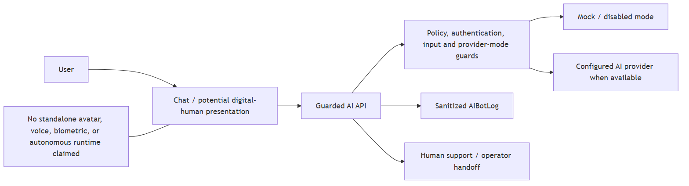

### 4.2 Component Responsibilities

| Component | Responsibility | Present-state note |
| --- | --- | --- |
| `AIAssistantButton` | Server-rendered feature gate; loads settings and allowed bots; renders the interactive assistant. | Tracked and embedded broadly. |
| `RentipidAIAssistant` | Text/Digital Human modal UI, bot selection, transcript, controls, and fallback. | Tracked; media behavior simulated. |
| `/help` page | Dedicated support workspace with prompts, messages, cards, and session indicator. | Tracked; submits to the 410 route. |
| `processAICommand` | Settings, RBAC, injection checks, guardrails, safe context, prompt selection, mock inference, output protection, and logs. | Tracked; no inspected live route calls it; inference is mock-only. |
| `AiSessionBroker` | Actor binding, status checks, replay protection, limits, provider initialization, expiry, termination, and fallback. | Implemented but untracked. |
| `AiCasePlatform` | Case creation/resume, ownership, entity links, evidence, states, resolutions, follow-up, export, closure. | Implemented but untracked. |
| `AiToolGateway` | Tool allowlist, RBAC, replay/idempotency, confirmation, execution records, auditing, and serialization. | Implemented but untracked; several handlers are mock. |
| `AiPolicyEngine` | Versioned deterministic decisions with hashes and reason codes. | Implemented but untracked; thresholds include local test values. |
| `AiContextHelper` | Server-side authorization of route/entity context. | Implemented but untracked; mock domain data. |
| `AiDiagnosticsHelper` | Network, microphone, service-worker, session, provider checks and bounded repairs. | Implemented but untracked; diagnostic outcomes are simulated parameters. |
| `AiGuardrails` | Injection patterns, secret scrubbing, allowed-field minimization. | Implemented but untracked; simple pattern/key logic. |
| `AiCircuitBreaker` | Per-provider error count, text fallback, and session cost cap. | Implemented but untracked; in-memory. |
| `DigitalHumanProviderAdapter` | Provider SDK isolation and media session lifecycle. | Contract only; credentials and implementation pending. |
| `MockProviderAdapter` | Local provider-session simulation. | Tracked. |

### 4.3 Request and Resolution Flow

The intended flow is:

```text
User channel
  -> authenticate and bind actor server-side
  -> create/validate scoped AI session
  -> authorize minimal route/entity context
  -> resume or create support case when required
  -> validate prompt and build safe context
  -> retrieve versioned knowledge
  -> generate explanation or structured tool request
  -> tool allowlist + RBAC + ownership + input validation
  -> deterministic policy decision
  -> explicit confirmation / step-up when required
  -> execute authoritative domain service
  -> verify result
  -> persist tool execution, resolution, message, and audit evidence
  -> return text/cards/audio presentation
  -> follow up or close case
```

The present UI-to-route flow stops at the migrated Vercel route, which returns 410. Sections 15 and 20 describe the required restoration path.

### 4.4 Next.js 16 Boundaries

The module uses the App Router. The bundled Next.js 16 guide confirms that:

- Route Handlers are `route.ts` files inside `app` and use Web `Request`/`Response` or Next extensions.
- POST handlers are not cached.
- Pages are Server Components by default.
- Interactive state, event handlers, effects, and browser APIs belong in Client Components.
- Secrets and database access belong on the server.

The current separation generally follows this model: `AIAssistantButton` and administration pages run on the server, while `RentipidAIAssistant` and `/help` are interactive Client Components. The critical defect is not the component boundary; it is the lack of a reachable replacement endpoint after the Vercel route migration.

### 4.5 Azure AI Service

`apps/api/src/services/aiService.ts` initializes an Azure OpenAI client using `AZURE_OPENAI_ENDPOINT` plus either `AZURE_OPENAI_API_KEY` or `DefaultAzureCredential`. It offers:

- `generateEmbeddings(text)` using `AZURE_OPENAI_EMBEDDING_DEPLOYMENT`, defaulting to `text-embedding-ada-002`.
- `generateChatCompletion(messages)` using `AZURE_OPENAI_CHAT_DEPLOYMENT`, defaulting to `gpt-4o`, temperature 0.3, maximum 1,000 tokens.

This service supports Azure AI Search indexing and potential RAG/chat, but no customer-support route invoking it was found in the inspected Azure API route set. The controlled v1 documents mention Google Gemini 2.5 Pro/Flash, while the current backend service is Azure OpenAI. Provider selection is therefore not a single settled current fact; it must be normalized in configuration and architecture records before live activation.

## 5. Channel and User-Interface Documentation

### 5.1 Dedicated Help Workspace

Route: `/help`

Purpose: a persistent, full-page AI support workspace for booking, payment, listing, and general support questions.

Visible behavior:

- Page title “RENTipid Support” and subtitle “Durable AI Workspace for your cases and questions.”
- Session-status indicator.
- Suggested prompts for a booking issue and provider listing guidance.
- User and assistant message bubbles.
- Blocked-policy styling.
- Optional structured cards containing title, description, and an action button.
- Responsive text input and Enter-key submission.

Current technical behavior:

- Local state holds messages and session status.
- No durable conversation or case ID is loaded or persisted by the component.
- The component sends `botId: 'Concierge'`, while the bot catalog's exact value is `RENTipid Concierge Bot`. A restored endpoint must normalize or validate this identifier.
- The request posts to `/api/ai/chat`, which currently responds 410.
- The page imports the reusable assistant button but hides it inside `display: none` to avoid duplicate presentation.

### 5.2 Contextual Assistant

The reusable assistant is referenced from 42 App Router page files. These include the homepage, browse, contact, how-it-works, public listing, prohibited items, Help, renter/provider/business/admin/compliance/finance/super-admin dashboards, booking details, inspections, claims, disputes, KYC, listings, finance ledgers, and marketing screens.

The server component:

- Hides the assistant if global AI or the module is disabled.
- Determines role-allowed bots.
- Removes bots disabled by configuration.
- Passes module, record ID, role, available bots, and disclaimer to the client component.

Many call sites do not pass `userRole` or `recordId`. They therefore receive Guest bot access and generic context unless their parent supplies those values. A systematic integration review should explicitly bind authenticated role and authoritative entity IDs for every embedded route.

### 5.3 Assistant Text Mode

Text mode provides:

- Bot selection from the allowed set.
- A configurable disclaimer.
- Chat history held in client state.
- Clear-chat action.
- Enter and send-button input.
- Loading animation and blocked-response styling.
- A fallback message when the API request fails.

Clearing the chat only clears browser component state; it does not delete persisted conversation/case data because the current component is not connected to those stores.

### 5.4 Digital Human Mode

The inspected UI includes:

- A Digital Human header and a visual avatar placeholder.
- Mode switching between text and Digital Human.
- Microphone consent state.
- Mute/unmute, simulated microphone, and end-session controls.
- A live-transcript overlay.
- An explicit “Continue in Text” failure path.

However, the current mode does not request browser microphone permission, establish WebRTC, stream audio, receive synthesized speech, render a real provider avatar, or call the session broker. `startDigitalHuman()` changes state after one second, and `simulateSpeech()` injects a fixed text prompt after two seconds. This must be presented to users only as a prototype until the provider integration is complete.

### 5.5 Accessibility and Responsive Behavior

The targeted P5 script checks responsive Tailwind classes, an assistant launcher `aria-label`, keyboard submission, captions, and controls. These are useful structural checks. They are not a substitute for browser acceptance with screen readers, focus trapping, Escape behavior, visible focus, color contrast, reduced-motion behavior, caption accuracy, microphone-denial flows, and touch-device testing.

### 5.6 User Operating Guide

For the current text interface:

1. Open Help or an assistant-enabled page.
2. Open the AI assistant.
3. Select an available bot if more than one is shown.
4. Read the disclaimer and avoid entering credentials, card security codes, or unnecessary personal data.
5. Ask one concrete question and include the relevant RENTipid reference only when the page has securely bound it.
6. Review generated explanations and drafts before acting.
7. For consequential actions, expect confirmation, policy evaluation, or safe hold.
8. If Digital Human fails, continue in text.
9. Treat provider, insurer, KYC, payment, and legal statuses as valid only when shown from their authoritative systems.

Current users should be informed that the inspected frontend chat endpoint is migrated and unavailable until the Azure integration is completed.

<!-- pagebreak -->

## 6. Session, Provider, and Conversation Architecture

### 6.1 Provider Contract

The provider-neutral interface defines:

```text
initializeSession(context) -> provider session ID, expiry, metadata
sendAudio(audio)           -> optional outbound media
receiveAudio(callback)     -> optional inbound media
closeSession(sessionId)    -> terminate provider session
```

Session context includes user ID, conversation ID, channel (`help`, `digital_human`, `contextual`, or `pwa`), and locale.

Permanent provider credentials must remain server-side. The intended client contract is a short-lived, scoped broker token or provider token. The current broker token is a constructed string and is not shown to be cryptographically signed, persisted, scoped, or independently validated; production activation requires a real token design.

### 6.2 Session Broker Controls

The current workspace broker applies:

- Single-use nonce replay protection.
- Database user lookup and rejection of Suspended or Blacklisted users.
- A fallback-mode block for Digital Human.
- Provider health check.
- Daily limit of 50 sessions per user.
- Concurrent limit of 3 sessions per user.
- 15-minute idle timeout.
- A declared 12-hour absolute timeout, although the inspected implementation does not enforce it.
- Minimum `AiServiceSession` persistence.
- Provider initialization through mock or Digital Human adapter.
- Text fallback if provider initialization throws.
- Provider close attempt and session termination.

Nonce, usage, active-session, and last-active data are in process memory. They will reset on restart and will not coordinate across serverless instances or multiple replicas. Production requires a shared authoritative store with atomic limit and replay semantics.

### 6.3 Conversation Continuity

The schema provides `AiConversation` and `AiMessage`, including user association, active case, summary, last intent/channel, message role/channel/content, safe structured payload, and timestamps.

The interface contract requires all channels to carry the conversation ID. The inspected UIs do not do so, the broker uses a placeholder conversation ID for provider initialization, and no conversation service was found writing or summarizing messages. Therefore the data model is ready, but continuity is not currently end-to-end.

### 6.4 Digital Human Provider Status

The controlled provider register records:

- Provider: TBD.
- Required variables: `DIGITAL_HUMAN_API_URL` and server-only `DIGITAL_HUMAN_API_KEY`.
- Status: missing credentials.
- Approved fallback: text-only shared core.
- Production mode: degraded, with live provider runtime not validated.

Activation must include provider selection, DPIA/privacy review, biometric/voice implications, retention rules, regional processing, content and abuse policies, token exchange, transport security, availability SLOs, cost limits, runtime tests, failure injection, and deletion workflows.

## 7. Support Case Platform and Lifecycle

### 7.1 Canonical Case

`AiSupportCase` is the intended canonical support record. It holds a unique case number, optional user, category/subcategory, severity, risk level, state, summary, policy version, SLA deadline, activity timestamp, and resolution/closure timestamps.

The platform suppresses duplicate open cases by user/category and, where provided, matching entity link. It can create a case, link an entity, add evidence references, evaluate simple evidence completeness, update state, propose resolution, request confirmation, reconsider, schedule follow-up, finalize, close, and export the case with evidence, links, and resolutions.

### 7.2 State Model

| State | Purpose |
| --- | --- |
| `OPEN` | Case created. |
| `UNDERSTANDING` | Intent and facts are being collected. |
| `DIAGNOSING` | Context and authoritative systems are being analyzed. |
| `AWAITING_EVIDENCE` | Required user or provider evidence is missing. |
| `AWAITING_USER_CONFIRMATION` | A binding action requires explicit confirmation. |
| `POLICY_EVALUATION` | Deterministic eligibility and limits are being evaluated. |
| `EXECUTING` | Authorized tool/domain action is executing. |
| `VERIFYING` | The system is confirming the resulting state. |
| `SAFE_HOLD` | Automation stopped because of uncertainty, conflict, limit, or external dependency. |
| `RESOLVED` | A verified outcome has been reached. |
| `CLOSED` | The case is finalized. |
| `SYSTEM_BLOCKED` | Guardrails or policy prohibited the action. |

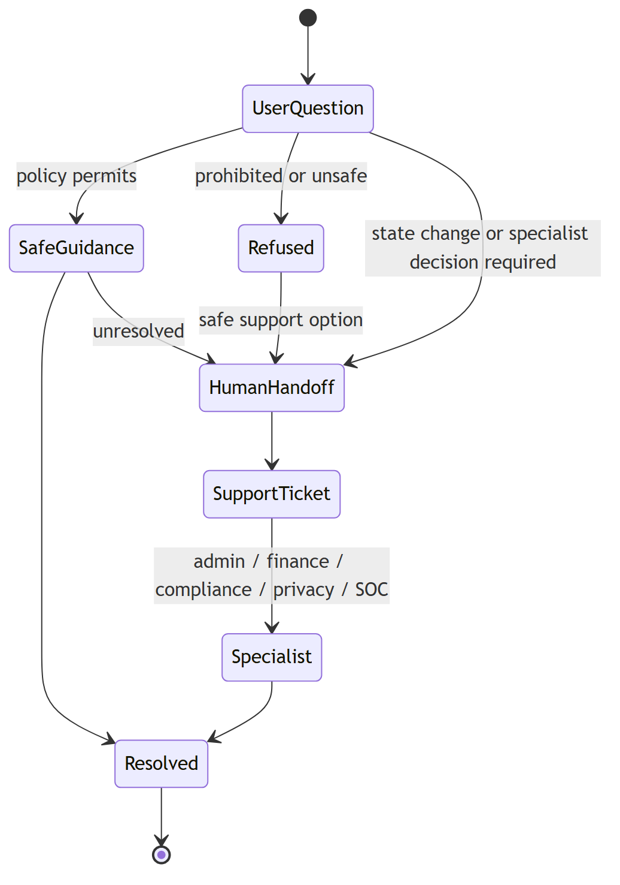

### 7.3 Severity and Risk

Severity values are `low`, `medium`, `high`, and `critical`. Risk values are `safe`, `consequential`, and `external`. New cases currently default to medium severity and safe risk; production classification rules were not found and must be defined before those values drive SLA or automation.

### 7.4 Evidence and Resolution

Evidence records include type, secure file reference, optional description, source channel, verification status, submitting user, and timestamp. The current completeness rule only checks whether any evidence is marked verified; it does not enforce category-specific evidence sets, malware scanning, metadata verification, file ownership, retention, or integrity hashes.

Resolution records support interim/final type, proposed/confirmed/executed/failed status, policy/tool references, a user-facing explanation, and verification/closure timestamps. The platform's current `finalizeResolution()` changes the case state but does not update a resolution record or prove the authoritative domain outcome. Production closure must be transactionally tied to post-action verification.

### 7.5 Ownership Gap

Case ownership is checked by comparing `AiSupportCase.userId`. The entity-link method contains a comment stating that real ownership of the linked Booking, Listing, or other entity should be verified. This is an explicit implementation gap. A user who owns a case must not automatically be allowed to link an arbitrary entity ID.

### 7.6 Follow-Up and SLA

`AiFollowUp` models reminders, rechecks, and re-evaluation with attempts and retry timestamps. No worker or scheduler that triggers follow-ups was found. `slaDueAt` exists but no SLA computation or breach job was found. Both are modeled capabilities awaiting operational execution.

## 8. Tool Gateway, Authorization, and Action Controls

### 8.1 Gateway Principle

The model must never receive raw database authority. It can request a named server-side tool with structured parameters and a request fingerprint. The gateway owns authorization and execution.

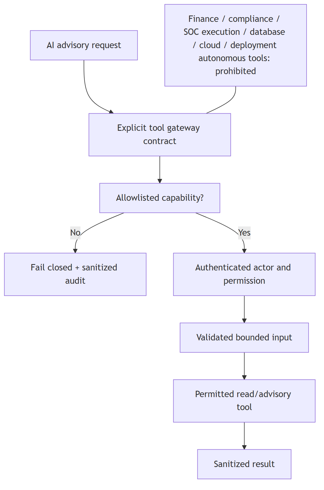

### 8.2 Risk Classes

The current TypeScript gateway defines `READ_ONLY`, `DRAFT_ONLY`, `CASE_ACTION`, `CONFIRMED_ACTION`, `POLICY_REQUIRED`, and `PROHIBITED`. Controlled documents use some different names, including `USER_CONFIRMATION_REQUIRED`, `POLICY_ENGINE_REQUIRED`, and `EXTERNAL_AUTHORITY_REQUIRED`. These vocabularies should be reconciled into one enum before production.

### 8.3 Enforcement Order

The inspected gateway:

1. Looks up the named tool.
2. Blocks prohibited tools and writes an audit record.
3. Resolves the user server-side.
4. Checks allowed roles.
5. Rejects replayed fingerprints for non-read operations.
6. Persists a pending execution when confirmation is missing.
7. Exposes a `requiresPolicy` marker.
8. Calls the handler.
9. Records success or denial.
10. Deep-copies the result using JSON serialization.

The policy check in the gateway itself is currently a comment/assumption. Individual handlers call the policy engine. Production should make policy invocation a non-bypassable gateway responsibility, validate tool inputs with explicit schemas, validate the AI session, verify ownership against authoritative services, bind fingerprints to canonical arguments, and persist idempotency before execution using a transactional unique constraint.

### 8.4 Implemented Demonstration Tools

| Tool | Risk | Roles | Main control | Present implementation |
| --- | --- | --- | --- | --- |
| `getBooking` | Read only | Renter, Provider, Admin | Ownership | In-memory mock booking. |
| `cancelBooking` | Confirmed action | Renter | Ownership, confirmation, cancellation policy, post-check | Mutates in-memory mock booking. |
| `adminOnlyTool` | Read only | Admin | RBAC | Returns demonstration secret-like data; must never be production exposed. |
| `prohibitedTool` | Prohibited | None in effect | Always denied | Security-control test. |
| `submitClaim` | Case action | Renter, Provider | Ownership and claim policy | In-memory mock claim. |
| `submitDispute` | Case action | Renter, Provider | Ownership and dispute policy | In-memory mock dispute. |
| `checkKyc` | Read only | Renter, Provider | KYC policy mapping | In-memory mock user. |
| `approveKyc` | Prohibited | Admin declared, but risk prohibits all | Always denied | Demonstrates that AI cannot approve identity. |
| `getInsurance` | Read only | Renter, Provider | Ownership and insurance status mapping | In-memory mock policy. |

The controlled Tool Registry also lists `getListing`, `getPayment`, `getKycStatus`, `getInsuranceStatus`, `getCase`, and `submitCaseEvidence`, but matching registered handlers were not found in the inspected registry. Documentation consumers must not assume a ledger entry equals a currently callable tool.

### 8.5 Audit Mapping

The gateway's `logSecurityEvent()` currently writes to `AuditLog` as a fallback, even where test output labels it a SecurityEvent. Production must write the correct security-event type into the SOC ingestion path, preserve correlation IDs, avoid storing sensitive raw prompts or results, and ensure audit failure policy is explicit.

## 9. Deterministic Policy Engine

### 9.1 Policy Result Contract

Every evaluation returns a decision (`approved`, `denied`, or `hold`), eligibility, stable reason code, policy version, optional calculated amount, confirmation requirement, step-up requirement, safe-hold flag, and optional next action.

Inputs are SHA-256 hashed and the decision is persisted in `AiPolicyDecision`. Because `JSON.stringify` ordering is used directly, production should canonicalize inputs before hashing to guarantee stable cross-runtime identity.

### 9.2 Policy Catalog

| Family | Core rule | Confirmation | Step-up / hold | Current note |
| --- | --- | --- | --- | --- |
| Cancellation | Confirmed booking more than 24 hours from start is approved; disputed/unknown holds; otherwise denied. | Approved cancellation requires confirmation. | No step-up in current rule. | Approved result returns `calculatedAmount: 100`, described as percentage-like but not strongly typed. |
| Rescheduling | Available date approved; unavailable denied. | Approval requires confirmation. | None. | Current code applies a numeric change fee of 10. |
| Refund | Provider fault approved for requested amount; renter fault denied; unknown fault holds. | Approval requires confirmation. | Amount over 500 requires step-up. | Currency is not represented in the result. |
| Fees/deposits | Risk score over 80 produces 20% deposit; otherwise 10%. | No. | High risk requires step-up. | Risk-score provenance is not shown. |
| Claim | Conflict/incomplete evidence holds; amount over 1,000 holds; otherwise approved. | Approval requires confirmation. | Over 1,000 requires step-up and external process. | 1,000 is explicitly a local test value. |
| Dispute | Conflict/incomplete evidence or amount over 500 holds; otherwise approved. | Approval requires confirmation. | Current over-limit helper does not set step-up. | 500 is explicitly a local test value. |
| KYC | Verified approved; rejected denied; other status holds. | No. | Unknown status holds. | AI cannot approve KYC. |
| Insurance | Active approved; inactive/unknown holds. | No. | Non-active status holds. | Insurer remains authoritative. |

### 9.3 Financial Safety

The closure records explicitly say that 1,000/500 claim and dispute thresholds are test values configurable in the database. The current code hard-codes them and uses dollar-style comments despite RENTipid's Philippines context. Production policy must specify currency, monetary units, rounding, effective version, jurisdiction, tax/fee treatment, authority, approval tiers, and database-controlled thresholds.

Generative output must never be treated as a binding calculation. A policy decision should be tied to the exact transaction snapshot, and execution should fail closed if the snapshot changes before mutation.

### 9.4 Safe Hold

Safe hold is returned for unknown/conflicting state, missing/conflicting evidence, exceeded automation thresholds, unknown KYC, or inactive/unknown insurance. A safe hold prevents the handler from proceeding. The operational next destination must be defined per reason code; “escalate” without an owner, deadline, and user-visible status is incomplete.

<!-- pagebreak -->

## 10. Data Model and Persistence

### 10.1 Additive Schema

Migration `20260812120000_add_unified_ai_foundation` creates 12 tables and adds only three foreign keys: session-to-user, conversation-to-user, and message-to-conversation. It also adds uniqueness/index controls for case number, tool idempotency, knowledge slug, provider-session reference, cases, entity links, and policy decision lookup.

### 10.2 Model Catalog

| Model | Purpose | Key integrity controls | Notable limitations |
| --- | --- | --- | --- |
| `AiServiceSession` | Channel session and provider reference. | Optional user FK. | `conversationId` is not a FK; no expiry/last-active columns. |
| `AiConversation` | Cross-channel conversation metadata. | Optional user FK. | `activeCaseId` is not a FK. |
| `AiMessage` | User, assistant, system, and tool turns. | Conversation FK with cascade delete. | `sessionId` is not a FK; raw `content` retention policy undefined. |
| `AiSupportCase` | Canonical case record. | Unique case number; user/status/activity index; optional user FK. | Related case tables have no case FKs. |
| `AiCaseEntityLink` | Links case to Booking, Listing, Payment, etc. | Case and entity indexes. | No case FK; polymorphic entity integrity is application-only. |
| `AiCaseEvidence` | Evidence reference and verification status. | None beyond primary key. | No case/user FKs; no content hash or storage-integrity metadata. |
| `AiToolExecution` | Authorization, policy, confirmation, execution, and verification trace. | Unique optional idempotency key. | No session/case FK; one nullable unique key requires careful provider behavior. |
| `AiPolicyDecision` | Versioned deterministic decision with input hash. | Composite lookup index. | No case FK; no explicit actor, currency, or transaction-snapshot version. |
| `AiResolution` | Proposed/final outcome. | None beyond primary key. | No FKs to case/policy/tool; no created timestamp. |
| `AiFollowUp` | Scheduled reminder/recheck/re-evaluation. | None beyond primary key. | No case FK; no worker lease/dead-letter fields. |
| `AiKnowledgeSource` | Versioned knowledge-source metadata. | Unique slug. | No content/chunk/index model and no retrieval implementation. |
| `AiProviderSession` | External provider session reference and expiry. | Unique provider reference. | No FKs to user/session; provider-specific consent and region metadata absent. |

### 10.3 Relationship Map

The intended relationship is User → Session/Conversation/Case, Conversation → Messages, Case → Entity Links/Evidence/Tool Executions/Policy Decisions/Resolutions/Follow-Ups, and Session → Provider Sessions. Only part of that graph is enforced by the migration. Application code must not be relied on as the sole integrity mechanism for durable evidence and financial/support history without a documented reason.

### 10.4 Retention, Deletion, and Privacy

The schema does not encode retention policy. Operations must define:

- Conversation and raw prompt retention.
- Case/evidence retention by category and legal requirement.
- Provider audio/video retention and whether media is stored at all.
- Policy and tool audit retention.
- User deletion/anonymization while preserving required financial/audit records.
- Subject-access/export behavior.
- Deletion propagation to external providers and vector/search indexes.

### 10.5 Migration and Rollback

The controlled rollback plan uses an additive migration strategy:

1. Deploy code with features off.
2. Run `prisma migrate deploy`.
3. Verify database health.
4. Enable feature flags gradually.
5. Roll back application deployment to a prior stable SHA if required.
6. Use a forward-fix migration rather than destructive down migration in production.

Stated triggers include greater than 1% 5xx rate, read latency over 500 ms, and automated security alarms. Managed backup, PITR, and read-replica synchronization are listed as prerequisites/assumptions and must be verified in the target environment rather than inferred from documentation.

## 11. Security, Privacy, and Abuse Resistance

### 11.1 Control Layers

The design uses defense in depth:

- Server-side authentication and actor binding.
- Role-to-bot access controls.
- Global, module, and bot feature switches.
- Prompt injection detection and blocked-keyword guardrails.
- Server-side tool registry and RBAC.
- Entity ownership checks.
- Confirmation and deterministic policy boundaries.
- Replay/idempotency controls.
- Secret scrubbing and allowed-field serialization.
- Output protection.
- Audit and security-event integration.
- Provider circuit breaker, limits, and text fallback.

### 11.2 Prompt and Output Controls

There are two guardrail implementations:

- `checkGuardrails()` blocks a list of sensitive action phrases such as approving KYC, publishing listings, verifying payment, releasing deposits, deciding disputes, refunds, payouts, keys, and bypass attempts.
- `AiGuardrails.detectInjection()` detects a short set of common patterns and offers recursive secret-key scrubbing plus allowlisted fields.
- The command layer also invokes `AIGuard` from the SOC detection subsystem for input and output protection.

Pattern matching is a useful layer but is not a complete prompt-injection defense. Production must treat all retrieved content, tool output, attachments, and provider metadata as untrusted; strictly separate instructions from data; allow only typed tools; cap arguments; and make authorization independent of model wording.

### 11.3 Authentication, RBAC, and Ownership

The strongest rule is that user ID and role must come from a validated server session, never the request body. The legacy `AIRequest` interface accepts `userRole` and `userId`, so any future route invoking it must overwrite those fields from server authentication.

The tool gateway resolves the user from the database and checks role, but it does not validate the supplied AI `sessionId`. Context and tool demonstrations use mock databases. Production must centralize ownership in reusable domain authorization services to prevent IDOR across Booking, Listing, Payment, Claim, Dispute, Case, Evidence, and Insurance records.

### 11.4 Confirmation and Step-Up

Confirmation must be explicit, scoped to a canonical action preview, short-lived, non-replayable, and invalidated if material inputs change. A Boolean `userConfirmed` argument alone is insufficient for a live consequential action.

Step-up authentication is represented in policy results but no authentication challenge or grant-consumption mechanism was found in this module. High-value actions must consume a server-issued step-up grant tied to actor, action, resource, amount, currency, and expiry.

### 11.5 Secrets and Data Minimization

Permanent Digital Human and AI provider keys must never enter a Client Component or client JSON. The server-only boundary should issue narrowly scoped short-lived tokens. Logging currently stores prompts and a response summary in `AIBotLog`; this creates privacy and prompt-injection-evidence retention obligations. Redaction must happen before persistence, not only before provider transmission.

The current recursive scrubber checks key names containing password, token, secret, credit card, SSN, or CVV. It will not reliably detect sensitive values embedded in free text. Production requires data classification and structured redaction for Philippine identifiers, phone/email/address data, payment references, KYC documents, and claim evidence.

### 11.6 Rate Limits and Distributed Controls

The Azure API has general and strict rate-limit middleware, but the inspected AI frontend route is a 410 handler and the shared-core broker's limits are in memory. A live AI route needs authenticated per-user, per-IP/risk, per-session, and provider-budget controls in a shared store, with stricter limits for session creation, tools, uploads, and confirmation attempts.

### 11.7 Security Test Record

The controlled P11 record reports passes for prompt injection, hidden instructions, prohibited tools, cross-user access/mutation, role escalation, actor spoofing, ownership bypass, privacy minimization, secret exposure, replay, duplicate mutation, confirmation bypass, step-up boundary, provider outage, circuit breaker, text fallback, and usage limits.

These are targeted local/structural tests. Several exercise in-memory mocks or call methods directly. They do not prove network authentication, browser isolation, distributed replay prevention, live provider handling, data exfiltration resistance, or production infrastructure configuration.

<!-- pagebreak -->

## 12. Configuration, Administration, and Monitoring

### 12.1 Database Settings

`getAISettings()` loads `SystemSetting` records whose keys begin with `ai_`. Principal settings include:

| Setting | Purpose | Default behavior |
| --- | --- | --- |
| `ai_global_enabled` | Master assistant switch. | Enabled. |
| `ai_logging_enabled` | Interaction-log switch. | Enabled. |
| `ai_mock_mode_enabled` | Forces mock behavior. | Enabled. |
| `ai_provider_mode` | `mock`, `openai`, `gemini`, or `disabled`. | `mock`. |
| `ai_max_permission` | Nominal maximum permission level. | 3, draft-only. |
| `ai_response_style` | Response style. | `Simple`. |
| `ai_disclaimer_text` | User-visible disclaimer. | Assist/summarize, no final decisions. |
| `ai_module_*_enabled` | Per-module switch. | Enabled unless explicitly false. |
| `ai_bot_*_enabled` | Per-bot switch. | Enabled unless explicitly false. |

Default-on behavior is convenient but risky for newly introduced modules/bots. Production configuration should prefer explicit registration and deny-by-default for high-impact contexts.

### 12.2 Environment Settings

The tracked AI environment contract includes:

| Variable | Meaning |
| --- | --- |
| `DIGITAL_HUMAN_API_URL` | Server-side Digital Human provider URL. |
| `DIGITAL_HUMAN_API_KEY` | Server-only provider credential. |
| `AI_FALLBACK_MODE_ENABLED` | Prevent Digital Human session creation and use text fallback. |
| `AI_PROVIDER_MOCK_ENABLED` | Select mock provider adapter. |
| `AI_MAX_SESSION_DURATION_MS` | Nominal maximum session duration; not consumed by the inspected broker. |

The Azure backend additionally uses `AZURE_OPENAI_ENDPOINT`, `AZURE_OPENAI_API_KEY` or managed identity, `AZURE_OPENAI_EMBEDDING_DEPLOYMENT`, and `AZURE_OPENAI_CHAT_DEPLOYMENT`.

### 12.3 Administration Screen

Admin/Super Admin settings provide:

- Global activation.
- Provider mode.
- Maximum permission level.
- Disclaimer text.
- Module activation switches for public, registration, listing, booking, payment, agreement, inspection, dispute, finance, admin, and compliance.
- Availability switches for every bot.

Only Super Admin may alter the global switch, provider mode, permission maximum, and disclaimer. Admin can alter module and bot switches. Changes are upserted and sent through administration audit/security ingestion.

The UI warning says sensitive actions require authorized human approval, while the module architecture says no routine human service. This is not necessarily contradictory: approval is an authorization control, not a support queue. Operational documentation should name which roles perform which approvals.

### 12.4 Monitoring Screen

The AI logs dashboard displays total interactions, blocked interactions, filters, and the 50 most recent `AIBotLog` records with user, role, bot, module, prompt, and status. The visible “Export Logs” button has no inspected action. Production should add pagination, time/risk filters, redacted export, access auditing, retention controls, and correlation to tool, policy, case, provider, and security events.

### 12.5 Telemetry and Health

The tracked telemetry service holds per-session token usage in memory, defaults to 10,000 tokens, and writes token/cost information to console. The untracked circuit breaker uses arbitrary cost units with a maximum of 50. These overlapping mechanisms must be consolidated.

`AiHealthService` tracks provider health in memory and opens after five failures for 60 seconds. The untracked breaker opens after three errors. A single configurable distributed resilience policy is needed, with metrics for sessions, provider latency/errors, fallback rate, token/cost, tool authorization, holds, confirmation abandonment, case resolution, and user satisfaction.

## 13. Diagnostics, Resilience, and Fallback

### 13.1 Diagnostic Checks

The helper models network, microphone permission, service worker, session, and provider health. It recommends `USE_TEXT_FALLBACK`, `REGISTER_SW`, or `RECREATE_SESSION`. The self-repair method maps those recommendations to bounded status strings.

This is a safe pattern: diagnose first, attempt only predefined reversible repairs, and never allow arbitrary model-generated repair code. Present checks receive Boolean arguments rather than probing actual browser/server state.

### 13.2 Circuit Breakers

Provider errors increment a counter; successful calls reset it; an open circuit uses a fallback task. Production should add half-open probes, time windows, concurrency protection, distributed state or instance-aware design, provider-specific thresholds, retry budgets, and telemetry.

### 13.3 Text-Only Degraded Mode

Text fallback is a central requirement. It must preserve authentication, conversation ID, active case, policy state, pending confirmation, and user-visible explanation. The current UI switches visual mode and the broker can report `fallbackToText`, but end-to-end continuity is not yet wired.

### 13.4 Failure UX

Required behavior by failure:

| Failure | User experience | System action |
| --- | --- | --- |
| Microphone denied | Explain and remain in text. | Do not repeatedly request permission. |
| Avatar provider unavailable | Offer immediate text continuation. | Open circuit; preserve conversation/case. |
| AI provider unavailable | Provide non-generative status and safe navigation. | Do not execute tools based on incomplete reasoning. |
| Session expired | Ask user to reauthenticate/recreate session. | Invalidate pending confirmations/tokens. |
| Domain authority unavailable | Show safe hold with retry/status information. | Persist case and follow-up. |
| Mutation timeout | Do not blindly repeat. | Query authoritative status using idempotency reference. |
| Usage limit reached | Explain limit and available non-AI support paths. | Stop provider calls; preserve case. |

## 14. Testing and Evidence

### 14.1 Test Program

The module's targeted scripts cover:

| Phase | Scope |
| --- | --- |
| P3 | Schema relations, duplicate domains, environment validation, mock provider, health/circuit foundation. |
| P4 | Session creation, unauthorized/suspended denial, replay, concurrent/daily limits, actor binding, termination, feature flag, provider fallback, secret exposure, expiry/cleanup. |
| P5 | Help UI, placeholder removal, text interaction, Digital Human UI, mic consent, transcript, controls, context marker, fallback, responsive layout, accessibility smoke, client secret scan. |
| P6 | Case creation/ownership/lifecycle, evidence, follow-up, resolutions, reconsideration, duplicate suppression, cross-channel resume, no-human-queue structure. |
| P7 | Tool actor resolution, input claim, unauthorized/RBAC/ownership denial, prohibited tools, audit mapping, confirmation, policy, verification, privacy serialization, idempotency/replay. |
| P8 | Deterministic cancellation/rescheduling/refund/deposit logic, version/reason codes, step-up, thresholds, safe hold, hashing, confirmation, gateway integration, generative override. |
| P9 | Claims/disputes ownership, evidence holds, thresholds, reconsideration, KYC mapping/prohibition, insurance authority, audit/security, duplicate-channel structure. |
| P10 | Context authorization, microphone/text fallback, service worker/PWA, provider/session diagnostics, bounded repairs, continuity claims, mutation retry safety. |
| P11 | Prompt/output security, prohibited tools, cross-user access, escalation/spoofing, privacy/secret controls, replay/confirmation/step-up, outage fallback, limits, no-human-service. |
| P12 | Runs P3–P11 and compares pre/post SHA-256 digest of `src/lib/ai` to detect modifications during validation. |

### 14.2 Evidence Ledger

The controlled evidence ledger records P3 through P12 passes between 12 and 13 August 2026. It also records corrections:

- Digital Human provider runtime proof pending credentials.
- Text fallback architecture validated; early runtime proof not yet proven, later targeted tests report local fallback pass.
- P5 UI structure validated, not browser runtime.
- P10 Capacitor runtime not proven.
- Claim/dispute thresholds are local test values.

### 14.3 Test Quality Caveats

Several scripts are executable demonstrations rather than framework assertions. P5 performs source-string checks. Some tests print PASS for structural or simulated conditions. P7 calls privacy serialization a PASS based on a JSON copy, and labels AuditLog fallback as SecurityEvent. P10 reports some behaviors as architecturally covered or simulated. These limitations should be preserved in any acceptance interpretation.

### 14.4 Historical Acceptance

`FINAL_ACCEPTANCE.md` records local E2E, migration, required data, acceptance, production build, deployment configuration, rollback, and deployment readiness as PASS at HEAD `81980e3...`, with approved degraded Digital Human mode and deferred Capacitor. `CLOSURE_CERTIFICATE.md` records completion, validation, acceptance, local functionality, deployment readiness, manifest, security/privacy, and rollback as PASS.

`MASTER_CONTROL.md`, however, still says P1 and P13 were not started and global completion/closure/freeze statuses were not started. This inconsistency should be corrected through controlled change management rather than silently rewritten.

### 14.5 Recommended Fresh Acceptance

Before live activation, execute:

1. Clean-checkout build and type/lint verification.
2. Fresh disposable database migration and seed.
3. Framework-based unit and integration tests, not source-string checks.
4. Authenticated HTTP tests for the new Azure chat/session/tool endpoints.
5. Browser tests for Help, contextual assistant, Digital Human consent/media, accessibility, responsive behavior, and fallback.
6. Distributed idempotency, replay, quota, and circuit-breaker tests.
7. Real domain-service tests for booking, payment, claims, disputes, KYC, and insurance boundaries.
8. Live-provider sandbox tests with data-minimization and deletion proof.
9. SOC event/correlation validation.
10. Load, latency, cost, outage, rollback, and recovery exercises.

<!-- pagebreak -->

## 15. Deployment, Release, and Rollback

### 15.1 Intended Topology

The present repository direction is:

- Next.js frontend and interactive components on Vercel.
- Azure API backend in `apps/api`/Azure Container Apps.
- PostgreSQL through Prisma.
- Azure OpenAI and Azure AI Search services.
- Application Insights and Azure secret/managed-identity support.
- A future Digital Human provider behind the provider adapter.

Earlier module documents state Google GenAI and Vercel serverless as the AI path. These are historical descriptions and must be reconciled with the Azure migration before release.

### 15.2 Deployment Blocker: Route Migration

The Next.js route deliberately returns 410 and tells callers to use `src/lib/api-client.ts`/`azureFetch`. The two customer-facing UIs have not been updated accordingly. A correct repair should:

- Define an authenticated Azure customer-support endpoint.
- Route frontend requests through the approved API client.
- Derive actor/role server-side.
- Validate request/body size and schema.
- Create/validate session and conversation.
- Invoke the one orchestrator.
- Preserve correlation and idempotency IDs.
- Return a versioned response contract.
- Map failures to safe, non-sensitive user messages.

### 15.3 Feature-Flag Activation Order

Recommended sequence:

1. Deploy schema with all new features disabled.
2. Validate database and application health.
3. Enable internal text mock mode for authorized testers.
4. Enable authenticated text provider mode for a small cohort.
5. Enable read-only tools.
6. Enable case/evidence workflows.
7. Enable confirmed deterministic mutations one family at a time.
8. Validate fallback and circuit behavior.
9. Enable Digital Human for internal users, then limited cohort.
10. Expand only while error, safety, privacy, cost, and resolution metrics remain within approved limits.

### 15.4 Rollback

Application rollback should revert the Vercel/Azure revision and disable feature flags. Additive schema remains in place for compatibility. Production database down migrations are prohibited; defects use forward fixes. Before migration, verify backup and PITR. After deployment, smoke-test health, login, booking, AI session initialization, Help, tool authorization, and fallback.

### 15.5 Operational Runbook

When error/fallback rates rise:

1. Identify frontend, Azure API, database, AI provider, Digital Human provider, or domain authority as the failing boundary.
2. Turn on text fallback or disable affected tools/provider mode.
3. Preserve correlation IDs, execution records, policy decisions, and case state.
4. Reconcile timed-out mutations with authoritative systems before retry.
5. Notify users through case status/follow-up without exposing internal errors.
6. Roll back application revision if release-correlated.
7. Use forward-fix migration for schema defects.
8. Record the incident, root cause, recovery evidence, and change request.

## 16. Governance, Closure, and Change Control

### 16.1 Architecture Locks

The v1 architecture locks:

- One shared orchestrator.
- One canonical AI case platform.
- One typed AI tool gateway.
- One versioned knowledge service.
- Existing deterministic RENTipid services as authoritative.
- Presentation-only channel variation.
- Additive use of the existing PostgreSQL/Prisma database.
- No routine human support queue.
- Provider SDK isolation and server-side credentials.

### 16.2 Accepted Scope and Limitations

Historical frozen scope includes Help, AI APIs/webhooks, session/case/tool/policy services, Google GenAI labels, AI Prisma models, security controls, P1–P12 tests, Digital Human adapter contract, degraded provider mode, contextual AI, and domain orchestration. Approved limitations are:

- Live Digital Human provider runtime not validated.
- 1,000/500 claim/dispute thresholds are test values.
- Capacitor UI/runtime deferred from v1.

The present audit adds the current 410 endpoint, mock-only command path, untracked shared core, and mock domain tools as material current-state limitations.

### 16.3 Controlled Artifacts

The module directory contains baseline, architecture, ownership, implementation, interface, requirements, tool, policy, case-state, provider, security/privacy, production activation, rollback, evidence, acceptance, closure, scope, digests, and artifact manifest records.

This new systematic document and PDF are documentation additions. They do not by themselves change the frozen software baseline or re-certify the module. If incorporated into the controlled manifest, hashes and closure/change records must be updated through an approved change request.

### 16.4 Change Requests

The frozen-scope record requires future changes to use `UAICS-DH-CR-###`. A change request should include objective, affected artifacts, threat/privacy assessment, migration impact, compatibility, test plan, rollback, evidence, approvers, resulting commit/tag, and manifest update.

## 17. Developer Guide

### 17.1 Key Paths

| Area | Paths |
| --- | --- |
| UI | `src/components/ai/*`, `src/app/help/page.tsx` |
| Legacy orchestrator | `src/lib/ai/ai-command-layer.ts` and sibling `ai-*` files |
| Shared-core workspace | `src/lib/ai/broker`, `cases`, `context`, `diagnostics`, `policy`, `resilience`, `security`, `tools` |
| Provider contracts | `src/lib/ai/gateway/ai-contracts.ts`, `src/lib/ai/adapters/*` |
| Frontend route | `src/app/api/ai/chat/route.ts` |
| Azure AI service | `apps/api/src/services/aiService.ts` |
| Database | `prisma/schema.prisma`, migration `20260812120000_add_unified_ai_foundation` |
| Admin | `src/app/dashboard/admin/ai-settings`, `ai-logs`, and super-admin wrappers |
| Tests | `p3_test.ts` through `p11_test.ts`, `run-p12-suite.ps1` |
| Controlled docs | `docs/unified-ai-customer-service/*` |

### 17.2 Local Review Workflow

Before changing Next.js code, read the relevant bundled guide in `node_modules/next/dist/docs/`. For this module, start with App Router Route Handlers, Server/Client Components, and version-16 upgrade notes.

Then:

1. Check Git status and preserve unrelated user changes.
2. Determine whether work targets the frozen v1 baseline or a new change request.
3. Reconcile tracked and untracked module files.
4. Use an isolated test database and run the repository database guard before migrations/tests.
5. Never expose environment/provider credentials to Client Components.
6. Add typed request/response schemas and server-side actor resolution.
7. Extend one authoritative service rather than creating a parallel support path.
8. Add negative authorization, replay, confirmation, policy, outage, and privacy tests.
9. Update ledgers, evidence, hashes, and operational instructions together.

### 17.3 Implementation Rules

- Use one shared Prisma client pattern rather than constructing clients throughout server modules.
- Replace `any` contracts with validated schemas.
- Use canonical structured IDs and currencies for monetary policies.
- Make tool handlers thin adapters over authoritative domain services.
- Persist session/quota/replay state in a shared store.
- Use transactional outbox or equivalent for audit/security/follow-up reliability.
- Do not log unredacted prompts or provider payloads.
- Do not treat model text as authorization, confirmation, policy, or post-action proof.
- Keep Digital Human media logic outside business logic.
- Ensure text fallback preserves the same conversation and case.

### 17.4 Adding a Tool

For every new tool:

1. Define stable name, purpose, risk class, allowed roles, input/output schema, ownership rule, policy family, confirmation/step-up need, idempotency semantics, authoritative service, audit/security events, verification, and failure mapping.
2. Register server-side only.
3. Validate the authenticated AI session and actor.
4. Fetch and authorize the target entity.
5. Evaluate deterministic policy against a versioned snapshot.
6. Obtain a scoped confirmation grant when needed.
7. Reserve idempotency transactionally.
8. Execute the domain service.
9. Read back authoritative state.
10. Persist execution and resolution evidence.
11. Return only minimized user-safe fields.
12. Test happy, denied, cross-user, replay, timeout, stale-confirmation, policy-hold, provider-failure, and audit-failure paths.

### 17.5 Adding a Provider

A provider implementation must support server-side configuration validation, short-lived scoped session creation, close/revocation, timeout, health, bounded retry, cost telemetry, privacy minimization, region/retention controls, and text fallback. Media permission belongs in the browser; permanent keys never do.

### 17.6 Adding Knowledge

Knowledge sources should be versioned, effective-dated, role-scoped, approved, and attributable. Retrieval must filter by status/effective dates/role, return citations, resist prompt injection in source content, and avoid indexing secrets or unauthorized records. Superseded knowledge must not silently remain active in search indexes.

<!-- pagebreak -->

## 18. Operator and Administrator Guide

### 18.1 Daily Checks

- Global/module/bot configuration matches the approved release.
- Text and Digital Human provider health.
- 5xx, latency, fallback, circuit-open, and session-creation trends.
- Blocked tool, RBAC, ownership, injection, replay, and confirmation events.
- Safe-hold counts by reason and unresolved age.
- Case SLA/follow-up backlog.
- Token, media-minute, and cost budgets.
- Domain reconciliation for any executed financial or booking action.

### 18.2 Safe Configuration Changes

Use Super Admin for global/provider/permission/disclaimer changes and Admin/Super Admin for module/bot switches. Confirm the audit/security event after saving. Enable risky capabilities gradually. Do not set a provider mode label unless the backend path, credentials, health, and runtime acceptance for that provider are complete.

### 18.3 Incident Triage

Use correlation among `AIBotLog`, `AuditLog`, SecurityEvent/SOC, `AiServiceSession`, `AiToolExecution`, `AiPolicyDecision`, `AiSupportCase`, and provider telemetry. Do not copy raw prompts or evidence into unsecured tickets. For suspected data leakage, disable affected provider/tool, preserve protected evidence, invoke the privacy incident process, and revoke provider tokens.

### 18.4 Support Case Operations

Even without a routine human queue, operators own system-level exceptions: provider outage, failed jobs, stuck follow-ups, reconciliation mismatches, security events, and legal/external authority handoffs. They should not override deterministic policy by editing outcomes directly. Repairs must be recorded, authorized, and verified.

## 19. Requirements Traceability Summary

The controlled requirements ledger lists 52 requirements across architecture, anti-duplication, authentication, RBAC, ownership, sessions, conversations, Help, Digital Human, orchestration, cases, evidence, follow-up, knowledge, tools, policy, bookings/listings/provider/payments/refunds/deposits/escrow/payouts/KYC/claims/disputes/insurance, context, PWA/Capacitor, diagnostics/self-repair, audit/security, privacy/injection/outage/limits, migration/data/E2E/acceptance/build/deployment/rollback, validation/closure/freeze, and no-human-service design.

The following current-state matrix is more precise than a single Implemented flag:

| Requirement family | Design/schema | Local implementation | Reachable current UI path | Live external proof |
| --- | --- | --- | --- | --- |
| Help and contextual UI | Yes | Yes | UI renders; chat POST returns 410 | No |
| Digital Human presentation | Yes | Simulated UI + adapter contract | UI prototype | No |
| Sessions | Yes | Untracked broker + schema | Not wired to UI | No distributed proof |
| Conversations | Yes | Schema | Not wired end to end | No |
| Support cases/evidence/resolution | Yes | Untracked platform + schema | Not wired to UI | No authoritative domain E2E |
| Tool gateway | Yes | Untracked gateway + demo registry | Not wired to UI | No production domain tools |
| Deterministic policy | Yes | Untracked engine | Called by demo tools | No production threshold approval |
| Knowledge retrieval | Metadata model | No full retrieval service found | No | No |
| Security/guardrails | Yes | Multiple layers | Legacy command layer only, endpoint unavailable | Targeted local evidence |
| PWA/Capacitor | Intended/deferred | Diagnostics only | No module-specific runtime proof | No |
| Deployment/rollback | Documented | Config and Azure direction exist | Integration incomplete | No Digital Human live proof |

## 20. Gap Register and Recommended Roadmap

### 20.1 Release-Blocking Gaps

1. Restore a reachable authenticated customer-support API after the 410 migration.
2. Select one provider/orchestrator architecture and reconcile Google Gemini, Azure OpenAI, mock, and provider-mode documentation.
3. Commit, review, and test the untracked shared-core implementation or remove it from claimed release scope.
4. Replace mock booking/claim/dispute/KYC/insurance/context records with authoritative domain-service adapters.
5. Implement conversation persistence and cross-channel continuity.
6. Implement production-grade session tokens, distributed replay/idempotency, quotas, expiry, and circuit state.
7. Make policy enforcement non-bypassable and replace hard-coded monetary thresholds with approved versioned configuration.
8. Complete entity-link ownership, schema relationships, and transactional resolution verification.
9. Implement or formally defer the knowledge retrieval service.
10. Resolve governance contradictions and regenerate controlled manifest/evidence after fresh acceptance.

### 20.2 Digital Human Activation Gaps

1. Choose and contract a provider.
2. Implement session/media methods and token exchange.
3. Obtain explicit microphone/camera consent and browser permission.
4. Define biometric/voice/media data processing, retention, deletion, and regional controls.
5. Add real transcript and accessible captions.
6. Preserve conversation/case across provider and text fallback.
7. Add provider health, timeout, retry, circuit, cost, and revocation.
8. Complete browser, device, network-degradation, privacy, security, and accessibility acceptance.

### 20.3 Quality and Operations Gaps

- Convert demonstration scripts into maintained Jest/Playwright suites with assertions.
- Add observability across frontend, Azure API, provider, tool, policy, case, and domain services.
- Implement follow-up/SLA workers.
- Add explicit case category/evidence requirements.
- Add pagination and protected export to monitoring.
- Define SLOs, incident ownership, safe-hold escalation destinations, and user communication.
- Add retention and data-subject workflows for messages, logs, evidence, and provider media.
- Remove duplicate/overlapping guardrail, telemetry, and circuit-breaker implementations.

### 20.4 Recommended Delivery Sequence

| Stage | Outcome |
| --- | --- |
| 1. Baseline reconciliation | One tracked module tree, one provider decision, corrected ledgers, approved change request. |
| 2. Text path restoration | Authenticated Azure route, safe orchestrator, persisted conversation, working Help/context UI. |
| 3. Read-only grounding | Versioned knowledge and authoritative read-only tools with citations and privacy controls. |
| 4. Case automation | Durable cases, evidence, follow-ups, safe holds, and user-visible status. |
| 5. Consequential tools | Confirmation grants, step-up, versioned policy, transactional idempotency, post-verification. |
| 6. Digital Human sandbox | Real provider behind identical shared core with full fallback. |
| 7. Acceptance and rollout | Clean build/migration, security/privacy/accessibility/load tests, canary, evidence, new freeze. |

## 21. API and Interface Contracts

### 21.1 Recommended Chat Request

```json
{
  "version": "1",
  "sessionId": "ais_...",
  "conversationId": "aic_...",
  "channel": "help",
  "botId": "RENTipid Concierge Bot",
  "message": "I need help with my booking",
  "clientContext": {
    "route": "/dashboard/renter/bookings/bk_...",
    "bookingId": "bk_..."
  },
  "requestId": "uuid"
}
```

User ID and role must not be accepted as authority in this body. They are resolved from the authenticated server context.

### 21.2 Recommended Chat Response

```json
{
  "version": "1",
  "requestId": "uuid",
  "sessionId": "ais_...",
  "conversationId": "aic_...",
  "caseId": "cas_...",
  "status": "answered",
  "message": "...",
  "cards": [],
  "pendingAction": null,
  "fallback": { "active": false, "reason": null }
}
```

For consequential actions, return a server-generated preview and confirmation grant rather than accepting a plain Boolean confirmation.

### 21.3 Error Contract

Use stable codes without internal leakage: `AUTH_REQUIRED`, `ACCOUNT_BLOCKED`, `SESSION_EXPIRED`, `RATE_LIMITED`, `CONTEXT_DENIED`, `TOOL_DENIED`, `CONFIRMATION_REQUIRED`, `STEP_UP_REQUIRED`, `POLICY_HOLD`, `PROVIDER_UNAVAILABLE`, `DOMAIN_UNAVAILABLE`, `VALIDATION_FAILED`, and `INTERNAL_ERROR`. Include a correlation/request ID and safe next action.

## 22. Glossary

| Term | Definition |
| --- | --- |
| Autonomous support | Automated understanding and resolution within explicitly permitted, deterministic, auditable boundaries. |
| Digital Human | Avatar/voice/media presentation channel over the same shared support core. |
| Safe hold | A persisted stop state caused by uncertainty, conflict, threshold, missing evidence, or external authority. |
| Step-up | Stronger authentication/authorization required for a higher-risk action. |
| Tool | A server-side, typed adapter that gives the AI narrowly scoped access to an authoritative capability. |
| Request fingerprint | Stable identity used to detect replay and duplicate mutation. |
| Post-action verification | Read-back of authoritative state after an action before reporting success. |
| Contextual AI | Assistant launched with minimal server-authorized route/entity context. |
| Degraded mode | Text service remains available while media/Digital Human is disabled or unavailable. |
| Frozen baseline | Accepted commit/tag/artifact set changeable only through controlled change request. |

## 23. Source Register

### 23.1 Controlled Module Records

`BASELINE.md`, `ARCHITECTURE_LOCK.md`, `IMPLEMENTATION_REGISTRY.md`, `INTERFACE_CONTRACTS.md`, `REQUIREMENTS_TRACEABILITY.md`, `AI_SERVICE_ACTION_MATRIX.md`, `AI_CASE_STATE_MODEL.md`, `TOOL_REGISTRY.md`, `POLICY_CATALOG.md`, `PROVIDER_REGISTER.md`, `SECURITY_PRIVACY_REVIEW.md`, `PRODUCTION_ACTIVATION.md`, `ROLLBACK_VERIFICATION.md`, `EVIDENCE_LEDGER.md`, `FINAL_ACCEPTANCE.md`, `CLOSURE_CERTIFICATE.md`, `FROZEN_SCOPE.md`, `CONTROLLED_ARTIFACT_MANIFEST.csv`, and `MASTER_CONTROL.md`.

### 23.2 Implementation and Data Sources

`src/lib/ai`, `src/components/ai`, `src/app/help/page.tsx`, `src/app/api/ai/chat/route.ts`, `src/app/dashboard/admin/ai-settings`, `src/app/dashboard/admin/ai-logs`, `apps/api/src/services/aiService.ts`, `prisma/schema.prisma`, and migration `20260812120000_add_unified_ai_foundation`.

### 23.3 Validation Sources

`p3_test.ts`, `p4_test.ts`, `p5_test.ts`, `p6_test.ts`, `p7_test.ts`, `p8_test.ts`, `p9_test.ts`, `p10_test.ts`, `p11_test.ts`, and `run-p12-suite.ps1`.

### 23.4 Related Governance and Diagrams

`docs/governance/RENTipid-Master-Plan.md` and the rendered architecture, tool-gateway, and case-lifecycle diagrams in `docs/final-documentation/09-DIAGRAMS`.

## 24. Final Statement

RENTipid has a coherent vision for unified, autonomous, policy-bound customer service with a Digital Human presentation layer. The repository already contains much of the supporting schema, UI, security logic, policy logic, case lifecycle, administration, evidence, and rollback design. The system's next milestone is not more conceptual breadth; it is integration discipline: one tracked core, one reachable authenticated API, authoritative domain adapters, durable distributed controls, a real provider only when approved, and fresh end-to-end evidence.

Until those conditions are met, the accurate operating status is: historically accepted v1 foundation and degraded-mode design, with a currently unavailable frontend chat route, mock/simulated inference and media behavior, pending live Digital Human provider, and substantial shared-core work present outside current Git tracking.


<!-- pagebreak -->

# Volume XIV — Insurance Module

> Closed/frozen/safely shelved technical foundation; live insurance remains disabled.

Source: `docs/insurance/RENTipid-Insurance-Module-Full-Documentation.md`

## Document control

| Field | Value |
|---|---|
| Module | TRU-01 Insurance |
| Document status | FINAL |
| Project disposition | CLOSED / FROZEN / SAFELY SHELVED |
| Live insurance activation | DISABLED / NOT ACTIVATED |
| Production deployment performed | NO |
| Production database action performed | NO |
| Frozen Technical Foundation baseline | 2ff068991950de64e3bf0931ed76a5650217dbe2 |
| Transaction Block source baseline | 6e22684907487d961146661547f29badbcd59dc9 |
| Foundation freeze ID | FRZ-INS-S1-2026-001 |
| Transaction change record | CR-2026-INS-001 |
| Source registries | docs/insurance/implementation/R1 through R15 |
| Classification | Internal engineering and operations documentation |

> **Authoritative disposition.** The owner has declared TRU-01 Insurance
> fully closed, frozen and safely shelved. Shelved means the module is retained
> as a controlled, non-live engineering baseline. It does not mean that a
> regulated insurer, product wording, premium, coverage, claims promise,
> Production deployment or live policy issuance has been approved or activated.

## 1. Executive summary

RENTipid Insurance is a provider-neutral insurance orchestration module built
around a normalized domain boundary. It supports deterministic engineering
eligibility and offers, optional checkout presentation, explicit consent,
insurance selection and order records, payment-dependency gating, policy
lifecycle foundations, idempotency and verified webhook processing.

The architecture deliberately separates RENTipid business logic from insurer
implementations:

    Checkout / API / future lifecycle consumers
                        |
                        v
            InsuranceTransactionService
                        |
                        v
              InsuranceDomainService
                        |
                        v
              PartnerAdapterRegistry
                        |
                        v
          PartnerAdapter (normalized contract)
                        |
              +---------+---------+
              |                   |
              v                   v
    MockInsuranceAdapter    Future real adapter
    (engineering only)      (not implemented/activated)

The architecture is fail-closed. Insurance, Mock usage and live issuance
require explicit configuration. The kill switch defaults active when its
configuration is absent. Ordinary rental checkout can continue without
Insurance when the optional subsystem is unavailable.

### 1.1 Final safe-state summary

| Control | Final state |
|---|---|
| Insurance feature | Disabled unless explicitly enabled |
| Live policy issuance | Disabled |
| Mock adapter | Explicit opt-in only; non-live |
| Kill switch | Safe default active |
| Real insurer credentials | Not required or stored |
| Real insurer requests in accepted evidence | 0 |
| Real payment movement in accepted evidence | 0 |
| Production actions | None |
| Provider-specific branches in normalized core | None found |
| Frozen foundation | Closed and immutable |
| Transaction implementation | Locally accepted and committed |
| Shelf posture | Non-live, controlled, change-controlled |

## 2. Scope

### 2.1 Implemented technical scope

- normalized identifiers, money, eligibility, offer, consent, policy, claim,
  webhook, reconciliation and capability contracts;
- PartnerAdapter interface with eleven normalized capabilities;
- deterministic PartnerAdapterRegistry and MockInsuranceAdapter;
- fail-closed InsuranceConfig and kill-switch boundary;
- InsuranceDomainService and InsuranceTransactionService;
- eligibility with machine-safe reason codes;
- offers with integer minor-unit money;
- optional checkout UI and bounded checkout integration;
- explicit, non-preselected affirmative consent;
- persisted selection and order lifecycles;
- payment-dependency abstraction;
- idempotent selection, order creation, issuance and policy persistence;
- verified, replay-resistant and duplicate-safe webhook foundation;
- normalized audit events;
- authenticated API and ownership boundaries;
- additive Prisma schema and migrations;
- deterministic local-only Mock partner/product sync;
- focused automated validation and local acceptance.

### 2.2 Intentionally excluded or non-live scope

- real insurer adapter and credentials;
- approved wording, exclusions, premiums or deductibles;
- regulatory or commercial insurer approval;
- live underwriting and policy issuance;
- live partner webhook activation;
- real insurance payment, settlement or payout;
- cancellation/refund execution;
- full claim and evidence lifecycle;
- Insurance ledger and finance reconciliation;
- database-backed Super Admin kill-switch UI;
- Production deployment or Production database operations.

## 3. Architectural principles

### 3.1 Provider neutrality

All consumers call normalized RENTipid contracts. Partner-specific
authentication, endpoints, headers, request/response fields, errors, webhook
formats and status mappings belong only inside adapters. Booking, Checkout,
Payment, Claims, Finance and UI logic must never branch on a particular insurer.

The accepted targeted scan of src/lib/insurance/transaction found no prohibited
production-provider branching.

### 3.2 Fail-closed operation

New business operations require Insurance explicitly enabled, kill switch
inactive, an adapter configured and registered, Mock explicitly enabled when
selected, and live issuance explicitly enabled for any non-Mock adapter.
Missing or invalid configuration produces safe domain errors. The module never
silently selects Mock or a production adapter.

### 3.3 Exact money

Money uses an integer amountMinor plus an uppercase three-letter currency.
Floating-point premium logic at domain boundaries is prohibited. The existing
rental payment amount is not modified by the optional Insurance UI.

### 3.4 Optional checkout

Insurance is never preselected. Insurance failure does not intentionally block
ordinary rental checkout. Premium is displayed separately and is not silently
added to the rental amount.

### 3.5 Reuse

The module reuses existing User, Booking, authentication, audit, Payment,
Prisma and migration infrastructure. It does not duplicate Booking, Payment,
Finance, Audit or RBAC systems.

## 4. Component catalog

| Component | Responsibility |
|---|---|
| InsuranceConfig | Parse fail-closed environment configuration |
| ConfigInsuranceKillSwitch | Expose kill-switch state |
| PartnerAdapter | Normalize partner capabilities |
| PartnerAdapterRegistry | Deterministic registration and resolution |
| MockInsuranceAdapter | Deterministic engineering scenarios |
| InsuranceDomainService | Provider-neutral capability orchestration |
| InsuranceTransactionService | Checkout, consent, order, issuance and webhooks |
| InsuranceTransactionRepository | Persistent transaction contract |
| PrismaInsuranceTransactionRepository | Prisma persistence |
| InsurancePaymentDependency | Isolate Insurance from Payment |
| DeferredInsurancePaymentDependency | Report pending without fake success |
| FixtureInsurancePaymentDependency | Deterministic test fixture |
| InsuranceCheckoutOption | Optional non-preselected checkout UI |
| processOptionalInsuranceCheckout | Non-blocking checkout boundary |
| RentipidInsuranceAuditSink | Existing audit infrastructure adapter |

## 5. Partner adapter contract

| Capability | Purpose |
|---|---|
| checkEligibility | Return normalized eligibility |
| getOffers | Return normalized offers |
| createOrder | Create order/policy result |
| getPolicy | Retrieve policy |
| cancelPolicy | Request supported cancellation |
| createClaim | Submit normalized claim |
| getClaim | Retrieve normalized claim |
| verifyWebhook | Verify and normalize event |
| reconcile | Produce reconciliation result |
| getCapabilities | Report support |
| healthCheck | Report safe availability |

The Mock adapter implements all capabilities with stable fixtures. Mock IDs are
clearly fake and cannot be mistaken for real insurer references.

## 6. Eligibility and offers

Eligibility consumes request, user, Booking and Listing identifiers, general
Listing category, rental value, currency and rental dates. Inputs are validated
for non-empty IDs, safe integer money, three-letter currency and a valid rental
period.

Results are ELIGIBLE, INELIGIBLE or TEMPORARILY_UNAVAILABLE with machine-safe
reason codes. Adapter failure becomes temporary unavailability for optional
checkout.

Offers contain offer, product and partner identifiers, currency, premium minor
units, coverage reference/dates, expiry, disclosure version, status and Mock
marker. The Mock fixture uses PHP and mock-terms-not-insurance-v1. These are
engineering values, not approved insurance terms.

## 7. Checkout and consent

The checkout component loads an authenticated offer, shows an unchecked
optional selection, reveals a separate consent checkbox after selection,
identifies Mock data as non-live, displays premium separately and leaves the
existing rental payment unchanged.

The server authenticates the renter, verifies Booking ownership, rebuilds
canonical context, retrieves the authoritative offer, verifies expiry, compares
disclosure/premium/currency and records the selection idempotently.

Consent evidence includes user and Booking, offer/partner/product references,
disclosure version, presented premium, currency, coverage dates, expiry,
server-side consent time, idempotency key and request hash. The database
requires consent_accepted to be true.

## 8. Order and policy lifecycle

Order states:

    SELECTED
       |
       v
    PENDING_PAYMENT_DEPENDENCY
       |
       +--------------------------+
       |                          |
       v                          v
    READY_FOR_ISSUANCE          FAILED
       |
       v
    ISSUANCE_PENDING
       |
       +--------------------------+
       |                          |
       v                          v
    ISSUED                     FAILED

The default payment dependency reports PENDING and never treats a rental
transaction as payment of an Insurance premium. Issuance needs authorized or
settled status with an exact amount/currency match.

Non-Mock issuance is blocked while live issuance is disabled. Mock issuance is
engineering-only. Successful policy persistence happens once; failures produce
safe state and audit.

Policy states are PENDING, ACTIVE, CANCELLED, EXPIRED and FAILED.
Cancellation/refund execution remains outside the shelved block.

## 9. Idempotency and concurrency

Keys are deterministic SHA-256 digests scoped by operation, principal, Booking
and request. Request hashes bind semantic payloads.

| Mutation | Protection |
|---|---|
| Selection | Unique key and one selection per Booking |
| Order | Unique key and one order per selection/Booking |
| Issuance | Unique issuance key and request hash |
| Policy | Unique Booking, order and idempotency constraints |
| Webhook | Unique partner/event ID and body hash |

Identical retries return stable results. Same-scope different-payload replays
fail. Prisma unique-conflict recovery compares hashes before returning an
existing record.

## 10. Webhook processing

Sequence:

1. match route partner to configured adapter;
2. stop when kill switch is active;
3. verify signature and body through the adapter;
4. require event ID, type, time and body hash;
5. reject outside the five-minute replay window;
6. detect existing partner/event;
7. return duplicate for the same body;
8. reject conflicting body hash;
9. insert a pending event;
10. map known policy events/status;
11. update matching policy when applicable;
12. mark processed or ignored;
13. write normalized audit.

Unknown verified events are safely ignored. Raw partner errors and bodies are
not exposed to users.

## 11. API surface

| Route | Method | Boundary |
|---|---|---|
| /api/insurance/offers | POST | Authenticated renter; Booking ownership |
| /api/insurance/select | POST | Explicit consent and authoritative offer |
| /api/insurance/orders | POST | Owner-scoped idempotent creation |
| /api/insurance/orders/[id]/issuance | POST | Payment and issuance gates |
| /api/insurance/policies/[id] | GET | Renter/provider/admin ownership |
| /api/webhooks/insurance/[partner] | POST | Signature and replay validation |

Errors use safe codes and generic messages. Credentials and raw provider errors
are never returned.

## 12. Data model

Foundation models:

- InsurancePartner: adapter metadata/capabilities, never credentials;
- InsuranceProduct: normalized product/configuration;
- InsuranceOffer: optional booking-linked offer;
- InsurancePolicy: policy lifecycle;
- InsuranceClaim: claim foundation;
- InsuranceWebhookEvent: verified event and replay record.

InsuranceSelection stores immutable consent and offer evidence. It has unique
Booking/idempotency constraints, a true-consent check, non-negative minor units,
allowed status check and restricted User/Booking foreign keys.

InsuranceOrder stores payment/issuance lifecycle. It has unique selection,
Booking, idempotency and issuance keys; allowed state checks; and restricted
User, Booking and selection relations.

InsurancePolicy has an additive optional unique insurance_order_id.

### 12.1 Migrations

| Migration | Scope | State |
|---|---|---|
| 20260812000000_add_insurance_foundation | Six foundation models | Accepted/frozen |
| 20260812010000_add_insurance_transaction_block | Selection/order/policy relation | Applied locally |

Both are additive. No reset, table drop, history fabrication or Production
database action occurred.

## 13. Required data and configuration

The guarded local Mock sync converges to one mock partner and one
MOCK-FOUNDATION product. Both are LOCAL, MOCK_LOCAL_ONLY, non-production and
not approved insurance. It seeds no offers, selections, orders, policies,
claims or webhook events.

Safe shelf configuration:

| Variable | Value |
|---|---|
| INSURANCE_ENABLED | false |
| INSURANCE_LIVE_ISSUANCE_ENABLED | false |
| INSURANCE_MOCK_ENABLED | false |
| INSURANCE_KILL_SWITCH | true |
| INSURANCE_ADAPTER | Unset |

## 14. RBAC and ownership

| Actor | Boundary |
|---|---|
| Guest | No access |
| Renter | Own offers, selection, order and policy |
| Provider | Policies attached to owned Booking/listing |
| Admin | Existing administrative RBAC |
| Finance Admin | Finance/reconciliation only |
| Compliance Admin | Compliance/claims only |
| Super Admin | Full control and future database kill switch |
| Partner service | Future authenticated webhook/sync only |

Routes reuse existing sessions and Booking ownership. Services do not invent
ownership.

## 15. Audit

Events include eligibility checked, offer presented, selection, consent,
order created, issuance requested, policy issued/failed and webhook
received/rejected.

Metadata is minimal: IDs, normalized states, safe reason codes, product,
currency/premium and adapter ID. It excludes credentials and raw partner
payloads. Required audit failure fails the protected operation safely.

## 16. Security controls

| Risk | Control |
|---|---|
| Unauthenticated use | Session checks |
| IDOR | Booking/order/selection ownership |
| Silent purchase | Unchecked selection and separate consent |
| Premium tampering | Server offer re-fetch and exact comparison |
| Money discrepancy | Integer minor units |
| Double issuance | Idempotency, hashes and unique constraints |
| Webhook spoofing | Adapter verification |
| Cross-adapter event | Configured adapter identity |
| Replay | Time window and unique event |
| Conflicting duplicate | Body-hash rejection |
| Provider leakage | Normalized errors |
| Accidental live issuance | Disabled by default |
| Mock fallback | Explicit Mock enablement |
| Emergency | Kill switch before mutation |
| Secret exposure | No credentials in normalized models/logs |

## 17. Privacy

Only minimum transaction data crosses the adapter boundary: general category,
dates, value, opaque identifiers and consent context. Offers are low
sensitivity; consent is immutable; policies are confidential; claims/evidence
are sensitive and deferred; webhook bodies become normalized metadata/hash;
audit is restricted.

Any future live adapter requires lawful-basis, minimization, retention,
encryption, cross-border and data-processing review.

## 18. Finance boundary

The module moves no real money. Future activation must independently trace
Insurance quote, payment dependency, order/policy, premium hold/settlement,
refund, claim adjustment and reconciliation. Insurance must remain separate
from rental amount, security deposit, provider payout and marketplace fee.

## 19. Product governance

| Code | Intent | Activation |
|---|---|---|
| RIP-AD | Accidental damage | NOT ACTIVATED |
| RIP-THEFT | Theft | NOT ACTIVATED |
| RIP-NR | Non-return | NOT ACTIVATED |
| RIP-TRANSIT | Transit loss/damage | NOT ACTIVATED |
| RIP-PA | Personal accident | NOT ACTIVATED |
| RIP-TPL | Third-party liability | NOT ACTIVATED |
| RIP-MOTOR | Motor-specific | NOT ACTIVATED |
| RIP-HOME | Home/property | NOT ACTIVATED |
| RIP-BIZ | Business continuity | NOT ACTIVATED |
| RIP-CANCEL | Cancellation | NOT ACTIVATED |

These codes describe software intent only. Wording, exclusions, deductible,
premium, insurer and regulatory approvals remain external.

## 20. Validation and evidence

### 20.1 Foundation Slice 1

| Gate | Evidence | Result |
|---|---|---|
| CODE COMPLETE | EVD-INS-S1-GATE1 | PASS |
| LOCAL FUNCTIONAL | EVD-INS-S1-GATE2 | PASS |
| LOCAL DATABASE MIGRATED | EVD-INS-S1-GATE3 | PASS |
| LOCAL DATA | EVD-INS-S1-GATE4 | PASS |
| LOCAL ACCEPTANCE | EVD-INS-S1-GATE5 | PASS |
| PREVIEW MIGRATED | EVD-INS-S1-GATE6 | PASS |
| PREVIEW ACCEPTANCE | EVD-INS-S1-GATE7 | PASS |
| PRODUCTION-READY | EVD-INS-S1-GATE8 | PASS |
| CLOSED / FROZEN | EVD-INS-S1-GATE9 | PASS |

Foundation tests: 17 passed, 0 failed.

### 20.2 Transaction Block

| Gate | Evidence at final run | Result |
|---|---|---|
| CODE COMPLETE | EVD-INS-TX-GATE1 | PASS |
| LOCAL FUNCTIONAL | EVD-INS-TX-GATE2 | PASS |
| LOCAL DATABASE MIGRATED | EVD-INS-TX-GATE3 | PASS |
| LOCAL DATA SYNCED | EVD-INS-TX-GATE4 | PASS |
| LOCAL ACCEPTANCE | EVD-INS-TX-GATE5 | PASS |
| Preview promotion | EVD-INS-TX-GATE6 | Not completed in last run |

Transaction tests: 14 passed, 0 failed. Prisma validate/generate passed on
6.19.3. Lint, provider-neutrality and Transaction TypeScript passed. Four
unrelated existing diagnostics in src/lib/auth.ts were not modified.

The owner’s later CLOSED / FROZEN / SAFELY SHELVED declaration is an
administrative project disposition. It freezes a safe non-live state and does
not convert incomplete Transaction Preview promotion into Production acceptance.

## 21. Deployment and recovery

Accepted foundation Preview:

- deployment dpl_CAZtitCnmuRL2hdf9hEjfT5gxukS;
- source 2ff068991950de64e3bf0931ed76a5650217dbe2;
- Preview / READY;
- Insurance disabled, live issuance disabled, Mock disabled, kill switch active;
- Production action none.

Transaction record:

- source 6e22684907487d961146661547f29badbcd59dc9;
- branch push succeeded;
- local baseline 39 migrations, current;
- Preview Insurance booleans safe;
- final Preview database/auth config was not operational in the last run;
- no Transaction Preview database write;
- no Production action.

Safe recovery:

1. Keep Insurance/live/Mock disabled and kill switch active.
2. Do not add real credentials while shelved.
3. Preserve commits, migrations and evidence.
4. Create change control before reactivation.
5. Re-establish dedicated Preview database/auth.
6. Resume only at the first unproved gate.
7. Require wording, partner, security, finance and Production approvals.

## 22. Shelving and reactivation

While shelved: no feature work, migration edits, seed changes, partner
onboarding, credentials, deployment, live issuance, real payment or claims
promise.

Reactivation requires business owner/reason, affected scope, partner/product
approval, wording approval, privacy/security review, Booking/Payment contract,
migration/rollback analysis, focused regression, Local/Preview acceptance and
explicit Production authorization.

## 23. Known limitations

- no real partner adapter or approved product;
- database Super Admin kill switch deferred;
- live Booking/payment issuance deferred;
- cancellation/refund deferred;
- claims/evidence deferred;
- Insurance ledger/reconciliation deferred;
- no Production operational history;
- Transaction Preview migration/acceptance was not completed before shelving.

## 24. Change control

Foundation is frozen as FRZ-INS-S1-2026-001. Transaction work is
CR-2026-INS-001. Future changes must identify baseline/reason/scope, list
contracts/routes/models, assess data/security/privacy/finance impact, run
affected promotion gates, record a new commit/freeze and preserve old evidence.

## 25. Source inventory

Core:

- src/lib/insurance/types.ts
- src/lib/insurance/PartnerAdapter.ts
- src/lib/insurance/PartnerAdapterRegistry.ts
- src/lib/insurance/InsuranceConfig.ts
- src/lib/insurance/InsuranceDomainService.ts
- src/lib/insurance/adapters/MockInsuranceAdapter.ts

Transaction:

- src/lib/insurance/transaction/InsuranceTransactionService.ts
- src/lib/insurance/transaction/PrismaInsuranceTransactionRepository.ts
- src/lib/insurance/transaction/repository.ts
- src/lib/insurance/transaction/types.ts
- src/lib/insurance/transaction/idempotency.ts
- src/lib/insurance/transaction/payment-dependency.ts
- src/lib/insurance/transaction/booking-context.ts
- src/lib/insurance/transaction/optional-checkout.ts
- src/lib/insurance/transaction/runtime.ts
- src/lib/insurance/transaction/http.ts

Routes/UI:

- src/app/api/insurance/offers/route.ts
- src/app/api/insurance/select/route.ts
- src/app/api/insurance/orders/route.ts
- src/app/api/insurance/orders/[id]/issuance/route.ts
- src/app/api/insurance/policies/[id]/route.ts
- src/app/api/webhooks/insurance/[partner]/route.ts
- src/app/checkout/[bookingId]/InsuranceCheckoutOption.tsx

Data/tests:

- prisma/schema.prisma
- prisma/migrations/20260812000000_add_insurance_foundation/migration.sql
- prisma/migrations/20260812010000_add_insurance_transaction_block/migration.sql
- scripts/sync-insurance-local-mock-catalog.ts
- tests/insurance/foundation.spec.ts
- tests/insurance/transaction-block.spec.tsx

Documentation: R1 through R15 under docs/insurance/implementation.

## 26. Glossary

| Term | Meaning |
|---|---|
| Adapter | Provider implementation behind normalized contract |
| Affirmative consent | Explicit auditable opt-in |
| Fail closed | Disable/reject when safety state is absent |
| Idempotency | Stable retry; conflict rejection |
| Live issuance | Real regulated policy creation |
| Mock | Deterministic engineering behavior |
| Normalized | RENTipid provider-neutral contract |
| Production-ready | Technical decision, not deploy permission |
| Shelved | Disabled, retained and change-controlled |
| Webhook replay | Reuse of old/duplicate event |

## 27. Final certification

TRU-01 Insurance is documented as **CLOSED / FROZEN / SAFELY SHELVED** by
owner authority. Accepted implementation and evidence are preserved. The
module remains disabled and non-live. Nothing here represents insurer approval,
wording approval, regulatory authorization, Production deployment, Production
database activity or live insurance availability.

Future work must begin with targeted change control and the first unproved gate.
No frozen baseline may be silently reopened.


<!-- pagebreak -->

# Volume XV — Privacy Module v1

> Accepted v1 scope with conditions and approved deferrals. Automated production deletion remains disabled.


<!-- pagebreak -->

# Privacy v1 Final Closure Certificate


Source: `docs/final-documentation/privacy-module/RENTIPID_PRIVACY_MODULE_V1_FINAL_CLOSURE_CERTIFICATE.md`

## RENTIPID PRIVACY MODULE V1 FINAL CLOSURE CERTIFICATE

### Module Identity
- Module: RENTipid Privacy Module v1

### Governance
- Controller: OneSystems Integration Philippines Inc.
- Owner: FEDERICO P. DIAGONO JR.
- DPO: MAVERIC SIDNEY DE MESA
- DPO Email: dpo@onesystemsphilippines.com
- DPO Registration: REGISTRATION_PENDING
- Policy Version: 1.0.0
- Effective Date: 2026-08-05
- Legal Reviewer: ATTY. JOSELYN BONNIE V. VALEROS
- Legal Decision: APPROVED_WITH_CONDITIONS
- Publication Approval: APPROVED_PENDING_CORRECTIONS
- Human Authorization: 20/20 items, 3/3 signatures

### Requirements Reconciliation
- Total Requirements: 66
- Mandatory Controls: 22 (All Proven Compliant)
- Approved Deferred Controls: 10
- Outside-Scope Controls: 34

### Retention Governance
- Retention Model: MANUAL_GOVERNED_PROCESS
- Automated Retention: V1_DEFERRED_APPROVED
- Production Automated Deletion: DISABLED
- 15 documented categories.

### Processor Summary
- Active Processors Verified: Vercel (jburns2372-sys/ren-tipid), Azure PostgreSQL (rentipid-postgres-db).
- Inactive processors restricted.

### C3 Validation Results
- Privacy Tests: 47_PASSED_0_FAILED_0_SKIPPED
- Security Tests: 9_PASSED_0_FAILED_0_SKIPPED
- Playwright Tests: 15_PASSED_0_FAILED_0_SKIPPED
- Lint: 0_ERRORS_0_WARNINGS
- Build: PASS
- Hash Mismatches: 0

### Approved Limitations & Status
- Automated retention is deferred and approved.
- Production automated deletion is disabled.
- DPO registration is pending (not complete).
- Source is not permanently immutable.
- No repository commit/tag exists yet for this closure.
- No deployment occurred.

### Production Safety Statements
- Production Database Used: NO
- Production Personal Data Accessed: NO
- Production Migration Applied: NO

### Final Acceptance Determination
Privacy Module v1 is accepted for its defined v1 scope with approved deferred controls.


<!-- pagebreak -->

# Privacy v1 Scope Decision


Source: `docs/final-documentation/privacy-module/FINAL_PRIVACY_V1_SCOPE_DECISION.md`

## FINAL PRIVACY V1 SCOPE DECISION

MODULE: RENTipid Privacy Module
VERSION: 1.0.0
CONTROLLER: ONESYSTEMS INTEGRATION PHILIPPINES INC.
POLICY OWNER: FEDERICO P. DIAGONO JR.
DPO: MAVERIC SIDNEY DE MESA
DPO EMAIL: dpo@onesystemsphilippines.com
LEGAL REVIEWER: ATTY. JOSELYN BONNIE V. VALEROS
PUBLICATION APPROVER: ATTY. JOSELYN BONNIE V. VALEROS
EFFECTIVE DATE: 2026-08-05
PUBLICATION DATE: 2026-08-05
DPO REGISTRATION STATUS: REGISTRATION_PENDING

### V1 MANDATORY SCOPE
1. Public Privacy Policy
2. Privacy rights information
3. Privacy contact and DPO contact
4. Data-subject request submission
5. Secure request tracking
6. Request ownership enforcement
7. Privacy administration RBAC
8. Account-deletion request workflow
9. Legal-hold protection
10. Cookie disclosure
11. Cookie preferences and withdrawal
12. Active processor disclosure
13. Cross-border disclosure
14. AI-use disclosure and restrictions
15. Manual governed retention procedure
16. Privacy audit logging
17. Focused Privacy technical validation
18. Focused Privacy browser validation
19. Production build
20. Closure certificate
21. Version-freeze manifest
22. SHA-256 evidence verification

### APPROVED DEFERRED CONTROLS
RETENTION_CONTROL_MODE: MANUAL_GOVERNED_PROCESS
AUTOMATED_RETENTION_ENGINE: DEFERRED_TO_FUTURE_CONTROLLED_PHASE
PRODUCTION_AUTOMATED_DELETION: DISABLED
DEFERRED_CONTROL_REOPENING_REQUIRED: YES

Deferred Controls outside V1 scope:
- automated disposal engine for all 15 categories;
- live external KYC;
- live external AI;
- live analytics;
- live marketing tracking;
- application-wide accessibility testing unrelated to Privacy;
- application-wide browser testing unrelated to Privacy;
- DPA review for inactive providers;
- processor-region verification for inactive providers;
- unrelated application requirements.

### REQUIREMENT CLASSIFICATION RULE
The 66 requirements must later be classified as:
- V1_MANDATORY
- V1_DEFERRED_APPROVED
- OUTSIDE_CURRENT_MODULE_SCOPE

V1_MANDATORY_REQUIREMENTS_FAILED: 0
V1_MANDATORY_REQUIREMENTS_BLOCKED: 0

Every deferred requirement must have:
- DEFERRED_REASON
- OWNER_APPROVAL
- LEGAL_REVIEW
- REOPENING_TRIGGER
- FUTURE_PHASE

### CONTROLLED CHANGE RULE
CONTROLLED_CHANGE_REQUIRED: YES
REOPENING_AUTHORITY: FEDERICO P. DIAGONO JR. OR FORMALLY AUTHORIZED SUCCESSOR

Reopening triggers must include:
- Privacy Policy change;
- controller change;
- DPO change;
- active processor change;
- processing-region change;
- DPA or contract change;
- retention-policy change;
- automated retention activation;
- new cookie or tracker;
- analytics activation;
- marketing activation;
- KYC activation;
- AI activation;
- payment live-mode activation;
- escrow live-mode activation;
- material DSR workflow change;
- security-control change;
- legal or regulatory change;
- privacy incident;
- mandatory-test failure;
- frozen-file hash failure.


<!-- pagebreak -->

# Privacy v1 Registry


Source: `docs/final-documentation/privacy-module/FINAL_PRIVACY_V1_REGISTRY.md`

## FINAL PRIVACY V1 REGISTRY

### A. Registry metadata
CREATED: 2026-08-05
AUTHOR: Agent
PURPOSE: Authoritative Privacy Registry for Phases 3-7

### B. Locked scope reference
SCOPE_DOCUMENT: docs/final-documentation/privacy-module/FINAL_PRIVACY_V1_SCOPE_DECISION.md
V1_MANDATORY_ITEMS: 22
RETENTION_MODE: MANUAL_GOVERNED_PROCESS

### C. Privacy route registry
ROUTE_ID: R-01
ROUTE: /privacy
SOURCE_FILE: src/app/privacy/page.tsx
PUBLIC_OR_PROTECTED: PUBLIC
ALLOWED_ROLES: ALL
PURPOSE: Public Privacy Policy
IMPLEMENTATION_STATUS: IMPLEMENTED
TEST_FILE: tests/privacy/privacy-center.spec.ts
KNOWN_GAP: None

ROUTE_ID: R-02
ROUTE: /privacy/cookies
SOURCE_FILE: src/app/privacy/cookies/page.tsx
PUBLIC_OR_PROTECTED: PUBLIC
ALLOWED_ROLES: ALL
PURPOSE: Cookie Preferences
IMPLEMENTATION_STATUS: IMPLEMENTED
TEST_FILE: NONE
KNOWN_GAP: Missing focused test

ROUTE_ID: R-03
ROUTE: /privacy/request
SOURCE_FILE: src/app/privacy/request/page.tsx
PUBLIC_OR_PROTECTED: PUBLIC
ALLOWED_ROLES: ALL
PURPOSE: DSR Form
IMPLEMENTATION_STATUS: IMPLEMENTED
TEST_FILE: NONE
KNOWN_GAP: Missing focused test

ROUTE_ID: R-04
ROUTE: /privacy/admin
SOURCE_FILE: NONE
PUBLIC_OR_PROTECTED: PROTECTED
ALLOWED_ROLES: Admin, Compliance Admin
PURPOSE: Privacy Administration
IMPLEMENTATION_STATUS: MISSING_V1_MANDATORY_FUNCTION
TEST_FILE: NONE
KNOWN_GAP: Missing Route

### D. Privacy API registry
API_ID: API-01
METHOD: POST
PATH: /api/privacy/requests
SOURCE_FILE: src/app/api/privacy/requests/route.ts
PURPOSE: DSR Creation
AUTHENTICATION: REQUIRED
AUTHORIZATION: REQUIRED
OWNERSHIP_CONTROL: MISSING
REQUEST_VALIDATION: YES
AUDIT_EVENT: MISSING
TEST_FILE: NONE
IMPLEMENTATION_STATUS: INCOMPLETE
KNOWN_GAP: Missing ownership control and audit event

API_ID: API-02
METHOD: POST
PATH: /api/privacy/consent
SOURCE_FILE: src/app/api/privacy/consent/route.ts
PURPOSE: Consent Update
AUTHENTICATION: OPTIONAL
AUTHORIZATION: NONE
OWNERSHIP_CONTROL: NONE
REQUEST_VALIDATION: YES
AUDIT_EVENT: MISSING
TEST_FILE: NONE
IMPLEMENTATION_STATUS: INCOMPLETE
KNOWN_GAP: Missing test file

API_ID: API-03
METHOD: GET
PATH: /api/privacy/cookies
SOURCE_FILE: src/app/api/privacy/cookies/route.ts
PURPOSE: Get Cookies
AUTHENTICATION: OPTIONAL
AUTHORIZATION: NONE
OWNERSHIP_CONTROL: NONE
REQUEST_VALIDATION: YES
AUDIT_EVENT: MISSING
TEST_FILE: NONE
IMPLEMENTATION_STATUS: INCOMPLETE
KNOWN_GAP: Missing test file

API_ID: API-04
METHOD: POST
PATH: /api/privacy/correction
SOURCE_FILE: src/app/api/privacy/correction/route.ts
PURPOSE: Correction Request
AUTHENTICATION: REQUIRED
AUTHORIZATION: REQUIRED
OWNERSHIP_CONTROL: MISSING
REQUEST_VALIDATION: YES
AUDIT_EVENT: MISSING
TEST_FILE: NONE
IMPLEMENTATION_STATUS: INCOMPLETE
KNOWN_GAP: Missing ownership control

API_ID: API-05
METHOD: POST
PATH: /api/privacy/deletion
SOURCE_FILE: src/app/api/privacy/deletion/route.ts
PURPOSE: Deletion Request
AUTHENTICATION: REQUIRED
AUTHORIZATION: REQUIRED
OWNERSHIP_CONTROL: MISSING
REQUEST_VALIDATION: YES
AUDIT_EVENT: MISSING
TEST_FILE: NONE
IMPLEMENTATION_STATUS: INCOMPLETE
KNOWN_GAP: Missing ownership control

API_ID: API-06
METHOD: POST
PATH: /api/privacy/export
SOURCE_FILE: src/app/api/privacy/export/route.ts
PURPOSE: Data Export
AUTHENTICATION: REQUIRED
AUTHORIZATION: REQUIRED
OWNERSHIP_CONTROL: MISSING
REQUEST_VALIDATION: YES
AUDIT_EVENT: MISSING
TEST_FILE: NONE
IMPLEMENTATION_STATUS: INCOMPLETE
KNOWN_GAP: Missing ownership control

### E. Privacy service registry
SERVICE_ID: SRV-01
SERVICE_NAME: PrivacyWorkflow
SOURCE_FILE: src/lib/privacy/privacy-workflow.ts
PURPOSE: Privacy Orchestration
CALLED_BY: APIs
DATABASE_MODELS: DataSubjectRequest
AUTHORIZATION_CONTROL: NO
AUDIT_CONTROL: NO
IMPLEMENTATION_STATUS: INCOMPLETE
TEST_FILE: NONE
KNOWN_GAP: Missing authorization and audit controls

### F. Privacy database-model registry
MODEL_ID: M-01
MODEL_NAME: User
SOURCE_LOCATION: prisma/schema.prisma
PRIVACY_PURPOSE: Identity
PERSONAL_DATA_FIELDS: email, mobile_number, full_name
RELATED_WORKFLOW: Authentication
LEGAL_HOLD_SUPPORT: NO
AUDIT_SUPPORT: YES
DELETION_SUPPORT: YES
KNOWN_GAP: Missing explicit legal hold flag

MODEL_ID: M-02
MODEL_NAME: PrivacyPolicyVersion
SOURCE_LOCATION: prisma/schema.prisma
PRIVACY_PURPOSE: Policy Tracking
PERSONAL_DATA_FIELDS: NONE
RELATED_WORKFLOW: Publication
LEGAL_HOLD_SUPPORT: NO
AUDIT_SUPPORT: NO
DELETION_SUPPORT: NO
KNOWN_GAP: None

MODEL_ID: M-03
MODEL_NAME: CookieConsentReceipt
SOURCE_LOCATION: prisma/schema.prisma
PRIVACY_PURPOSE: Consent
PERSONAL_DATA_FIELDS: userId
RELATED_WORKFLOW: Cookie Preferences
LEGAL_HOLD_SUPPORT: NO
AUDIT_SUPPORT: NO
DELETION_SUPPORT: YES
KNOWN_GAP: None

MODEL_ID: M-04
MODEL_NAME: DataSubjectRequest
SOURCE_LOCATION: prisma/schema.prisma
PRIVACY_PURPOSE: DSR
PERSONAL_DATA_FIELDS: userId
RELATED_WORKFLOW: Privacy Request
LEGAL_HOLD_SUPPORT: NO
AUDIT_SUPPORT: NO
DELETION_SUPPORT: NO
KNOWN_GAP: None

MODEL_ID: M-05
MODEL_NAME: AccountDeletionRequest
SOURCE_LOCATION: prisma/schema.prisma
PRIVACY_PURPOSE: Deletion
PERSONAL_DATA_FIELDS: userId
RELATED_WORKFLOW: Account Deletion
LEGAL_HOLD_SUPPORT: NO
AUDIT_SUPPORT: NO
DELETION_SUPPORT: NO
KNOWN_GAP: None

### G. Privacy role and permission registry
ROLE_ID: ROLE-01
ROLE_VALUE: Guest
SOURCE_FILE: prisma/schema.prisma
PRIVACY_CAPABILITIES: View Policy
KNOWN_GAP: None

ROLE_ID: ROLE-02
ROLE_VALUE: Renter
SOURCE_FILE: prisma/schema.prisma
PRIVACY_CAPABILITIES: Submit DSR
KNOWN_GAP: None

ROLE_ID: ROLE-03
ROLE_VALUE: Individual Provider
SOURCE_FILE: prisma/schema.prisma
PRIVACY_CAPABILITIES: Submit DSR
KNOWN_GAP: None

ROLE_ID: ROLE-04
ROLE_VALUE: Business Provider
SOURCE_FILE: prisma/schema.prisma
PRIVACY_CAPABILITIES: Submit DSR
KNOWN_GAP: None

ROLE_ID: ROLE-05
ROLE_VALUE: Admin
SOURCE_FILE: prisma/schema.prisma
PRIVACY_CAPABILITIES: Manage DSR
KNOWN_GAP: None

ROLE_ID: ROLE-06
ROLE_VALUE: Finance Admin
SOURCE_FILE: prisma/schema.prisma
PRIVACY_CAPABILITIES: View
KNOWN_GAP: None

ROLE_ID: ROLE-07
ROLE_VALUE: Compliance Admin
SOURCE_FILE: prisma/schema.prisma
PRIVACY_CAPABILITIES: Manage DSR
KNOWN_GAP: None

ROLE_ID: ROLE-08
ROLE_VALUE: Super Admin
SOURCE_FILE: prisma/schema.prisma
PRIVACY_CAPABILITIES: Manage All
KNOWN_GAP: None

PERMISSION_ID: PERM-01
ACTION: SUBMIT_PRIVACY_REQUEST
PUBLIC_ACCESS: NO
AUTHENTICATED_USER_ACCESS: YES
OWN_RECORD_ONLY: YES
AUTHORIZED_ADMIN_ROLES: Admin, Compliance Admin
SOURCE_FILE: NONE
IMPLEMENTATION_STATUS: INCOMPLETE
KNOWN_GAP: Missing explicit permission file

### H. Privacy audit-event registry
EVENT_ID: EVT-01
EVENT_NAME: PRIVACY_REQUEST_CREATED
SOURCE_FILE: NONE
TRIGGER: NONE
ACTOR: NONE
TARGET: NONE
IMPLEMENTATION_STATUS: MISSING
TEST_FILE: NONE
KNOWN_GAP: Missing audit events completely

### I. Privacy test registry
TEST_ID: T-01
TEST_FILE: tests/privacy/privacy-center.spec.ts
TEST_RUNNER: Playwright
TEST_TYPE: E2E
FUNCTION_TESTED: Privacy Center UI
DATABASE_REQUIRED: NO
ISOLATION_METHOD: NONE
CURRENT_STATUS: PRESENT
KNOWN_GAP: None

### J. Active processor registry
PROCESSOR_ID: PROC-01
PROVIDER_NAME: Vercel
SERVICE: Hosting
REPOSITORY_EVIDENCE: Vercel deployment
OPERATING_STATUS: ACTIVE
ACTIVE_DATA_TRANSFER: YES
EXTERNAL_EVIDENCE_REQUIRED: NO
PROCESSING_REGION_STATUS: VERIFIED_REGION_IAD1
CONTRACT_OR_DPA_STATUS: VERIFIED_PRO_DPA
PHASE_4_ACTION_REQUIRED: COMPLETE

PROCESSOR_ID: PROC-02
PROVIDER_NAME: Microsoft Azure
SERVICE: Database
REPOSITORY_EVIDENCE: prisma/schema.prisma (provider = postgresql)
OPERATING_STATUS: ACTIVE
ACTIVE_DATA_TRANSFER: YES
PROCESSING_REGION_STATUS: VERIFIED_REGION_SOUTHEAST_ASIA
EXTERNAL_EVIDENCE_REQUIRED: NO
PHASE_4_ACTION_REQUIRED: COMPLETE

PROCESSOR_ID: PROC-03
PROVIDER_NAME: PayMongo
SERVICE: Payment
REPOSITORY_EVIDENCE: package.json
OPERATING_STATUS: SANDBOX
ACTIVE_DATA_TRANSFER: NO
PROCESSING_REGION_STATUS: NOT_APPLICABLE_WHILE_INACTIVE
EXTERNAL_EVIDENCE_REQUIRED: NO
PHASE_4_ACTION_REQUIRED: Verify Sandbox

### K. Inactive processor registry
PROCESSOR_ID: PROC-06
PROVIDER_NAME: External KYC
SERVICE: Identity
REPOSITORY_EVIDENCE: NONE
OPERATING_STATUS: NOT_ACTIVE
ACTIVE_DATA_TRANSFER: NO
EXTERNAL_EVIDENCE_REQUIRED: NO
PROCESSING_REGION_STATUS: NOT_APPLICABLE_WHILE_INACTIVE
CONTRACT_OR_DPA_STATUS: NOT_REQUIRED_WHILE_INACTIVE
PHASE_4_ACTION_REQUIRED: Verify Inactive

PROCESSOR_ID: PROC-07
PROVIDER_NAME: Analytics
SERVICE: Analytics
REPOSITORY_EVIDENCE: NONE
OPERATING_STATUS: NOT_ACTIVE
ACTIVE_DATA_TRANSFER: NO
EXTERNAL_EVIDENCE_REQUIRED: NO
PROCESSING_REGION_STATUS: NOT_APPLICABLE_WHILE_INACTIVE
CONTRACT_OR_DPA_STATUS: NOT_REQUIRED_WHILE_INACTIVE
PHASE_4_ACTION_REQUIRED: Verify Inactive

PROCESSOR_ID: PROC-05
PROVIDER_NAME: External AI
SERVICE: AI
REPOSITORY_EVIDENCE: NONE
OPERATING_STATUS: NOT_ACTIVE
ACTIVE_DATA_TRANSFER: NO
EXTERNAL_EVIDENCE_REQUIRED: NO
PROCESSING_REGION_STATUS: NOT_APPLICABLE_WHILE_INACTIVE
CONTRACT_OR_DPA_STATUS: NOT_REQUIRED_WHILE_INACTIVE
PHASE_4_ACTION_REQUIRED: Verify Inactive

### L. Privacy source-file inventory
PATH: src/app/privacy/page.tsx
CLASSIFICATION: PRIVACY_V1_SOURCE
PURPOSE: Privacy Policy
CURRENT_CHANGE_STATUS: UNMODIFIED
PHASE_OWNER: Privacy
INCLUDED_IN_FINAL_FREEZE: YES
REASON: Mandatory

### M. Privacy test-file inventory
PATH: tests/privacy/privacy-center.spec.ts
CLASSIFICATION: PRIVACY_V1_TEST
PURPOSE: E2E Testing
CURRENT_CHANGE_STATUS: UNMODIFIED
PHASE_OWNER: Privacy
INCLUDED_IN_FINAL_FREEZE: YES
REASON: Mandatory

### N. Privacy dependency-file inventory
PATH: package.json
CLASSIFICATION: PRIVACY_V1_DEPENDENCY
PURPOSE: Dependencies
CURRENT_CHANGE_STATUS: UNMODIFIED
PHASE_OWNER: Root
INCLUDED_IN_FINAL_FREEZE: NO
REASON: Contains non-privacy dependencies

### O. Unrelated pre-existing change inventory
PATH: NONE
CLASSIFICATION: UNRELATED_PREEXISTING
PURPOSE: NONE
CURRENT_CHANGE_STATUS: UNMODIFIED
PHASE_OWNER: NONE
INCLUDED_IN_FINAL_FREEZE: NO
REASON: NONE

### P. Core functionality gap register
GAP_ID: GAP-01
FUNCTION: DSR Ownership Enforcement
SOURCE_FILE: src/app/api/privacy/requests/route.ts
EXPECTED_CONTROL: Reject cross-user requests
CURRENT_STATE: Missing
SECURITY_IMPACT: HIGH
REQUIRED_CHANGE: Implement ownership check
REQUIRED_TEST: tests/privacy/dsr.integration.test.ts
V1_MANDATORY: YES
PHASE_OWNER: Privacy

GAP_ID: GAP-02
FUNCTION: Audit Logging
SOURCE_FILE: src/lib/privacy/privacy-workflow.ts
EXPECTED_CONTROL: Log privacy events
CURRENT_STATE: Missing
SECURITY_IMPACT: HIGH
REQUIRED_CHANGE: Implement audit logging
REQUIRED_TEST: tests/privacy/audit.test.ts
V1_MANDATORY: YES
PHASE_OWNER: Privacy

### Q. Phase 3 implementation worklist
WORK_ID: W-01
V1_SCOPE_ITEM: Secure request tracking
GAP: GAP-01
SOURCE_FILE_TO_CHANGE: src/app/api/privacy/requests/route.ts
EXPECTED_CHANGE: Add ownership checks
TEST_FILE_TO_CREATE_OR_UPDATE: tests/privacy/dsr.integration.test.ts
DEPENDENCIES: NONE
SECURITY_PRIORITY: HIGH
COMPLETION_GATE: Test passing

WORK_ID: W-02
V1_SCOPE_ITEM: Privacy audit logging
GAP: GAP-02
SOURCE_FILE_TO_CHANGE: src/lib/privacy/privacy-workflow.ts
EXPECTED_CHANGE: Add audit event calls
TEST_FILE_TO_CREATE_OR_UPDATE: tests/privacy/audit.test.ts
DEPENDENCIES: NONE
SECURITY_PRIORITY: HIGH
COMPLETION_GATE: Test passing

### R. Phase 4 evidence worklist
- Verify Vercel Region
- Identify Database Provider and Verify Region

### S. Phase 5 validation command registry
TYPESCRIPT_COMMAND: npx tsc --noEmit
PRIVACY_CHANGED_FILE_LINT_COMMAND: npm run lint
PRIVACY_UNIT_TEST_COMMAND: npx jest tests/privacy
PRIVACY_INTEGRATION_TEST_COMMAND: npx jest tests/privacy
COOKIE_TEST_COMMAND: npx playwright test tests/privacy
PRIVACY_BROWSER_TEST_COMMAND: npx playwright test tests/privacy
PRIVACY_ACCESSIBILITY_COMMAND_OR_METHOD: MANUAL
PRIVACY_MOBILE_PRINT_COMMAND_OR_METHOD: MANUAL
PRODUCTION_BUILD_COMMAND: npm run build
TEST_DATABASE_GUARD_COMMAND: npm run test:db:guard


<!-- pagebreak -->

# Privacy Implementation Report


Source: `docs/final-documentation/privacy-module/IMPLEMENTATION_REPORT.md`

## IMPLEMENTATION_REPORT.md

IMPLEMENTED PRIVACY ROUTES: PENDING_IMPLEMENTATION
IMPLEMENTED APIS: PENDING_IMPLEMENTATION
IMPLEMENTED SERVICES: PENDING_IMPLEMENTATION
DATABASE MODELS: PENDING_IMPLEMENTATION
UI PAGES: PENDING_IMPLEMENTATION
AUTHENTICATION: PENDING_IMPLEMENTATION
AUTHORIZATION: PENDING_IMPLEMENTATION
PRIVACY REQUESTS: PENDING_IMPLEMENTATION
ACCOUNT DELETION: PENDING_IMPLEMENTATION
LEGAL HOLDS: PENDING_IMPLEMENTATION
COOKIE PREFERENCES: PENDING_IMPLEMENTATION
PROCESSOR REGISTRY: PENDING_IMPLEMENTATION
AI RESTRICTIONS: PENDING_IMPLEMENTATION
AUDIT LOGGING: PENDING_IMPLEMENTATION
RETENTION DOCUMENTATION: 15
RETENTION IMPLEMENTATION STATUS: INCOMPLETE
MISSING IMPLEMENTATION: YES
SOURCE PATHS: PENDING_IMPLEMENTATION
TEST PATHS: PENDING_IMPLEMENTATION
MIGRATION PATHS: PENDING_IMPLEMENTATION
OPERATIONAL RESTRICTIONS: PENDING_IMPLEMENTATION
RETENTION_CATEGORIES_DOCUMENTED: 15
RETENTION_CATEGORIES_IMPLEMENTED: 0


<!-- pagebreak -->

# Data Classification Register


Source: `docs/final-documentation/privacy-module/DATA_CLASSIFICATION_REGISTER.md`

## DATA_CLASSIFICATION_REGISTER.md

CLASSIFICATION: HIGHLY_RESTRICTED
EXAMPLES: IDs
PROCESSING_PURPOSE: KYC
AUTHORIZED_ROLES: Admin
STORAGE: DB
TRANSMISSION: TLS
RETENTION_CATEGORY: RET-03
ENCRYPTION_EXPECTATION: YES
LOGGING_RESTRICTION: YES
DISCLOSURE_RESTRICTION: YES


<!-- pagebreak -->

# Personal Data Inventory


Source: `docs/final-documentation/privacy-module/PERSONAL_DATA_INVENTORY.md`

## PERSONAL_DATA_INVENTORY.md

DATA_ID: D-01
DATA_CATEGORY: Identity
DATA_ELEMENTS: Name
DATA_SUBJECT: User
SOURCE: User
COLLECTION_POINT: Registration
PURPOSE: Auth
PROCESSING_BASIS: Contract
DATABASE_MODEL: User
STORAGE_LOCATION: DB
PROCESSORS: DB Provider
CROSS_BORDER_POSSIBLE: PENDING_EXTERNAL_CONFIRMATION
RETENTION_ID: RET-01
AUTHORIZED_ROLES: Admin
PUBLIC_DISCLOSURE: YES
STATUS: INCOMPLETE


<!-- pagebreak -->

# Processor and Recipient Registry


Source: `docs/final-documentation/privacy-module/DATA_RECIPIENT_AND_PROCESSOR_REGISTRY.md`

## DATA RECIPIENT AND PROCESSOR REGISTRY

Content pending validation.


<!-- pagebreak -->

# Cross-Border Assessment


Source: `docs/final-documentation/privacy-module/CROSS_BORDER_PROCESSING_ASSESSMENT.md`

## CROSS_BORDER_PROCESSING_ASSESSMENT.md

CROSS_BORDER_REVIEW_DECISION: APPROVED_WITH_CORRECTIONS
STATUS: COMPLETE

VERCEL_FUNCTION_REGION: iad1
VERCEL_GLOBAL_DELIVERY: YES
DATABASE_PROVIDER: Microsoft Azure
DATABASE_RESOURCE: rentipid-postgres-db
DATABASE_PROCESSING_REGION: Southeast Asia
DATABASE_CONNECTED_TO_VERCEL_PRODUCTION: YES
PROVIDER_SUBPROCESSORS_POSSIBLE: YES
CROSS_BORDER_PROCESSING_POSSIBLE: YES
CROSS_BORDER_DISCLOSURE_COMPLETE: YES
VALIDATED_PROCESSORS_ACTIVATED: NO

RENTipid uses cloud hosting via Vercel (with function execution in iad1 and global content delivery infrastructure) and managed database hosting via Microsoft Azure in the Southeast Asia region. Personal information may be stored or processed outside the Philippines through provider infrastructure, backups, and authorized subprocessors. Inactive providers receive no live personal data.


<!-- pagebreak -->

# Cookie and Tracker Registry


Source: `docs/final-documentation/privacy-module/COOKIE_AND_TRACKER_REGISTRY.md`

## COOKIE_AND_TRACKER_REGISTRY.md

NAME: next-auth.session-token
TYPE: Cookie
CREATOR: NextAuth
PURPOSE: Auth
DATA_STORED: Token
DURATION: Session
FIRST_OR_THIRD_PARTY: First
ESSENTIAL_OR_OPTIONAL: Essential
CONSENT_REQUIRED: NO
SOURCE: NextAuth
RUNTIME_STATUS: ACTIVE
DISCLOSURE_STATUS: YES

OPTIONAL_ANALYTICS_ACTIVE: PENDING_EXTERNAL_CONFIRMATION
MARKETING_TRACKING_ACTIVE: PENDING_EXTERNAL_CONFIRMATION
COOKIE_DISCLOSURE_COMPLETE: YES
COOKIE_PREFERENCE_TEST_STATUS: NOT_TESTED


<!-- pagebreak -->

# Data-Subject Rights Matrix


Source: `docs/final-documentation/privacy-module/DATA_SUBJECT_RIGHTS_MATRIX.md`

## DATA SUBJECT RIGHTS MATRIX

Content pending validation.


<!-- pagebreak -->

# Data-Subject Request Runbook


Source: `docs/final-documentation/privacy-module/DATA_SUBJECT_REQUEST_RUNBOOK.md`

## DATA_SUBJECT_REQUEST_RUNBOOK.md

INTAKE: Form
AUTHENTICATION: REQUIRED
IDENTITY_VERIFICATION: REQUIRED
OWNERSHIP_CHECK: REQUIRED
TRIAGE: Admin
ASSIGNMENT: Admin
DEADLINE: 30 days
PROCESSOR_COORDINATION: Admin
DECISION: Admin
DENIAL: Admin
APPEAL: DPO
AUDIT: YES
CLOSURE: YES
EVIDENCE: YES


<!-- pagebreak -->

# Manual Retention and Disposal Runbook


Source: `docs/final-documentation/privacy-module/MANUAL_RETENTION_AND_DISPOSAL_RUNBOOK.md`

## MANUAL RETENTION AND DISPOSAL RUNBOOK

PROCESS_OWNER: FEDERICO P. DIAGONO JR. OR FORMALLY AUTHORIZED SUCCESSOR
PRIVACY_OVERSIGHT: MAVERIC SIDNEY DE MESA, DATA PROTECTION OFFICER
OPERATIONAL_EXECUTOR: AUTHORIZED COMPLIANCE ADMIN
LEGAL_ESCALATION: ATTY. JOSELYN BONNIE V. VALEROS OR AUTHORIZED LEGAL SUCCESSOR

PRODUCTION_DISPOSAL_REQUIRES_SEPARATE_AUTHORIZATION: YES
DRY_REVIEW_REQUIRED_BEFORE_DISPOSAL: YES
LEGAL_HOLD_CHECK_REQUIRED: YES
ACTIVE_OBLIGATION_CHECK_REQUIRED: YES
AUDIT_RECORD_REQUIRED: YES
PROCESSOR_COORDINATION_REQUIRED_WHEN_APPLICABLE: YES
AD_HOC_DESTRUCTIVE_SCRIPT_PROHIBITED: YES
AUTOMATED_SCHEDULED_DELETION_ACTIVE: NO
AUTOMATED_RETENTION_REOPENING_TRIGGER: YES

### STEP 1 — REQUEST OR SCHEDULE
- Compliance Admin initiates a retention review.
- Record the review ID, date, scope, and requesting authority.

### STEP 2 — ELIGIBLE-RECORD REPORT
- Generate a bounded report of potentially eligible records.
- Do not delete records during report generation.

### STEP 3 — LEGAL-HOLD REVIEW
- Check legal, contractual, litigation, regulatory, fraud, and security holds.
- Exclude held records.

### STEP 4 — ACTIVE-OBLIGATION REVIEW
- Exclude active bookings.
- Exclude pending payments and payouts.
- Exclude active claims and disputes.
- Exclude unresolved investigations.
- Exclude accounting and tax records still within the approved period.

### STEP 5 — DPO OR COMPLIANCE REVIEW
- DPO or authorized Compliance Admin reviews the candidate list.
- Record approval, rejection, or deferral for each category.

### STEP 6 — OWNER OR AUTHORIZED APPROVAL
- Obtain required authorization before production disposal.
- Record the authorizing person, scope, date, and decision.

### STEP 7 — CONTROLLED DISPOSAL
- Delete, anonymize, or archive only approved records.
- Use existing safe application or database procedures.
- Do not use ad hoc uncontrolled scripts.

### STEP 8 — PROCESSOR COORDINATION
- Submit deletion or return requests to active processors where applicable.
- Record request reference and result.

### STEP 9 — BACKUP HANDLING
- Allow approved backup expiration according to the documented lifecycle.
- Do not selectively alter immutable backup sets unless supported and approved.

### STEP 10 — AUDIT AND COMPLETION
- Record affected categories and counts.
- Record exclusions.
- Record processor actions.
- Record failures.
- Record final reviewer.
- Produce a disposal-completion report.


<!-- pagebreak -->

# AI and Automated Processing Registry


Source: `docs/final-documentation/privacy-module/AI_AND_AUTOMATED_PROCESSING_REGISTRY.md`

## AI AND AUTOMATED PROCESSING REGISTRY

Content pending validation.


<!-- pagebreak -->

# Volume XVI — User and Admin Profile Management

> Later module records supersede the older master manual's read-only profile limitation for their accepted frozen scope.


<!-- pagebreak -->

# Profile Phase Ledger


Source: `docs/final-documentation/user-profile-admin-profile-management/PHASE_LEDGER.md`

## Phase Ledger

| Phase | Title | Implementation Status | Validation Status | Acceptance Status | Closure Status | Freeze Status |
|---|---|---|---|---|---|---|
| 0 | Entry Gate and Scope Control | COMPLETED | VALIDATED | ACCEPTED | CLOSED | FROZEN |
| 1 | Data Model and Profile Field Governance | COMPLETED | VALIDATED | ACCEPTED | CLOSED | FROZEN |
| 2 | My Profile Page | COMPLETED | VALIDATED | ACCEPTED | CLOSED | FROZEN |
| 3 | Dashboard Profile Navigation | COMPLETED | VALIDATED | ACCEPTED | CLOSED | FROZEN |
| 4 | Secure Profile API and Server Actions | COMPLETED | VALIDATED | ACCEPTED | CLOSED | FROZEN |
| 5 | Profile Photo Management | COMPLETED | VALIDATED | ACCEPTED | CLOSED | FROZEN |
| 6 | Password and Account Security | COMPLETED | VALIDATED | ACCEPTED | CLOSED | FROZEN |
| 7 | Admin User Profile Management | COMPLETED | VALIDATED | ACCEPTED | CLOSED | FROZEN |
| 8 | Audit Logging | COMPLETED | VALIDATED | ACCEPTED | CLOSED | FROZEN |
| 9 | Security Hardening | COMPLETED | VALIDATED | ACCEPTED | CLOSED | FROZEN |
| 10 | Automated Testing | COMPLETED | VALIDATED | ACCEPTED | CLOSED | FROZEN |
| 11 | Linting and Type Safety | COMPLETED | VALIDATED | ACCEPTED | CLOSED | FROZEN |
| 12 | Local Application Dry-Run | COMPLETED | VALIDATED | ACCEPTED | CLOSED | FROZEN |
| 13 | Pull Request Staging | COMPLETED | VALIDATED | ACCEPTED | CLOSED | FROZEN |
| 14 | Formal Acceptance | COMPLETED | VALIDATED | ACCEPTED | CLOSED | FROZEN |
| 15 | Permanent Security Freeze | COMPLETED | VALIDATED | ACCEPTED | CLOSED | FROZEN |


<!-- pagebreak -->

# Profile Field Governance Matrix


Source: `docs/final-documentation/user-profile-admin-profile-management/FIELD_GOVERNANCE_MATRIX.md`

## Field Governance Matrix

### User Profile Fields

| Field | User Readable | User Editable | Admin Readable | Admin Editable | Compliance Controlled | Finance Controlled | Super Admin Controlled | System Only | Sensitive Masked | Immutable |
|---|---|---|---|---|---|---|---|---|---|---|
| id | No | No | Yes | No | No | No | No | Yes | No | Yes |
| user_id | No | No | Yes | No | No | No | No | Yes | No | Yes |
| first_name | Yes | Yes | Yes | Yes | No | No | Yes | No | No | No |
| middle_name | Yes | Yes | Yes | Yes | No | No | Yes | No | No | No |
| last_name | Yes | Yes | Yes | Yes | No | No | Yes | No | No | No |
| suffix | Yes | Yes | Yes | Yes | No | No | Yes | No | No | No |
| full_name | Yes | No (Derived)| Yes | No | No | No | No | No | No | No |
| display_name | Yes | Yes | Yes | Yes | No | No | Yes | No | No | No |
| date_of_birth | Yes | Yes | Yes | Yes | No | No | Yes | No | No | No |
| gender | Yes | Yes | Yes | Yes | No | No | Yes | No | No | No |
| preferred_language | Yes | Yes | Yes | Yes | No | No | Yes | No | No | No |
| timezone | Yes | Yes | Yes | Yes | No | No | Yes | No | No | No |
| alternate_mobile_number| Yes | Yes | Yes | Yes | No | No | Yes | No | No | No |
| address_line_1 | Yes | Yes | Yes | Yes | No | No | Yes | No | No | No |
| address_line_2 | Yes | Yes | Yes | Yes | No | No | Yes | No | No | No |
| barangay | Yes | Yes | Yes | Yes | No | No | Yes | No | No | No |
| city | Yes | Yes | Yes | Yes | No | No | Yes | No | No | No |
| province | Yes | Yes | Yes | Yes | No | No | Yes | No | No | No |
| postal_code | Yes | Yes | Yes | Yes | No | No | Yes | No | No | No |
| country | Yes | Yes | Yes | Yes | No | No | Yes | No | No | No |
| address_encrypted | No | No | No | No | No | No | No | Yes | Yes | No |
| emergency_contact_name | Yes | Yes | Yes | No | No | No | Yes | No | No | No |
| emergency_contact_relationship| Yes | Yes | Yes | No | No | No | Yes | No | No | No |
| emergency_contact_number | Yes | Yes | Yes | No | No | No | Yes | No | No | No |
| email_notifications_enabled | Yes | Yes | Yes | No | No | No | Yes | No | No | No |
| sms_notifications_enabled | Yes | Yes | Yes | No | No | No | Yes | No | No | No |
| push_notifications_enabled | Yes | Yes | Yes | No | No | No | Yes | No | No | No |
| profile_completion_percentage| Yes | No | Yes | No | No | No | No | Yes | No | No |
| profile_photo | Yes | Yes | Yes | No | No | No | Yes | No | No | No |
| verification_status | Yes | No | Yes | No | Yes | No | Yes | No | No | No |
| trust_score | Yes | No | Yes | No | Yes | No | Yes | Yes | No | No |
| updated_at | Yes | No | Yes | No | No | No | No | Yes | No | No |

### Business Profile Fields

| Field | User Readable | User Editable | Admin Readable | Admin Editable | Compliance Controlled | Finance Controlled | Super Admin Controlled | System Only | Sensitive Masked | Immutable |
|---|---|---|---|---|---|---|---|---|---|---|
| id | No | No | Yes | No | No | No | No | Yes | No | Yes |
| user_id | No | No | Yes | No | No | No | No | Yes | No | Yes |
| business_name | Yes | Yes | Yes | Yes | Yes | No | Yes | No | No | No |
| business_type | Yes | Yes | Yes | Yes | Yes | No | Yes | No | No | No |
| business_contact_number | Yes | Yes | Yes | Yes | Yes | No | Yes | No | No | No |
| business_email | Yes | Yes | Yes | Yes | Yes | No | Yes | No | No | No |
| tax_identification_number | Yes | Yes | Yes | Yes | Yes | Yes | Yes | No | Yes | No |
| business_registration_number | Yes | Yes | Yes | Yes | Yes | No | Yes | No | No | No |
| business_description | Yes | Yes | Yes | Yes | No | No | Yes | No | No | No |
| business_address | Yes | Yes | Yes | Yes | No | No | Yes | No | No | No |
| authorized_representative | Yes | Yes | Yes | Yes | Yes | No | Yes | No | No | No |
| verification_status | Yes | No | Yes | No | Yes | No | Yes | No | No | No |
| updated_at | Yes | No | Yes | No | No | No | No | Yes | No | No |


<!-- pagebreak -->

# Profile Freeze Manifest


Source: `docs/final-documentation/user-profile-admin-profile-management/FREEZE_MANIFEST.md`

## FREEZE MANIFEST

**FEATURE:** User Profile and Admin Profile Management
**BRANCH:** feature/soc-phase4-threat-response
**FREEZE TIMESTAMP:** 2026-08-04T22:13:15.215Z

### FROZEN FILES

- src/app/api/profile/route.ts
  - SHA-256: f9cb2d6583d0c5271679663b29f877a480f6681a4aca31aa9137928114727a6a
- src/app/api/profile/photo/route.ts
  - SHA-256: 267c15eba6feaa0ab2a887dd753277d07a1df50e7f7a6a5649e14f7303cf110e
- src/app/api/profile/change-password/route.ts
  - SHA-256: c681377cc82f457ce79843c51461254c4460de4bf1f4a892fb946dc792868366
- src/app/dashboard/profile/page.tsx
  - SHA-256: b7be17ba24436a786a4375d991361f264f0be55504f981f6a02d858ba93c48ed
- src/components/profile/ProfileFormClient.tsx
  - SHA-256: 0476392b8368297bceb45148314ffb040a254c7da0a658b65d384a29264d0ada
- src/components/profile/ProfilePhotoUploadClient.tsx
  - SHA-256: cd1fdc8ee4f7785951c6719baa23fbf693cfd70a13615d3b3277a5c95e11d8af
- src/components/profile/ChangePasswordClient.tsx
  - SHA-256: 683fa2cbb212f04dc9e2ed1bfab03bb876cdbd7a8f483faf61f9223e0d325e8d
- src/app/api/admin/users/[userId]/profile/route.ts
  - SHA-256: 2912fbb804d01e2190b1c2599eb9e698bd19eb7f9c49e21598dbe37bac51b650
- src/app/dashboard/admin/users/page.tsx
  - SHA-256: e4fc4341c0cabcffeac7c10ea375a791676c27d674d99b5d2c135beaa768fa0b
- src/app/dashboard/admin/users/[userId]/page.tsx
  - SHA-256: 66c92e95ff9406d803fb3246f09a18ca7403e6d52754b600bd82378c4438df22
- src/components/admin/AdminProfileFormClient.tsx
  - SHA-256: dc2ce815b20a948f66955bfcdee06b3dd159c4659325756ab18cda5a9de1bfce
- src/components/layout/UserNavMenu.tsx
  - SHA-256: 70872d051ddd60f494d97b82f7b3fcc9bc0154edcaacc81c66711710057b6a3f

### ACCEPTED VALIDATION COMMANDS
- npm run lint
- npx tsc --noEmit
- npx cross-env NODE_ENV=test npx dotenv -e .env.test.local -e .env.test -- npx tsx scripts/test-profiles.ts

### KNOWN LIMITATIONS
- Existing legacy tests required field name updates to match the new Prisma schema.

### CONTROLLED REOPENING REQUIREMENT
Any modifications to the frozen files require a formal Controlled Change Request and re-execution of all validation gates.


<!-- pagebreak -->

# Profile Test Execution Registry


Source: `docs/final-documentation/user-profile-admin-profile-management/TEST_EXECUTION_REGISTRY.md`

## Test Execution Registry


<!-- pagebreak -->

# Volume XVII — Complete Frozen Working Registers

> These are the full controlled working registers, not only summaries. Their historical counts are preserved and should be read with the current direct inventories in Volume XVIII.


<!-- pagebreak -->

# SOURCE AUTHORITY AND CONFLICT REGISTER


Source: `docs/final-documentation/11-EVIDENCE-AND-VALIDATION/RENTipid_SOURCE_AUTHORITY_AND_CONFLICT_REGISTER.md`

## RENTipid Source Authority and Conflict Register

### Source-Priority Hierarchy

**Priority 1 — Current implementation evidence:**
Active codebase, routing structure, Prisma schema, Next.js configuration, environment templates, authorization codebase, and test specifications.

**Priority 2 — Final accepted and frozen governance evidence:**
Phase19B final closure records, SOC final assurance records, security freeze manifests.

**Priority 3 — Accepted historical phase reports:**
Previous phase summaries and slice records.

**Priority 4 — Previous manuals and handover documents.**

**Priority 5 — Planning documents.**

### Conflict Rule
CURRENT_IMPLEMENTATION_AND_FINAL_ACCEPTED_GOVERNANCE supersede HISTORICAL_MANUALS_AND_PLANS

### Conflict Register

| Topic | Older Claim | Current Evidence | Authoritative Resolution | Superseded Source | Final Documentation Treatment |
|---|---|---|---|---|---|
| AWS Deployment | AWS topology and PM2 were used for deployment. | Current architecture uses Vercel for Frontend and Azure for Backend/Services. | Azure/Vercel is authoritative. | Historical manuals/plans. | AWS references moved to SUPERSEDED_ARCHITECTURE_HISTORY. |
| SOC accepted baseline versus later route shells | All approved SOC Phase 4 capabilities are accepted and frozen; a prior documentation pass treated three placeholder routes as proof that the accepted baseline was incomplete. | Gate 4I proves controlled simulation through `execution.service.ts` and nine accepted integration scenarios. Gate 4J proves response UAT and accepts `PHASE4_SOC_OPERATIONS_AND_RECOVERY_RUNBOOK.md`. The three standalone routes are untracked, contain placeholder text, have no exact-path test or accepted-report references, and are linked only by the current untracked `SecurityNav.tsx`. No accepted authority requires standalone simulations, reports, or maintenance pages. No dedicated SOC report-generation service was found. | Separate route status from capability status. The simulations route is a navigation shell while the accepted simulation capability is complete and frozen. The reports route is an optional planned UI and its dedicated reporting capability is not part of the accepted baseline. The maintenance route is a planned UI while accepted maintenance/recovery procedures are complete and frozen through services, tests, UAT, and the runbook. None of the three route shells blocks documentation of the approved completed scope. | Broad route-equals-module inference in the halted documentation run. | Disclose all three routes as `NAVIGATION_SHELL_ONLY` or `PLANNED_NOT_IMPLEMENTED` in the Route and Screen Registry, Known Gap and Limitation Registry, SOC manual, and Developer Handover. Do not describe the standalone pages as implemented. Preserve the accepted Gate 4I/Gate 4J capability status and do not reopen frozen phases. |

Canonical manual cross-reference: `../00-DOCUMENT-CONTROL/RENTipid_DOCUMENT_CONTROL_AND_APPROVAL.md`,
`../07-PHASE-HISTORY-AND-FREEZE/RENTipid_PHASE_COMPLETION_AND_FREEZE_REGISTER.md`,
and Master Chapters 4–10 and 238–242.


<!-- pagebreak -->

# MODULE AND FEATURE REGISTRY


Source: `docs/final-documentation/00-WORKING-REGISTRIES/RENTipid_MODULE_AND_FEATURE_REGISTRY.md`

## RENTipid Module and Feature Registry

Status: `FROZEN_WORKING_REGISTRY`

| Domain | Primary implementation | Current documentation status | Important boundary |
| --- | --- | --- | --- |
| Identity/session | `src/lib/auth.ts`, auth API, registration pages | Implemented | NextAuth remains on Vercel in split target |
| Profiles/account lifecycle | profile, account deletion, privacy services | Implemented with limitations | Profile editing UI is coming soon; account deletion is controlled |
| KYC/compliance | KYC pages, verification documents, admin/compliance review | Implemented workflow surface | Storage/backend transition remains environment-dependent |
| Listings/catalog | listing pages, listing services, photos/documents/categories | Implemented | Publication/verification remains role-controlled |
| Booking/rental lifecycle | booking services/pages, agreement, turnover, inspections, claims | Implemented | Exact states come from Prisma/current services |
| Payments | checkout, payment library, PayMongo webhook/reconciliation | Implemented in guarded modes | Phase 19 is complete NO-GO; live activation is not authorized |
| Finance operations | finance dashboards, ledger, refunds, payouts, deposits, settlement | Implemented operator surfaces | Real money actions remain gated/manual/disabled where labeled |
| Reviews/notifications | Prisma models and application surfaces | Implemented supporting domain | Use current route/service evidence |
| Admin operations | admin and super-admin dashboards | Mixed implemented/readiness surfaces | A dashboard route may be a readiness checklist, not active infrastructure |
| Privacy/data rights | `src/lib/privacy`, `/api/privacy/*`, account deletion | Implemented controls | Export/deletion/correction require authorization and auditing |
| Support/UAT/beta | support tickets, feedback, issues, UAT, beta controls | Implemented | Beta/release labels remain authoritative |
| Marketing/social | social services, campaigns, promotion pages | Partially implemented | Provider campaign analytics is explicitly coming soon |
| AI assistant | `src/lib/ai`, AI routes/components/settings | Guarded implementation | Mock/disabled/provider modes; AI cannot make prohibited decisions |
| Mobile/PWA | manifest/PWA/Capacitor configuration and readiness pages | Implemented packaging/readiness | Store publication is not implied |
| SOC telemetry/detection | security event writers/adapters/rules/evaluator | Complete accepted capability | Privacy-safe, lifecycle-aware, test-guarded |
| SOC incident cases | cases service/API/UI | Complete and frozen | Gate 4F authority |
| SOC playbooks/approvals | lifecycle services/APIs/UIs | Complete and frozen | Gate 4G authority and separation of duties |
| SOC responses | execution, rollback, response API/UI | Complete and frozen | Reversible approved scope only |
| SOC controlled simulation | Gate 4I service/test and command-center visibility | Complete and frozen capability | Standalone simulations page is only a navigation shell |
| SOC reporting | no dedicated generator/export service found | Not in approved baseline | Standalone reports page is planned, not implemented |
| SOC maintenance/recovery | runbook, response UAT, recovery/backfill/checkpoints | Complete and frozen capability | Standalone maintenance page is planned, not required |
| Behavioral risk | intelligence services/API/UI | Complete/frozen by Phase 5 slices | Read-only investigation/handoff boundaries apply |
| Threat map/geolocation | threat-map API/UI and Phase 6A evidence | Implemented/frozen | Privacy-safe IP handling/provider modes |
| Root web runtime | Next.js application | Current | 163 page routes and 65 API route files |
| Extracted API | `apps/api` | Transitional/current implementation | Azure target; does not prove deployment |
| Worker | `apps/worker` | Transitional/current implementation | Azure job target; operational state not inferred |
| Infrastructure | Terraform root/modules/environments | Defined, partially evolving | Plan/apply/provisioning not authorized by documentation |

Completion premise:

`EVERY_APPROVED_MODULE_AND_PHASE` is documented according to its accepted
status. Optional, future, readiness, placeholder, and NO-GO surfaces remain
visible without being promoted to completed features.

Canonical manual cross-reference: `../01-MASTER-MANUAL/RENTipid_COMPLETE_MASTER_MANUAL.md`
Parts III–XXII.


<!-- pagebreak -->

# REPOSITORY EVIDENCE REGISTRY


Source: `docs/final-documentation/00-WORKING-REGISTRIES/RENTipid_REPOSITORY_EVIDENCE_REGISTRY.md`

## RENTipid Repository Evidence Registry

Status: `FROZEN_WORKING_REGISTRY`

| Evidence ID | Current path | Evidence role | Classification |
| --- | --- | --- | --- |
| REPO-001 | `src/app` | Next.js page and route surface | Primary current implementation |
| REPO-002 | `src/components` | UI components by domain | Primary current implementation |
| REPO-003 | `src/lib` | Root application services and policies | Primary current implementation |
| REPO-004 | `apps/api` | Extracted Azure API application | Current transitional implementation |
| REPO-005 | `apps/worker` | Extracted Azure worker | Current transitional implementation |
| REPO-006 | `prisma/schema.prisma` | 79-model database and 29-enum state contract | Primary data contract |
| REPO-007 | `prisma/migrations` | Migration history | Primary schema history; modification prohibited |
| REPO-008 | `tests` | 142 Jest/Playwright test/spec files | Primary validation evidence |
| REPO-009 | `infrastructure` | Azure Terraform definitions | Current desired-state code; not proof of provisioning |
| REPO-010 | `.github/workflows` | CI/release workflows | Current automation evidence |
| REPO-011 | `.env.production.example` | Production variable-name template | Names only; never a secret source |
| REPO-012 | `package.json` | Root scripts and dependency contract | Primary build/runtime evidence |
| REPO-013 | `docs/security/phase4` | SOC Phase 4 plans, gates, evidence, final UAT, runbook | Accepted SOC authority |
| REPO-014 | `docs/security/level5` | Level 5 evidence and authorization | Accepted security authority |
| REPO-015 | `docs/governance/phase-freeze` | Strict freeze manifests | Higher-priority frozen status authority |
| REPO-016 | `docs/governance/phase-closure` | Closure reports | Higher-priority accepted status authority |
| REPO-017 | `docs/governance/phase-audit` | Cross-phase audit registries | Audit aid; resolve conflicts against freeze/closure records |
| REPO-018 | `docs/phase19` | Live-payment pilot evidence | Current Phase 19 authority |
| REPO-019 | `docs/phase19b` | Azure/Vercel readiness and R-series evidence | Current Phase 19B authority |
| REPO-020 | `docs/RENTipid-Master-Manual` | Earlier generated manual | Historical secondary source; not current truth |
| REPO-021 | `docs/final-documentation` | Reconciled final documentation | Current documentation output |

Inventory counts at freeze:

- page routes: `163`;
- API route files: `65`;
- Prisma models: `79`;
- Prisma enums: `29`;
- test/spec files: `142` (`135` security, `3` checkout, `3` e2e,
  `1` privacy).

Evidence exclusions:

- `.next`, `node_modules`, generated caches, ZIP evidence packages, local
  uploads, and secret-bearing environment files are not documentation sources;
- infrastructure declarations do not prove deployed resource state;
- a route filename does not prove an accepted complete module;
- earlier manuals do not override current code or accepted freeze evidence.

Canonical manual cross-reference: `../06-DEVELOPER-HANDOVER/RENTipid_DEVELOPER_HANDOVER_MANUAL.md`
and Master Chapters 1–10 and 245.


<!-- pagebreak -->

# PHASE AND SUBPHASE REGISTRY


Source: `docs/final-documentation/00-WORKING-REGISTRIES/RENTipid_PHASE_AND_SUBPHASE_REGISTRY.md`

## RENTipid Phase and Subphase Registry

Status: `FROZEN_WORKING_REGISTRY`

This registry does not re-adjudicate or reopen phases. It maps the complete
phase families to their controlling evidence and records only status that is
safe to carry into manuals.

| Phase family | Included gates/slices | Controlling evidence | Documentation classification |
| --- | --- | --- | --- |
| SOC Phase 2 | Phase 2 and v6 final evidence | `docs/soc/phase2-v6-final-evidence.md`, phase-audit records | Historical accepted/tested baseline |
| SOC Phase 3 | Gate 3B, Gate 3C and reconciliation/closeout | `docs/soc/phase3-*`, Phase 3 acceptance | Historical accepted baseline |
| SOC Phase 4 foundation | Gates 4A, 4B-1, 4B2, 4B4/4E, 4B5/4D | Phase 4 gate manifest, closeout and freeze records | Closed/frozen where formal register says so |
| Incident cases | Gate 4F; slices C1-C5 and C2 sub-slices | Gate 4F closeout/evidence bundle | `FORMALLY_COMPLETED_CLOSED_AND_FROZEN` |
| Playbooks/approvals | Gate 4G; slices A2, A3, A4/A5, A6, A7 and remediations | Gate 4G closeout/evidence bundle | `FORMALLY_COMPLETED_CLOSED_AND_FROZEN` |
| Reversible response | Gate 4H, R2, R3 | Gate 4H evidence, closure and freeze | `FORMALLY_COMPLETED_CLOSED_AND_FROZEN` |
| Controlled simulation | Gate 4I | Gate 4I evidence, closure and freeze | `FORMALLY_COMPLETED_CLOSED_AND_FROZEN` |
| Maintenance/UAT | Gate 4J | Gate 4J final acceptance and operations runbook | Accepted capability; no standalone maintenance-page requirement |
| Security Level 5 | Phases 5B, 5C, 5D, 5E, 5F, 5G, 5H, 5I, 5J, 5K, 5L, 5M, 5N | Level 5 acceptance registry and formal frozen register | `FORMALLY_COMPLETED_CLOSED_AND_FROZEN`; no automatic reopening |
| Behavioral intelligence | Slices 1, 2, 3, 4, 5A, 5B, 5C | SOC Phase 5 bundles and formal frozen register | `FORMALLY_COMPLETED_CLOSED_AND_FROZEN` |
| Live threat map | Phase 6A | Phase 6A evidence and formal frozen register | `FORMALLY_COMPLETED_CLOSED_AND_FROZEN` |
| Application expansion | Phases 6B-16 where documented in repository history | Phase reports/current code | Document per current implementation; do not infer freeze |
| Production database work | Phase 17 and evidence packages | `phase17-*`, remaining-work and closure-integrity records | Evidence exists; deployment status must be stated from the exact report, not inferred from files |
| Production readiness | Phase 18 | current phase documentation | Evidence classification only; no implicit deployment |
| Live payment pilot | Phase 19 slices A-D and final report | `docs/phase19` | `PHASE19_COMPLETE_NO_GO_FROZEN`; live activation remains prohibited |
| Azure/Vercel direction and readiness | Phase 19B slices A-D, E1-E5, R1-R4 and R3 decisions | `docs/phase19b` | `PHASE19B_COMPLETE_WITH_SEPARATE_OWNER_DECISIONS_RESERVED`; direction is `VERCEL_FRONTEND_WITH_AZURE_BACKEND_AND_SERVICES`; deployment is not implied |
| R3 network decision | R3-VNET-OPTION-2 and network identifier response | R3 decision, contract, inventory/reconciliation | Local parallel design authorized; provisioning/cutover not authorized |
| R4 identifiers | Azure/Vercel non-secret identifier intake | Phase 19B R4 registry/Owner response | Identifiers complete; no secret or deployment authority |
| Closure integrity | audit, recovery, pilot, scaling batches | `docs/governance/phase-closure-*` | Governance controls; never application feature claims |

Conflict rule:

`FORMAL_FREEZE_OR_CLOSURE > FINAL_ACCEPTED_EVIDENCE > HISTORICAL_PHASE_REPORT > PLAN`

The older `RENTIPID_PHASE_MASTER_REGISTRY.md` contains conservative
`IMPLEMENTED_UNVERIFIED` labels that conflict with later formal freeze records.
Final manuals use the higher-priority freeze/closure evidence and disclose the
conflict rather than rewriting either historical source.

Separately governed decisions:

- `DATABASE_MIGRATION: PENDING_SEPARATE_OWNER_DECISION`;
- `PAYMENT_ACTIVATION: NOT_AUTHORIZED`;
- Azure provisioning, deployment, traffic migration, and DNS cutover are not
  authorized by documentation.

Canonical manual cross-reference: `../07-PHASE-HISTORY-AND-FREEZE/RENTipid_PHASE_COMPLETION_AND_FREEZE_REGISTER.md`
and Master Chapters 238–242.


<!-- pagebreak -->

# ROUTE AND SCREEN REGISTRY


Source: `docs/final-documentation/00-WORKING-REGISTRIES/RENTipid_ROUTE_AND_SCREEN_REGISTRY.md`

## RENTipid Route and Screen Registry

Status: `FROZEN_WORKING_REGISTRY`

Inventory result: `163` `page.tsx` routes. Dynamic segments are shown in
brackets. Presence means the route exists; it does not independently prove
business acceptance, deployment, or full feature completion.

| Route group | Count | Exact current routes |
| --- | ---: | --- |
| Public root | 1 | `/` |
| Account | 1 | `/account/delete` |
| Authentication/registration | 4 | `/login`, `/register`, `/register/business`, `/register/individual` |
| Marketplace discovery | 3 | `/browse`, `/listing/[id]`, `/checkout/[bookingId]` |
| Public guidance/legal/support | 12 | `/beta-guide`, `/contact`, `/feedback`, `/help`, `/how-it-works`, `/install-app`, `/privacy`, `/prohibited-items`, `/safety`, `/support`, `/terms`, `/unauthorized` |
| Dashboard common | 3 | `/dashboard/kyc`, `/dashboard/profile`, `/dashboard/provider/onboarding-checklist` |
| Renter | 8 | `/dashboard/renter`, `/dashboard/renter/bookings`, `/dashboard/renter/bookings/[id]`, `/dashboard/renter/bookings/[id]/claims`, `/dashboard/renter/bookings/[id]/inspection`, `/dashboard/renter/bookings/[id]/refund-request`, `/dashboard/renter/onboarding-checklist`, `/dashboard/renter/payments/[id]/receipt` |
| Provider | 17 | `/dashboard/provider`, `/dashboard/provider/bookings`, `/dashboard/provider/bookings/[id]`, `/dashboard/provider/bookings/[id]/claims`, `/dashboard/provider/bookings/[id]/claims/new`, `/dashboard/provider/bookings/[id]/inspection`, `/dashboard/provider/bookings/[id]/return-inspection`, `/dashboard/provider/bookings/[id]/turnover`, `/dashboard/provider/ledger`, `/dashboard/provider/listings`, `/dashboard/provider/listings/[id]`, `/dashboard/provider/listings/[id]/promote`, `/dashboard/provider/listings/new`, `/dashboard/provider/marketing`, `/dashboard/provider/payouts`, `/dashboard/provider/payouts/[id]/statement`, `/dashboard/provider/social-accounts` |
| Business provider | 4 | `/dashboard/business`, `/dashboard/business/listings/[id]/promote`, `/dashboard/business/marketing`, `/dashboard/business/social-accounts` |
| Compliance | 3 | `/dashboard/compliance`, `/dashboard/compliance/listings`, `/dashboard/compliance/listings/[id]` |
| Finance | 15 | `/dashboard/finance`, `/dashboard/finance/deposits`, `/dashboard/finance/gateway-transactions`, `/dashboard/finance/live-pilot-training`, `/dashboard/finance/live-webhook-monitor`, `/dashboard/finance/payout-batches`, `/dashboard/finance/payout-readiness`, `/dashboard/finance/payouts`, `/dashboard/finance/payouts/[id]`, `/dashboard/finance/reconciliation`, `/dashboard/finance/reconciliation/[id]`, `/dashboard/finance/refund-readiness`, `/dashboard/finance/refunds`, `/dashboard/finance/refunds/[id]`, `/dashboard/finance/settlements` |
| Admin general | 33 | `/dashboard/admin`, `/dashboard/admin/account-deletions`, `/dashboard/admin/ai-logs`, `/dashboard/admin/ai-settings`, `/dashboard/admin/ai-v1-check`, `/dashboard/admin/beta-dashboard`, `/dashboard/admin/beta-invitations`, `/dashboard/admin/beta-readiness`, `/dashboard/admin/beta-users`, `/dashboard/admin/bookings`, `/dashboard/admin/categories`, `/dashboard/admin/disputes`, `/dashboard/admin/disputes/[id]`, `/dashboard/admin/feedback`, `/dashboard/admin/feedback/[id]`, `/dashboard/admin/incident-response`, `/dashboard/admin/issues`, `/dashboard/admin/launch-announcements`, `/dashboard/admin/listings/[id]/promote`, `/dashboard/admin/marketing`, `/dashboard/admin/marketing/campaigns/[id]`, `/dashboard/admin/marketing/campaigns/new`, `/dashboard/admin/mobile-analytics`, `/dashboard/admin/reports`, `/dashboard/admin/social-accounts`, `/dashboard/admin/sop`, `/dashboard/admin/sop/refund-review`, `/dashboard/admin/support`, `/dashboard/admin/support/[id]`, `/dashboard/admin/support-readiness`, `/dashboard/admin/system-logs`, `/dashboard/admin/uat`, `/dashboard/admin/uat/[id]` |
| Admin SOC | 15 | `/dashboard/admin/security`, `/dashboard/admin/security/alerts`, `/dashboard/admin/security/approvals`, `/dashboard/admin/security/approvals/[requestId]`, `/dashboard/admin/security/cases`, `/dashboard/admin/security/cases/[caseId]`, `/dashboard/admin/security/intelligence/behavioral-risk`, `/dashboard/admin/security/maintenance`, `/dashboard/admin/security/playbooks`, `/dashboard/admin/security/playbooks/[playbookId]`, `/dashboard/admin/security/reports`, `/dashboard/admin/security/responses`, `/dashboard/admin/security/responses/[executionId]`, `/dashboard/admin/security/rules`, `/dashboard/admin/security/simulations` |
| Super Admin | 44 | `/dashboard/super-admin`, `/dashboard/super-admin/ai-logs`, `/dashboard/super-admin/ai-settings`, `/dashboard/super-admin/app-version`, `/dashboard/super-admin/aws-deployment-dry-run`, `/dashboard/super-admin/aws-operations-monitor`, `/dashboard/super-admin/beta-categories`, `/dashboard/super-admin/beta-controls`, `/dashboard/super-admin/beta-dashboard`, `/dashboard/super-admin/beta-invitations`, `/dashboard/super-admin/beta-readiness`, `/dashboard/super-admin/beta-users`, `/dashboard/super-admin/data-cleanup`, `/dashboard/super-admin/deposit-policy-review`, `/dashboard/super-admin/finance-approval-settings`, `/dashboard/super-admin/launch-categories`, `/dashboard/super-admin/launch-controls`, `/dashboard/super-admin/launch-monitor`, `/dashboard/super-admin/legal-finance-review`, `/dashboard/super-admin/legal-policy-readiness`, `/dashboard/super-admin/live-payment-execution`, `/dashboard/super-admin/live-payment-pilot`, `/dashboard/super-admin/live-payment-runbook`, `/dashboard/super-admin/live-pilot-smoke-test`, `/dashboard/super-admin/live-pilot-training`, `/dashboard/super-admin/marketing`, `/dashboard/super-admin/mobile-readiness`, `/dashboard/super-admin/payment-launch`, `/dashboard/super-admin/payment-production-readiness`, `/dashboard/super-admin/payment-readiness`, `/dashboard/super-admin/paymongo-activation`, `/dashboard/super-admin/phase19b-dry-run`, `/dashboard/super-admin/pilot-participants`, `/dashboard/super-admin/production-domain-readiness`, `/dashboard/super-admin/release-candidate`, `/dashboard/super-admin/reports`, `/dashboard/super-admin/social-accounts`, `/dashboard/super-admin/social-launch`, `/dashboard/super-admin/social-readiness`, `/dashboard/super-admin/system-backup`, `/dashboard/super-admin/system-logs`, `/dashboard/super-admin/v1-analytics`, `/dashboard/super-admin/v1-launch`, `/dashboard/super-admin/v1-smoke-test` |

### Explicit Route Limitations

| Route | Route status | Capability relationship | Documentation treatment |
| --- | --- | --- | --- |
| `/dashboard/admin/security/simulations` | `NAVIGATION_SHELL_ONLY` | Gate 4I controlled simulation is complete/frozen elsewhere | Disclose shell; direct operators to accepted response workflow and command center |
| `/dashboard/admin/security/reports` | `PLANNED_NOT_IMPLEMENTED` | Dedicated SOC report generation is not in approved baseline | Do not claim report export exists |
| `/dashboard/admin/security/maintenance` | `PLANNED_NOT_IMPLEMENTED` | Gate 4J maintenance/recovery capability is complete/frozen through runbook/services/tests | Disclose absent convenience UI |
| `/dashboard/profile` | `IMPLEMENTED_READ_ONLY_WITH_EDIT_LIMITATION` | Profile display works; edit button says coming soon | Document profile-edit limitation |
| `/dashboard/provider/marketing` | `IMPLEMENTED_WITH_PARTIAL_LIMITATION` | Marketing navigation/generation entry exists; campaign analytics says coming soon | Document analytics limitation |
| `/dashboard/admin/reports` | `IMPLEMENTED_METRICS_WITH_PLACEHOLDER_EXPORTS` | Counts/aggregates render; CSV and some AI metrics are placeholders | Do not claim export completion |
| `/dashboard/super-admin/reports` | `DELEGATED_TO_ADMIN_REPORTS` | Reuses admin reports page | Inherits the same limitations |

Authority note: this registry records current routes honestly while the SOC
placeholder reconciliation prevents optional shells from invalidating accepted
capabilities.

Canonical manual cross-reference: `../02-USER-MANUALS/RENTipid_USER_MANUAL.md`
and Master Appendix A.


<!-- pagebreak -->

# ROLE AND PERMISSION REGISTRY


Source: `docs/final-documentation/00-WORKING-REGISTRIES/RENTipid_ROLE_AND_PERMISSION_REGISTRY.md`

## RENTipid Role and Permission Registry

Status: `FROZEN_WORKING_REGISTRY`

### Application Roles

| Role | Primary surfaces | Security boundary |
| --- | --- | --- |
| Guest | public/auth flows | No privileged dashboard/SOC authority |
| Renter | renter dashboard, bookings, claims, inspections, receipts | Own-scope marketplace data |
| Individual Provider | provider listings/bookings/turnover/payout views | Own provider scope |
| Business Provider | business/provider marketing and listing operations | Own business scope |
| Admin | administration and selected marketplace workflows | No implicit finance/compliance/SOC-supervisor authority |
| Finance Admin | finance review, payouts/refunds/reconciliation | Financial role; no default KYC/security override |
| Compliance Admin | KYC/compliance review | Compliance role; no default financial approval |
| SOC_ANALYST | cases, playbook drafting, response viewing/requesting | No execute, rollback, approval, role admin, or payment admin |
| SOC_SUPERVISOR | case supervision, playbooks, approvals/responses | Separation of duties remains mandatory |
| Super Admin | platform oversight and broad SOC matrix | Cannot bypass accepted dual-control constraints |

### SOC Permission Families

- Dashboard/technical details: `DASHBOARD_VIEW`, `TECHNICAL_DETAILS_VIEW`.
- Events/alerts/rules: view/export/review and controlled rule lifecycle.
- Incident cases: view, create, triage, investigate, assign/reassign, notes,
  evidence, containment request, resolve, close, reopen, escalate.
- Playbooks: view, create, edit, version, submit/review, approve/reject,
  activate.
- Responses: view, request, approve/reject, cancel/revoke, execute, rollback.
- Vocabulary-only/limited permissions include simulations, evidence, reports,
  emergency, finance, and compliance entries; vocabulary presence does not
  prove a corresponding standalone implementation.

### Enforced Principles

1. server-side authorization is authoritative; hidden buttons are not a
   security boundary;
2. response requester/approver/executor separation is enforced by accepted
   Gate 4G/4H services and tests;
3. rollback is separately authorized;
4. SOC Analyst access is least privilege;
5. financial and compliance decisions remain with their dedicated roles;
6. public registration cannot self-select privileged roles;
7. proxy/route/session checks must agree;
8. no documentation statement grants a runtime permission.

Current caveat: `SECURITY_PERMISSIONS` contains historical/future vocabulary.
Final manuals distinguish defined vocabulary from active role assignments and
implemented service enforcement.

Canonical manual cross-reference: `../02-USER-MANUALS/RENTipid_USER_MANUAL.md`,
`../03-OPERATIONS-MANUALS/RENTipid_OPERATIONS_MANUAL.md`,
`../05-SECURITY-SOC-PRIVACY/RENTipid_SECURITY_SOC_PRIVACY_MANUAL.md`, and Master
Part II.


<!-- pagebreak -->

# DATABASE AND DATA OWNERSHIP REGISTRY


Source: `docs/final-documentation/00-WORKING-REGISTRIES/RENTipid_DATABASE_AND_DATA_OWNERSHIP_REGISTRY.md`

## RENTipid Database and Data Ownership Registry

Status: `FROZEN_WORKING_REGISTRY`

Schema authority: `prisma/schema.prisma`

Inventory: `79` models and `29` enums.

| Data domain | Models | Primary ownership/boundary |
| --- | --- | --- |
| Identity/profile | `User`, `UserMfa`, `UserProfile`, `BusinessProfile`, `AccountDeletionRequest` | Identity owner; protected profile fields and controlled deletion |
| Catalog/listings | `Category`, `CategoryRequirement`, `Listing`, `ListingPhoto`, `ListingDocument` | Provider-created; admin/compliance publication controls |
| Booking/rental/trust | `Booking`, `BookingStatusHistory`, `RentalAgreement`, `InspectionReport`, `InspectionPhoto`, `TurnoverRecord`, `DamageClaim`, `DamageClaimPhoto`, `DisputeCase`, `DepositAction`, `Review`, `Notification` | Transaction participants plus authorized operations roles |
| Verification | `VerificationDocument` | User subject; compliance review; restricted document storage |
| Payments/finance | `Payment`, `GatewayTransaction`, `PaymentWebhookLog`, `PaymentReconciliationLog`, `PaymentActionLog`, `FinanceLedger`, `RefundRequest`, `ProviderPayout`, `PayoutBatch` | Finance/system-controlled; never AI- or SOC-autonomous |
| Platform/audit | `AuditLog`, `ApiSecurityLog`, `AIBotLog`, `SystemSetting`, `SystemSettings`, `AuthenticationSecurityLog`, `SystemErrorLog` | Append/controlled settings; privileged access and redaction required |
| Marketing/social | `SocialAccount`, `MarketingCampaign`, `MarketingPost`, `CampaignApproval`, `PromotionAsset`, `UTMLink`, `CampaignAnalytics`, `ProviderPromotionOptIn`, `SocialPostQueue` | Provider/business/admin scope; external publication separately controlled |
| Release/support | `AppReleaseVersion`, `MobileAnalytics`, `BetaInvitation`, `BetaFeedback`, `IssueTicket`, `SupportTicket`, `UATFlow` | Admin/support/release operations |
| SOC telemetry/detection | `SecurityEvent`, `SecurityEventIngestionFailure`, `SecurityEventIngestionCheckpoint`, `DetectionRule`, `SecurityAlert`, `SecurityAlertEvidence`, `RuleEvaluationLog`, `DetectionEvaluationCheckpoint` | Privacy-safe security operations; lifecycle/environment separated |
| SOC incident cases | `IncidentCase`, `IncidentCaseHistory`, `IncidentCaseNote`, `IncidentCaseEvidence`, `IncidentCasePlaybookLink` | Analyst/supervisor workflow; evidence references constrained |
| SOC response | `SecurityResponsePlaybook`, `SecurityResponseStep`, `SecurityResponseApprovalRequest`, `SecurityResponseApprovalDecision`, `SecurityResponseApprovalGrant`, `SecurityResponseExecution`, `SecurityResponseAction` | Dual-control approved response lifecycle; reversible scope only |
| Behavioral risk | `BehavioralRiskAssessment`, `BehavioralRiskSignal`, `BehavioralRiskEvidenceLink` | Read-only investigation/intelligence scope |
| Geolocation | `SecurityEventGeoEnrichment` | Privacy-safe derived enrichment; raw/private IP restrictions |

State enums:

`SecurityEventSource`, `SecurityDomain`, `SecurityEventClassification`,
`SecuritySeverity`, `SecurityLifecycle`, `SecurityProcessingStatus`,
`SecurityEnvironment`, `DetectionRuleStatus`, `DetectionRuleCreatorType`,
`SecurityAlertReviewStatus`, `AlertEvidenceRole`, `RuleEvaluationOutcome`,
`DetectionDeduplicationStrategy`, `DetectionCorrelationSubject`,
`DetectionConfidenceFormula`, `IncidentCaseStatus`, `IncidentCaseSeverity`,
`IncidentCaseOrigin`, `IncidentCaseHistoryReason`, `IncidentCaseNoteType`,
`IncidentCaseEvidenceType`, `IncidentCaseEvidenceSource`,
`SecurityPlaybookStatus`, `SecurityResponseActionType`,
`SecurityResponseReversibility`, `SecurityApprovalStatus`,
`SecurityApprovalEventType`, `SecurityApprovalGrantState`,
`SecurityExecutionStatus`.

Safety boundaries:

- database content was not accessed for this documentation;
- model presence does not prove production records or deployment;
- migrations and schema were not modified;
- manuals must use current service authorization, not model names, to explain
  who may mutate data;
- secrets, ciphertext, raw credentials, and private documents are never
  documentation evidence.

Canonical manual cross-reference: `../04-TECHNICAL-MANUALS/RENTipid_TECHNICAL_REFERENCE.md`,
`../06-DEVELOPER-HANDOVER/RENTipid_DEVELOPER_HANDOVER_MANUAL.md`, and Master
Part XV.


<!-- pagebreak -->

# API AND SERVICE REGISTRY


Source: `docs/final-documentation/00-WORKING-REGISTRIES/RENTipid_API_AND_SERVICE_REGISTRY.md`

## RENTipid API and Service Registry

Status: `FROZEN_WORKING_REGISTRY`

Inventory: `65` root Next.js API route files. Method labels reflect current
exports; several marketplace routes are compatibility/proxy wrappers, so
their downstream Azure handler remains the behavioral authority.

| API group | Count | Current route surface |
| --- | ---: | --- |
| Admin | 12 | `/api/admin/categories`; `/api/admin/disputes/[id]/resolve`; `/api/admin/documents/verify`; `/api/admin/listings/verify`; `/api/admin/security/cases`; `/api/admin/security/cases/[caseId]`; case assignment/evidence/notes/status children; `/api/admin/security/events`; `/api/admin/verify` |
| AI | 1 | `/api/ai/chat` |
| Authentication | 2 | `/api/auth/[...nextauth]`; `/api/auth/register` |
| Bookings | 9 | `/api/bookings`; agreement, claims/respond, inspection/renter-confirm, provider-agreement, status, turnover children |
| Documents | 2 | `/api/documents/[id]`; `/api/documents/upload` |
| Finance | 1 | `/api/finance/upload` |
| Listings | 4 | `/api/listings`; documents, photos, submit children |
| Payments | 1 | `/api/payments` |
| Privacy | 4 | `/api/privacy/consent`; correction; deletion; export |
| SOC approvals | 7 | request detail; approve; cancel; list; reject; revoke; submit |
| SOC dashboard/intelligence | 5 | `/api/soc/dashboard`; behavioral-risk latest/history/detail; `/api/soc/threat-map` |
| SOC playbooks | 11 | detail/list plus activate, draft create/update, review submit, step add/remove/reorder/update, version create |
| SOC responses | 4 | response detail/list; execute; rollback |
| Webhooks | 2 | `/api/webhooks/paymongo`; health |

### Primary Service Families

| Service family | Paths | Contract |
| --- | --- | --- |
| Authentication | `src/lib/auth.ts`, registration/security helpers | Session, role, input and telemetry controls |
| Marketplace | booking/listing/payment libraries and root APIs | Current monolith plus transitional Azure proxy behavior |
| Privacy | `src/lib/privacy`, privacy APIs | Consent, correction, export, deletion controls |
| AI | `src/lib/ai`, AI API; `apps/api/src/services/aiService.ts` | Guarded advisory/generation behavior; provider modes |
| SOC events/detection | `src/lib/security/events`, `rules`, `detection` | Normalize, deduplicate, evaluate, alert, recover |
| SOC cases | `src/lib/security/cases` | RBAC, lifecycle, notes/evidence, API handlers |
| SOC playbooks/approvals | `src/lib/security/playbooks`, `approvals` | Versioned playbooks, review, approval, scoped grants |
| SOC responses | `src/lib/security/responses/execution.service.ts` | Approved reversible execution, NOOP simulation, rollback |
| SOC dashboard | `src/lib/security/dashboard` | Read-only KPI/feed/response projections |
| Behavioral risk | `src/lib/security/intelligence` and SOC APIs | Investigation and handoff reads |
| Geolocation | `src/lib/security/geolocation`, threat-map API | Privacy-safe enrichment and map output |
| Extracted Azure API | `apps/api/src` | Health, documents, listings, bookings, payments, webhooks, services |
| Worker | `apps/worker/src` | Scheduled/background job entry points |

API documentation rules:

- authentication/authorization and sanitized error behavior are part of the
  contract;
- POST presence does not authorize production use;
- payment endpoints remain subject to Phase 19 NO-GO/live-mode controls;
- route wrappers marked for Azure migration are transitional;
- no dedicated SOC reports export API was found.

Canonical manual cross-reference: `../04-TECHNICAL-MANUALS/RENTipid_TECHNICAL_REFERENCE.md`
and Master Parts XVI and XXII.


<!-- pagebreak -->

# INTEGRATION AND EXTERNAL PROVIDER REGISTRY


Source: `docs/final-documentation/00-WORKING-REGISTRIES/RENTipid_INTEGRATION_AND_EXTERNAL_PROVIDER_REGISTRY.md`

## RENTipid Integration and External Provider Registry

Status: `FROZEN_WORKING_REGISTRY`

| Integration | Current evidence | Status/treatment |
| --- | --- | --- |
| Vercel | Next.js runtime, Owner-verified project `ren-tipid`, domains `www.rentipid.com.ph` and `ren-tipid.vercel.app` | Frontend/auth target; verification does not authorize deployment |
| Azure Container Apps | Terraform compute modules, `apps/api`, `apps/worker` | Target backend/worker runtime; definitions are not provisioning proof |
| Azure Database for PostgreSQL | Terraform database module, Prisma PostgreSQL datasource | Approved target/readiness path; production data state not inferred |
| Azure Blob Storage | storage module and `apps/api/src/services/blobService.ts` | Managed-identity/user-delegation implementation in current worktree; deployment not inferred |
| Azure Key Vault | Terraform/root and `apps/api/src/utils/secrets.ts` | Secret provider boundary; secret values excluded from documentation |
| Azure Application Insights | monitoring/compute and API middleware | Telemetry integration defined; current provisioning must be independently verified |
| Azure OpenAI | extracted API AI service/package | Optional/provider-configured; credentials and deployment availability not assumed |
| Azure AI Search | extracted API dependencies/config names | Planned/configured integration; active index not proven |
| PayMongo | root and extracted webhook/payment services | Sandbox/mock/readiness support; Phase 19 live activation remains NO-GO |
| NextAuth | root auth API and `src/lib/auth.ts` | Authentication remains on Vercel in target split |
| PostgreSQL/Prisma | schema, migrations, database guards | Application persistence; no database queried during documentation |
| MaxMind GeoIP | geolocation provider abstraction/package | Provider can be disabled/fixture/database; privacy rules apply |
| Social platforms | social account/campaign services | Account/promotion workflow; external publication depends on provider authorization |
| Capacitor/PWA | Capacitor config, manifest/service-worker tooling | Mobile/PWA packaging; store publication not implied |
| Email/SMTP | production template variable names | Provider/config contract only; active delivery not proven |
| GitHub Actions | workflow definitions | CI/release automation code; run status not inferred |

Architecture classification:

`AUTHORITATIVE_ARCHITECTURE_DIRECTION: VERCEL_FRONTEND_WITH_AZURE_BACKEND_AND_SERVICES`

`CURRENT_REPOSITORY_RUNTIME_TRANSITION_STATE: PARTIALLY_SPLIT_IMPLEMENTATION`

`AZURE_PROVISIONING_OR_DEPLOYMENT_AUTHORIZED_BY_DOCUMENTATION: NO`

Superseded architecture:

- AWS/PM2 materials are `SUPERSEDED_ARCHITECTURE_HISTORY` and must not be
  presented as the current target;
- AWS-labeled readiness screens remain route artifacts, not current
  architecture authority.

External-state rule: local code and Terraform establish intent/capability, not
that a cloud resource, credential, provider account, or production connection
currently exists.

Canonical manual cross-reference: `../04-TECHNICAL-MANUALS/RENTipid_TECHNICAL_REFERENCE.md`,
`../03-OPERATIONS-MANUALS/RENTipid_OPERATIONS_MANUAL.md`, and Master Chapters
167 and 225–234.


<!-- pagebreak -->

# CONFIGURATION AND ENVIRONMENT REGISTRY


Source: `docs/final-documentation/00-WORKING-REGISTRIES/RENTipid_CONFIGURATION_AND_ENVIRONMENT_REGISTRY.md`

## RENTipid Configuration and Environment Registry

Status: `FROZEN_WORKING_REGISTRY`

Only variable names are documented. No value was read from `.env`, `.env.local`,
cloud configuration, or any secret store.

### Public/runtime routing names

`APP_BASE_URL`, `NEXT_PUBLIC_API_URL`, `NEXT_PUBLIC_AZURE_API_URL`,
`NEXT_PUBLIC_USE_AZURE_BACKEND`, `NEXT_PUBLIC_VERCEL_URL`, `PRODUCTION_DOMAIN`,
`PORT`, `NODE_ENV`.

### Authentication/data names

`DATABASE_URL`, `DIRECT_URL`, `NEXTAUTH_SECRET`, `SOURCE_DATABASE_URL`,
`RESTORE_DATABASE_URL`, `EXPLICIT_RESTORE_TARGET_REQUIRED`,
`ALLOW_TEST_DATABASE_MUTATION`.

### Azure names

`APPLICATIONINSIGHTS_CONNECTION_STRING`, `AZURE_STORAGE_ACCOUNT_NAME`,
`AZURE_STORAGE_ACCOUNT_KEY`, `KEY_VAULT_NAME`, `AZURE_OPENAI_ENDPOINT`,
`AZURE_OPENAI_API_KEY`, `AZURE_OPENAI_CHAT_DEPLOYMENT`,
`AZURE_OPENAI_EMBEDDING_DEPLOYMENT`, `AZURE_SEARCH_ENDPOINT`,
`AZURE_SEARCH_API_KEY`, `AZURE_SEARCH_INDEX`, `STORAGE_PROVIDER`.

`AZURE_STORAGE_ACCOUNT_KEY` remains a referenced legacy name in repository
history/current source searches; the Phase 19B managed-identity work removes
that dependency from the extracted blob service. Documentation never requests
or prints the value.

### Payment names

`PAYMENT_LIVE_MODE`, `PAYMENT_PROVIDER_MODE`, `PAYMONGO_LIVE_ENABLED`,
`PAYMONGO_PUBLIC_KEY_LIVE`, `PAYMONGO_SECRET_KEY_LIVE`,
`PAYMONGO_WEBHOOK_SECRET_LIVE`, `PAYMONGO_SECRET_KEY`,
`PAYMONGO_WEBHOOK_SECRET`, `PAYMONGO_SANDBOX`, `SYNTHETIC_ACKNOWLEDGEMENT`.

Live mode remains controlled by the accepted Phase 19 NO-GO boundary.

### Security/crypto/SOC names

`BLIND_INDEX_KEY`, `BLIND_INDEX_KEY_ID`, `MFA_ENCRYPTION_KEY`,
`MFA_ENCRYPTION_KEY_ID`, `PROFILE_FIELD_PROTECTION_MODE`,
`RETIRED_FIELD_ENCRYPTION_KEYS`, `SECURITY_TELEMETRY_HMAC_KEY`,
`SECURITY_TELEMETRY_HMAC_KEY_VERSION`, `SOC_CORRELATION_HMAC_KEY`,
`SOC_GEOIP_DATABASE_PATH`, `SOC_GEOLOCATION_HMAC_SECRET`,
`SOC_GEOLOCATION_PROVIDER`.

### CI/job names

`GITHUB_REF`, `GITHUB_RUN_ID`, `JOB_NAME`.

### Production-template-only provider names

`EMAIL_FROM`, `EMAIL_PROVIDER`, `NEXTAUTH_URL`, `SMTP_HOST`, `SMTP_PASSWORD`,
`SMTP_PORT`, `SMTP_USER`.

Classification rules:

- public-prefixed values are not automatically safe if they carry sensitive
  data; only documented intended public routing values belong there;
- passwords, keys, tokens, HMAC material, connection strings, database URLs,
  SAS values, and secrets are `SECRET_VALUE_NEVER_DOCUMENT`;
- templates are contracts, not evidence that a value is configured;
- local/test/production environments must remain isolated;
- database-guard variables are safety controls, not deployment switches.

Canonical manual cross-reference: `../04-TECHNICAL-MANUALS/RENTipid_TECHNICAL_REFERENCE.md`
and Master Chapters 231–233.


<!-- pagebreak -->

# WORKFLOW AND STATE TRANSITION REGISTRY


Source: `docs/final-documentation/00-WORKING-REGISTRIES/RENTipid_WORKFLOW_AND_STATE_TRANSITION_REGISTRY.md`

## RENTipid Workflow and State Transition Registry

Status: `FROZEN_WORKING_REGISTRY`

| Workflow | Authoritative implementation/state evidence | Documentation status |
| --- | --- | --- |
| Registration/session | auth/register routes, `src/lib/auth.ts`, user status/role | Implemented with input and role restrictions |
| Profile/KYC | profile, verification document and compliance routes | Implemented; profile edit UI limitation disclosed |
| Listing lifecycle | listing services/pages, category requirements, publication/review | Implemented role-controlled lifecycle |
| Booking lifecycle | booking status service/history, agreements, inspections, turnover | Implemented; use exact current state transitions |
| Claims/disputes | claim, response, dispute-resolution routes and models | Implemented human-reviewed workflow |
| Payment/reconciliation | payment, gateway/webhook/action/reconciliation logs and services | Guarded; live activation NO-GO |
| Refund/payout | request/review/batch/readiness/settlement surfaces | Controlled/manual/readiness states; no autonomous transfer claim |
| Account deletion/privacy | privacy APIs and account deletion model/page | Controlled request workflow with audit expectations |
| Marketing approval/publication | campaign/post/approval/queue models/services | Partially implemented; external provider state dependent |
| Security-event ingestion | writers → adapters → normalized event → checkpoint/failure | Implemented/frozen evidence family |
| Detection | draft/initialize/update/activate/archive → evaluation → alert | Implemented/frozen controlled lifecycle |
| Incident case | open → triage/investigate/assign/evidence → containment/resolve/close/reopen/escalate | Implemented/frozen Gate 4F lifecycle |
| Playbook | draft → version → review → approve/reject → activate | Implemented/frozen Gate 4G lifecycle |
| Response approval | request → decision → time-bound grant → consume/revoke/expire | Implemented/frozen dual-control lifecycle |
| Response execution | pending/running → succeed/fail → rollback/rollback-fail | Implemented/frozen reversible Gate 4H lifecycle |
| Controlled simulation | approved NOOP/reversible scenarios under test guard | Complete/frozen Gate 4I capability |
| SOC recovery | acquire lease → bounded replay → idempotent normalize → checkpoint/release | Implemented/tested; operator runbook accepted |
| Behavioral risk | assessment/signals/evidence → latest/history/detail/handoff | Implemented/frozen investigation lifecycle |
| Release/beta/UAT | invitations, feedback, issues, UAT flow, readiness/launch screens | Implemented operational/readiness surface; not production authorization |
| Phase 19 pilot | authorization → bounded pilot controls → NO-GO final state | Complete/frozen NO-GO |
| Phase 19B infrastructure | readiness → identifiers/design → separate authorization/provisioning | In progress; local definitions do not authorize apply/deploy |

State authority order:

1. current service transition guards;
2. Prisma enum/data contract;
3. accepted gate evidence;
4. UI labels;
5. historical plans.

A UI button or status label cannot create a transition not allowed by the
server-side service.

Canonical manual cross-reference: `../02-USER-MANUALS/RENTipid_USER_MANUAL.md`,
`../03-OPERATIONS-MANUALS/RENTipid_OPERATIONS_MANUAL.md`,
`../04-TECHNICAL-MANUALS/RENTipid_TECHNICAL_REFERENCE.md`, and Master Parts
III–XXI.


<!-- pagebreak -->

# AUDIT AND SECURITY EVENT REGISTRY


Source: `docs/final-documentation/00-WORKING-REGISTRIES/RENTipid_AUDIT_AND_SECURITY_EVENT_REGISTRY.md`

## RENTipid Audit and Security Event Registry

Status: `FROZEN_WORKING_REGISTRY`

### Audit/telemetry stores

| Store/model | Purpose | Safety treatment |
| --- | --- | --- |
| `AuditLog` | application/operator action evidence | Sanitize payloads; no secrets/raw credentials |
| `AuthenticationSecurityLog` | identity/session telemetry | Privacy-safe authentication context |
| `ApiSecurityLog` | API security events | Bounded summaries and result classification |
| `AIBotLog` | AI action/policy evidence | No prompt secret leakage; prohibited actions logged safely |
| `SystemErrorLog` | system failure evidence | No stack/secret exposure to unauthorized UI |
| `PaymentWebhookLog` | webhook receipt/security state | Signature/secret values never logged |
| `PaymentActionLog` | payment operation evidence | Currency/amount precision and authorization context |
| `PaymentReconciliationLog` | reconciliation evidence | Financial control and mismatch evidence |
| `SecurityEvent` | normalized SOC event | Lifecycle/environment/idempotency/privacy contract |
| `RuleEvaluationLog` | detection evaluation outcome | Deterministic rule evidence |
| `IncidentCaseHistory` | incident lifecycle audit | Actor/reason/state evidence |
| `SecurityResponseApprovalDecision` | approval/rejection history | Separation-of-duties evidence |
| `SecurityResponseExecution`/`Action` | response/rollback state | Sanitized failure codes; protected before/after state |

### Security-event lifecycle

Sources include authentication, audit, API, AI, system errors, payments,
verification, bookings, claims, disputes, inspections, and settings as
supported by the adapter registry.

Controls:

- source compatibility validation;
- environment and lifecycle classification (`LIVE`, `TEST`, `SIMULATION`);
- idempotency and deduplication;
- bounded privacy-safe summaries;
- HMAC/pseudonymous correlation;
- ingestion failure recording and recovery linkage;
- checkpoint/lease protection;
- simulation exclusion by default in operational views unless explicitly
  included;
- authorization on case/evidence/response reads and writes.

Export/report distinction: event/audit evidence exists, but no dedicated SOC
report-generation/export module was found. Evidence storage must not be
documented as a completed reporting product.

Canonical manual cross-reference: `../05-SECURITY-SOC-PRIVACY/RENTipid_SECURITY_SOC_PRIVACY_MANUAL.md`
and Master Parts XII and XVIII.


<!-- pagebreak -->

# SECURITY CONTROL REGISTRY


Source: `docs/final-documentation/00-WORKING-REGISTRIES/RENTipid_SECURITY_CONTROL_REGISTRY.md`

## RENTipid Security Control Registry

Status: `FROZEN_WORKING_REGISTRY`

| Control family | Current implementation/evidence | Classification |
| --- | --- | --- |
| Authentication/session | NextAuth, session callbacks, registration validation | Implemented |
| Server authorization | role/permission helpers, proxy and page/API guards | Implemented; server is authoritative |
| Least privilege | SOC Analyst/Supervisor matrices, finance/compliance separation | Accepted/frozen SOC evidence |
| Separation of duties | approval requester/approver/executor constraints | Accepted/frozen Gates 4G/4H |
| Input validation | Zod/domain validators, mutation services, upload policy | Implemented |
| Upload security | extension/MIME/magic/content checks and size limits | Accepted Level 5 evidence |
| Audit/sanitization | audit/security logs, serializers, safe failure codes | Implemented/frozen |
| Telemetry privacy | pseudonymization/HMAC, bounded summaries, IP safety | Implemented/frozen |
| Detection engineering | rule validation/DSL/evaluator/deduplication/checkpoints | Implemented/frozen |
| Incident response | cases, playbooks, approvals, reversible execution/rollback | Implemented/frozen |
| Controlled simulation | Gate 4I nine-scenario suite and NOOP execution | Complete/frozen capability |
| Emergency freeze | response execution stop with rollback availability | Accepted/frozen |
| Recovery/resilience | leases, checkpoints, backfill/recovery, runbooks | Implemented/accepted |
| Cryptographic protection | envelopes, key providers, blind indexes, profile protection/rotation | Accepted/frozen Level 5 evidence |
| MFA/step-up | MFA/session evidence and models | Accepted/frozen evidence |
| Payment protection | signature validation, reconciliation, live-mode controls | Implemented with Phase 19 NO-GO |
| Database safety | local test-database guard and explicit mutation controls | Implemented |
| Cloud identity | managed identity/Key Vault/storage RBAC target | Phase 19B local implementation/readiness; deployment not inferred |
| Supply chain | lockfiles, CI/dependency evidence | Accepted Level 5 evidence |
| AI governance | policy/guardrails/advisory constraints | Implemented/frozen evidence |
| Privacy/ISMS | privacy services and Level 5M registers/runbooks | Accepted/frozen evidence |

Non-controls:

- hiding a UI control without a server guard;
- a permission constant with no service implementation;
- a Terraform resource not applied;
- a placeholder route;
- a readiness dashboard;
- a historical test result used as proof of current production state.

Canonical manual cross-reference: `../05-SECURITY-SOC-PRIVACY/RENTipid_SECURITY_SOC_PRIVACY_MANUAL.md`
and Master Parts XVII–XXI.


<!-- pagebreak -->

# TEST AND VALIDATION EVIDENCE REGISTRY


Source: `docs/final-documentation/00-WORKING-REGISTRIES/RENTipid_TEST_AND_VALIDATION_EVIDENCE_REGISTRY.md`

## RENTipid Test and Validation Evidence Registry

Status: `FROZEN_WORKING_REGISTRY`

Current inventory: `142` test/spec files.

| Test domain | Files | Evidence scope |
| --- | ---: | --- |
| Security | 135 | SOC telemetry, rules, cases, playbooks, approvals, responses, UI, crypto, Level 5, database guards |
| Checkout/payment pilot | 3 | checkout behavior and Phase 19 pilot limits/restrictions |
| End-to-end | 3 | Playwright/deferred baseline flows |
| Privacy | 1 | privacy service/flow evidence |

Key accepted suites:

| Capability | Canonical evidence |
| --- | --- |
| Controlled simulation | `tests/security/responses/gate4i-controlled-response-simulation.integration.test.ts` — nine accepted scenarios |
| Gate 4J UAT | `tests/security/ui/gate4j-soc-technical-uat.test.tsx` — operator workflow and server page authorization |
| Response execution | Gate 4H execution, controls, API and operations UI suites |
| Playbooks/approvals | Gate 4G lifecycle, RBAC, concurrency, approval vertical and UI suites |
| Incident cases | Gate 4F schema/service/RBAC/API/UI suites |
| Recovery | `tests/security/soc-recovery.test.ts`, backfill/idempotency suites |
| SOC dashboard | `tests/security/ui/rentipid-soc-command-center-dashboard.test.tsx` |
| Least privilege | SOC analyst dashboard/proxy authorization suites |
| Payment security | PayMongo signature and reconciliation suites |
| Crypto/profile protection | security crypto unit/integration bundles |

Evidence rules:

- accepted reports record historical commands/results at their checkpoints;
- documentation-only reconciliation does not rerun database or code tests;
- test-file presence does not equal a current pass;
- current dirty-worktree changes are not covered by historical frozen test
  results unless an accepted report explicitly says so;
- database-backed tests require the local test-database guard;
- production databases are never a test target;
- the three SOC placeholder routes have no exact-path test references.

Validation performed for this documentation is structural/read-only: file
inventory, source tracing, authority comparison, internal link/status checks,
and file-boundary checks.

Canonical manual cross-reference: `../06-DEVELOPER-HANDOVER/RENTipid_DEVELOPER_HANDOVER_MANUAL.md`
and Master Chapters 235–237.


<!-- pagebreak -->

# DEPLOYMENT AND RUNTIME REGISTRY


Source: `docs/final-documentation/00-WORKING-REGISTRIES/RENTipid_DEPLOYMENT_AND_RUNTIME_REGISTRY.md`

## RENTipid Deployment and Runtime Registry

Status: `FROZEN_WORKING_REGISTRY`

### Current architecture language

`AUTHORITATIVE_ARCHITECTURE_DIRECTION: VERCEL_FRONTEND_WITH_AZURE_BACKEND_AND_SERVICES`

`CURRENT_REPOSITORY_RUNTIME_TRANSITION_STATE: PARTIALLY_SPLIT_IMPLEMENTATION`

The first status is the accepted Phase 19B direction. The second describes
the current repository, where root Next.js APIs and extracted service targets
coexist. Neither status proves Azure provisioning or deployment.

| Runtime concern | Target/evidence | Documentation status |
| --- | --- | --- |
| Frontend/server rendering | Vercel Next.js project `ren-tipid` | Owner-verified identity; deployment not performed by this work |
| Public domains | `www.rentipid.com.ph`, `ren-tipid.vercel.app` | Owner-verified; no DNS/live check performed here |
| Authentication | NextAuth in root Next.js app | Remains on Vercel target |
| Backend API | `apps/api` on Azure Container Apps | Transitional target/definition; production activation not inferred |
| Background worker | `apps/worker` as Azure Container Apps Job | Transitional target/definition |
| Database | Azure Database for PostgreSQL Flexible Server target | Terraform/readiness evidence; production data path separately controlled |
| Object storage | Azure Blob Storage with private endpoint/managed identity target | Current local definitions; provisioning not authorized |
| Registry | Azure Container Registry | Terraform definition/existing-resource input |
| Monitoring | Log Analytics/Application Insights | Terraform/middleware definition |
| Network | parallel VNet `10.219.0.0/20`; ACA `/23`; private endpoint `/24` | Owner-approved non-overlap identifiers; no provisioning authority |
| Infrastructure as code | root and environment/module Terraform | Code only; no plan/apply run during documentation |

### Environment tiers

- local development;
- isolated test database and test lifecycle;
- staging/readiness definitions;
- production target requiring explicit authorization.

### Deployment controls

- no Terraform plan/apply from documentation;
- no Azure/Vercel mutation;
- no production/database/payment access;
- Phase 19 live payment status remains `COMPLETE_NO_GO_FROZEN`;
- Phase 19B local definition does not authorize provisioning, deployment,
  traffic migration, DNS cutover, or database migration;
- current compute/network/storage changes are uncommitted worktree evidence and
  are not described as deployed;
- `PHASE19B_FINAL_STATUS` remains
  `PHASE19B_COMPLETE_WITH_SEPARATE_OWNER_DECISIONS_RESERVED`;
- `DATABASE_MIGRATION` remains `PENDING_SEPARATE_OWNER_DECISION`;
- Azure provisioning or deployment authorized by documentation: `NO`;
- AWS/PM2 materials are `SUPERSEDED_ARCHITECTURE_HISTORY`.

Canonical manual cross-reference: `../03-OPERATIONS-MANUALS/RENTipid_OPERATIONS_MANUAL.md`,
`../04-TECHNICAL-MANUALS/RENTipid_TECHNICAL_REFERENCE.md`, and Master Part XXII.


<!-- pagebreak -->

# KNOWN GAP AND LIMITATION REGISTRY


Source: `docs/final-documentation/00-WORKING-REGISTRIES/RENTipid_KNOWN_GAP_AND_LIMITATION_REGISTRY.md`

## RENTipid Known Gap and Limitation Registry

Status: `FROZEN_WORKING_REGISTRY`

| Gap ID | Area | Evidence-based limitation | Approved-scope blocker? | Documentation treatment |
| --- | --- | --- | --- | --- |
| GAP-001 | SOC simulations route | Standalone page contains only permission guard and placeholder text | No | `NAVIGATION_SHELL_ONLY`; capability complete/frozen elsewhere |
| GAP-002 | SOC reports route | Standalone page has no report component/service/API/export | No | `PLANNED_NOT_IMPLEMENTED`; dedicated reporting not approved scope |
| GAP-003 | SOC maintenance route | Standalone page contains placeholder text and no maintenance service | No | `PLANNED_NOT_IMPLEMENTED`; runbook/recovery capability complete/frozen |
| GAP-004 | Profile | Profile displays data; edit control says coming soon | No | `IMPLEMENTED_READ_ONLY_WITH_EDIT_LIMITATION` |
| GAP-005 | Provider marketing | Campaign analytics entry says coming soon | No | Partial feature limitation |
| GAP-006 | Admin reports | CSV export and AI prompt metrics are placeholders/mock | No | Metrics page exists; do not claim export/report completion |
| GAP-007 | Live payments | Phase 19 final status is NO-GO/frozen | Yes for live activation, not for documentation | Prominent operational prohibition |
| GAP-008 | Phase 19B | Azure/Vercel production readiness and parallel network work are not final provisioning/deployment evidence | Yes for production activation, not for documentation | Describe target/readiness only |
| GAP-009 | Split architecture | Root APIs and extracted Azure API coexist | No | Transitional/partially split architecture |
| GAP-010 | Environment contract | 52 code-referenced variable names versus 19 production-template names | Configuration review required | Document categories/names; never invent values |
| GAP-011 | Cloud state | Terraform and application clients cannot prove resources are deployed/configured | Yes for production claim | External verification/authorization required |
| GAP-012 | Mobile distribution | PWA/Capacitor/readiness evidence does not prove app-store publication | No | Distinguish packaging from publication |
| GAP-013 | Social providers | Social workflow code does not prove connected provider accounts/publication | No | External provider dependent |
| GAP-014 | Historical manuals | Earlier master manual claims no gaps and uses an older baseline | No | Superseded as authority; retained as history |
| GAP-015 | Phase audit conflict | Conservative phase master labels conflict with later formal freeze records | No | Freeze/closure evidence wins; conflict disclosed |
| GAP-016 | Dirty snapshot | Documentation baseline contains extensive pre-existing uncommitted work | No | Preserve and identify snapshot HEAD plus worktree caveat |
| GAP-017 | Historical test results | Accepted tests prove checkpoint state, not every current dirty-file edit | No | Do not call current tree fully revalidated |
| GAP-018 | AWS-named routes | Some super-admin readiness routes retain AWS labels | No | Route artifacts/superseded history, not target architecture |

Rule: a limitation becomes a completion-premise blocker only when an exact
accepted requirement requires the missing capability and repository-wide
evidence proves it absent. Placeholder text alone is insufficient.

Canonical manual cross-reference: `../01-MASTER-MANUAL/RENTipid_COMPLETE_MASTER_MANUAL.md`
Chapter 246 and `../06-DEVELOPER-HANDOVER/RENTipid_DEVELOPER_HANDOVER_MANUAL.md`.


<!-- pagebreak -->

# DOCUMENTATION TRACEABILITY REGISTRY


Source: `docs/final-documentation/00-WORKING-REGISTRIES/RENTipid_DOCUMENTATION_TRACEABILITY_REGISTRY.md`

## RENTipid Documentation Traceability Registry

Status: `FROZEN_WORKING_REGISTRY`

| Documentation subject | Working registry authority | Primary code/evidence authority | Final manual target |
| --- | --- | --- | --- |
| Scope/status/conflicts | Source conflict, phase, terminology, gap registries | freeze/closure reports, current code | Executive overview; governance |
| Modules/features | Module registry | `src`, `apps`, accepted reports | System manual; user/admin manuals |
| Routes/screens | Route registry | `src/app` | Route reference; user/admin/SOC manuals |
| Roles/access | Role registry | permissions, authorization, proxy, tests | Access-control guide; all operator manuals |
| Data/models | Database registry | Prisma schema/services | Data manual; developer handover |
| APIs/services | API registry | route/service files | API reference; developer handover |
| Integrations | Integration registry | packages, clients, Phase 19B evidence | Architecture/operations manuals |
| Configuration | Configuration registry | code references and example template | Configuration guide; operations manual |
| Workflows/states | Workflow registry | services, Prisma enums, accepted tests | Workflow manual; user/operator guides |
| Audit/events | Audit registry | telemetry/events/detection code | SOC/security manuals |
| Security controls | Security registry | Level 5/Phase 4 evidence and code | Security/compliance manual |
| Tests/validation | Test registry | tests and accepted evidence reports | QA/validation manual |
| Runtime/deployment | Deployment registry | infrastructure, apps, Phase 19B | Architecture/operations manual |
| Gaps/limitations | Gap registry | current route/source searches | Known limitations; every affected manual |

Mandatory placeholder traceability:

- Route registry: all three standalone SOC routes disclosed.
- Gap registry: GAP-001 through GAP-003.
- SOC manual: route/capability distinction and operator alternatives.
- Developer handover: no implementation claim and future gate requirements.
- Reconciliation report: exact evidence and completion-premise decision.

Traceability status:
`COMPLETE_FOR_FROZEN_WORKING_EVIDENCE_LAYER`

Canonical manual cross-reference: `../01-MASTER-MANUAL/RENTipid_COMPLETE_MASTER_MANUAL.md`
and `../11-EVIDENCE-AND-VALIDATION/RENTipid_DOCUMENTATION_EVIDENCE_INDEX.md`.


<!-- pagebreak -->

# STATUS TERMINOLOGY AND CLASSIFICATION REGISTRY


Source: `docs/final-documentation/00-WORKING-REGISTRIES/RENTipid_STATUS_TERMINOLOGY_AND_CLASSIFICATION_REGISTRY.md`

## RENTipid Status Terminology and Classification Registry

Status: `FROZEN_WORKING_REGISTRY`

### Route statuses

| Status | Meaning |
| --- | --- |
| `IMPLEMENTED_AND_ENABLED` | Route has operative functionality and is not intentionally disabled by accepted policy |
| `IMPLEMENTED_READ_ONLY_WITH_LIMITATION` | Useful read surface exists; named mutation/convenience capability is absent |
| `IMPLEMENTED_WITH_PARTIAL_LIMITATION` | Core route functions but a disclosed subfeature is placeholder/future |
| `NAVIGATION_SHELL_ONLY` | Route exists primarily as a shell/link; required capability may exist elsewhere |
| `PLANNED_NOT_IMPLEMENTED` | Route text/surface exists but named feature has no implementation |
| `SUPERSEDED` | Route/source reflects a replaced architecture or workflow |
| `DELEGATED_TO_OTHER_ROUTE` | Route reuses another route and inherits its status/limitations |

### Capability statuses

| Status | Meaning |
| --- | --- |
| `COMPLETE_AND_FROZEN` | Exact approved capability has accepted closure/freeze evidence |
| `IMPLEMENTED` | Current code supports the capability; no freeze claim implied |
| `IMPLEMENTED_BUT_DISABLED` | Code exists but policy/config prevents activation |
| `MOCK_OR_SIMULATION_ONLY` | Only safe test/advisory behavior is allowed |
| `PLANNED_NOT_IMPLEMENTED` | Accepted/current evidence shows planning without implementation |
| `NOT_APPLICABLE` | Capability is outside the approved baseline being assessed |

### Operational statuses

| Status | Meaning |
| --- | --- |
| `READY` | Prerequisites proven within stated scope; not deployment authority |
| `NO_GO` | Activation prohibited even if code exists |
| `OWNER_AUTHORIZATION_REQUIRED` | External/mutating action requires explicit Owner approval |
| `NOT_PROVISIONED` | Desired-state code exists without resource creation evidence |
| `NOT_DEPLOYED` | Code/evidence exists without release evidence |
| `PARTIALLY_SPLIT` | Root and extracted service boundaries coexist |
| `PARTIALLY_SPLIT_IMPLEMENTATION` | Current repository transition state; root and extracted service boundaries coexist |
| `VERCEL_FRONTEND_WITH_AZURE_BACKEND_AND_SERVICES` | Authoritative architecture direction, not a deployment claim |
| `PHASE19B_COMPLETE_WITH_SEPARATE_OWNER_DECISIONS_RESERVED` | Phase 19B documentation/governance work complete while named future actions remain separately governed |
| `PENDING_SEPARATE_OWNER_DECISION` | Action cannot proceed without a new exact Owner decision |
| `NOT_AUTHORIZED` | Operation is explicitly outside current authority |
| `COMPLETE_NO_GO_FROZEN` | Phase complete with an accepted prohibition on live activation |
| `SUPERSEDED_ARCHITECTURE_HISTORY` | Historical architecture material retained for traceability, not current direction |
| `OWNER_VERIFIED` | Owner supplied/confirmed an identifier; not independently live-tested |

### Evidence statuses

| Status | Meaning |
| --- | --- |
| `CURRENT_IMPLEMENTATION_EVIDENCE` | Read directly from current source/tree |
| `FINAL_ACCEPTED_AND_FROZEN_EVIDENCE` | Accepted closure/freeze authority |
| `HISTORICAL_ACCEPTED_EVIDENCE` | Valid at a historical checkpoint |
| `PLANNING_EVIDENCE` | Intent only |
| `PLACEHOLDER_EVIDENCE` | Proves incompleteness of that surface, not necessarily its capability |
| `EXTERNAL_STATE_NOT_VERIFIED` | Cannot be proven from repository evidence |

Forbidden status promotion:

- route present → module complete;
- Terraform present → resource provisioned;
- environment name present → secret/config value set;
- test file present → test currently passing;
- historical acceptance → all later dirty changes accepted;
- permission constant present → feature implemented;
- readiness page present → production ready;
- domain named → DNS/live service verified.

Completion premise terminology:

`VERIFIED_WITH_STATUS_CLASSIFICATION` means every approved module/phase can be
documented honestly while optional/future/disabled/placeholder work remains
classified. It does not mean every repository route is fully implemented or
that production activation is authorized.

Canonical manual cross-reference: `../00-DOCUMENT-CONTROL/RENTipid_DOCUMENT_CONTROL_AND_APPROVAL.md`,
`../07-PHASE-HISTORY-AND-FREEZE/RENTipid_PHASE_COMPLETION_AND_FREEZE_REGISTER.md`,
and Master Chapter 6.


<!-- pagebreak -->

# Volume XVIII — Direct Current Repository Inventories

## Current Page Routes (181)

- `src/app/account/delete/page.tsx`
- `src/app/beta-guide/page.tsx`
- `src/app/browse/page.tsx`
- `src/app/checkout/[bookingId]/page.tsx`
- `src/app/contact/page.tsx`
- `src/app/dashboard/admin/account-deletions/page.tsx`
- `src/app/dashboard/admin/ai-logs/page.tsx`
- `src/app/dashboard/admin/ai-settings/page.tsx`
- `src/app/dashboard/admin/ai-v1-check/page.tsx`
- `src/app/dashboard/admin/beta-dashboard/page.tsx`
- `src/app/dashboard/admin/beta-invitations/page.tsx`
- `src/app/dashboard/admin/beta-readiness/page.tsx`
- `src/app/dashboard/admin/beta-users/page.tsx`
- `src/app/dashboard/admin/bookings/page.tsx`
- `src/app/dashboard/admin/categories/page.tsx`
- `src/app/dashboard/admin/disputes/[id]/page.tsx`
- `src/app/dashboard/admin/disputes/page.tsx`
- `src/app/dashboard/admin/feedback/[id]/page.tsx`
- `src/app/dashboard/admin/feedback/page.tsx`
- `src/app/dashboard/admin/incident-response/page.tsx`
- `src/app/dashboard/admin/issues/page.tsx`
- `src/app/dashboard/admin/launch-announcements/page.tsx`
- `src/app/dashboard/admin/listings/[id]/promote/page.tsx`
- `src/app/dashboard/admin/marketing/campaigns/[id]/page.tsx`
- `src/app/dashboard/admin/marketing/campaigns/new/page.tsx`
- `src/app/dashboard/admin/marketing/page.tsx`
- `src/app/dashboard/admin/mobile-analytics/page.tsx`
- `src/app/dashboard/admin/page.tsx`
- `src/app/dashboard/admin/privacy/consents/page.tsx`
- `src/app/dashboard/admin/privacy/page.tsx`
- `src/app/dashboard/admin/privacy/policies/page.tsx`
- `src/app/dashboard/admin/privacy/requests/[requestId]/page.tsx`
- `src/app/dashboard/admin/privacy/requests/page.tsx`
- `src/app/dashboard/admin/reports/page.tsx`
- `src/app/dashboard/admin/security/alerts/page.tsx`
- `src/app/dashboard/admin/security/approvals/[requestId]/page.tsx`
- `src/app/dashboard/admin/security/approvals/page.tsx`
- `src/app/dashboard/admin/security/cases/[caseId]/page.tsx`
- `src/app/dashboard/admin/security/cases/page.tsx`
- `src/app/dashboard/admin/security/intelligence/behavioral-risk/page.tsx`
- `src/app/dashboard/admin/security/maintenance/page.tsx`
- `src/app/dashboard/admin/security/page.tsx`
- `src/app/dashboard/admin/security/playbooks/[playbookId]/page.tsx`
- `src/app/dashboard/admin/security/playbooks/page.tsx`
- `src/app/dashboard/admin/security/reports/page.tsx`
- `src/app/dashboard/admin/security/responses/[executionId]/page.tsx`
- `src/app/dashboard/admin/security/responses/page.tsx`
- `src/app/dashboard/admin/security/rules/page.tsx`
- `src/app/dashboard/admin/security/simulations/page.tsx`
- `src/app/dashboard/admin/social-accounts/page.tsx`
- `src/app/dashboard/admin/sop/page.tsx`
- `src/app/dashboard/admin/sop/refund-review/page.tsx`
- `src/app/dashboard/admin/support-readiness/page.tsx`
- `src/app/dashboard/admin/support/[id]/page.tsx`
- `src/app/dashboard/admin/support/page.tsx`
- `src/app/dashboard/admin/system-logs/page.tsx`
- `src/app/dashboard/admin/uat/[id]/page.tsx`
- `src/app/dashboard/admin/uat/page.tsx`
- `src/app/dashboard/admin/users/[userId]/page.tsx`
- `src/app/dashboard/admin/users/page.tsx`
- `src/app/dashboard/business/listings/[id]/promote/page.tsx`
- `src/app/dashboard/business/marketing/page.tsx`
- `src/app/dashboard/business/page.tsx`
- `src/app/dashboard/business/social-accounts/page.tsx`
- `src/app/dashboard/compliance/listings/[id]/page.tsx`
- `src/app/dashboard/compliance/listings/page.tsx`
- `src/app/dashboard/compliance/page.tsx`
- `src/app/dashboard/compliance/prohibited-items/appeals/[id]/page.tsx`
- `src/app/dashboard/compliance/prohibited-items/appeals/page.tsx`
- `src/app/dashboard/compliance/prohibited-items/enforcement/[id]/page.tsx`
- `src/app/dashboard/compliance/prohibited-items/enforcement/page.tsx`
- `src/app/dashboard/compliance/prohibited-items/page.tsx`
- `src/app/dashboard/compliance/prohibited-items/policies/[id]/page.tsx`
- `src/app/dashboard/compliance/prohibited-items/policies/page.tsx`
- `src/app/dashboard/finance/deposits/page.tsx`
- `src/app/dashboard/finance/gateway-transactions/page.tsx`
- `src/app/dashboard/finance/live-pilot-training/page.tsx`
- `src/app/dashboard/finance/live-webhook-monitor/page.tsx`
- `src/app/dashboard/finance/page.tsx`
- `src/app/dashboard/finance/payout-batches/page.tsx`
- `src/app/dashboard/finance/payout-readiness/page.tsx`
- `src/app/dashboard/finance/payouts/[id]/page.tsx`
- `src/app/dashboard/finance/payouts/page.tsx`
- `src/app/dashboard/finance/reconciliation/[id]/page.tsx`
- `src/app/dashboard/finance/reconciliation/page.tsx`
- `src/app/dashboard/finance/refund-readiness/page.tsx`
- `src/app/dashboard/finance/refunds/[id]/page.tsx`
- `src/app/dashboard/finance/refunds/page.tsx`
- `src/app/dashboard/finance/settlements/page.tsx`
- `src/app/dashboard/kyc/page.tsx`
- `src/app/dashboard/privacy/page.tsx`
- `src/app/dashboard/profile/page.tsx`
- `src/app/dashboard/provider/bookings/[id]/claims/new/page.tsx`
- `src/app/dashboard/provider/bookings/[id]/claims/page.tsx`
- `src/app/dashboard/provider/bookings/[id]/inspection/page.tsx`
- `src/app/dashboard/provider/bookings/[id]/page.tsx`
- `src/app/dashboard/provider/bookings/[id]/return-inspection/page.tsx`
- `src/app/dashboard/provider/bookings/[id]/turnover/page.tsx`
- `src/app/dashboard/provider/bookings/page.tsx`
- `src/app/dashboard/provider/ledger/page.tsx`
- `src/app/dashboard/provider/listings/[id]/page.tsx`
- `src/app/dashboard/provider/listings/[id]/promote/page.tsx`
- `src/app/dashboard/provider/listings/new/page.tsx`
- `src/app/dashboard/provider/listings/page.tsx`
- `src/app/dashboard/provider/marketing/page.tsx`
- `src/app/dashboard/provider/onboarding-checklist/page.tsx`
- `src/app/dashboard/provider/page.tsx`
- `src/app/dashboard/provider/payouts/[id]/statement/page.tsx`
- `src/app/dashboard/provider/payouts/page.tsx`
- `src/app/dashboard/provider/social-accounts/page.tsx`
- `src/app/dashboard/renter/bookings/[id]/claims/page.tsx`
- `src/app/dashboard/renter/bookings/[id]/inspection/page.tsx`
- `src/app/dashboard/renter/bookings/[id]/page.tsx`
- `src/app/dashboard/renter/bookings/[id]/refund-request/page.tsx`
- `src/app/dashboard/renter/bookings/page.tsx`
- `src/app/dashboard/renter/onboarding-checklist/page.tsx`
- `src/app/dashboard/renter/page.tsx`
- `src/app/dashboard/renter/payments/[id]/receipt/page.tsx`
- `src/app/dashboard/super-admin/ai-logs/page.tsx`
- `src/app/dashboard/super-admin/ai-settings/page.tsx`
- `src/app/dashboard/super-admin/app-version/page.tsx`
- `src/app/dashboard/super-admin/aws-deployment-dry-run/page.tsx`
- `src/app/dashboard/super-admin/aws-operations-monitor/page.tsx`
- `src/app/dashboard/super-admin/beta-categories/page.tsx`
- `src/app/dashboard/super-admin/beta-controls/page.tsx`
- `src/app/dashboard/super-admin/beta-dashboard/page.tsx`
- `src/app/dashboard/super-admin/beta-invitations/page.tsx`
- `src/app/dashboard/super-admin/beta-readiness/page.tsx`
- `src/app/dashboard/super-admin/beta-users/page.tsx`
- `src/app/dashboard/super-admin/data-cleanup/page.tsx`
- `src/app/dashboard/super-admin/deposit-policy-review/page.tsx`
- `src/app/dashboard/super-admin/finance-approval-settings/page.tsx`
- `src/app/dashboard/super-admin/launch-categories/page.tsx`
- `src/app/dashboard/super-admin/launch-controls/page.tsx`
- `src/app/dashboard/super-admin/launch-monitor/page.tsx`
- `src/app/dashboard/super-admin/legal-finance-review/page.tsx`
- `src/app/dashboard/super-admin/legal-policy-readiness/page.tsx`
- `src/app/dashboard/super-admin/live-payment-execution/page.tsx`
- `src/app/dashboard/super-admin/live-payment-pilot/page.tsx`
- `src/app/dashboard/super-admin/live-payment-runbook/page.tsx`
- `src/app/dashboard/super-admin/live-pilot-smoke-test/page.tsx`
- `src/app/dashboard/super-admin/live-pilot-training/page.tsx`
- `src/app/dashboard/super-admin/marketing/page.tsx`
- `src/app/dashboard/super-admin/mobile-readiness/page.tsx`
- `src/app/dashboard/super-admin/page.tsx`
- `src/app/dashboard/super-admin/payment-launch/page.tsx`
- `src/app/dashboard/super-admin/payment-production-readiness/page.tsx`
- `src/app/dashboard/super-admin/payment-readiness/page.tsx`
- `src/app/dashboard/super-admin/paymongo-activation/page.tsx`
- `src/app/dashboard/super-admin/phase19b-dry-run/page.tsx`
- `src/app/dashboard/super-admin/pilot-participants/page.tsx`
- `src/app/dashboard/super-admin/production-domain-readiness/page.tsx`
- `src/app/dashboard/super-admin/release-candidate/page.tsx`
- `src/app/dashboard/super-admin/reports/page.tsx`
- `src/app/dashboard/super-admin/social-accounts/page.tsx`
- `src/app/dashboard/super-admin/social-launch/page.tsx`
- `src/app/dashboard/super-admin/social-readiness/page.tsx`
- `src/app/dashboard/super-admin/system-backup/page.tsx`
- `src/app/dashboard/super-admin/system-logs/page.tsx`
- `src/app/dashboard/super-admin/v1-analytics/page.tsx`
- `src/app/dashboard/super-admin/v1-launch/page.tsx`
- `src/app/dashboard/super-admin/v1-smoke-test/page.tsx`
- `src/app/feedback/page.tsx`
- `src/app/help/page.tsx`
- `src/app/how-it-works/page.tsx`
- `src/app/install-app/page.tsx`
- `src/app/listing/[id]/page.tsx`
- `src/app/login/page.tsx`
- `src/app/page.tsx`
- `src/app/privacy/admin/page.tsx`
- `src/app/privacy/cookies/page.tsx`
- `src/app/privacy/page.tsx`
- `src/app/privacy/request/page.tsx`
- `src/app/prohibited-items/page.tsx`
- `src/app/register/business/page.tsx`
- `src/app/register/individual/page.tsx`
- `src/app/register/page.tsx`
- `src/app/safety/page.tsx`
- `src/app/support/page.tsx`
- `src/app/terms/page.tsx`
- `src/app/unauthorized/page.tsx`

## Current Root API Route Handlers (85)

- `src/app/api/address/autocomplete/route.ts`
- `src/app/api/address/details/route.ts`
- `src/app/api/address/ph/barangays/route.ts`
- `src/app/api/address/ph/cities/route.ts`
- `src/app/api/address/ph/resolve-city/route.ts`
- `src/app/api/admin/categories/route.ts`
- `src/app/api/admin/disputes/[id]/resolve/route.ts`
- `src/app/api/admin/documents/verify/route.ts`
- `src/app/api/admin/listings/verify/route.ts`
- `src/app/api/admin/security/cases/[caseId]/assignment/route.ts`
- `src/app/api/admin/security/cases/[caseId]/evidence/route.ts`
- `src/app/api/admin/security/cases/[caseId]/notes/route.ts`
- `src/app/api/admin/security/cases/[caseId]/route.ts`
- `src/app/api/admin/security/cases/[caseId]/status/route.ts`
- `src/app/api/admin/security/cases/route.ts`
- `src/app/api/admin/security/events/route.ts`
- `src/app/api/admin/users/[userId]/profile/route.ts`
- `src/app/api/admin/verify/route.ts`
- `src/app/api/ai/chat/route.ts`
- `src/app/api/auth/[...nextauth]/route.ts`
- `src/app/api/auth/register/route.ts`
- `src/app/api/bookings/[id]/agreement/route.ts`
- `src/app/api/bookings/[id]/claims/respond/route.ts`
- `src/app/api/bookings/[id]/claims/route.ts`
- `src/app/api/bookings/[id]/inspection/renter-confirm/route.ts`
- `src/app/api/bookings/[id]/inspection/route.ts`
- `src/app/api/bookings/[id]/provider-agreement/route.ts`
- `src/app/api/bookings/[id]/status/route.ts`
- `src/app/api/bookings/[id]/turnover/route.ts`
- `src/app/api/bookings/route.ts`
- `src/app/api/documents/[id]/route.ts`
- `src/app/api/documents/upload/route.ts`
- `src/app/api/finance/upload/route.ts`
- `src/app/api/health/route.ts`
- `src/app/api/insurance/offers/route.ts`
- `src/app/api/insurance/orders/[id]/issuance/route.ts`
- `src/app/api/insurance/orders/route.ts`
- `src/app/api/insurance/policies/[id]/route.ts`
- `src/app/api/insurance/select/route.ts`
- `src/app/api/listings/[id]/documents/route.ts`
- `src/app/api/listings/[id]/photos/route.ts`
- `src/app/api/listings/[id]/submit/route.ts`
- `src/app/api/listings/route.ts`
- `src/app/api/payments/route.ts`
- `src/app/api/privacy/consent/route.ts`
- `src/app/api/privacy/cookies/route.ts`
- `src/app/api/privacy/correction/route.ts`
- `src/app/api/privacy/deletion/route.ts`
- `src/app/api/privacy/escalate/route.ts`
- `src/app/api/privacy/export/route.ts`
- `src/app/api/privacy/requests/route.ts`
- `src/app/api/profile/change-password/route.ts`
- `src/app/api/profile/photo/route.ts`
- `src/app/api/profile/route.ts`
- `src/app/api/soc/approvals/[requestId]/route.ts`
- `src/app/api/soc/approvals/approve/route.ts`
- `src/app/api/soc/approvals/cancel/route.ts`
- `src/app/api/soc/approvals/list/route.ts`
- `src/app/api/soc/approvals/reject/route.ts`
- `src/app/api/soc/approvals/revoke/route.ts`
- `src/app/api/soc/approvals/submit/route.ts`
- `src/app/api/soc/dashboard/route.ts`
- `src/app/api/soc/intelligence/behavioral-risk/[assessmentId]/route.ts`
- `src/app/api/soc/intelligence/behavioral-risk/history/route.ts`
- `src/app/api/soc/intelligence/behavioral-risk/latest/route.ts`
- `src/app/api/soc/playbooks/[playbookId]/route.ts`
- `src/app/api/soc/playbooks/activate/route.ts`
- `src/app/api/soc/playbooks/draft-create/route.ts`
- `src/app/api/soc/playbooks/draft-update/route.ts`
- `src/app/api/soc/playbooks/list/route.ts`
- `src/app/api/soc/playbooks/review-submit/route.ts`
- `src/app/api/soc/playbooks/step-add/route.ts`
- `src/app/api/soc/playbooks/step-remove/route.ts`
- `src/app/api/soc/playbooks/step-reorder/route.ts`
- `src/app/api/soc/playbooks/step-update/route.ts`
- `src/app/api/soc/playbooks/version-create/route.ts`
- `src/app/api/soc/reports/export/route.ts`
- `src/app/api/soc/responses/[executionId]/rollback/route.ts`
- `src/app/api/soc/responses/[executionId]/route.ts`
- `src/app/api/soc/responses/execute/route.ts`
- `src/app/api/soc/responses/list/route.ts`
- `src/app/api/soc/threat-map/route.ts`
- `src/app/api/webhooks/insurance/[partner]/route.ts`
- `src/app/api/webhooks/paymongo/health/route.ts`
- `src/app/api/webhooks/paymongo/route.ts`

## Current Azure API Route Files (6)

- `apps/api/src/routes/bookings.ts`
- `apps/api/src/routes/documents.ts`
- `apps/api/src/routes/enforcement-cases.ts`
- `apps/api/src/routes/health.ts`
- `apps/api/src/routes/listings.ts`
- `apps/api/src/routes/webhooks.ts`

## Current Prisma Models (116)

- `User`
- `UserMfa`
- `PasswordResetToken`
- `PasswordResetRequest`
- `Address`
- `PsgcSubdivision`
- `AddressApiRateLimit`
- `UserProfile`
- `BusinessProfile`
- `Category`
- `VerificationDocument`
- `CategoryRequirement`
- `Listing`
- `ListingPhoto`
- `ListingDocument`
- `Booking`
- `BookingStatusHistory`
- `Payment`
- `GatewayTransaction`
- `PaymentWebhookLog`
- `PaymentReconciliationLog`
- `PaymentActionLog`
- `FinanceLedger`
- `RentalAgreement`
- `SystemSettings`
- `InspectionReport`
- `InspectionPhoto`
- `TurnoverRecord`
- `DamageClaim`
- `DamageClaimPhoto`
- `DisputeCase`
- `DepositAction`
- `Review`
- `Notification`
- `AuditLog`
- `ApiSecurityLog`
- `AIBotLog`
- `SystemSetting`
- `AuthenticationSecurityLog`
- `SystemErrorLog`
- `SocialAccount`
- `MarketingCampaign`
- `MarketingPost`
- `CampaignApproval`
- `PromotionAsset`
- `UTMLink`
- `CampaignAnalytics`
- `ProviderPromotionOptIn`
- `SocialPostQueue`
- `AccountDeletionRequest`
- `AppReleaseVersion`
- `MobileAnalytics`
- `BetaInvitation`
- `BetaFeedback`
- `IssueTicket`
- `SupportTicket`
- `UATFlow`
- `RefundRequest`
- `ProviderPayout`
- `PayoutBatch`
- `SecurityEvent`
- `SecurityEventIngestionFailure`
- `SecurityEventIngestionCheckpoint`
- `DetectionRule`
- `SecurityAlert`
- `SecurityAlertEvidence`
- `RuleEvaluationLog`
- `DetectionEvaluationCheckpoint`
- `IncidentCase`
- `IncidentCaseHistory`
- `IncidentCaseNote`
- `IncidentCaseEvidence`
- `SecurityResponsePlaybook`
- `SecurityResponseStep`
- `IncidentCasePlaybookLink`
- `SecurityResponseApprovalRequest`
- `SecurityResponseApprovalDecision`
- `SecurityResponseApprovalGrant`
- `SecurityResponseExecution`
- `SecurityResponseAction`
- `BehavioralRiskAssessment`
- `BehavioralRiskSignal`
- `BehavioralRiskEvidenceLink`
- `SecurityEventGeoEnrichment`
- `ProhibitedItemPolicy`
- `ListingPolicyEvaluation`
- `ListingEnforcementCase`
- `ListingPolicyAppeal`
- `PolicyChangeRecord`
- `CookieConsentReceipt`
- `DataSubjectRequest`
- `InsurancePartner`
- `InsuranceProduct`
- `InsuranceOffer`
- `InsuranceSelection`
- `InsuranceOrder`
- `InsurancePolicy`
- `InsuranceReconciliationLog`
- `InsuranceFinanceException`
- `InsuranceClaim`
- `InsuranceClaimEvidence`
- `InsuranceWebhookEvent`
- `PrivacyPolicyVersion`
- `InsuranceConfig`
- `AiServiceSession`
- `AiConversation`
- `AiMessage`
- `AiSupportCase`
- `AiCaseEntityLink`
- `AiCaseEvidence`
- `AiToolExecution`
- `AiPolicyDecision`
- `AiResolution`
- `AiFollowUp`
- `AiKnowledgeSource`
- `AiProviderSession`

## Current Prisma Enums (29)

- `SecurityEventSource`
- `SecurityDomain`
- `SecurityEventClassification`
- `SecuritySeverity`
- `SecurityLifecycle`
- `SecurityProcessingStatus`
- `SecurityEnvironment`
- `DetectionRuleStatus`
- `DetectionRuleCreatorType`
- `SecurityAlertReviewStatus`
- `AlertEvidenceRole`
- `RuleEvaluationOutcome`
- `DetectionDeduplicationStrategy`
- `DetectionCorrelationSubject`
- `DetectionConfidenceFormula`
- `IncidentCaseStatus`
- `IncidentCaseSeverity`
- `IncidentCaseOrigin`
- `IncidentCaseHistoryReason`
- `IncidentCaseNoteType`
- `IncidentCaseEvidenceType`
- `IncidentCaseEvidenceSource`
- `SecurityPlaybookStatus`
- `SecurityResponseActionType`
- `SecurityResponseReversibility`
- `SecurityApprovalStatus`
- `SecurityApprovalEventType`
- `SecurityApprovalGrantState`
- `SecurityExecutionStatus`

## Current Migration Directories (43)

- `20260715145648_init_soc_events`
- `20260715153500_add_soc_recovery`
- `20260715161457_add_soc_failure_resolution`
- `20260716000000_phase2_corrections`
- `20260716000001_phase2_final_corrections`
- `20260716000002_phase2_v5_corrections`
- `20260716032811_phase3_detection_rules_and_alerts`
- `20260717074109_phase3_add_quarantined_detection_rule_status`
- `20260719122949_add_auth_security_log`
- `20260719125500_fix_authentication_security_log_source_enum`
- `20260719140248_add_api_security_log`
- `20260719140402_add_api_security_log_enum`
- `20260719144014_add_correlation_key_subject_fixed`
- `20260720061500_add_payment_action_log`
- `20260720073000_add_checkout_idempotency`
- `20260720231333_add_payment_action_log_security_event_source`
- `20260721155006_add_payment_action_log_amount_evidence`
- `20260721173423_add_payment_action_log_currency_evidence`
- `20260723053752_add_incident_case_foundation`
- `20260724131703_amend_incident_case_history_assignment`
- `20260724140000_soc_gate4g_playbooks`
- `20260724145953_reconcile_incident_case_reopen_lifecycle`
- `20260724155000_soc_gate4g_playbook_concurrency`
- `20260725000000_add_approved_scope_binding`
- `20260725145200_gate4h_reversible_response_execution`
- `20260725185900_add_mfa_schema`
- `20260726162419_add_behavioral_risk_persistence`
- `20260727011311_phase5f_profile_encryption_companion_fields`
- `20260731160300_init_prohibited_items_phase2`
- `20260805092944_privacy_v1_schema_recovery`
- `20260807000000_privacy_v1_remediation`
- `20260808000000_reconcile_schema_drift`
- `20260809000000_add_global_address`
- `20260809000001_add_address_rate_limit`
- `20260809000002_add_address_rate_limit_cleanup_index`
- `20260811000001_add_psgc_subdivision`
- `20260811000002_add_password_recovery`
- `20260812000000_add_insurance_foundation`
- `20260812010000_add_insurance_transaction_block`
- `20260812020000_add_insurance_claims_slice`
- `20260812090534_add_insurance_finance_slice`
- `20260812093937_add_insurance_admin_slice`
- `20260812120000_add_unified_ai_foundation`

## Current Test and Specification Files (194)

- `tests/address-system/address-accessibility.test.tsx`
- `tests/address-system/address-api.test.ts`
- `tests/address-system/address-country-change.test.tsx`
- `tests/address-system/address-international.test.ts`
- `tests/address-system/address-normalizer.test.ts`
- `tests/address-system/address-pii-logging.test.ts`
- `tests/address-system/address-provider-semantics.test.ts`
- `tests/address-system/address-rate-limit.test.ts`
- `tests/address-system/address-session-controls.test.tsx`
- `tests/address-system/address-strict-validation.test.ts`
- `tests/address-system/address-token.test.ts`
- `tests/address-system/business-lifecycle.test.ts`
- `tests/address-system/legacy-migration-safety.test.ts`
- `tests/address-system/profile-address-crypto.test.ts`
- `tests/address-system/profile-address-idor.test.ts`
- `tests/address-system/profile-address-token-authority.test.ts`
- `tests/address-system/profile-address-transactions.test.ts`
- `tests/address-system/profile-strict-validation.test.ts`
- `tests/address-system/psgc-production-bootstrap.test.ts`
- `tests/address-system/psgc-service.test.ts`
- `tests/checkout/checkout-helpers.test.ts`
- `tests/compliance/phase5-appeals.integration.test.ts`
- `tests/e2e/address-system/address-accessibility.spec.ts`
- `tests/e2e/address-system/authoritative-address-e2e.spec.ts`
- `tests/e2e/deferred-baseline.spec.ts`
- `tests/e2e/local-address-live.spec.ts`
- `tests/e2e/privacy-v1.spec.ts`
- `tests/e2e/soc-foundation.spec.ts`
- `tests/e2e/soc-phase2.spec.ts`
- `tests/foundation/health-route.test.ts`
- `tests/insurance/foundation.spec.ts`
- `tests/insurance/transaction-block.spec.tsx`
- `tests/marketplace/marketplace-sample-seed.test.ts`
- `tests/privacy/admin-rbac.integration.test.ts`
- `tests/privacy/admin.test.ts`
- `tests/privacy/audit.test.ts`
- `tests/privacy/cookie-consent.test.ts`
- `tests/privacy/dsr.integration.test.ts`
- `tests/privacy/phase5m.test.ts`
- `tests/privacy/phase6zd-c3-remediation.integration.test.ts`
- `tests/privacy/privacy-center.spec.ts`
- `tests/privacy/public-policy.test.ts`
- `tests/privacy/security-negative.integration.test.ts`
- `tests/security/alerts/alert-audit.test.ts`
- `tests/security/alerts/alert-creation.test.ts`
- `tests/security/alerts/alert-escalation.test.ts`
- `tests/security/alerts/alert-resolution.test.ts`
- `tests/security/alerts/alert-search.test.ts`
- `tests/security/auth-account-access-policy.test.ts`
- `tests/security/authorization.test.ts`
- `tests/security/cases/gate4f-slice-c1-case-foundation.integration.test.ts`
- `tests/security/cases/gate4f-slice-c2-s2-schema-amendment.integration.test.ts`
- `tests/security/cases/gate4f-slice-c2-s4-r2-lifecycle-reconciliation.integration.test.ts`
- `tests/security/cases/gate4f-slice-c2-s6-case-writers.integration.test.ts`
- `tests/security/cases/gate4f-slice-c3-case-rbac.integration.test.ts`
- `tests/security/cases/gate4f-slice-c4-case-api.integration.test.ts`
- `tests/security/cases/gate4f-slice-c5-case-ui.test.tsx`
- `tests/security/cases/gate4f-slice-c6-incident-case-closeout.integration.test.ts`
- `tests/security/cases/gate4g-slice-a2-playbook-schema.integration.test.ts`
- `tests/security/cases/gate4g-slice-a3-playbook-lifecycle.integration.test.ts`
- `tests/security/cases/gate4g-slice-a3-r1-playbook-rbac.integration.test.ts`
- `tests/security/cases/gate4g-slice-a3-r2-concurrency-schema.integration.test.ts`
- `tests/security/cases/gate4g-slice-a4-a5-approval-vertical.integration.test.ts`
- `tests/security/cases/gate4g-slice-a4-a5-r2-grant-consumption-boundary.integration.test.ts`
- `tests/security/cases/gate4g-slice-a6-playbook-activation-api.integration.test.ts`
- `tests/security/cases/gate4h-r2-scope-binding.integration.test.ts`
- `tests/security/crypto.test.ts`
- `tests/security/crypto/crypto.test.ts`
- `tests/security/crypto/phase5fe-key-rotation.test.ts`
- `tests/security/crypto/profile-backfill-approval.test.ts`
- `tests/security/crypto/profile-backfill-classifier.test.ts`
- `tests/security/crypto/profile-backfill-environment-identity.test.ts`
- `tests/security/crypto/profile-backfill-staging-command.test.ts`
- `tests/security/crypto/profile-backfill-writer.test.ts`
- `tests/security/crypto/profile-field-protection.test.ts`
- `tests/security/crypto/profile-protection-mode.test.ts`
- `tests/security/database-guard.test.ts`
- `tests/security/events-adapters.test.ts`
- `tests/security/events/event-enrichment.test.ts`
- `tests/security/events/event-ingestion.test.ts`
- `tests/security/events/event-lifecycle.test.ts`
- `tests/security/events/event-storage.test.ts`
- `tests/security/events/event-validation.test.ts`
- `tests/security/events/gate4b4-slice-a-existing-adapters.integration.test.ts`
- `tests/security/events/gate4b4-slice-b1c-checkout-writer.integration.test.ts`
- `tests/security/events/gate4b4-slice-b1e-payment-freeze-blocked.integration.test.ts`
- `tests/security/events/gate4b4-slice-b1f-a1-post-commit-handoff.integration.test.ts`
- `tests/security/events/gate4b4-slice-b1f-payment-action-log-adapter.integration.test.ts`
- `tests/security/events/gate4b4-slice-b1g-amount-evidence-storage.integration.test.ts`
- `tests/security/events/gate4b4-slice-b1g-amount-mismatch-reconciliation.integration.test.ts`
- `tests/security/events/gate4b4-slice-b1g-payment-action-log-vocabulary.test.ts`
- `tests/security/events/gate4b4-slice-b1g-r2-r3-runtime-context.test.ts`
- `tests/security/events/gate4b4-slice-b1h-currency-mismatch-reconciliation.integration.test.ts`
- `tests/security/events/gate4b4-slice-c1-booking-creation-writer.integration.test.ts`
- `tests/security/events/gate4b4-slice-c2-booking-created-adapter.integration.test.ts`
- `tests/security/events/gate4b5-slice-p1-payment-webhook-ingestion.integration.test.ts`
- `tests/security/events/writers/administration-writer.test.ts`
- `tests/security/financial.test.ts`
- `tests/security/gate4b-2r1-acceptance.test.ts`
- `tests/security/gate4b-adapter-contract.test.ts`
- `tests/security/gate4b-authentication-idempotency.test.ts`
- `tests/security/gate4b-authentication-regression.test.ts`
- `tests/security/gate4b-authentication-writer.test.ts`
- `tests/security/gate4b-authorization-boundary.test.ts`
- `tests/security/gate4b-system-setting-idempotency.test.ts`
- `tests/security/gate4b-telemetry-hmac.test.ts`
- `tests/security/gate4b3-api-telemetry.test.ts`
- `tests/security/identity/identity-input.test.ts`
- `tests/security/integration/profile-backfill-dry-run.integration.test.ts`
- `tests/security/integration/profile-backfill-isolated-write.integration.test.ts`
- `tests/security/integration/profile-protection-integration.test.ts`
- `tests/security/intelligence/behavioral-risk.api.test.ts`
- `tests/security/intelligence/behavioral-risk.dashboard.test.tsx`
- `tests/security/intelligence/behavioral-risk.engine.test.ts`
- `tests/security/intelligence/behavioral-risk.handoff.test.tsx`
- `tests/security/intelligence/behavioral-risk.navigation.test.ts`
- `tests/security/intelligence/behavioral-risk.persistence.integration.test.ts`
- `tests/security/maintenance/maintenance-health.service.test.ts`
- `tests/security/maintenance/maintenance.page.test.tsx`
- `tests/security/maintenance/maintenance.states.test.tsx`
- `tests/security/mfa-authorization.test.ts`
- `tests/security/mfa-service.test.ts`
- `tests/security/phase5i-supply-chain.test.ts`
- `tests/security/phase5j5k.test.ts`
- `tests/security/proxy/soc-analyst-proxy-boundary.test.ts`
- `tests/security/reports/reporting.service.test.ts`
- `tests/security/reports/reports.audit-required.test.ts`
- `tests/security/reports/reports.export.route.test.ts`
- `tests/security/reports/reports.page.test.tsx`
- `tests/security/resilience/phase5l-backup-restore.test.ts`
- `tests/security/responses/gate4h-api.integration.test.ts`
- `tests/security/responses/gate4h-execution-controls.integration.test.ts`
- `tests/security/responses/gate4h-execution.integration.test.ts`
- `tests/security/responses/gate4i-controlled-response-simulation.integration.test.ts`
- `tests/security/rules/alert-generator.test.ts`
- `tests/security/rules/alert-review.test.ts`
- `tests/security/rules/dsl-evaluator.test.ts`
- `tests/security/rules/dsl.test.ts`
- `tests/security/rules/gate3g-initialization.test.ts`
- `tests/security/rules/gate4b4-slice-b1d-payment-anomaly.test.ts`
- `tests/security/rules/gate4d-a-r1-native-api-evaluator.integration.test.ts`
- `tests/security/rules/gate4da-api-detection.test.ts`
- `tests/security/rules/gate4e-listing-lifecycle.integration.test.ts`
- `tests/security/rules/gate4e-prohibited-items-policy.integration.test.ts`
- `tests/security/rules/phase3-lifecycle.integration.test.ts`
- `tests/security/rules/rule-activation-concurrency.test.ts`
- `tests/security/rules/rule-activation.test.ts`
- `tests/security/rules/rule-archiving.test.ts`
- `tests/security/rules/rule-audit-rollback.test.ts`
- `tests/security/rules/rule-authorization.test.ts`
- `tests/security/rules/rule-creation.test.ts`
- `tests/security/rules/rule-evaluator-worker.test.ts`
- `tests/security/rules/rule-immutability.test.ts`
- `tests/security/rules/rule-queries.test.ts`
- `tests/security/rules/rule-update-concurrency.test.ts`
- `tests/security/rules/rule-update.test.ts`
- `tests/security/rules/rule-version-allocation.test.ts`
- `tests/security/serializers.test.ts`
- `tests/security/session-step-up.test.ts`
- `tests/security/simulations/simulation.actions.test.ts`
- `tests/security/simulations/simulation.audit-marker.test.ts`
- `tests/security/simulations/simulation.page.test.tsx`
- `tests/security/simulations/simulation.reporting-boundary.test.ts`
- `tests/security/simulations/simulation.service.test.ts`
- `tests/security/simulations/simulation.states.test.tsx`
- `tests/security/soc-audit.test.ts`
- `tests/security/soc-authorization.test.ts`
- `tests/security/soc-backfill.test.ts`
- `tests/security/soc-gate-manifest.test.ts`
- `tests/security/soc-gate4d.test.ts`
- `tests/security/soc-gate4e.test.ts`
- `tests/security/soc-gate4f.test.ts`
- `tests/security/soc-gate4g.test.ts`
- `tests/security/soc-idempotency.test.ts`
- `tests/security/soc-phase5c.test.ts`
- `tests/security/soc-phase5d.test.ts`
- `tests/security/soc-phase5e.test.ts`
- `tests/security/soc-phase5i.test.ts`
- `tests/security/soc-phase5j.test.ts`
- `tests/security/soc-phase5k.test.ts`
- `tests/security/soc-phase6a-threat-map.test.ts`
- `tests/security/soc-query-api.test.ts`
- `tests/security/soc-recovery.test.ts`
- `tests/security/soc-remediation-evidence.test.ts`
- `tests/security/soc-slice1.test.ts`
- `tests/security/soc-slice5b.test.ts`
- `tests/security/supply-chain/workflow.test.ts`
- `tests/security/ui/gate4g-slice-a7-playbook-approval-ui.test.tsx`
- `tests/security/ui/gate4h-response-operations-ui.test.tsx`
- `tests/security/ui/gate4j-soc-technical-uat.test.tsx`
- `tests/security/ui/rentipid-soc-command-center-dashboard.test.tsx`
- `tests/security/ui/soc-analyst-dashboard-access.test.ts`
- `tests/security/uploads/upload-routes.test.ts`
- `tests/security/uploads/upload-security.test.ts`

## Configuration Names

Values are intentionally excluded. Names are discovered from safe environment templates and code references.

- `ADDRESS_PROVIDER`
- `AI_FALLBACK_MODE_ENABLED`
- `AI_MAX_SESSION_DURATION_MS`
- `AI_PROVIDER_MOCK_ENABLED`
- `ALLOW_MARKETPLACE_SAMPLE_SEED`
- `ALLOW_POLICY_FIXTURE_INTEGRATION_FINDINGS`
- `ALLOW_TEST_DATABASE_MUTATION`
- `APPLICATIONINSIGHTS_CONNECTION_STRING`
- `APP_BASE_URL`
- `AZURE_OPENAI_API_KEY`
- `AZURE_OPENAI_CHAT_DEPLOYMENT`
- `AZURE_OPENAI_EMBEDDING_DEPLOYMENT`
- `AZURE_OPENAI_ENDPOINT`
- `AZURE_SEARCH_API_KEY`
- `AZURE_SEARCH_ENDPOINT`
- `AZURE_SEARCH_INDEX`
- `AZURE_STORAGE_ACCOUNT_KEY`
- `AZURE_STORAGE_ACCOUNT_NAME`
- `BLIND_INDEX_KEY`
- `BLIND_INDEX_KEY_ID`
- `DATABASE_URL`
- `DIGITAL_HUMAN_API_KEY`
- `DIGITAL_HUMAN_API_URL`
- `DIRECT_URL`
- `EMAIL_FROM`
- `EMAIL_PROVIDER`
- `ENABLE_LIVE_PAYMENTS`
- `GOOGLE_MAPS_API_KEY`
- `JOB_NAME`
- `KEY_VAULT_NAME`
- `MFA_ENCRYPTION_KEY`
- `MFA_ENCRYPTION_KEY_ID`
- `NEXTAUTH_SECRET`
- `NEXTAUTH_URL`
- `NEXT_PUBLIC_API_URL`
- `NEXT_PUBLIC_USE_AZURE_BACKEND`
- `NEXT_PUBLIC_VERCEL_URL`
- `NODE_ENV`
- `PAYMENT_LIVE_MODE`
- `PAYMENT_MODE`
- `PAYMENT_PROVIDER_MODE`
- `PAYMONGO_LIVE_ENABLED`
- `PAYMONGO_PUBLIC_KEY_LIVE`
- `PAYMONGO_SANDBOX`
- `PAYMONGO_SECRET_KEY`
- `PAYMONGO_SECRET_KEY_LIVE`
- `PAYMONGO_WEBHOOK_SECRET`
- `PAYMONGO_WEBHOOK_SECRET_LIVE`
- `PORT`
- `PRIVACY_FIELD_ENCRYPTION_KEY_B64`
- `PRODUCTION_DOMAIN`
- `PROFILE_FIELD_PROTECTION_MODE`
- `RETIRED_FIELD_ENCRYPTION_KEYS`
- `SECURITY_TELEMETRY_HMAC_KEY`
- `SECURITY_TELEMETRY_HMAC_KEY_VERSION`
- `SEED_TEST_PASSWORD`
- `SMTP_HOST`
- `SMTP_PASSWORD`
- `SMTP_PORT`
- `SMTP_USER`
- `SOC_CORRELATION_HMAC_KEY`
- `SOC_GEOIP_DATABASE_PATH`
- `SOC_GEOLOCATION_HMAC_SECRET`
- `SOC_GEOLOCATION_PROVIDER`
- `STORAGE_PROVIDER`
- `VERCEL_ENV`

## Dependency Inventory

| Surface | Package | Declared version |
| --- | --- | --- |
| Azure API | `@azure/identity` | `^4.4.1` |
| Azure API | `@azure/keyvault-secrets` | `^4.8.0` |
| Azure API | `@azure/openai` | `^1.0.0-beta.12` |
| Azure API | `@azure/search-documents` | `^12.0.0` |
| Azure API | `@azure/storage-blob` | `^12.17.0` |
| Azure API | `@types/cors` | `^2.8.17` |
| Azure API | `@types/express` | `^4.17.21` |
| Azure API | `@types/jest` | `^29.5.12` |
| Azure API | `@types/jsonwebtoken` | `^9.0.6` |
| Azure API | `applicationinsights` | `^2.9.5` |
| Azure API | `cors` | `^2.8.5` |
| Azure API | `express-rate-limit` | `^7.1.5` |
| Azure API | `express` | `^4.19.2` |
| Azure API | `helmet` | `^7.1.0` |
| Azure API | `jest` | `^29.7.0` |
| Azure API | `jsonwebtoken` | `^9.0.2` |
| Azure API | `rentipid` | `file:../..` |
| Azure API | `ts-jest` | `^29.1.2` |
| Azure API | `ts-node` | `^10.9.2` |
| Azure API | `typescript` | `^5.0.0` |
| Azure worker | `@prisma/client` | `^6.19.3` |
| Azure worker | `ts-node` | `^10.9.2` |
| Azure worker | `typescript` | `^5.0.0` |
| Frontend/root | `@axe-core/playwright` | `4.12.1` |
| Frontend/root | `@base-ui/react` | `^1.6.0` |
| Frontend/root | `@capacitor/cli` | `^7.6.7` |
| Frontend/root | `@capacitor/core` | `^8.4.1` |
| Frontend/root | `@hookform/resolvers` | `^5.4.0` |
| Frontend/root | `@maxmind/geoip2-node` | `6.3.4` |
| Frontend/root | `@playwright/test` | `^1.61.1` |
| Frontend/root | `@prisma/client` | `^6.19.3` |
| Frontend/root | `@tailwindcss/postcss` | `^4` |
| Frontend/root | `@testing-library/dom` | `^10.4.1` |
| Frontend/root | `@testing-library/react` | `^16.3.2` |
| Frontend/root | `@types/bcryptjs` | `^2.4.6` |
| Frontend/root | `@types/crypto-js` | `^4.2.2` |
| Frontend/root | `@types/jest-axe` | `3.5.9` |
| Frontend/root | `@types/jest` | `^30.0.0` |
| Frontend/root | `@types/node` | `^20` |
| Frontend/root | `@types/nodemailer` | `7.0.4` |
| Frontend/root | `@types/react-dom` | `^19` |
| Frontend/root | `@types/react-simple-maps` | `3.0.6` |
| Frontend/root | `@types/react` | `^19` |
| Frontend/root | `applicationinsights` | `3.15.1` |
| Frontend/root | `bcryptjs` | `^3.0.3` |
| Frontend/root | `class-variance-authority` | `^0.7.1` |
| Frontend/root | `clsx` | `^2.1.1` |
| Frontend/root | `cross-env` | `^10.1.0` |
| Frontend/root | `crypto-js` | `^4.2.0` |
| Frontend/root | `dotenv-cli` | `^11.0.0` |
| Frontend/root | `eslint-config-next` | `16.2.12` |
| Frontend/root | `eslint` | `^9` |
| Frontend/root | `jest-axe` | `11.0.0` |
| Frontend/root | `jest-environment-jsdom` | `^30.4.1` |
| Frontend/root | `jest` | `^30.4.2` |
| Frontend/root | `lucide-react` | `^1.23.0` |
| Frontend/root | `next-auth` | `4.24.15` |
| Frontend/root | `next` | `16.2.12` |
| Frontend/root | `nodemailer` | `7.0.7` |
| Frontend/root | `otplib` | `13.4.1` |
| Frontend/root | `pdfkit` | `0.19.1` |
| Frontend/root | `pg` | `^8.22.0` |
| Frontend/root | `prisma` | `^6.19.3` |
| Frontend/root | `react-dom` | `19.2.4` |
| Frontend/root | `react-hook-form` | `^7.80.0` |
| Frontend/root | `react-simple-maps` | `3.0.0` |
| Frontend/root | `react` | `19.2.4` |
| Frontend/root | `server-only` | `0.0.1` |
| Frontend/root | `shadcn` | `^4.13.0` |
| Frontend/root | `tailwind-merge` | `^3.6.0` |
| Frontend/root | `tailwindcss` | `^4` |
| Frontend/root | `ts-jest` | `^29.4.11` |
| Frontend/root | `tsx` | `^4.23.0` |
| Frontend/root | `tw-animate-css` | `^1.4.0` |
| Frontend/root | `typescript` | `^5` |
| Frontend/root | `world-countries` | `5.1.0` |
| Frontend/root | `zod` | `^4.4.3` |

## Worktree Status at Generation

This is evidence of repository state, not an instruction to commit or discard changes.

```text
M apps/api/package.json
 M apps/api/src/middleware/appInsights.ts
 M apps/api/src/middleware/auth.ts
 M apps/api/src/middleware/correlationId.ts
 M apps/api/src/middleware/rateLimiter.ts
 M apps/api/src/routes/enforcement-cases.ts
 M apps/api/src/routes/health.ts
 M apps/api/src/routes/webhooks.ts
 M apps/api/src/services/aiService.ts
 M docs/RENTipid-Master/14-CLOSURE-REGISTER.md
 M docs/insurance/implementation/CODEX-LAST-FULL-REPORT.txt
 M docs/insurance/implementation/R1-requirements.md
 M docs/insurance/implementation/R10-tests.md
 M docs/insurance/implementation/R12-issues-risks.md
 M docs/insurance/implementation/R13-deployment.md
 M docs/insurance/implementation/R15-change-control.md
 M docs/insurance/implementation/R5-routes-api-events.md
 M docs/insurance/implementation/R6-data-model.md
 M package-lock.json
 M package.json
 M playwright.config.ts
?? .agents/
?? PRE_RESTART_STAGED.patch
?? PRE_RESTART_UNTRACKED_FILES.txt
?? PRE_RESTART_WORKTREE.patch
?? apps/api/src/routes/__tests__/
?? "codex latest result.txt"
?? docs/RENTipid-Master/01-MASTER-MODULE-REGISTER.md
?? docs/RENTipid-Master/02-FEATURE-REGISTER.md
?? docs/RENTipid-Master/03-ROUTE-REGISTER.md
?? docs/RENTipid-Master/04-API-REGISTER.md
?? docs/RENTipid-Master/07-SEED-REGISTER.md
?? docs/RENTipid-Master/08-RBAC-REGISTER.md
?? docs/RENTipid-Master/09-INTEGRATION-REGISTER.md
?? docs/RENTipid-Master/11-SECURITY-REGISTER.md
?? docs/RENTipid-Master/12-KNOWN-GAP-REGISTER.md
?? docs/RENTipid-Master/13-DEPENDENCY-REGISTER.md
?? docs/RENTipid-Master/15-FREEZE-REGISTER.md
?? docs/RENTipid-Master/CR-2026-001.md
?? docs/governance/RENTipid-Master-Plan.md
?? docs/governance/RENTipid-Universal-Promotion-Standard.md
?? docs/insurance/RENTipid-Insurance-Module-Full-Documentation.md
?? docs/insurance/RENTipid-Insurance-Module-Full-Documentation.pdf
?? docs/insurance/insurance-documentation.css
?? docs/system-documentation/
?? docs/unified-ai-customer-service/DOCUMENTATION_COVER_PREVIEW.png
?? docs/unified-ai-customer-service/RENTipid-Unified-Autonomous-AI-Customer-Service-and-Digital-Human.pdf
?? docs/unified-ai-customer-service/SYSTEMATIC_DOCUMENTATION.html
?? docs/unified-ai-customer-service/SYSTEMATIC_DOCUMENTATION.md
?? docs/unified-ai-customer-service/SYSTEMATIC_DOCUMENTATION_SHA256.txt
?? docs/unified-ai-customer-service/generate-systematic-documentation.js
?? fix-perms.ts
?? generate-pdf.js
?? new-migration.sql
?? p10_test.ts
?? p11_test.ts
?? p4_test.ts
?? p5_test.ts
?? p6_test.ts
?? p7_test.ts
?? p8_test.ts
?? p9_test.ts
?? run-p12-suite.ps1
?? src/app/api/health/
?? src/lib/ai/broker/
?? src/lib/ai/cases/
?? src/lib/ai/context/
?? src/lib/ai/diagnostics/
?? src/lib/ai/policy/
?? src/lib/ai/resilience/
?? src/lib/ai/security/
?? src/lib/ai/tools/
?? src/lib/security/account-access-policy.ts
?? temp_hashes.txt
?? temp_hashes2.txt
?? test-finance-slice.ts
?? tests/foundation/
?? tests/security/auth-account-access-policy.test.ts
```


<!-- pagebreak -->

# Volume XIX — Architecture and Workflow Diagram Atlas

The following 25 diagrams are the canonical visual set produced by the earlier documentation program and validated as rendered PNG/SVG artifacts. Diagrams explain relationships and flows; implementation and governance evidence remain authoritative.

## Diagram 01 — System context

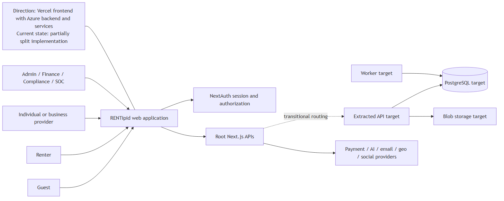

## Diagram 02 — User and role ecosystem

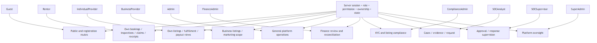

## Diagram 03 — Vercel and Azure architecture direction

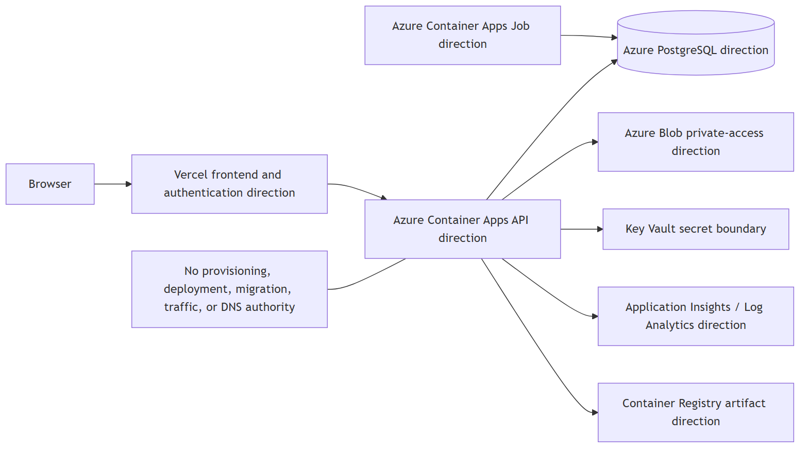

## Diagram 04 — Repository runtime transition

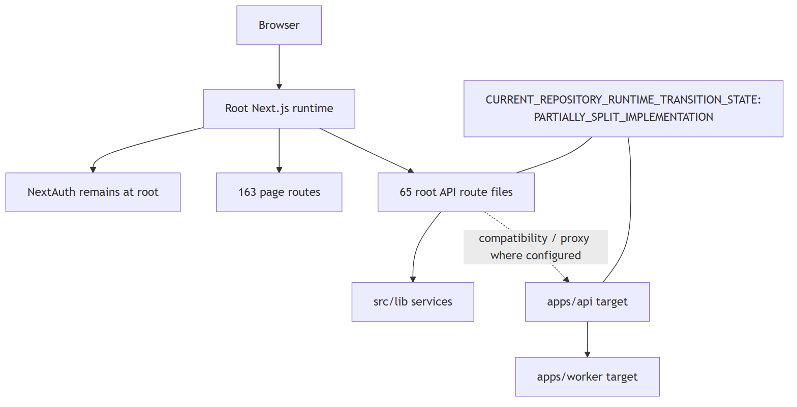

## Diagram 05 — Renter journey

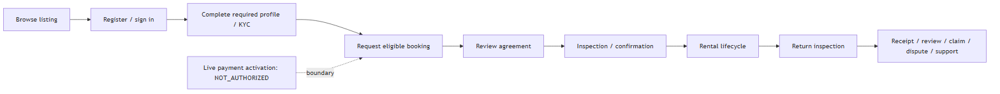

## Diagram 06 — Provider journey

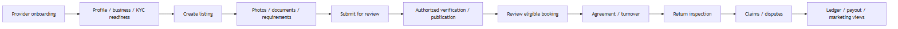

## Diagram 07 — Listing lifecycle

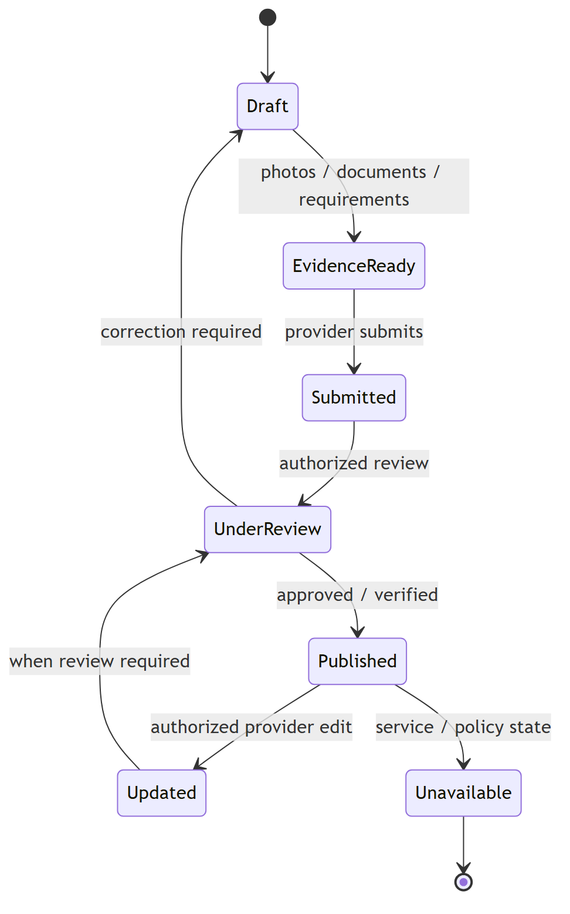

## Diagram 08 — Booking lifecycle

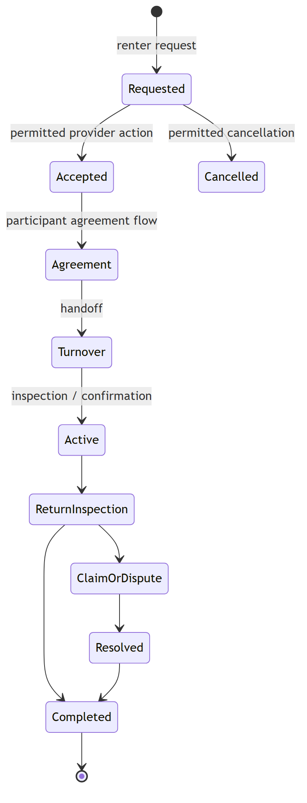

## Diagram 09 — Agreement lifecycle

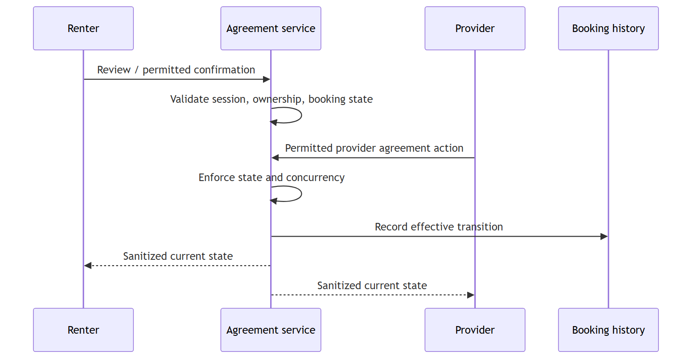

## Diagram 10 — Payment webhook reconciliation

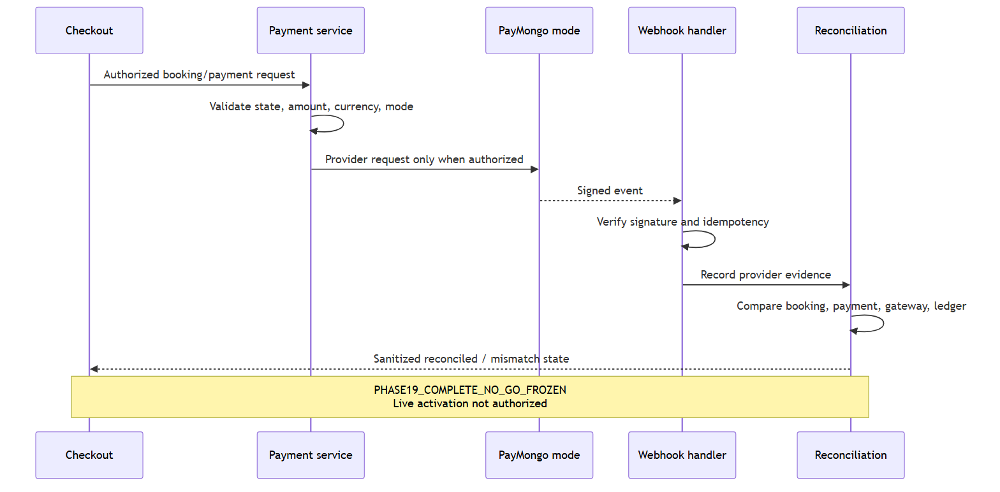

## Diagram 11 — Deposit, refund, and payout

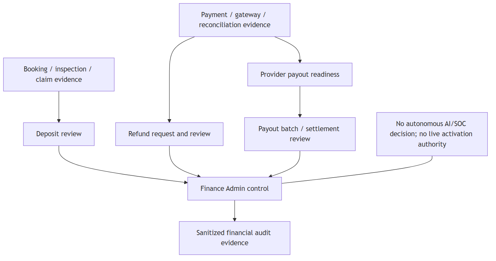

## Diagram 12 — Inspection, claim, and dispute

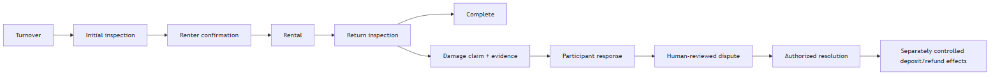

## Diagram 13 — KYC and business verification

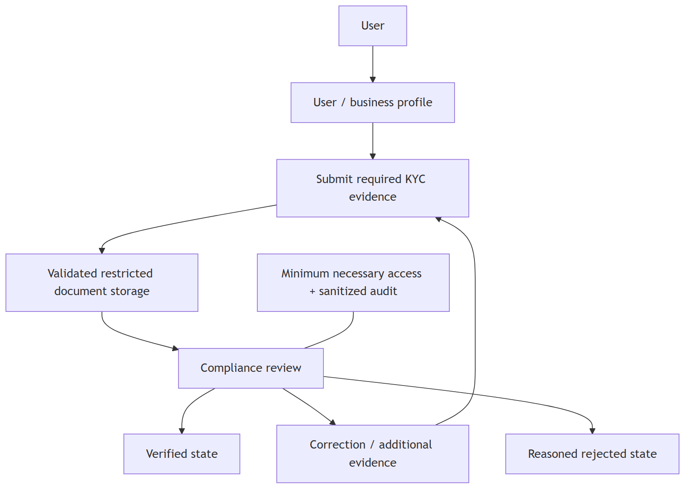

## Diagram 14 — SOC event to response

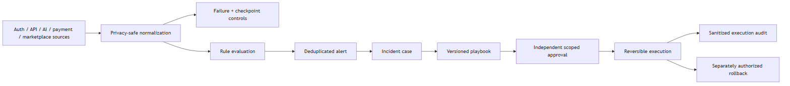

## Diagram 15 — Detection and alert flow

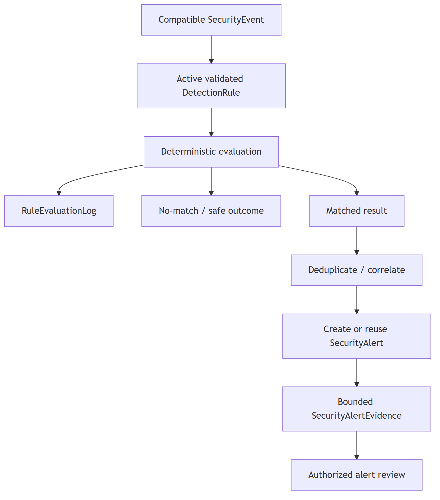

## Diagram 16 — Incident approval, execution, and rollback

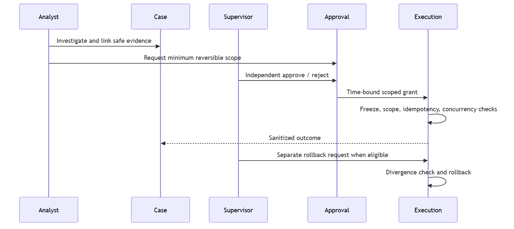

## Diagram 17 — Emergency freeze

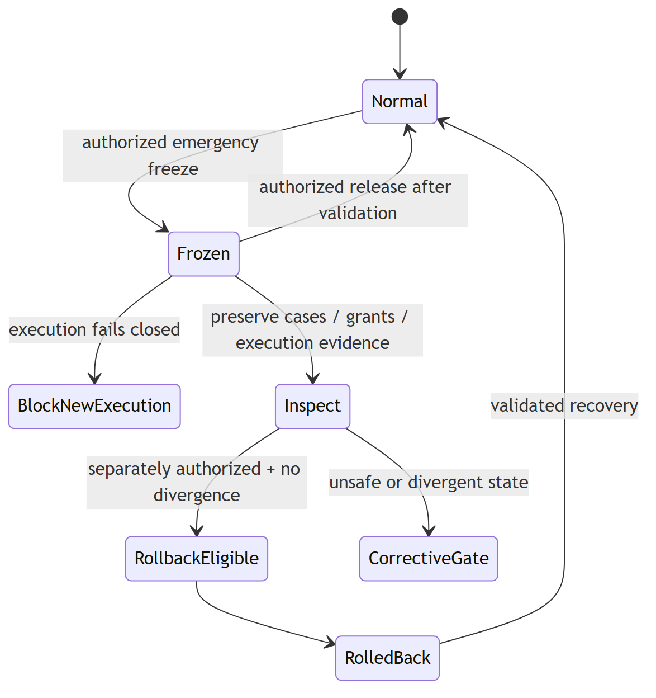

## Diagram 18 — AI and Digital Human architecture


## Diagram 19 — AI tool gateway


## Diagram 20 — AI support-case lifecycle


## Diagram 21 — Database domain map

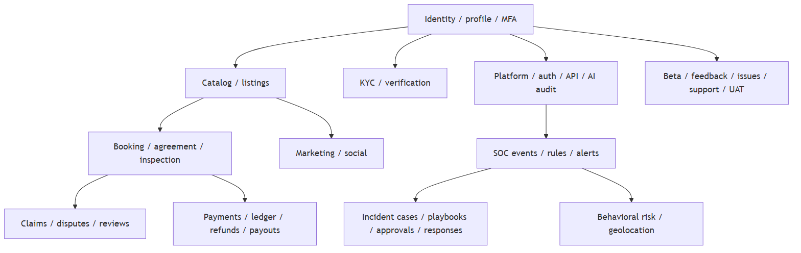

## Diagram 22 — API integration map

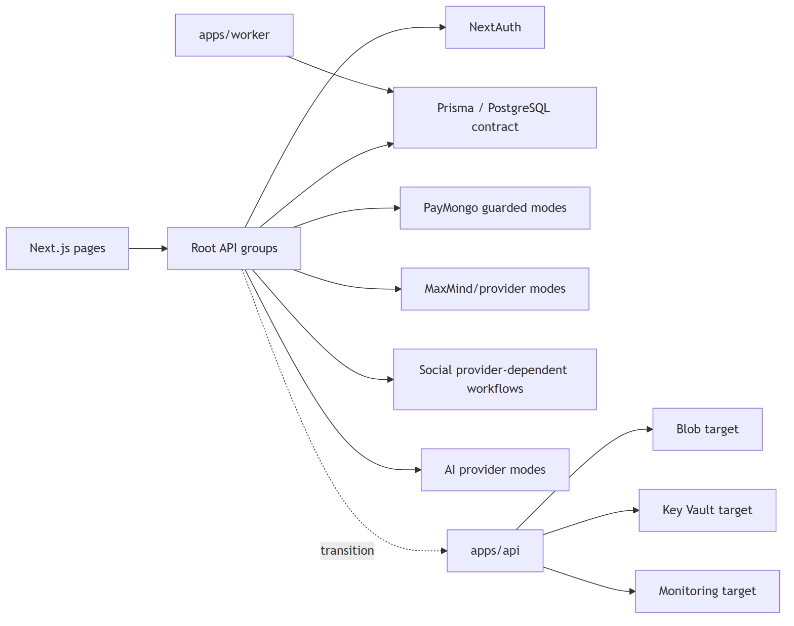

## Diagram 23 — PWA and Capacitor architecture

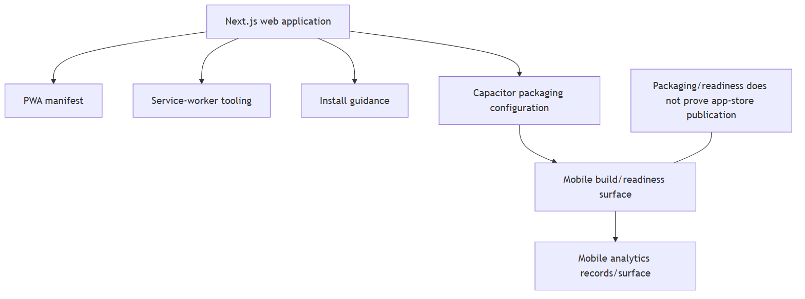

## Diagram 24 — Monitoring, backup, and recovery

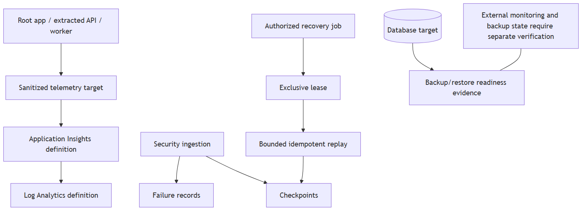

## Diagram 25 — Phase and freeze timeline

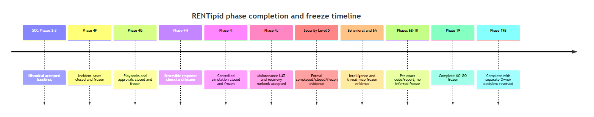


<!-- pagebreak -->

# Volume XX — Validation, Use, and Handover

## Documentation Validation Scope

This build validates document assembly, source presence, diagram loading, internal contents links, layout overflow, PDF structure, tagging, bookmarks, page objects, and SHA-256 integrity. It does not rerun application, database, payment, provider, cloud, browser-journey, security, or production acceptance suites.

## How to Determine Whether a Capability Is Live

1. Identify the exact route, API, service, model, and integration.
2. Check current code, not only a historical manual.
3. Check the accepted phase/freeze record for governance status.
4. Check environment configuration without exposing values.
5. Verify target infrastructure and external provider state under explicit authority.
6. Run the relevant local/preview acceptance with safe database guards.
7. Confirm monitoring, rollback, and operational ownership.
8. For payments, insurance, KYC, AI, privacy automation, or security response, confirm the separate activation gate.

## Reopen and Change-Control Checklist

- Exact approved requirement and Owner/authorized approver.
- Current source authority and affected frozen records.
- Actors, permissions, ownership, and separation of duties.
- Data classification, privacy, retention, processor, and cross-border impact.
- State-machine, transaction, idempotency, and reconciliation impact.
- API/schema/migration compatibility.
- Security threat analysis, logging, and incident response.
- Environment/provider/infrastructure authorization.
- Targeted and regression tests with exact evidence.
- Deployment, rollback, recovery, monitoring, and documentation updates.
- New commit/tag/manifest only after acceptance.

## Final System Statement

RENTipid is extensively modeled and documented across marketplace, rental, trust, finance, administration, privacy, AI, insurance, mobile, delivery, and SOC domains. Its strongest characteristics are explicit ownership, state and evidence records, separation of duties, fail-closed high-risk foundations, reversible security response, and disciplined governance vocabulary.

The complete and accurate posture is not “everything is live.” The repository is a partially split implementation with a large accepted/frozen body of local engineering work, several non-live or shelved integrations, reserved production decisions, a live-payment prohibition, and current dirty-worktree changes. This manual preserves both capability and limitation so future decisions can be made from evidence rather than inference.
